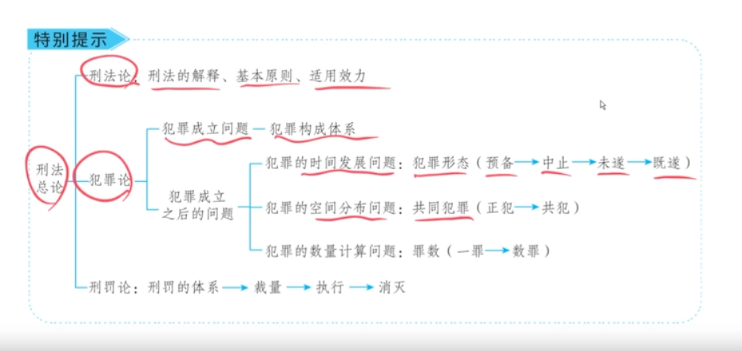
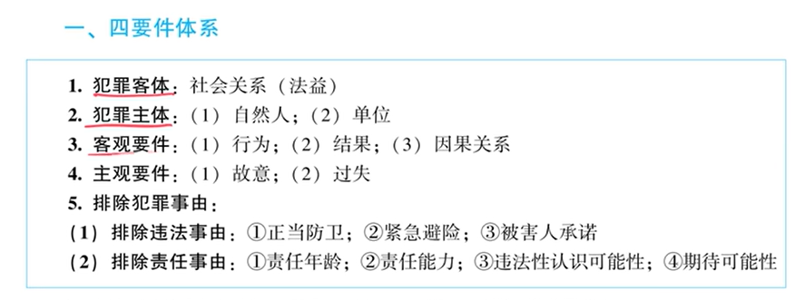

### **第1部分：定罪标准（四要件体系）学习提纲**

> **【提纲使用说明】**
> 1.  本提纲专为非法律科班人士备考法考设计，语言力求通俗易懂。
> 2.  所有法律概念和条款均来源于讲稿与刑法学通说，未凭空捏造。不确定之处已标注。
> 3.  提纲中，“【理解】”代表底层逻辑，“【例题】”代表应用，“【注】”代表知识拓展。

#### **第一章：刑法总论框架与犯罪论概览**

**1.1 刑法总论三大板块**
-   **板块一：刑法概论**（刑法的解释、原则、效力）——已学完。
-   **板块二：犯罪论**（核心，占80%）——研究**如何定罪**。 `【注：这是本提纲的重点】`
-   **板块三：刑罚论**（犯罪后如何处罚）——后续学习。

**1.2 犯罪论解决的两大问题**
1.  **犯罪是否成立**：即本节要学的“定罪标准”。
2.  **犯罪成立后的延伸问题**：
    -   **时间发展**：犯罪形态（预备、中止、未遂、既遂）。
    -   **空间分布**：共同犯罪（教唆犯、帮助犯、实行犯等）。 `【注：教唆犯指引诱、怂恿他人犯罪的人；帮助犯指为犯罪提供帮助的人；实行犯指直接实施犯罪的人。】`
    -   **数量计算**：罪数问题（一罪还是数罪，如何处罚）。

#### **第二章：定罪的标准——改良版四要件体系**

**2.1 核心变化（2026年法考）**
-   **旧体系**：两阶层体系（更复杂）。
-   **新体系**：**中国化、改良版的四要件体系**（更简单，是当前法考官方立场）。
-   **备考心态**：掌握难的，简化版的更容易接受。

**2.2 体系构成（广义四要件 = 入罪 + 出罪）**
1.  **入罪要件（四个）** ：
    1.  犯罪客体
    2.  犯罪主体
    3.  客观要件
    4.  主观要件
2.  **出罪要件（一个）** ：
    5.  排除犯罪事由（包括排除违法事由和排除责任事由）

**2.3 入罪要件详解（判断“有没有干坏事儿”）**

**（一）犯罪客体**
-   **定义**：犯罪行为侵犯的、受法律保护的利益（**法益**）。 `【理解：法益是抽象的利益，不是具体的物品。】`
-   **犯罪客体 vs 犯罪对象**：犯罪客体是法益（如**财产权**），犯罪对象是法益的载体（如被偷的**手机**）。二者是“利益”与“载体”的关系。

**（二）犯罪主体**
-   **定义**：实施犯罪的自然人或单位。
-   **核心条件**：**具有侵害法益的能力**即可，不要求达到刑事责任年龄。 `【理解：一个10岁孩子能把手机偷走，就证明他有能力侵害财产法益，他就是适格的犯罪主体。】`

**（三）客观要件**
-   **内容**：危害**行为**、危害**结果**、行为与结果之间的**因果关系**。

**（四）主观要件**
-   **内容**：犯罪**故意**（明知+希望/放任）、犯罪**过失**（应当预见而未预见，或已预见但轻信能避免）。

> **【入罪结论】**：当一个行为同时满足上述四个要件时，就初步认定行为人**制造了违法事实**，其行为具有违法性（法益侵害性）。

**2.4 出罪要件详解（判断“是不是个坏人”）**

**（一）排除违法事由（正当化事由）**
-   **功能**：从反面推翻“干坏事儿”的结论，认为行为**本身是正当的**。
-   **常见类型**：**正当防卫**、紧急避险等。 `【注：紧急避险指为了使合法权益免受危险，不得已损害另一较小合法权益的行为。】`
-   **法律效果**：无罪。

> **【例题：排除违法事由——正当防卫】**
> 80岁老方为保护自己财产，将持枪抢劫的10岁狗蛋踹成轻伤。
> **解析**：虽然老方满足前四要件，但其行为属于**正当防卫**，排除了违法性，老方**无罪**。其无罪理由是“行为正当”。

**（二）排除责任事由（宽恕事由）**
-   **功能**：承认行为违法，但认为**无法谴责行为人**，因此不予惩罚。
-   **底层原理**：谴责一个人，要求他**有能力认识到自己行为的法律性质和后果**（法规犯意识）。如果他没有这种能力，刑罚就失去了意义，即“不教而诛，谓之虐杀”。
-   **常见类型**：
    1.  **未达刑事责任年龄**（如不满12/14/16周岁）。
    2.  **精神病人**（在不能辨认或不能控制自己行为时犯罪）。
-   **法律效果**：不负刑事责任，无罪。

> **【例题：排除责任事由——责任年龄】** `【注：此为“宽恕”而非“正当”。】`
> 6岁孩子偷走手机。
> **解析**：他确实“干了坏事儿”，但因未达刑事责任年龄，法律推定他无法被谴责，因此**不负刑事责任**。其无罪理由是“无法谴责”。

**2.5 犯罪概念的“阶段化理解”**
-   **定义**：一个行为在“干坏事儿”阶段，可以被认定为“犯罪行为”（用于认定共犯、追缴赃物等）；但在“是不是坏人”阶段，可能因责任阻却而不追究刑事责任。
-   **价值**：解决了“未达年龄者与成年人共同作案时，如何处罚成年人”的难题。

> **【核心例题：阶段化理解——15岁抢夺案（2012年真题）】**
> **案情**：15岁甲（不够抢夺罪年龄）让16岁乙帮自己望风，甲实施抢夺。
> **解析**：
> 1.  **干坏事儿阶段**：甲、乙构成抢夺罪的**共同犯罪**（甲是实行犯，乙是帮助犯）。
> 2.  **是不是坏人阶段**：甲因年龄不够被“宽恕”（无罪）；乙年龄够，应被“谴责”，构成**抢夺罪的帮助犯**（有罪）。
> **结论**：“甲与乙构成共犯”和“甲不构成犯罪”两种说法可以同时成立，不矛盾，只是处于不同判断阶段。

**2.6 改良版 vs 前苏联版四要件体系**
-   **核心区别**：前苏联版把责任年龄、责任能力放在“犯罪主体”里；改良版把它们放在“排除责任事由”里。
-   **改良版的优势**：避免了前苏联版在类似上述“15岁抢夺案”中无法处罚有责任能力帮助者的Bug。

#### **第三章：定罪的基本原则——客观主义立场**

**3.1 审查顺序：先看客观，后看主观**
-   **定义**：判断犯罪时，必须**优先判断客观要件**（是否有危害行为），再判断主观要件（是否有故意/过失）。不能先入为主地认为“他想犯罪”。

**3.2 核心考点：危害行为的认定**
-   **定义**：危害行为必须是对刑法所保护的法益**制造了现实危险**的行为。
-   **重要性**：如果连危害行为都没有，直接得出无罪结论，无需再考虑主观。

> **【经典例题：无危害行为=无罪——沙漠稻草人案】**
> **案情**：狗蛋在沙漠里向稻草人开枪。
> **解析**：狗蛋主观上确实想杀人。但客观上，他的开枪行为没有对任何人的生命法益制造危险，**不构成危害行为**。因此，**不构成故意杀人罪**。

> **【巩固例题：无危害行为=无罪——老大爷“抢劫”案】**
> **案情**：老大爷为了进监狱，假装抢劫并主动要求老板报警。
> **解析**：老大爷的行为没有侵犯老板的财产法益，没有制造危险，**不构成抢劫的危害行为**，因此**不构成抢劫罪**。

**3.3 客观主义的法理**
-   **核心原则**：“无行为则无犯罪”。刑法惩罚的是造成法益侵害危险的“行为”，而不是单纯邪恶的“思想”。

### **第三部分：2026年法考核心考点预测与备考建议**

基于讲稿内容和近年命题趋势，以下为本章节的核心考点总结，供您重点复习。

| **知识点** | **可能考试的方式** | **举例 / 提示** |
| :--- | :--- | :--- |
| **1. 广义四要件体系的构成** | 选择题（判断哪些属于四要件内容，哪些属于排除犯罪事由） | 题干：下列哪项属于/不属于广义的四要件内容？混淆项：排除违法事由、排除责任事由易被遗漏。 |
| **2. 犯罪客体 vs 犯罪对象** | 选择题（判断某选项是对客体还是对象的描述） | 题干：狗蛋偷手机，侵犯的是“财产权”（客体）还是“手机”（对象）？ |
| **3. 排除犯罪事由的区分** | 选择题/案例分析（判断某无罪情形属于排除违法还是排除责任） | 题干：正当防卫（排除违法）与精神病发作伤人（排除责任）的无罪理由有何不同？ |
| **4. 责任年龄与共同犯罪** | **选择题/主观题考点（★★★★★）** **【主观题标示】** | 结合改良版四要件，分析“15岁甲与16岁乙共同抢夺案”。重点：甲的“共犯”身份与最终“无罪”结论如何统一。 |
| **5. 犯罪概念的阶段化理解** | 选择题/案例分析（判断赃物性质、共犯认定） | 题干：10岁偷的手机是否属于“犯罪所得”？16岁帮忙窝藏是否构成犯罪？ |
| **6. 客观主义立场与危害行为** | **选择题/主观题考点（★★★★★）** **【主观题标示】** | 经典“稻草人案”变形。判断行为人是否实施了“危害行为”，警惕“主观归罪”的错误选项。 |
| **7. 前苏联体系Bug** | 选择题（判断哪个选项正确描述了该Bug或改良版的解决方案） | 题干：关于前苏联四要件体系的说法，哪项是错误的？核心bug在于无法处理“有责任能力者帮助无责任年龄者”的案件。 |

> **【备考提示】**
> 1.  **重中之重**：请务必消化“15岁抢夺案”和“沙漠稻草人案”两个经典模型。它们是理解整个四要件体系和客观主义立场的钥匙，也是主观题的重要素材。
> 2.  **思维转变**：在做题时，时刻提醒自己“**先客观后主观**”。看到一个案例，先问“有没有危害行为？”，再问“有没有故意或过失？”。这个思维顺序是答对题目的关键。
> 3.  **体系感**：将“四要件”和“排除事由”看作一个动态的、立体的判断流程（入罪→出罪），而不是孤立的五个点。

### **第2部分：定罪标准讲稿（整理与切分版）**

> **【整理说明】**
> 1.  为便于阅读，已按照讲授逻辑划分为章节和段落，并提炼了小标题。
> 2.  对原文中明显的口误、重复和逻辑不连贯之处进行了修正，修正处用`【校注：...】`标出。
> 3.  保留了讲授者所有的案例、比喻和分析模型，并将其中的案例提炼为“例题”以便学习。
> 4.  对于讲授者引入的、超出“定罪标准”核心主题的其他法律概念（如共同犯罪、罪数等），以“注”的形式在括号内进行解释说明，不影响正文的纯粹性。

#### **第一节：犯罪论体系概览**

**一、 犯罪论在刑法总则中的地位与框架**

好，那从今天开始，我们就要进入第二讲：犯罪构成。从犯罪构成开始，我们就要正式进入犯罪论的学习了。

关于犯罪论，我们先看一个图表，把它的框架建构起来。大家看我们刑法总论包括三块：第一块是刑法概论（刑法的解释、原则、效力），我们已经讲完了。接下来第二大块就是犯罪论，犯罪论只解决一个问题——**如何定罪**，它占整个总论百分之八十的内容。

犯罪论又解决两大问题：
第一，**犯罪是否成立**的问题，这就要看犯罪的构成要件。
第二，如果犯罪成立了，那么要解决成立之后的**三大延伸问题**：
1.  **犯罪在时间上的发展问题**，也叫犯罪形态。比如犯罪预备、中止、未遂、既遂。
2.  **犯罪在空间上的分布问题**，比如教唆犯、帮助犯、实行犯、正犯、共犯，这属于共同犯罪的问题。 `【注：此处引入“共同犯罪”概念，指多人一起犯罪时如何区分各自角色和责任。】`
3.  **犯罪在数量上的计算问题**，即一罪与数罪，也就是罪数问题。

> **【例题：罪数问题】**
> 狗蛋一天的生活：大清早因起床气杀死室友；上午打了一上午诈骗电话；中午因西瓜太贵杀死摊主；晚上组织卖淫到深夜；后半夜聚众吸毒；第二天起床又因起床气杀死朋友。
> 问：狗蛋犯了这么多罪，最终是数罪并罚，还是按一罪处理？这就是罪数问题要解决的。 `【注：此处引入“罪数”概念，指对同一个人的多个犯罪行为如何定罪处罚。】`

**二、 考试方向的变化：从两阶层到四要件**

好了，框架建构起来后，我们先看犯罪是否成立的问题。犯罪成立的标准，就叫犯罪构成体系。我们第二讲就讲这个。

**今年（2026年）最大的变化，就是把曾经的两阶层体系，改为四要件体系。** 为什么改？我们必须有政治站位。政法，永远是把“政”放在“法”前面。考试就是指挥棒，往哪指，咱就往哪打。作为考生，不能有抵触情绪；作为老师，也不能固步自封。考试是过桥，不是让你在桥上跟官方唱对台戏。先把考试通过再说。

给二战的同学吃个定心丸：两阶层体系比四要件体系更复杂、更难。你把降龙十八掌都练会了，还怕学不会闪电五连鞭吗？掌握更难的，简单的自然不在话下。

#### **第二节：改良版四要件体系详解**

**一、 四要件的构成与功能**

我们现在来看这个四要件体系。注意，我们这个是**中国化、改良版的四要件体系**，不是原汁原味的前苏联四要件体系。

请看图表，广义的改良版四要件体系包括五个部分：
1.  犯罪客体
2.  犯罪主体
3.  客观要件
4.  主观要件
5.  **排除犯罪事由**

其中，前四个要件是用来**入罪**的（判断行为是否构成犯罪），第五个是用来**出罪**的（判断是否存在无罪理由）。一入一出，构成完整的体系。

**二、 前四个要件：入罪条件**

**（一）犯罪客体**

1.  **概念**：犯罪客体指犯罪侵犯的社会关系，理论上称为法益，即**法律所保护的利益**。
2.  **与犯罪对象的区别**：
    -   **犯罪客体**是抽象的法益（如财产权）。
    -   **犯罪对象**是法益的载体（如手机）。

> **【例题：客体与对象的区分】**
> 狗蛋偷了小芳的手机。
> **犯罪客体**：小芳的**财产权**。
> **犯罪对象**：小芳的这部**手机**。

**（二）犯罪主体**

指实施犯罪的自然人或单位。作为自然人主体，只要求一个条件：**具有侵害法益的能力**。

> **【例题：犯罪主体】**
> 10岁的狗蛋，偷了80岁老方的三折叠手机，并且成功偷到手了。这就说明狗蛋有侵犯财产法益的能力，他就是合格的犯罪主体。

**（三）客观要件与主观要件**

-   **客观要件**：包括行为、结果、因果关系。
-   **主观要件**：包括故意、过失。

> **【例题：前四要件齐备】**
> 10岁的狗蛋故意偷了80岁老方的手机。
> -   犯罪客体：老方的财产权。（✓）
> -   犯罪主体：狗蛋有侵害法益的能力。（✓）
> -   客观要件：有偷窃行为、有财产损失结果，有因果关系。（✓）
> -   主观要件：狗蛋是故意的。（✓）
> **初步结论**：前四要件全部具备，狗蛋**制造了法益侵害事实（违法事实）**，其行为具有违法性（法益侵害性），初步入罪。

**三、 第五个要件：排除犯罪事由（出罪）**

初步入罪后，辩护律师登场，寻找出罪事由。排除犯罪事由分两类：

**（一）排除违法事由（正当化事由）**

> **【例题：排除违法事由——正当防卫】**
> 10岁的狗蛋端着加特林机枪抢劫80岁老方的手机。老方奋力反击，一脚把狗蛋踹成轻伤。问：老方是否构成故意伤害罪？
> **分析**：
> 1.  前四要件齐备：客体（狗蛋健康权）、主体（老方有侵害能力）、客观（踹的行为和轻伤结果）、主观（故意）均满足，初步入罪。
> 2.  排除违法事由：老方的辩护律师主张，这是**正当防卫**。根据司法解释，对危及人身安全的暴力犯罪可以正当防卫。
> **最终结论**：老方的行为是正当防卫，排除了违法性，**无罪**。

**（二）排除责任事由（宽恕事由）**

> **【例题：排除责任事由——责任年龄】**
> 6岁的小小狗蛋，趁80岁老方抱他的时候，偷走了老方的三折叠手机。问：小小狗蛋怎么处理？
> **分析**：
> 1.  前四要件齐备：客体（财产权）、主体（有能力）、客观（偷窃）、主观（故意）均满足，初步入罪。
> 2.  排除违法事由：正当防卫、紧急避险等均不适用。
> 3.  排除责任事由：**责任年龄不够**。法律规定盗窃罪要年满16周岁才负刑事责任。6岁的小孩不具备刑事责任能力。
> **底层原理**：谴责一个人（让其承担刑事责任），前提是他**有能力认识到自己行为的法律性质和后果**。6岁小孩缺乏这种认识能力，无法谴责他。
> **最终结论**：因排除责任事由，小小狗蛋**不负刑事责任，无罪**。

> `【注：此处引入“责任能力”概念，指行为人具备辨认和控制自己行为的能力，是承担刑事责任的前提。同时提及精神病人，若因精神疾病发作伤人，也因不具备责任能力而无罪。】`

**四、 四要件体系的逻辑总结——“干坏事”与“坏人”**

四要件体系的核心逻辑就是两步判断：
1.  **有没有干坏事儿？** 由前四个要件+排除违法事由来判断。
    -   前四要件齐备，初步认为你干了坏事儿（制造了违法事实）。
    -   排除违法事由（如正当防卫），是从反面推翻，认为你干的不是坏事儿。
2.  **是不是个坏人？** 由排除责任事由来判断。
    -   如果干了坏事儿，再看能不能谴责你。如果能谴责，你就是坏人（罪犯）。
    -   如果不能谴责（如精神病患者、未达刑事责任年龄的儿童），我们就宽恕你，你是病人/小孩，不是坏人。

**注意**：正当防卫（排除违法）无罪和精神病人（排除责任）无罪，理由完全不同。前者是行为正当，后者是行为人不可谴责。

#### **第三节：改良版四要件体系的深层逻辑**

**一、 犯罪概念的阶段化理解**

> **【例题：犯罪概念的阶段化】**
> 10岁的狗蛋偷了一部手机。前四要件齐备，无排除违法事由，因此他“干了坏事儿”（行为具有违法性）。但因年龄不够，排除责任，最终不负刑事责任。
> **问题**：狗蛋偷的手机算“犯罪所得”吗？如果铁牛明知是狗蛋偷的手机还帮忙窝藏，铁牛构成掩饰、隐瞒犯罪所得罪吗？
> **分析**：构成。虽然狗蛋最终无罪，但他的行为在“干坏事儿”阶段，已经被评价为**犯罪行为**（带双引号，阶段化的犯罪行为）。因此，手机的性质是犯罪所得。

这就是“犯罪概念的阶段化理解”：在判断是否“干坏事儿”（违法性）的阶段，可以认定行为是犯罪；在最终决定是否惩罚（有责性）的阶段，可能因责任阻却而出罪。

**二、 改良版 vs 前苏联版四要件体系的核心区别**

| 比较点 | 前苏联版四要件体系 | 改良版四要件体系（法考立场） |
| :--- | :--- | :--- |
| **主体定义** | 犯罪主体必须**同时**具有责任年龄和责任能力。 | 犯罪主体只要求**有侵害法益的能力**。 |
| **体系位置** | 责任年龄、责任能力是**犯罪主体**的成立条件。 | 责任年龄、责任能力是**排除责任事由**的内容。 |
| **核心Bug** | 无法处理“有责任能力者帮助无责任年龄者犯罪”的案件。 | 通过“犯罪概念阶段化”，完美解决上述Bug。 |

> **【核心例题：前苏联版体系的Bug与改良版的解决——15岁抢夺案（2012年真题）】**
> **案情**：甲（15周岁）求16周岁的乙为其抢夺行为做接应（望风），乙同意。抢夺罪的责任年龄是16周岁。
> **问题**：如何处理甲和乙？
> **前苏联版四要件分析（错误）**：
> 1.  甲不满16岁，不是合格的犯罪主体 → 甲无罪。
> 2.  甲的实行行为不存在，乙作为帮助犯无法单独存在，也不能认定为间接正犯（因为乙对甲无支配力）→ 乙也无罪。
> **结论**：显然不合理，放跑了有责任的乙。 `【注：间接正犯，指利用他人作为犯罪工具，对他人有支配力，从而实现自己犯罪目的的人。】`
>
> **改良版四要件分析（正确）**：
> 1.  **干坏事儿阶段（犯罪概念阶段化）**：甲有侵害法益的能力，前四要件齐备。甲和乙在“干坏事儿”层面，构成**抢夺罪的共同犯罪**（带双引号），其中甲是实行犯，乙是帮助犯。
> 2.  **是不是坏人阶段（排除责任事由）**：甲未满16岁，排除责任，最终无罪。乙年满16岁，无排除责任事由，最终构成**抢夺罪的帮助犯**。
> **结论**：甲无罪，乙构成抢夺罪的帮助犯。 A项（甲不构成犯罪）和B项（甲与乙构成共犯）说法都对，但不矛盾，分别处于不同判断阶段。

**三、 定罪顺序：先看客观，后看主观（客观主义立场）**

法考刑法采取**客观主义立场**，即**优先判断客观要件，再判断主观要件**。

> **【经典例题：客观主义立场——沙漠稻草人案】**
> **案情**：狗蛋在沙漠里看到前方有个仇人小芳，于是开枪。走近一看，是个稻草人，四下无人。
> **问题**：狗蛋是否构成故意杀人罪？
> **主观主义（错误）**：狗蛋主观上有杀人故意，也开了枪，应构成故意杀人罪（未遂）。
> **客观主义（正确）**：先看客观。故意杀人罪的危害行为，必须是对他人的生命法益制造危险的行为。狗蛋在四下无人的沙漠里向稻草人开枪，对任何人的生命法益都没有制造危险。**连危害行为都不存在，直接得出无罪结论**。思想再邪恶，没有实施危害行为，刑法也不能惩罚。`【注：此处强调“无行为则无犯罪”的刑法原则。】`

> **【巩固例题：客观主义立场——老大爷“抢劫”案】**
> **案情**：一老大爷为进监狱养老，拿木棍到小卖部敲柜台，要求老板报警说自己抢劫。老板不报，老大爷就赖着不走，老板无奈报警。
> **问题**：老大爷是否构成抢劫罪？
> **分析**：先看客观。抢劫罪的危害行为必须是对他人财产法益制造危险。老大爷的目的不是劫财，其行为也没有侵犯老板财产权的危险性，最多是妨碍了老板看电视。**没有抢劫的危害行为，不构成抢劫罪。**

#### **第四节：本节总结**

1.  **定罪标准**：采用**改良版的四要件体系**（广义上包含五个部分）。
2.  **判断逻辑**：先判断“有没有干坏事儿”（前四要件+排除违法事由），再判断“是不是个坏人”（排除责任事由）。
3.  **体系优势**：采用“犯罪概念阶段化”理解，解决了前苏联四要件体系的Bug，能正确处理“无责任年龄者与有责任能力者共同犯罪”的案件。
4.  **审查顺序**：坚守**客观主义立场**，**先看客观后看主观**。优先判断是否存在危害行为，再考虑主观罪过。

**【授课教师提示】**
本节内容（尤其是客观主义立场和改良版四要件体系的逻辑）是刑法总则的基石，也是理解后续所有罪名的关键。一遍听不懂很正常，后边我们做题时还会反复巩固。

