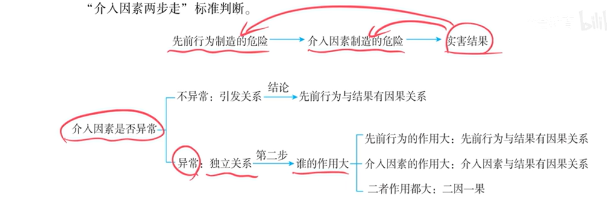

### **一：基于讲稿内容的知识点提纲与考点预测**

以下提纲旨在为非科班人士梳理讲稿核心内容，对照法考刑法因果关系部分的考查体系。

#### **第一部分：刑法因果关系与介入因素知识提纲**

**一、 核心问题：行为与结果之间的客观联系**
*   **判断目的：** 解决行为人是否要对发生的危害结果承担客观责任，是认定犯罪既遂的重要依据。

**二、 传统理论及其局限（了解即可，重点是其问题）**
*   **“条件说”**
    *   **公式：** “无A则无B，A即B因”。
    *   **问题：** 会导致因果链条无限追溯，不当地扩大处罚范围。

**三、 法考官方立场：“危险现实化理论”**
*   **核心思路：** 判断行为所制造的危险是否合乎规律地（而非偶然地）在结果中实现了。
*   **操作工具：“介入因素两步走”标准（核心考点）**

**（一）第一步：判断介入因素是否“异常”**

*   **标准：** 基于社会一般人的生活经验，看该事件发生的概率高低。
*   **结论A：不异常（大概率事件）**
    *   **法律效果：** 说明介入因素与先前行为是“引发关系”。
    *   **最终结论：** **一步到位，认定先前行为与结果有因果关系。**
*   **结论B：异常（小概率事件）**
    *   **法律效果：** 说明介入因素与先前行为是“独立关系”。
    *   **进入第二步分析。**

**（二）第二步：比较“作用大小”（仅在介入因素异常时）**
*   **标准：** 比较先前行为的危险与介入因素的危险，谁对最终结果的发生贡献更大。
*   **结论：**
    1.  介入因素 > 先前行为 → 结果与介入因素有因果关系（先前行为中断）。
    2.  先前行为 > 介入因素 → 结果与先前行为有因果关系。
    3.  二者相当 → 结果与二者均有因果关系（**二因一果**）。

**四、 介入因素的三种常见类型及判断规则（讲稿精华）**

**类型一：被害人自身行为**
*   **自杀行为：**
    *   **原则：** 通常认定为异常介入因素，中断因果关系（如：抢劫后被害人自杀，不构成抢劫致人死亡）。
    *   **例外：** 暴力干涉婚姻自由罪致人死亡、虐待罪致人死亡，这两个罪名中的“致人死亡”包括被害人自杀。
*   **自救/逃生行为：**
    *   **规则：** 结合具体情景判断。若行为人的先前行为（如追杀）制造了紧迫危险，迫使被害人采取本能逃生行为而死亡的，通常认定为**不异常**，有因果关系（如：持刀追砍，失足坠楼案）。

**类型二：第三人行为**
*   **一般规则：** 按两步走标准判断。
*   **特殊情形：阻断救助行为**
    *   **规则：** 如果先前行为的危险已被现实的救助行为消除，第三者再阻断救助导致结果发生的，死亡结果与**阻断救助的行为**有因果关系，与先前行为**没有**因果关系（如：救生圈案）。

**类型三：被害人特殊体质**
*   **核心规则：** **一律认定有因果关系！**
*   **特别提示：** 有因果关系不等于有刑事责任。
    *   **客观（因果关系）：** 成立。
    *   **主观（责任）：** 需另行判断行为人是否有故意或过失。如无故意过失，则为意外事件，无罪。

**五、 无法查明的案件（事实存疑的处理）**

**（一）基本原则**
1.  **共同犯罪：** 适用 **“部分实行全部负责”原则** → 犯罪结果由全体共犯人承担。
2.  **单独犯罪（不构成共犯）：** 适用 **“存疑时有利于被告人”原则**。

**（二）“存疑时有利于被告人”的具体应用**
*   **“死得越早，对被告人越有利”口诀**
    *   **适用场景：** 多行为（尤其是过失行为）作用于同一被害人，死亡时间无法查明的案件。
    *   **应用：** 推定死亡发生在最早的时间点，以最有利于各被告人的方式进行定罪量刑。
*   **对不同罪过形式的处理：**
    *   **过失犯罪**（如交通肇事）：死亡时间的推定会影响罪数（是否成立“因逃逸致人死亡”）和量刑档次。
    *   **故意犯罪**（如故意杀人）：死亡时间无法查明时，若无法证明致命伤由自己造成，应认定为犯罪**未遂**。

---

#### **第二部分：2026年法考高频考点预测表**

**（说明：** 基于讲稿中强调的“考试喜欢考”“法考真题”等提示，结合近年命题趋势整理。**）**

| **知识点** | **可能考试的方式** | **举例（源于讲稿或常见模型）** |
| :--- | :--- | :--- |
| **1. 介入因素两步走（异常性判断）** | 给一个复杂案例，要求判断介入因素是否“异常”。**关键在于具体化、情景化判断**，不能脱离案情。 | 例题：将人砍伤后丢在悬崖边 → 被害人苏醒后爬动坠崖（**不异常**）。 提示：若只说“被害人坠崖”，则异常；但结合“重伤昏迷在悬崖边”的具体情景，则不异常。 |
| **2. 特殊体质案（因果关系 + 刑事责任区分）** | 判断因果关系后，进一步考查主观罪过，判断是故意伤害罪、过失致人死亡罪还是意外事件。**这是主客观相统一原则的重要体现。** | 例题：扇耳光致血友病患者流血不止死亡。 结论：因果关系**有**。 责任：可能故意、过失或意外事件，需看行为人是否明知或应知。 |
| **3. 阻断救助行为（主观题考点）** ⭐ | 给出存在第三人救助又被阻断的模型，考查先前行为人对最终结果是否负责。 | 例题：甲推乙下水 → 丙扔救生圈 → 丁捞走救生圈致乙溺亡。 结论：死亡结果与甲**没有**因果关系，与丁**有**因果关系。 |
| **4. 无法查明的案件（共同犯罪 vs 单独犯罪）** | 区分共犯与非共犯，分别适用“部分实行全部负责”和“存疑有利于被告人”原则。 | ①甲乙共谋同时开枪，只一弹致命无法查明：二人均**既遂**。 ②甲乙互不知情同时开枪，只一弹致命无法查明：二人均**未遂**。 |
| **5. 连环碾压案（死亡时间推定）** ⭐ | 给出连环碾压的“双动作”模型，考查对甲乙二人如何定性及量刑。**核心在于“死得越早越有利”口诀的应用。** | 例题：甲乙先后碾压丙，无法查明死亡时间。 结论：推定死亡发生在甲碾压时。甲定交通肇事罪（肇逃，3-7年）；乙不构成犯罪（碾压尸体）。 |
| **6. 条件说的识别与批判（客观题）** | 题干或选项中出现“无A则无B”的表述，问是否应采纳。 | 陷阱：若未考虑条件说无限追溯的弊端，可能误选有因果关系。 |
| **7. 因果关系与刑事责任的关系（主观题/客观题）** | 问“有因果关系是否一定构成犯罪”，这是近年高频陷阱。 | 结论：**不一定！** 还需考察主观上的故意或过失。 |

> **【使用说明】**
> 1.  **标记⭐的为“主观题考点”**，需要重点掌握分析步骤和结论表述，特别是“介入因素两步走”的分析过程在主观题中是重要的得分点。
> 2.  学习本讲时，请始终牢记 **“因果关系解决的是客观归责问题，主观罪过解决的是最终责任问题”** 这一核心区分，这是答对题目的关键。
> 3.  本提纲及预测完全基于您提供的讲稿内容，未添加任何外部法条或理论，以确保您学习的纯粹性。

### **二：讲稿切分、修正与段落整理**

**（说明：** 以下内容已根据讲授逻辑进行段落切分。对原文中明显的语音转文字错误、重复、口语化赘词进行了修正，修正处用 `[修正]` 或 `[优化]` 标注。所有案例、分析模型、知识点均予完整保留，未做任何删减。对于讲授者引入的超出主题范畴的概念，以“注”的形式加以说明。**）**

---

**第一段：主题引入与标准案例**

好，那接下来我们就看第三节，关于因果关系的判断。那这里面如果给你加入一个介入因素，该怎么办？为此，我们先弄一个标准案例。

> **【标准案例】**
> 狗蛋儿想杀小方，把小方捅了两刀，然后狗蛋儿就走了。小方身受重伤，结果被邻居狗剩救起，狗剩开车送小方去医院。途中，铁牛驾车违章不慎撞上狗剩的车，酿成车祸，而车祸直接导致受伤的小方死亡。
>
> **问：** 死亡结果与狗蛋儿的刀杀行为有无因果关系？

**第二段：案例分析——肇事者责任与问题的核心**

我们先分析铁牛。铁牛很简单，因为违章肇事酿成车祸，车祸直接导致小方死亡，铁牛要对这个死亡结果负责，构成交通肇事罪，这是没问题的。

现在的问题是，这个死亡结果跟狗蛋儿前面的刀杀行为有没有因果关系？
*   如果有，那狗蛋儿的故意杀人罪在成立的基础上就**既遂**了。
*   如果没有，那狗蛋儿的故意杀人罪就不是既遂，虽然成立故意杀人罪，但只能算是**未遂**。

所以，要研究狗蛋儿前面的刀杀行为和小方最终死亡之间有无因果关系，目的就是为了解决他的故意杀人罪是否既遂的问题。而这里面，就有了一个介入因素，就是铁牛的车祸。

**第三段：理论铺垫——条件说及其弊端**

遇到这种有介入因素的案件该怎么处理呢？理论上早期有一个学说叫 **“条件说”** 。这个理论大家要了解一下，因为考试喜欢在这里挖坑。

**1. 条件说的公式**
它的判断公式是：**“无A则无B，A即B因”**。
按照这个逻辑，小方的最终死亡也能算到狗蛋儿的刀杀行为头上。因为：如果不刀砍小方 → 小方就不会被送医院 → 途中就不会遇到车祸 → 就不会死亡。所以，“无A则无B”，死亡结果也能算到狗蛋儿头上，应构成故意杀人罪既遂。

**2. 条件说的弊端**
这个“无A则无B”是一个**必要条件关系**，它的弊端在于会使得因果链条**无限追溯**，这肯定不行。
`[举例说明]`
比如，狗蛋儿拿刀把小方砍死了。按条件说：没有刀砍行为，小方就不会死，所以有因果关系。但以此类推，没有狗蛋儿他妈生狗蛋儿，就没有刀砍行为，死亡结果也能算到他妈头上；再往上推，还能算到他奶奶头上……这就无限延伸了，显然不合理。

`[注：讲授者在此处引入逻辑学概念“滑坡论证”作为类比，帮助理解条件说的逻辑谬误。]`

因此，判断A是B的原因，不能用“无A则无B”这种必要条件，而应当用 **“有A则有B”** 这种充分条件。

**第四段：核心理论——危险现实化理论（介入因素两步走）**

怎样用“有A则有B”来判断呢？这就是我们要说的 **“危险现实化理论”** （早期叫“相当因果关系说”）。在我们法考里面，该理论的具体应用被提炼成一个标准，即 **“介入因素两步走”标准**。

这类案例的基本模型是：一个先前行为制造了危险流 → 一个介入因素又制造了新的危险 → 最终发展成实害结果。问题就是，这个实害结果到底跟谁有因果关系？

**介入因素两步走标准：**

**第一步：判断介入因素是否异常。**
*   **判断标准：** 这是一个概率判断，即根据经验判断该事件是大概率事件还是小概率事件。
*   **结论：**
    *   **异常（小概率）**：说明先前行为与介入因素是**独立关系**。
    *   **不异常（大概率）**：说明介入因素是由先前行为**引发**的。

**第二步：判断作用大小（仅在介入因素异常时进行）。**
*   **判断内容：** 比较先前行为与介入因素对死亡结果的发生，谁的作用更大。
*   **结论：**
    1.  介入因素作用更大 → 死亡结果与介入因素有因果关系。
    2.  先前行为作用更大 → 死亡结果与先前行为有因果关系。
    3.  作用一样大 → 死亡结果与二者都有因果关系（**二因一果**）。

**第五段：标准案例的结论与另一种模型（被害人自身行为）**

**1. 标准案例应用**
回到狗蛋儿刀杀小方的案例。介入因素是铁牛的车祸。根据经验，送医途中遭遇车祸是**异常**的。进入第二步，题中描述“车祸直接导致小方当场死亡”，说明车祸（介入因素）对死亡作用更大。因此，死亡结果与狗蛋儿的刀杀行为没有因果关系，狗蛋儿构成故意杀人罪**未遂**。

**2. 真题案例模型**
> **【例题1】**
> 狗蛋儿在悬崖边要杀小方，将小方杀成重伤昏迷后离开。五分钟后，小方被冷风吹醒，本能地爬了两步，结果掉下悬崖摔死。
> **问：** 死亡结果与狗蛋儿有无因果关系？

**做题章法：**
*   **第一步：** 找出三要素：先前行为（狗蛋儿的刀杀行为）、死亡结果（小方摔死）、介入因素（注意：是“小方爬两步掉悬崖”，而非“冷风吹过”）。
*   **第二步：判断异常性。** 关键在于看题中交代的是“一般化”还是“具体化”情景。本案是具体情景：被害人被重伤昏迷在悬崖边，苏醒后迷迷糊糊中本能爬动，这是大概率事件，**不异常**。
*   **结论：** 介入因素不异常，说明是由先前行为引发的，一步到位得出结论：**有因果关系**。狗蛋儿构成故意杀人罪**既遂**。

**第六段：介入因素分类详解——类型一：被害人自身行为**

**1. 抢劫致人死亡案例**
> **【例题2】**
> 狗蛋儿持刀抢劫卖淫女，卖淫女吓得跑向阳台，狗蛋儿持刀追赶，卖淫女在慌乱中不慎失足坠楼摔死。
> **问：** 死亡结果与狗蛋儿的抢劫行为有无因果关系？

*   **分析：** 介入因素是“卖淫女失足坠楼”。结合具体情景“持刀追砍”，被害人慌乱中失足是大概率事件，**不异常**。
*   **结论：** 有因果关系。狗蛋儿构成抢劫罪，且属于“抢劫致人死亡”（结果加重犯）。

**2. 重点考点：被害人自杀**
> **【例题3】**
> 小方抢劫了狗蛋儿的手机，狗蛋儿觉得受辱，十分钟后剖腹自杀身亡。
> **问：** 小方是否构成抢劫罪致人死亡？

*   **原则性结论：** 犯罪结束后，被害人自杀身亡的，自杀行为是**异常**的介入因素，与先前的犯罪行为**没有因果关系**，犯罪人不对此死亡结果负责。
*   **例外（法条明确规定）：** 在 **暴力干涉婚姻自由罪** 和 **虐待罪** 中，“致人死亡”包括了被害人自杀的情形，需要负责。

**第七段：介入因素分类详解——类型二：第三人的行为**

**1. 与前述标准案例相同，按两步走标准判断即可。**

**2. 特殊情形：阻断救助行为**
> **【救生圈案】**
> 甲将乙推入水中欲淹死乙。丙扔给乙一个救生圈，乙抓住后脱离危险。此时，与甲无关的丁为了杀乙，强行将救生圈捞走，乙溺水身亡。
> **问：** 死亡结果与甲的行为有无因果关系？

*   **分析：** 注意，丙的行为是救助行为，不是介入因素。真正的介入因素是丁“阻断救助”的行为。
*   **第一步：** 丁的出现对甲来说是**异常**的（半路杀出程咬金）。
*   **第二步：** 比较作用。虽然甲把乙推下水制造了危险，但丙的救助行为已经**阻断**了这个危险。丁捞走救生圈是**重启了一个新的致命危险**。因此，丁的作用更大。
*   **结论：** 死亡结果与甲**没有**因果关系，算到丁的头上。
*   **总结性结论：** 在有现实救助行为且有获救可能性的前提下，死亡结果直接算到阻断救助的行为人头上，与先前行为无关。

**第八段：介入因素分类详解——类型三：特殊体质**

> **【例题4：血友病案】**
> 甲要伤害乙，扇了乙一耳光，乙嘴角流血不止。乙告知甲自己有血友病（流血不止），后乙流血过多死亡。
> **问：** 死亡结果与甲的行为有无因果关系？

*   **分析：** 特殊体质（疾病）本身不算介入因素，因为它早在先前行为之前就存在。但“疾病发作”是由殴打行为引起的，可视为一个介入因素。
*   **结论：** 无论是否启动两步走，疾病发作是由殴打行为直接**引发**的，因此**有因果关系**。
*   **重要提示（客观与主观相区分）：**
    **有因果关系 ≠ 有刑事责任！**
    有因果关系只是解决了**客观要件**（行为、结果、因果关系）。最终是否构成犯罪，还要看**主观要件**（故意、过失）。
    *   如果甲明知乙有病，可能构成故意伤害罪致人死亡。
    *   如果甲应当预见而未预见，可能构成过失致人死亡罪。
    *   如果甲根本无法预见（意外事件），则不承担刑事责任。

> **【例题5：冠心病案】**
> 妻子站街招嫖，与嫖客发生纠纷，丈夫冲出来用膝盖顶了嫖客一下，嫖客倒地后因冠心病发作死亡。
> **问：** 丈夫如何定性？

*   **分析：** 有因果关系（引发疾病发作）。
*   **定性：** 是否有罪，看主观。
    *   有过失 → 过失致人死亡罪。
    *   无过失（意外事件）→ 无罪。

**第九段：因果关系章节总结**

回顾因果关系判断流程：
1.  先看**因**（行为）是否成立。
2.  再看**果**（结果）是否存在。
3.  看因果流程中是否有**介入因素**。
    *   **无介入因素**：直接判断因果关系。
    *   **有介入因素**：启动“介入因素两步走”标准。
        *   介入因素种类：①被害人自身行为；②第三人行为；③特殊疾病发作（一律认定有因果关系）。

**第十段：无法查明的案件（第四节内容引入）**

处理无法查明案件，核心在于区分是**单独犯罪**还是**共同犯罪**。

**1. 共同犯罪（部分实行全部负责原则）**
> **【例题6】**
> 甲乙合谋杀小方，同时开枪，小方身中一弹死亡，但无法查明是谁射出的致命子弹。
> **结论：** 因是共同犯罪，适用“部分实行全部负责”原则，无论谁打中的，甲乙二人均对死亡结果负责，均构成故意杀人罪**既遂**。

**2. 单独犯罪（存疑时有利于被告人原则）**
> **【例题7：趁火打劫案】**
> 景点悬桥垮塌，众人落谷。狗蛋儿见小方趴在地上不动，拽走其手表。事后无法查明小方是在狗蛋儿拽表前已死亡，还是拽表时未死（昏迷）。
> **结论：**
> *   可能性一（未死）：构成盗窃罪（活人身上取财）。
> *   可能性二（已死）：构成侵占罪（死人身上取财）。
> 定侵占罪（轻罪）对被告人有利。因此，适用“存疑有利于被告人”，死亡时间被推定为**越早越好**（即拽表前已死亡），最终认定狗蛋儿构成侵占罪。
> **口诀：** 死亡时间无法查明时，死得越早，对被告人越有利。

**第十一段：无法查明的案件——连环碾压案（典型考点）**

> **【例题8：连环碾压案】**
> 甲开车将丙撞倒在路中央后逃逸。五分钟后，乙开车从丙身上碾过。救护车到现场发现丙已死，但无法查明丙是在乙碾压前死亡，还是乙碾压后死亡。

*   **性质：** 甲、乙互不知情，不构成共同犯罪，应分别处理。
*   **处理原则：** 对每个人均适用“存疑有利于被告人”原则（子原则：死亡时间越早越好）。

**详细分析：**
*   **第一种可能（死亡时间点①）：** 甲碾压直接导致丙死亡（死得早）。
    *   甲：与死亡有因果关系，构成交通肇事罪（肇事后逃逸，适用3-7年档）。
    *   乙：碾压的是尸体，与死亡无因果关系。
*   **第二种可能（死亡时间点②）：** 甲撞伤丙，乙的碾压才导致丙死亡（死得晚）。
    *   乙：与死亡有因果关系。
    *   甲：乙的碾压行为是介入因素。因甲将丙撞倒在路中央后逃逸，后续车辆碾压是大概率事件，**不异常**，因此甲的先前行为与死亡结果**也有因果关系**（二因一果）。

**最终认定：**
*   对甲：无论哪种可能，甲都对死亡负责。适用存疑原则，认定死亡时间最早（即第一种可能），虽然对甲定罪无影响，但在量刑上有利（适用3-7年档，而非“因逃逸致人死亡”的7-15年档）。
*   对乙：存疑时作有利认定，按第一种可能处理，即乙对死亡结果**不负责**。

**结论：** 最终处理结果就是按照“死亡时间最早”的模式（死得越早越好）来处理。

**第十二段：无法查明的案件——互不知情的故意犯罪**

> **【例题9】**
> 甲、乙互不知情，但都想杀死小方，不约而同同时开枪。小方身中一弹死亡，无法查明是谁打的。
> **结论：**
> *   甲、乙不构成共同犯罪。
> *   对甲：单独看，无法证明其子弹致命，根据“存疑有利于被告人”，不能认定既遂，只能认定为故意杀人罪**未遂**。
> *   同理，乙也认定为故意杀人罪**未遂**。
> *   **观念提示：** 这体现了刑法在保护法益与保障人权冲突时，优先选择**保障人权**（宁可错放，不可错杀）。

**第十三段：课堂总结与勉励**

好了，整个因果关系的内容我们就讲完了。做对这类题，和一些生活中的观念也息息相关。

`[注：讲授者在此处引入了关于“精神内耗”和斯多葛学派哲学的讨论，内容如下，虽超出刑法主题，但为保持原文完整性，特此保留。]`

考试失利时，要记住“因上努力，果上随缘”。斯多葛学派认为，要区分自己能控制的事（自己的思想、品德）和不能控制的事（别人的看法、考试结果）。我们能做的，就是培养自己的美德，平静地接受不可控的事情。我们复习法考，克服困难，本身就是一种美德和品格的培养，至于结果，我们内心平静地接受。大家共勉。

---

