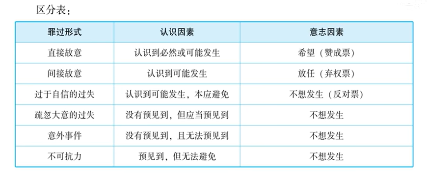
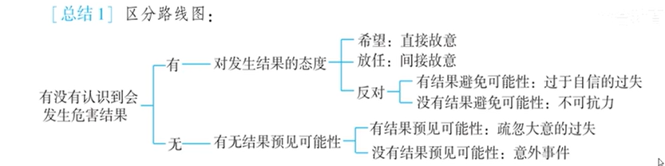

# 1：知识点提纲与考点表格

## 一、罪过形式区分——知识提纲

### （一）六种罪过形式（三组）

| 分组 | 罪过形式 | 认识因素 | 意志因素 |
|------|----------|----------|----------|
| 第一组：故意 | 直接故意 | 明知 | 希望 |
| | 间接故意 | 明知 | 放任 |
| 第二组：过失 | 过于自信过失 | 已经预见 | 轻信能够避免（反对结果） |
| | 疏忽大意过失 | 应当预见但没有预见 | 疏忽大意（反对结果） |
| 第三组：无罪过事件 | 意外事件 | 无法预见 | — |
| | 不可抗力 | 已经预见 | 无法抗拒 |

> **〖注释〗** 讲授者还提到了“概括故意”“择一故意”，这是对故意的**理论分类**（学理分类），与“直接故意/间接故意”这一**法定分类**不同。理论分类与法定分类不是对立排斥关系，有时可以重合。法考中直接故意与间接故意的区分是法定分类下的考点。

### （二）五组区分

**第一组：直接故意 vs 间接故意**
- 标准：意志因素不同——希望 vs 放任
- 关键点：放任的前提是结果**可能发生也可能不发生**；如果认识到结果**必然发生**还实施行为，是直接故意，不是间接故意。
- 对应《刑法》条款：第14条

**第二组：间接故意 vs 过于自信过失**
- 标准：对结果的态度不同——放任 vs 不想/反对
- 参考标准：有无采取避免措施（有→倾向于过失；无→倾向于故意）
- 对应《刑法》条款：第14条 vs 第15条

**第三组：过于自信过失 vs 疏忽大意过失**
- 标准：是否已经预见——已预见 vs 未预见（但应当预见）
- 易错：不要把“应当预见”等同于“已经预见”
- 对应《刑法》条款：第15条

**第四组：疏忽大意过失 vs 意外事件**
- 标准：有无预见到的可能性——有（应当预见）vs 无（无法预见）
- 易错：不要把“没有预见”等同于“没有预见的可能性”
- 对应《刑法》条款：第15条 vs 第16条

**第五组：过于自信过失 vs 不可抗力**
- 标准：有无结果避免的可能性——有 vs 无（无法抗拒）
- 对应《刑法》条款：第15条 vs 第16条

### （三）综合判断路线图

**第一步：有没有认识到会发生危害结果？**

**有认识 →**
- 希望结果发生 → **直接故意**
- 放任结果发生 → **间接故意**
- 反对结果发生 → 有结果避免的可能性 → **过于自信过失**
- 反对结果发生 → 无法抗拒/无法避免 → **不可抗力**

**没有认识 →**
- 有预见到的可能性（应当预见）→ **疏忽大意过失**
- 没有预见到的可能性（无法预见）→ **意外事件**

### （四）故意犯罪与过失犯罪对比总结

> **〖注释〗** 此部分内容属于罪过形式章节的总结性内容，部分涉及犯罪形态、共同犯罪等后续章节的知识点，讲授者在此做了预先提示，以注释形式保留。

**1. 成立条件：**
- 故意犯罪：一般不要求发生实害结果（有行为和危险即成立；发生结果是既遂）。
- 过失犯罪：**必须**造成实害结果（如死亡、重伤等）。〖依据《刑法》第15条第2款“过失犯罪，法律有规定的才负刑事责任”〗

**2. 主客观相一致原则：**
- 故意犯罪：要求遵守。
- 过失犯罪：不存在此原则问题。

**3. 主观恶性与刑罚：**
- 故意犯罪：明知故犯，恶性大，刑罚重。
- 过失犯罪：恶性轻，刑罚轻。

**4. 未完成形态：**
- 故意犯罪：有预备、未遂、中止等未完成形态。
- 过失犯罪：只有成立与不成立，**没有未完成形态**。
- 〖注：讲授者特别提示“间接故意也有未完成形态”，此观点将在犯罪形态部分详细讲解。〗

**5. 共同犯罪：**
- 故意犯罪：可以成立共同犯罪。
- 过失犯罪：**不能成立共同犯罪**。〖依据《刑法》第25条第2款“二人以上共同过失犯罪，不以共同犯罪论处”〗

**6. 处罚原则：**
- 故意犯罪：处罚是**原则**。
- 过失犯罪：处罚是**例外**（法律有规定的才处罚）。例如：故意毁坏财物构成犯罪，但过失毁坏财物无罪。

## 二、考点表格（知识点 | 可能考试的方式 | 举例）

> **说明**：以下考点均基于讲授者在讲稿中明确提到的“五组区分是考试重点”以及相关分析模型整理而成。讲授者未明确区分“近几年考过的”与“2026年可能考的”，以下综合呈现。

| 序号 | 知识点 | 可能考试的方式 | 举例（基于讲稿） | 是否主观题考点 |
|------|--------|----------------|------------------|----------------|
| 1 | 直接故意 vs 间接故意（放任的正确理解） | 选择题中给案例判断；也可能在主观题案例分析中考查行为人主观心态认定 | 三体小说叶文洁案：绳索解开老公必死无疑→直接故意，不是间接故意 | ⭐ 是（主观题案例分析中罪过形式的认定是常见采分点） |
| 2 | 间接故意 vs 过于自信过失（有无采取避免措施） | 选择题案例判断；主观题中可能要求分析行为人主观心态并说明理由 | 毒饭菜案：丈夫去接孩子（采取避免措施）→过于自信过失 | ⭐ 是 |
| 3 | 间接故意 vs 过于自信过失（高压气泵案） | 选择题判断；也可能在主观题中作为罪过形式分析的素材 | 高压气泵吹肛门→未采取任何避免措施→间接故意 | ⭐ 是 |
| 4 | 过于自信过失 vs 疏忽大意过失（是否已预见） | 选择题中辨析两种过失 | 医生纱布案：医生未预见纱布在体内→疏忽大意过失（不是过于自信） | 否 |
| 5 | 疏忽大意过失 vs 意外事件（有无预见可能性） | 选择题高频考点，注意“没有预见≠没有预见的可能性” | 商场倒车案：司机没有预见但不等于没有预见可能性→疏忽大意过失 | 否 |
| 6 | 过于自信过失 vs 不可抗力（有无结果避免可能性） | 选择题中判断是否承担刑事责任 | 泰坦尼克号船长：有避免可能性（减速转向）→过于自信过失，不是不可抗力 | 否 |
| 7 | 综合判断路线图（四选一） | 选择题中给出案例，从四个罪过形式/无罪过事件中选一个 | 新婚之夜吻死妻子案：无认识+无预见可能性→意外事件；丝袜勒脖案：有认识+反对+有避免可能→过于自信过失 | ⭐ 是（主观题中通常需要完整展示判断步骤） |
| 8 | 故意犯罪 vs 过失犯罪的成立条件 | 选择题中判断某行为是否构成犯罪 | 故意杀人不要求把人杀死才成立犯罪；过失犯罪必须造成实害结果 | 否 |
| 9 | 过失犯罪没有未完成形态 | 选择题中判断正误 | 过失致人死亡罪没有未遂形态 | 否 |
| 10 | 过失犯罪没有共同犯罪 | 选择题中判断正误 | 二人共同过失犯罪不以共同犯罪论处（《刑法》第25条第2款） | 否 |

> **〖特别提示〗** 讲授者在讲稿中强调以下内容为重点：
> 1. 五组区分是法考**常规重点**，选择题必考；
> 2. **综合判断路线图**是核心分析工具，建议熟练掌握，在主观题案例分析中尤其重要；
> 3. 两个易错点：
>    - “没有预见”≠“没有预见的可能性”（疏忽大意过失 vs 意外事件）；
>    - “应当预见”≠“已经预见”（疏忽大意过失 vs 过于自信过失）；
> 4. 过于自信过失的判断要点：**已经预见** + **反对结果发生** + **采取了避免措施（或有避免可能性）**；
> 5. 放任（间接故意）的正确理解：结果是**可能发生也可能不发生**才谈得上放任；结果必然发生则不是放任，是直接故意。
> 6. 讲授者明确提到“罪过形式的区分”是**基本功**，在选择题中属于必考内容，在主观题案例分析中也会涉及行为人主观心态的认定分析，属于**贯穿型考点**。

# 2：讲稿切分与整理

> **整理说明**：原稿为音频转文字材料，存在少量重复、口语化表达和语音识别错误。以下整理尽可能保留原文内容与讲授顺序，对明显错误做了修正（以〖〗标出），对重复语句做了合并，对讲授者提到的全部例题、案例和分析模型予以完整保留。

## 第一段：罪过形式的总体框架（六种罪过形式、三组、五组区分）

好，那接下来我们就看第二节，罪过形式的区分。罪过形式啊，完整的来说是有六个，一共是三组。我们看一下书上这个图表：第一组是两个故意；第二组是两个过失；第三组是两个无罪过事件，就是意外事件和不可抗力。

那考试考什么呢？考五组区分：
- 第一组，直接故意和间接故意的区分；
- 第二组，间接故意和过于自信过失的区分；
- 第三组，过于自信过失和疏忽大意过失的区分；
- 第四组，疏忽大意过失和意外事件的区分；
- 第五组，过于自信过失和不可抗力的区分。

一共这五组区分，我们要一个一个来看。

## 第二段：第一组区分——直接故意与间接故意

### （一）法定分类与理论分类

直接故意和间接故意，这是法定的关于故意的分类。我们前面讲过概括故意、择一故意，那是对故意的理论分类。直接故意、间接故意是法定分类。而且间接故意和择一故意、概括故意，它们不是对立排斥关系，有时候是可以相互重合的。

### （二）区分标准

直接故意和间接故意怎么区分呢？法条里面说得很清楚：直接故意是**明知＋希望**，间接故意是**明知＋放任**。一个是希望结果发生，一个是放任结果发生。

### （三）如何理解“放任”——三体小说案例〖讲授者所举例题〗

> **〖例题1〗**
>
> **案情**：叶文洁想杀死政委，因为政委知道她的秘密。一天，政委抓着绳索下悬崖，绳索上也有叶文洁的丈夫。叶文洁在悬崖上看守绳索，心想：我把绳索一解开，政委必死无疑。但她又想到丈夫也在上面，解开绳子丈夫也必死无疑。她带着矛盾心理——一边想“政委我希望你死”，一边想“老公我对不住你我不想让你死”——解开了绳索，两人全部摔死。
>
> **问题**：叶文洁对政委的死亡和对丈夫的死亡，分别是什么故意？
>
> **分析**：对政委的死亡，是直接故意（明知＋希望），没有问题。问题是对丈夫的死亡，是不是间接故意（放任）？
>
> 很多人认为是放任，但这是误解。放任的前提是：结果**可能发生，也可能不发生**，行为人持“发生也可以，不发生也可以，无所谓”的心态。但在这个案例中，叶文洁认识到绳索一解开，丈夫**必死无疑**，不是可能死也可能不死。既然认识到必死无疑还这么做，内心深处就是希望丈夫死亡。所以对丈夫的死亡也是**直接故意**。
>
> **提示**：生活中的“我不想让他死”的心理，和刑法上的心理是有距离的。刑法上，认识到结果必然发生还实施行为，就是希望，就是直接故意。

## 第三段：第二组区分——间接故意与过于自信过失

### （一）过于自信过失的定义

过于自信的过失，法条的定义是：**已经预见**自己的行为可能发生危害结果，但是**轻信能够避免**，由此导致结果发生。简单讲三个点：已经预见、轻信能够避免、由此发生危害结果。

> **〖讲授者延伸——备考提醒〗**
>
> > 〖此部分为讲授者对一战考生的备考心态提醒，属于教学鼓励性质的内容，与罪过形式的知识点无直接关系，但保留了原文内容。〗
> >
> > 一战失利的同学，百分之六十的原因是轻敌了——功夫没有用到位。法考通过率前几年是百分之二十到二十五，但从去年开始下滑到百分之十五，甚至可能降到百分之十。因为司法部“十四五计划”原定全国律师达到七十万人次，现在已经八十多万了，超额完成任务，通过率必然下调。一百个人里只有十五个人通过，绝对是少数中的少数。所以不要听信“没复习几天就过了”之类的话，也不要相信“十天刑法拿高分”的宣传。宁愿料敌从宽，功夫用到位，不要过于自信。

### （二）间接故意与过于自信过失的区分

**相似点**：两者都**已经预见到**结果可能发生。

**区别点**：对结果发生的**态度**不一样。
- 间接故意：**放任**，爱咋咋地，结果发生也可以，不发生也可以；
- 过于自信过失：**不想**结果发生，结果的发生违背其意愿。

**判断标准**：主要看有没有采取避免措施。
- 放任心态：一般不会采取避免措施；
- 不想结果发生：多多少少会采取一些避免措施，哪怕措施是无效的。

> **〖例题2〗**
>
> **案情**：丈夫想杀妻子，在家里做了一桌有毒的饭菜，等妻子下班回家吃。但他想到如果孩子放学回家吃了也会死，于是赶紧去学校接孩子。结果到学校后老师说孩子已经放学回家了。丈夫赶紧往家赶，到家发现妻子和孩子都毒死在饭桌上。
>
> **问题**：丈夫对妻子的死亡是什么故意？对孩子的死亡是什么心态？
>
> **分析**：对妻子的死亡是**直接故意**，没有疑问。对孩子的死亡，丈夫已经预见到可能会毒死孩子，但他采取了避免措施（去学校接孩子），虽然措施无效，但说明他不想让孩子死亡，所以是**过于自信的过失**。

> **〖例题3——真题原型〗**
>
> **案情**：两个年轻人把一个小孩按住，用汽车修理店的高压气泵对着小孩的肛门吹气，距离大概二十来厘米，想“做实验”看小孩的肛门结实不结实。结果导致小孩内脏破裂、肝肠寸断，遭受重伤。
>
> **问题**：这是间接故意还是过于自信过失？
>
> **分析**：判决意见认为是过于自信的过失（过失致人重伤罪），但理论界认为不妥当。行为人没有采取任何避免措施，不能因为事后说“没想到”就认定为过失，至少是放任的间接故意，甚至可能是直接故意。应当认定为**间接故意**，构成故意伤害罪（重伤），用过失犯罪判罚太轻。
>
> **提示**：不能因为行为人嘴上说“不想”，就否定故意。要看行为——身体很诚实。

## 第四段：第三组区分——过于自信过失与疏忽大意过失

### （一）疏忽大意过失的定义

疏忽大意过失，法条的定义是：**应当预见**自己的行为可能发生危害结果，因为**疏忽大意没有预见**，由此导致结果发生。三个点：应当预见、因疏忽大意没有预见、由此导致结果发生。

### （二）两者的区分

**相同点**：都是过失犯罪，都**不想**让结果发生。

**区别点**：是否**已经预见**。
- 过于自信过失：**已经预见**，轻信能够避免；
- 疏忽大意过失：**没有预见**（但应当预见）。

**易错点**：不要把“应当预见”等同于“已经预见”。“应当预见”是应然，“已经预见”是实然，两者不同。

> **〖例题4〗**
>
> **案情**：医生做完手术后，觉得手术很成功。但病人术后腹痛，一查发现感染了——原来是手术时纱布忘在病人体内没拿出来。
>
> **问题**：医生是过于自信过失还是疏忽大意过失？
>
> **分析**：不是过于自信过失。过于自信过失要求已经预见到危险，而医生根本没有预见到纱布会在病人体内。他是应当预见但因为疏忽大意没有预见，所以是**疏忽大意过失**。如果导致重伤，可能构成过失致人重伤罪或医疗事故罪（医疗事故罪本身就是过失犯罪）。

## 第五段：第四组区分——疏忽大意过失与意外事件

### （一）意外事件的定义

意外事件：由于**无法预见**的原因导致结果发生。即无法预见、也没有预见，然后发生了结果。

### （二）两者的区分

**相同点**：都**没有预见到**结果发生。

**区别点**：**有无预见到的可能性**。
- 疏忽大意过失：**应当预见**＝有预见到的可能性；
- 意外事件：**无法预见**＝没有预见到的可能性。

**易错点**：不要把“没有预见”等同于“没有预见的可能性”。没有预见≠没有预见的可能性。

> **〖讲授者延伸——备考心态提醒〗**
>
> 〖此部分为讲授者以自身经历鼓励考生，与知识点无直接关系，但保留原文内容。〗
>
> 第一次法考没考过，不等于没有考过的可能性。不能因为一次失利就自暴自弃。二十年前我第一次考司法考试也没过，是因为轻敌了，第二年老老实实把功夫用到位就过了。人生的可能性是无限的。

> **〖例题5〗**
>
> **案情**：一辆面包车在商场门口倒车，一位女士从旋转门出来，手里拎着东西还在打电话，没注意后面有车，刚下台阶就被撞倒，车继续倒行把她卷到车底。幸好及时停车，女士没大碍。
>
> **〖假设延伸〗**：如果司机真把这位女士压死了，是疏忽大意过失还是意外事件？
>
> **分析**：司机肯定不是故意。他没有预见到撞到人，但要判断的是——他有没有预见到的可能性？虽然他没有预见，但不等于没有预见的可能性。作为一个司机，在商场门口倒车，客观上完全有预见条件，有认识能力。所以他不是无法预见，而是应当预见但没有预见。应当认定为**疏忽大意过失**，可能构成交通肇事罪（或过失致人死亡罪，区分在分则中讲解）。

## 第六段：第五组区分——过于自信过失与不可抗力

### （一）不可抗力的定义

不可抗力：由于**无法抗拒**的原因导致结果发生。即已经预见到结果可能发生，但无法抗拒。

### （二）两者的区分

**相似点**：都**已经预见到**结果可能发生。

**区别点**：**有无结果避免的可能性**。
- 过于自信过失：**有**结果避免的可能性，但太轻信、太自信了；
- 不可抗力：**没有**避免的可能性，无法抗拒、无法避免。

> **〖例题6〗**
>
> **案情**：巨型海啸来了，船长已经无法抗拒，海啸直接把船打翻，很多乘客死亡。
>
> **问题**：船长对这些乘客的死亡是过于自信过失还是不可抗力？
>
> **分析**：这是**不可抗力**，不承担刑事责任。

> **〖例题7——泰坦尼克号〗**
>
> **案情**：泰坦尼克号航行时，船长史密斯已经收到附近船只发来的多封警报电报，告知附近有冰山。但史密斯船长认为泰坦尼克号史上最大最坚固，撞上冰山也没事，没有减速，仍以最大时速二十二节航行，最终撞上冰山导致海难。
>
> **问题**：史密斯船长对海难是疏忽大意过失、过于自信过失还是不可抗力？
>
> **分析**：
> - 不是疏忽大意过失：因为他已经收到了警报，已经预见到了危险；
> - 不是不可抗力：因为他完全可以采取避免措施——减速、转向、驶离危险水域，有避免的可能性；
> - 是**过于自信过失**：已经预见，但轻信能够避免，有避免可能性却没有采取有效措施。
>
> **提示**：过于自信过失和不可抗力的区分，关键在于有没有结果避免的可能性。

## 第七段：综合判断——区分路线图（判断步骤）

考试比我们讲的要难一点，因为刚才是一组一组区分，是二选一；但考试是四个选项（A间接故意、B过于自信过失、C疏忽大意过失、D意外事件），需要综合判断。所以我们画一个**区分路线图**，做题要有章法：

**第一步：判断认识因素**——有没有认识到会发生危害结果？

- **有认识到** → 走上半区：
  - **第二步：看对结果的态度**
    - **希望** → **直接故意**
    - **放任** → **间接故意**
    - **不想/反对** → 走第三步：**有无结果避免的可能性？**
      - **有** → **过于自信过失**
      - **无法避免/无法抗拒** → **不可抗力**

- **没有认识到** → 走下半区：
  - **第二步：看有无预见到的可能性？**
    - **有（应当预见）** → **疏忽大意过失**
    - **没有（无法预见）** → **意外事件**

> **〖例题8——新婚之夜吻死妻子案〗**
>
> **案情**：新婚之夜，丈夫亲吻妻子脖子，因亲吻部位恰好在“颈部动脉窦”（医学上相当于死穴，控制心率），丈夫不知道，结果把妻子亲死了。
>
> **问题**：丈夫对妻子的死亡属于什么罪过形式？
>
> **按路线图判断**：
> - 第一步：有没有认识到亲吻会导致死亡？**没有认识到**；
> - 第二步：有没有预见到的可能性？丈夫不是医生，这种事情极其罕见，**没有预见到的可能性**。
>
> **结论**：**意外事件**，不构成过失致人死亡罪。

> **〖例题9——丝袜勒脖“死亡游戏”案〗**（实务真实案例）
>
> **案情**：工厂女工宿舍里，两个好闺蜜玩“死亡游戏”——用丝袜勒脖子，据说到“快到死但不会死的程度”会有快感。一人给另一人用丝袜勒脖子，被勒者疼得叫，但行为人以为那是“有快感的叫”（事先约定“有快感就叫”）。宿舍管理人员曾拍窗询问，她们说“没事在玩”。继续勒，结果把对方勒死了。行为人发现闺蜜死了，哭着上吊自杀，被隔壁人发现救活。
>
> **问题**：行为人对闺蜜的死亡属于什么罪过形式？
>
> **按路线图判断**：
> - 第一步：有没有认识到会死人？**有认识到**（傻子都知道）→ 上半区；
> - 第二步：对死亡结果的态度是什么？
>   - 不是希望（不是想谋杀）；
>   - 是放任还是反对？争议很大。
>
> **实务认定**：根据被告人供述和相关证据，她以为对方叫是因为有快感，确实不想让对方死。最终认定为**过于自信过失**（过于自信地玩这种危险游戏）。如果换一套证据，也可能认定为间接故意。
>
> **提示**：这个案例在实务中争议很大，关键是看证据能否证明行为人“不想结果发生”。

## 第八段：故意犯罪与过失犯罪的对比总结

| 对比项 | 故意犯罪 | 过失犯罪 |
|--------|----------|----------|
| **成立条件** | 一般不要求发生危害结果。如故意杀人罪，不要求把人杀死才成立，有杀人行为且对生命有危险即成立；把人杀死是既遂。 | 都要求**造成危害结果**。如过失致人死亡罪、过失致人重伤罪、医疗事故罪、交通肇事罪，都要求造成实害结果。 |
| **主客观相一致原则** | 要求遵守。 | 不存在此原则问题。 |
| **主观恶性** | 明知故犯，主观恶性大，刑罚重。 | 非明知故犯，主观恶性轻，刑罚轻。 |
| **未完成形态** | 有未完成形态（犯罪预备、未遂、中止）。注意：**间接故意也有未完成形态**（在犯罪形态部分讲解）。 | 只有成立和不成立的问题，没有未完成形态。 |
| **共同犯罪** | 有共同犯罪。 | 没有共同犯罪（在共同犯罪部分讲解）。 |
| **处罚原则** | 处罚故意犯罪是**原则**。 | 处罚过失犯罪是**例外**。过失毁坏财物无罪；许多故意行为构成犯罪，过失实施同样行为则不构成犯罪。 |

