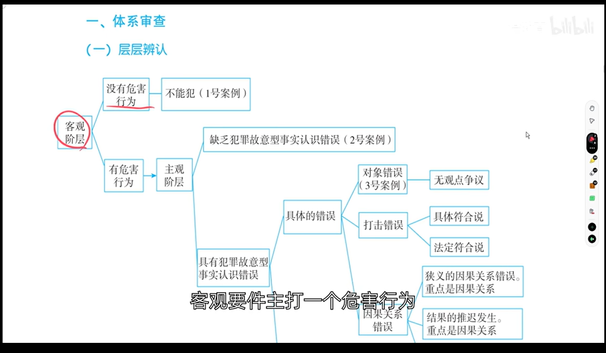

## 1、法考备考提纲（事实认识错误）

> **说明**：以下提纲基于讲稿内容整理，对照刑法相关条款，方便非法科背景的考生备考。


### （一）基本概念

**事实认识错误**：行为人主观上认识的事实与客观上发生的事实不一致。

**刑法相关条款**：
- **《刑法》第14条**：故意犯罪——明知自己的行为会发生危害社会的结果，并且希望或者放任这种结果发生。
- **《刑法》第15条**：过失犯罪——应当预见自己的行为可能发生危害社会的结果，因为疏忽大意而没有预见，或者已经预见而轻信能够避免。

> **注释**：事实认识错误本身在刑法条文中没有专门规定，是刑法理论对故意、过失认定问题的系统总结。法考按照 **“法定符合说”** 来讲解。


### （二）做题逻辑顺序（体系审查图）



```
第一步：看客观要件（客观阶层）——有没有危害行为？
├── 没有危害行为 → 不能犯 → 无罪（如：沙漠稻草人案）
└── 有危害行为 → 进入第二步

第二步：看主观——有没有犯罪故意？
├── 没有犯罪故意 → 缺乏故意型事实认识错误
│   └── 有过失→过失致人死亡罪；无过失→意外事件（如：误将人当野兔）
└── 有犯罪故意 → 进入第三步（有犯罪故意型认识错误）

第三步：看预定目标与实害对象的种类是否相同？
├── 种类相同 → 同一构成要件内的错误（具体错误）
│   └── 再分：对象错误 vs 打击错误（考试重点！）
└── 种类不同 → 不同构成要件间的错误（抽象错误）
    └── 如：想杀人，结果打死了狗熊
```


### （三）具体错误 vs 抽象错误

| | 具体错误（同一构成要件内的错误） | 抽象错误（不同构成要件间的错误） |
|---|---|---|
| **定义** | 认识的事实与实际发生的事实不一致，但**没有超出同一犯罪构成** | 认识的事实与实际发生的事实**分别属于不同的犯罪构成** |
| **行业黑话** | **具体的错误** | **抽象的错误** |
| **举例** | 想杀仇人乙，错把丙当乙打死（都是人） | 想杀仇人乙，结果打死了狗熊（人是故意杀人罪，狗熊是故意毁坏财物罪） |


### （四）具体错误的两大分类——对象错误 vs 打击错误（⚡考试重中之重）

#### 🔑 “两步走”区分标准（务必熟记！）

**第一步**：判断犯罪人对**实害对象、实害结果**是什么心理？
- **过失（或意外事件）** → **打击错误**（一步到位，不用走第二步）
- **故意（包括间接故意）** → 走第二步

**第二步**：判断犯罪人行为时对实害对象的**身份有没有认错**？
- **有身份认识错误** → **对象错误**
- **没有身份认识错误** → **没有任何事实认识错误**（间接故意的案件）

#### 对象错误 vs 打击错误对比表

| | 对象错误 | 打击错误 |
|---|---|---|
| **原因** | 认错了人（身份搞错） | 行为偏差（打偏了） |
| **对实害结果的心态** | 故意（直接故意） | 过失（或意外事件） |
| **有无身份认识错误** | 有 | 无（往往根本不知道实害对象的存在） |
| **举例** | 想杀乙，错把丙当乙打死 | 想杀乙，开枪打偏了，打死了旁边的丙 |
| **理论别称** | 动机错误 | 方法错误 |

#### ⚠️ 对象错误的最大易错点（讲授者反复强调！）

> **把“杀人动机”和“杀人故意”搞混！**

- 想杀狗蛋→错把铁牛当狗蛋打死了
- **有杀铁牛的故意吗？有！** 因为铁牛就是眼前这个人
- **有杀铁牛的动机吗？没有。** 动机是杀狗蛋
- **故意杀人罪只要求有杀人的故意，不要求有杀“特定姓名的人”的故意**

🔑 **做题秘诀**：做对象错误题时，**把身份忘掉，记住位置**！


### （五）隔离犯（考试最爱考！）

**定义**：行为和结果不在同一现场的案件（如寄毒酒）。

**三步模型总结**：

| 模型 | 案情 | 对实害结果的心态 | 结论 |
|---|---|---|---|
| 模型一 | 地址写对，快递员投错 | 过失 | **打击错误** |
| 模型二 | 明知他人可能喝，放任不管 | 间接故意 | **无认识错误**（故意杀人既遂） |
| 模型三 | 地址写错（以为211是乙家） | 故意 | **对象错误** |
| 真题模型 | 地址写错（自己填错成217） | 过失 | **打击错误** |


### （六）不能犯（补充概念）

**定义**：客观上没有危害行为，虽然主观上有犯意，但行为对法益没有任何危险。

**对象不能犯**：如沙漠稻草人案——想杀仇人，结果是稻草人，四下无人→无罪。

> **注释**：不能犯与事实认识错误的区别在于：不能犯是在**客观阶层**就出罪了（没有危害行为）；事实认识错误是客观上有危害行为，但在**主观阶层**处理。


## 2、2026年法考高频考点预测

> **说明**：以下基于讲稿中讲授者明确强调的考试重点整理。

| 知识点 | 可能考试的方式 | 举例 | 是否主观题考点 |
|---|---|---|---|
| **对象错误 vs 打击错误的区分（两步走标准）** | 客观题（单选/多选），给出案例让判断属于哪种错误 | 寄毒酒三个模型；开枪打偏的各种变体 | **是**（案例分析题可能涉及） |
| **动机 vs 故意的区分** | 客观题，选项设置陷阱（把动机当故意，或把故意当动机） | “甲对丙的死亡有没有故意”——丙就是被害人本人 | 否 |
| **隔离犯中的认识错误** | 客观题，寄毒酒类案例 | 地址写错 vs 快递员投错 | **是**（主观题可能考模型区分） |
| **具体错误 vs 抽象错误的区分** | 客观题，判断属于同一构成要件内还是不同构成要件间 | 打死人（具体）vs 打死狗熊（抽象） | 否（但作为基础概念） |
| **不能犯（对象不能犯）** | 客观题，判断是否构成犯罪 | 沙漠稻草人案 | 否 |
| **缺乏故意型事实认识错误** | 客观题，判断是过失致人死亡还是意外事件 | 误将人当野兔射杀 | 否 |
| **间接故意 vs 打击错误的区分** | 客观题，判断“打偏了”是否属于打击错误 | 小方杀狗蛋（铁牛拥抱案） | **是**（间接故意的认定） |

> **⚠️ 主观题特别提示**：讲授者明确提到，**对象错误与打击错误的区分**、**隔离犯（寄毒酒案）的模型分析**，是考试的重中之重，很可能在主观题中出现案例分析。需要掌握：①两步走标准的完整推理过程；②每个步骤的判断理由；③最终结论（构成什么罪，既遂还是未遂）。


## 四、讲稿中提到的全部例题清单

| 编号 | 名称 | 所属知识点 |
|---|---|---|
| 例题1 | 沙漠稻草人案 | 不能犯（对象不能犯） |
| 例题2 | 误将人当野兔案 | 缺乏故意型事实认识错误 |
| 例题3 | 认错仇人案（乙/丙） | 对象错误（具体错误） |
| 例题4 | 动物园狗熊案 | 抽象错误 |
| 例题5 | 小方杀狗蛋（铁牛拥抱案） | 打击错误 vs 间接故意 |
| 例题6 | 认错人（狗蛋/铁牛） | 对象错误（动机 vs 故意） |
| 例题7 | 寄毒酒三个模型 | 隔离犯中的认识错误 |
| 例题8 | 寄毒酒写错地址（真题） | 隔离犯中的打击错误 |
| 例题9 | 甄嬛传剪秋投毒案 | 间接故意 vs 打击错误 |

## 3、讲稿切分段落（按逻辑顺序）

> **说明**：以下对原文进行了段落切分和适当修订。修改处用 **【修订】** 标注；重复内容已删除；口语化表达在不改变原意的前提下适当精简；讲授者自述、鼓励性内容予以保留。

### 第一部分：引入——本节的重要性与学习建议

事实认识错误是刑法中既重点又难点的板块。许多同学都想放弃，但不要怕。建议先关掉视频，把书认认真真看一遍，这个板块看一两遍，再听讲，消化起来更容易。【修订：精简口语】

讲授者分享了一段关于读书的感悟（源自《权力的游戏》小恶魔台词“我的头脑就是我的武器”），鼓励大家在这个板块要下决心先看书。【修订：保留讲授者原意，精简表述】

### 第二部分：体系审查图——做题的逻辑顺序

这一块容易乱，因为没有把体系顺序梳理清楚。必须按照体系审查图层层辨认，不能凭感觉。做题第一步：**先看客观要件（客观阶层）** ——有没有危害行为。

### 第三部分：一号案例——不能犯（对象不能犯）

**例题1（沙漠稻草人案）** ：甲在沙漠中看到前方有个仇人乙，向其开枪，实际上是稻草人，四下无人。【修订：原文“而且是四下无人”调整为更通顺的表达】

**分析**：先看客观——沙漠中四下无人，又是稻草人，开枪对任何人的生命法益都没有危险，所以不是危害行为。从危害行为这一块直接得出无罪结论。理论上称为**不能犯**，具体是**对象不能犯**。特点：客观上没有危害行为，虽然主观上把对象认错了，但先看客观。【修订：保留“不要考虑枪支犯罪”的提示】

### 第四部分：二号案例——缺乏故意型的事实认识错误

**例题2（误将人当野兔案）** ：甲在树林中看到前方有野兔，以为是野兔就开枪，实际上是个人乙，把乙打死了。【修订：讲授者提到“去年湖南还是哪就发生这种案例”，保留此信息】

**与一号案例的对比**：

| | 一号案例（稻草人） | 二号案例（野兔/人） |
|---|---|---|
| **相同点** | 主观上都把对象认错了 | 主观上都把对象认错了 |
| **区别（客观）** | 开枪不是危害行为 | 开枪是危害行为（把人打死了） |

**分析**：主观上不是故意（没有杀人故意），要么是过失（定过失致人死亡罪），要么是意外事件（无罪）。称为**缺乏故意型的事实认识错误**（缺乏犯罪故意）。

### 第五部分：三号案例——具有犯罪故意型的事实认识错误（同一构成要件内的错误/具体错误）

**例题3（对象错误——认错仇人）** ：甲看到前方站着仇人乙，开枪，实际上认错人了，是路人丙，把丙当作乙打死了。

**与二号案例的对比**：

| | 二号案例（野兔/人） | 三号案例（乙/丙） |
|---|---|---|
| **相同点** | 客观上有危害行为；主观上都把对象认错了 | 客观上有危害行为；主观上都把对象认错了 |
| **区别（主观）** | 没有杀人故意（只有打野兔的故意） | **有杀人故意** |

三号案例称为**具有犯罪故意型的认识错误**。

### 第六部分：四号案例——不同构成要件间的错误（抽象错误）

**例题4（动物园案）** ：动物园游人如织，甲看到前方有仇人乙就开枪，实际上是狗熊（把狗熊当成了乙），把狗熊打死了。子弹差点击中其他游客，从游客耳边飞过。【修订：原文“无害行为”应为“危害行为”之误，已修正】

**与三号案例的对比**：

| | 三号案例（乙/丙） | 四号案例（人/狗熊） |
|---|---|---|
| **相同点** | 客观上有危害行为；主观上都把对象认错了；都有杀人故意 | 客观上有危害行为；主观上都把对象认错了；都有杀人故意 |
| **区别** | 预定目标（人）与实害对象（人）**种类相同** | 预定目标（人）与实害对象（狗熊/物）**种类不同** |

**命名**：
- 三号案例：**同一构成要件内的错误**（同一犯罪构成内的错误）——行业黑话称 **“具体的错误”**
- 四号案例：**不同构成要件间的错误**（不同犯罪构成间的错误）——行业黑话称 **“抽象的错误”**

> **注释**：这两个黑话术语需要记忆，因为考试选项里可能出现。具体错误=同一构成要件内的错误；抽象错误=不同构成要件间的错误。

### 第七部分：具体错误的两大分类——对象错误 vs 打击错误

具体错误分为三大类，最难区分的是**对象错误**和**打击错误**，这是考试的重中之重。

讲授者给出了一个 **“两步走”区分标准**：

**第一步**：判断犯罪人对**实害对象、实害结果**是什么心理？
- 如果是**过失心理**（或意外事件）→ **一步到位：打击错误**
- 如果是**故意心理**（包括间接故意）→ 走到第二步

**第二步**：判断犯罪人行为时对实害对象的**身份有没有认错**？
- 如果有身份认识错误 → **对象错误**
- 如果没有身份认识错误 → **没有任何事实认识错误**（可能是间接故意的情形）

### 第八部分：两步走标准的原理讲解（含例题5）

讲授者通过一个复杂案例说明：**不是所有“打偏了”都是打击错误**。

**例题5（小方杀狗蛋案——间接故意 vs 打击错误）** ：

**案情**：小方要杀狗蛋（因狗蛋出轨），看到前方站的就是狗蛋，没认错。正要开枪时，铁牛走过去拥抱亲吻狗蛋。小方不想打死铁牛，想等铁牛离开再开枪。但铁牛一直抱着狗蛋不撒手。小方等不及，心想：我尽力朝狗蛋开枪，如果把铁牛打死了算你倒霉。砰！一枪打过去，真把铁牛打死了。

**问题**：这是打击错误吗？

**分析**：小方对铁牛的死亡是**放任心态**=**间接故意**=故意。主观认识和实际发生一致→不存在事实认识错误→不是打击错误。

**结论**：要构成打击错误，必须加一个条件——对实害对象、实害结果只能是**过失或意外事件**。

**修改后的案情（打击错误）** ：铁牛在附近割猪草，小方没看到铁牛，开枪打偏了，把割猪草的铁牛打死了。对铁牛的死亡不是故意（没看到），是过失→**这才是打击错误**。

### 第九部分：对象错误的深入讲解——动机 vs 故意的区分（重点难点）

**例题6（对象错误——认错人）** ：小方看到前方站了一个人，认为是狗蛋，开枪，实际上是铁牛（认错了），把人打死了。

**分析**：
- 小方对眼前这个人的死亡是**故意**（直接故意）
- 但对这个人的**身份有认识错误**（以为是狗蛋，实际上是铁牛）→ **对象错误**

**⚠️ 易错点（讲授者重点强调）** ：

> 问：“小方对前方这个人的死亡是什么心态？” → 答：故意。
> 问：“小方对铁牛的死亡是什么心态？” → 很多同学会答：过失（没有杀铁牛的故意）。

**这是错误的！** 铁牛就是这个人，这个人就是铁牛。之所以会答错，是因为把**杀人动机**和**杀人故意**混淆了。

- 小方**没有杀铁牛的动机**（动机是杀狗蛋）
- 但小方**有杀人的故意**（铁牛是人，就是眼前这个人）

故意杀人罪只要求有杀人的故意，不要求有杀“特定姓名的人”的故意。对象错误理论上又称**动机错误**——杀人动机没实现，但杀人故意有且实现了。

**🔑 做题口诀**：做对象错误的题时，**把身份忘掉，记住位置**。身份姓名不影响杀人故意的认定；位置（这个人是否在攻击范围内）才决定有无杀人故意。

### 第十部分：两步走标准的真正用武之地——隔离犯（寄毒酒案）

之前讲的案例都是“同一现场”的案件（行为和结果在同一现场，眼睛能看到），凭感觉也能做对。两步走标准的优越性体现在**隔离犯**（行为和结果不在同一现场）的场合，考试最喜欢考。

讲授者用**寄毒酒**的三个模型讲解：

**模型一（打击错误）** ：

甲想杀乙，给乙寄毒酒，填写地址正确（211室）。快递员投递时疏忽大意投错了，投到217室。217室的住户丙不知情，喝了毒酒死亡。

**分析**：甲对丙的死亡不可能是故意，只可能是过失或意外事件（没想到快递员搞错）。按两步走，一步到位→**打击错误**。可以理解为：快递员相当于甲射出去的一颗“子弹”，这颗子弹打偏了，打死了丙，甲对丙的死亡是过失。

**模型二（间接故意，无认识错误）** ：

甲给乙寄毒酒，知道乙和老婆丙住在211室，也知道乙可能给老婆喝或一起喝。甲心想“管他呢”，还是寄了。果然乙没喝，老婆丙喝了，中毒死亡。

**分析**：
- 第一步：甲对丙的死亡是**放任**（间接故意）→ 不是打击错误
- 第二步：甲有没有把丙误当作乙的身份认识错误？**没有** → 不是对象错误
- 结论：**什么认识错误都没有**，就是间接故意的案件，故意杀人既遂

**模型三（对象错误）** ：

甲想杀乙，给乙寄毒酒，以为乙家的地址是211室，实际上乙家的地址不是211，211的户主是丙。甲把毒酒寄到211，丙收到后喝了，中毒死亡。

**分析**：甲把211住户的身份搞错了→**对象错误**。

**⚠️ 再次强调易错点**：
- 问：甲对211住户的死亡有没有故意？→ 有（给211寄毒酒，对211住户的死亡是故意）
- 问：甲对丙的死亡有没有故意？→ **有！** 因为丙就是211住户
- 说“没有”又是把**动机**（杀乙的动机）和**故意**（杀211住户的故意）搞混了

**🔑 再次强调**：做故意杀人罪的对象错误题时，**把被害人身份抹掉，用位置（如211室）来代替**。

> **注释**：讲授者提到书上还有教唆犯的问题，原理一样，可以自己练习。另外，书上还有一些“不具有通用性的标准”，一战同学可以不看以免混乱，但二战或学过刑法的同学建议看一看，因为考试会挖坑。

### 第十一部分：真题训练（隔离犯——寄毒酒写错地址）

**例题7（真题）** ：甲想给乙寄毒酒杀死乙，知道乙住在211室。填写包裹单时疏忽大意写成了217室（自己没有意识到），交给快递员。快递员按217投递，217住户丙不知情，喝了毒酒死亡。

**问题**：甲是对象错误还是打击错误？

**分析**：
- 第一步：甲对丙（217住户）的死亡是什么心态？**疏忽大意的过失**（不小心填错了）
- 过失→一步到位→**打击错误**

### 第十二部分：《甄嬛传》案例（宫女剪秋投毒案）

**例题8（剪秋投毒案）** ：

宫女剪秋给甄嬛的汤里放鹤顶红。后来甄嬛没喝，孟静娴喝了，被毒死。剪秋不在场，事后才知道。

**分析（需加条件）** ：
- 如果剪秋投毒时认识到甄嬛身边其他人也可能喝，但放任不管→对死亡结果是**间接故意**→不是打击错误；同时没有把身份搞错→也不是对象错误→**就是间接故意的案件，故意杀人既遂**
- 如果剪秋对其他人可能喝汤完全没有预见→**可能是打击错误**

### 第十三部分：总结——体系路线图回顾

整个体系路线图层层辨认完毕。这一块十字路口多、容易乱，一定要按照体系图一步一步辨认，不能凭感觉蒙。


