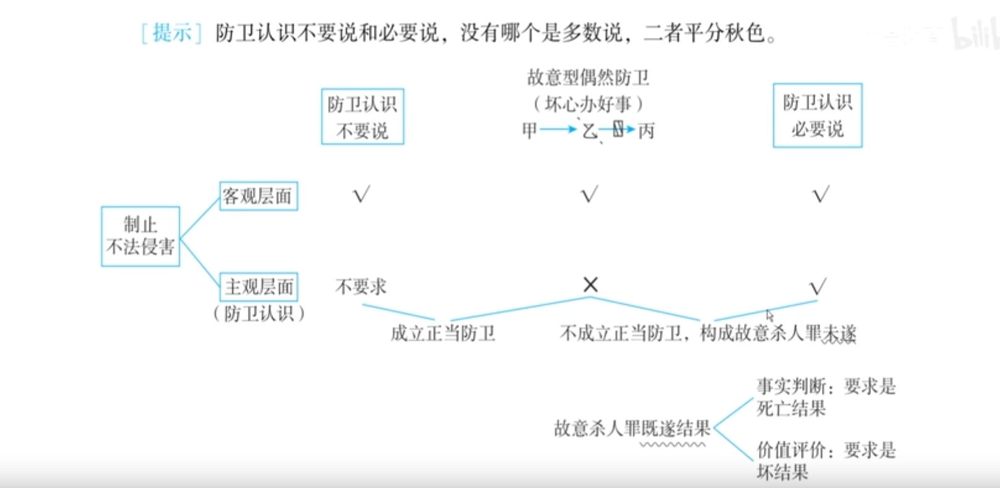

### 1：法考备考提纲与考点提示

本提纲基于上述讲稿内容，对照刑法中正当防卫的构成要件进行提取和梳理，旨在帮助非法学背景的考生系统掌握考点。

#### 一、 正当防卫的构成要件回顾（总框架）

正当防卫的成立需要同时满足以下条件（六字口诀：**制止不法侵害**）：

1.  **起因条件**：存在现实的不法侵害。
2.  **时间条件**：不法侵害正在进行。
3.  **意思条件**（本讲核心）：主观上要有防卫意识（认识+意志）。
4.  **对象条件**：防卫行为必须针对不法侵害人本人。
5.  **限度条件**：防卫行为没有明显超过必要限度造成重大损害。

#### 二、 本讲核心：意思条件（主观要件）深度解析

本讲重点围绕“意思条件”展开，即行为人主观上必须具备**防卫意识**（认识到自己在制止不法侵害）。

**（一）缺乏防卫意识的两种情形**

1.  **偶然防卫（坏心办好事）**
    - **定义**：行为人客观上制止了不法侵害，但主观上**没有**防卫认识。
    - **类型**：
        - **故意型偶然防卫**：基于犯罪故意（如杀人）而偶然实现了防卫效果。
        - **过失型偶然防卫**：基于过失行为（如擦枪走火）而偶然实现了防卫效果。
    - **处理（观点展示）**：
        - **防卫认识不要说（结果本位主义）**：成立正当防卫 → **无罪**。
        - **防卫认识必要说（行为本位主义）**：不成立正当防卫。
            - 故意型：定故意杀人罪**未遂**（因为制造了好结果）。
            - 过失型：过失致人死亡罪不成立（因为缺“坏结果”）→ **无罪**。
    - **核心考点（高频，客观+主观）**：**偶然防卫与打击错误的结合**
        - **案情**：甲乙共谋杀丙，甲打偏打死乙，客观上阻止了乙杀丙。
        - **分析模型**：
            1.  **主观要件阶段（打击错误）**：分析甲对丙、对乙的罪过形态（具体/法定符合说）。
            2.  **排除违法事由阶段（偶然防卫）**：分析甲打死乙是否构成偶然防卫。
        - **终局结论**：
            - 甲对**丙**：故意杀人罪**未遂**。
            - 甲对**乙**：**无罪**（偶然防卫的两种观点均认定无罪，但理由不同）。

2.  **防卫挑拨**
    - **定义**：故意挑衅、激怒对方，待对方实施侵害后，再以“防卫”为名加害对方。
    - **处理**：**不成立正当防卫**，因其主观上具有犯罪故意，是恶意利用防卫制度。

3.  **相互斗殴**
    - **定义**：双方基于不法意图互相攻击（约架、决斗）。
    - **处理**：
        - **斗殴无防卫**：双方均不能主张正当防卫。
        - **斗殴有承诺**：承诺**轻伤**有效；承诺**重伤、死亡**无效，仍需负刑责。
    - **与正当防卫的区分标准**：
        1.  **谁先动手**：先动手者为不法侵害。
        2.  **发生地点**：上门挑衅者多为不法侵害，在家抵抗者多为防卫。

#### 三、 常见例题与解析（基于讲稿）

**【例题1】故意型偶然防卫**
乙欲杀丙，正欲开枪。甲出于杀死仇人乙的意图，开枪将乙打死，客观上救了丙。但甲并未看到乙要杀丙。问：甲的行为如何定性？
- **解析**：甲构成偶然防卫。
    - 防卫认识不要说：成立正当防卫，无罪。
    - 防卫认识必要说：不成立正当防卫，定故意杀人罪未遂。

**【例题2】过失型偶然防卫**
乙欲杀丙，正欲开枪。甲在家擦枪，不慎走火，子弹击中乙，致乙死亡，客观上救了丙。甲并未看到乙要杀丙。问：甲的行为如何定性？
- **解析**：甲构成过失型偶然防卫。
    - 防卫认识不要说：成立正当防卫，无罪。
    - 防卫认识必要说：不成立正当防卫。但甲对乙死亡系过失，涉嫌过失致人死亡罪，因结果客观上系“好结果”，故不构成该罪，最终无罪。

**【例题3】偶然防卫与打击错误结合（猪队友案）**
甲、乙合谋共同枪杀丙。二人同时开枪，甲枪法不准，将乙打死，客观上阻止了乙杀丙。问：甲对丙、对乙如何定罪？
- **解析**：
    - 对丙：构成故意杀人罪**未遂**。
    - 对乙：甲对乙的死亡系过失。分析如下：
        1.  打击错误阶段：具体符合说定过失致人死亡罪；法定符合说拟制为故意杀人既遂（中间结论）。
        2.  偶然防卫阶段：甲打死乙属于**过失型偶然防卫**。两种观点均认为最终应认定为**无罪**。
    - **终局结论**：甲对丙故意杀人未遂，对乙无罪。

**【例题4】防卫挑拨**
马特拉齐故意辱骂齐达内，诱使齐达内用头撞击自己，马特拉齐随即准备反击。问：马特拉齐能否成立正当防卫？
- **解析**：不能。马特拉齐的行为属于防卫挑拨，恶意利用正当防卫制度，不成立正当防卫。

**【例题5】相互斗殴的认定**
A带人冲到B的公司打砸，B率员工反击。警察赶到后，能否认定双方为相互斗殴？
- **解析**：不能。虽然B曾口头回应“你放马过来”，但A上门挑衅，地点在B的公司，B的行为应认定为保卫家园的防卫性质，而非相互斗殴。

#### 四、 2026年法考高概率考点预测表

以下表格基于讲稿中明确的重点、难点及历年考查情况整理，**加粗**项为主观题高度相关考点。

| 知识点 | 可能考试的方式 | 举例/说明 |
| :--- | :--- | :--- |
| **偶然防卫的概念与辨认** | **客观题（概念辨析）** | 辨识“坏心办好事”——客观制止不法侵害，主观无防卫认识。 |
| **防卫认识不要说 vs 必要说** | **客观题（观点判断）** + **主观题（观点展示）** | 给出案例，要求分别按两种观点阐述处理结果及理由。 |
| **故意型偶然防卫的处理** | 客观题（结论判断） | 判断按必要说应定故意杀人罪未遂，而非既遂。 |
| **过失型偶然防卫的处理** | 客观题（结论判断） | 判断按必要说因制造“好结果”而不构成过失致人死亡罪，最终无罪。 |
| **偶然防卫与打击错误的结合** | **客观题（复杂案例分析）** + **主观题（进阶观点展示）** | 如“猪队友案”。需按四要件体系，分步骤分析打击错误（中间结论）和偶然防卫（终局结论），最终得出对预定目标（未遂）和对意外对象（无罪）的结论。此考点逻辑链条长，极易在主观题中考查。 |
| **防卫挑拨的认定** | 客观题（判断正误） | 识别恶意挑衅后反击的行为，不成立正当防卫。 |
| **相互斗殴的两句话及限度** | 客观题（判断正误） | “斗殴无防卫”是原则，“斗殴有承诺（轻伤）”是例外。承诺重伤、死亡无效。 |
| **相互斗殴与正当防卫的区分** | 客观题（案例判断） | 运用“谁先动手”和“地点”两个标准进行区分。重点掌握“上门挑衅”不认定为相互斗殴。 |

---

**总结：**
本段讲稿的核心是**意思条件**，其灵魂在于对**偶然防卫**这一概念的深度剖析及其与**打击错误**的结合考查。备考时需特别注意：
1.  **熟记两种对立观点**（不要说 vs 必要说）及其推导逻辑。
2.  **掌握分析模型**：在复杂案件中，需区分**主观要件阶段**（如打击错误）和**违法性判断阶段**（如偶然防卫），前者是中间过程，后者影响终局结论。
3.  **“猪队友案”是重中之重**，务必理解透彻，因为它极有可能作为主观题的基础案情进行演绎。

### 2：讲稿逻辑切分与文本修正

**说明：**
1.  **逻辑分段**：按照讲授的自然逻辑推进，将长文本切分为若干段落，并提炼了小标题。
2.  **文本修正**：修正了明显的语音转文字错误（如错别字、重复词、不通顺的句子），并用`【修正】`标记；对涉及的其他法律概念用`【注】`进行了说明。
3.  **内容保留**：最大程度保留了原文的讲授风格、所有例题、分析模型和比喻。

---

#### 段落一：引入主题与核心难点——偶然防卫

好，接下来我们讲【正当防卫】的**意思条件**。这里面有一个非常非常重要的难点，就是**偶然防卫**。

我们先讲比较简单的，叫**故意型偶然防卫**。它的标准案例，希望大家一定要记住。因为这一块太难了，所以我今年在这一块自己画了一个图表，可能相对来说清晰一点。大家翻到手上的图表，也就是八十四页，我们一起来看。

#### 段落二：故意型偶然防卫的标准案例与结构辨认

首先，这个标准案例大家要掌握好：乙要杀丙，他正要开枪的时候，甲把乙给打死了。甲把乙打死了，刚好乙就没法去杀丙了，丙就活下来了。

我先问大家，如果甲当时看到了乙要杀丙，甲就是要制止乙的不法侵害、要救丙，那甲就是个妥妥的**第三人的正当防卫**，这个没什么难度。

考题故意给你拐个弯，弄一个特殊情形：**甲当时没有看到乙正要杀丙**，甲只有一个想法——“我要杀死仇人乙”，然后把乙给干掉了。把乙杀了，刚好客观上阻止了乙去杀丙，救了丙。甲这种情况，就属于**坏心办好事**。这个坏心办好事，我们给它起个名字，就叫**偶然防卫**。

那怎么辨认偶然防卫呢？我们前面说过，正当防卫是六个字——**制止不法侵害**。这既有客观面，也有主观面。客观上要求制止不法侵害，主观上也有要求。

我们来看，偶然防卫的特点是：**客观上制止了不法侵害**（客观打钩）；但**主观上**，甲有没有意识到自己在制止乙的不法侵害？没有。他没有防卫意识，也叫**没有防卫认识**（主观打叉）。
所以，辨认偶然防卫，它就是**坏心办好事**——客观打钩，主观打叉。

#### 段落三：观点展示之一——防卫认识不要说

接下来我们看**观点展示**。考试在这一块经常考观点展示，而且两种观点平分秋色，没有哪个是绝对多数说。

**第一种观点，叫防卫认识不要说。**
这个“不要说”的意思是，成立正当防卫，**不要求主观上有防卫认识**，不要求主观上认识到自己在制止不法侵害。
它的理由是：成立正当防卫，只要求客观上制止不法侵害就够了（客观打钩就过）。
按照这种观点，甲的偶然防卫**能成立正当防卫**，因为甲客观上制止了乙的不法侵害，救了丙一命。既然成立正当防卫，甲就**无罪**。
简单讲，防卫认识不要说就是：**我只看客观上有没有办好事，不管主观上是好心还是坏心。**

#### 段落四：观点展示之二——防卫认识必要说

**第二种观点，叫防卫认识必要说。**
“必要说”的意思是，成立正当防卫，**既要求客观上制止不法侵害，还要求主观上认识到这一点**，也就是主观上要有防卫认识（客观主观都得打钩）。
它的理由是：成立正当防卫，必须是**好心办好事**。

按照这种观点，甲的偶然防卫**不成立正当防卫**。因为虽然客观上制止了不法侵害，但主观上没有防卫认识。
那不成立正当防卫，甲把乙打死了，就要定罪。定什么罪？**故意杀人罪**。
但是，注意！是故意杀人罪的**既遂**还是**未遂**？结论是：**未遂**。

许多同学不理解：明明把仇人乙杀死了，为什么不是既遂？
背后的原理是这样的：故意杀人罪要成立既遂，要制造一个**既遂结果**。这个结果有两个层次的要求：
1.  **事实判断**：有一个死亡结果。
2.  **价值评价**：这个死亡结果必须是**坏结果**。
你不要以为死亡结果就一定是坏结果。法警执行枪决，事实判断上制造了死亡结果，但价值评价上是好结果（为民除害）。
现在，甲把乙打死了，客观上制止了乙杀人的不法侵害，救了丙一命。这个死亡结果是**好结果**。而杀人罪的既遂结果必须是坏结果，所以这个死亡结果不属于既遂结果，不能定既遂。
既遂排除了，又没有中止行为，就只能定**故意杀人罪未遂**。

#### 段落五：两大观点的底层原理与价值观剖析

我们来看两种观点背后的底层原理：

- **防卫认识不要说**（结果本位主义）：行为的好坏，由**结果的好坏**决定。偶然防卫是坏心办好事，既然结果上办了好事，行为就是好行为，就成立正当防卫（无罪）。这叫**以成败论英雄**。
- **防卫认识必要说**（行为本位主义）：行为的好坏，用**行为本身的标准**判断，与结果的好坏各算各的账。坏心办好事，有坏心、坏行为，不能成立正当防卫，成立故意犯罪；但承认办了好事，有好结果，所以不定既遂，定未遂从宽处理。

`【注】` 讲授者在此处引入了“结果本位主义/行为本位主义”的哲学/价值观讨论，并类比了老板与员工、恋爱观等生活场景，旨在帮助理解两种观点的差异，并非刑法条文本身。

#### 段落六：过失型偶然防卫及其观点展示

我们刚才讲的是**故意型偶然防卫**，现在巩固训练一下**过失型偶然防卫**。

标准案例：还是乙要杀丙，甲把乙打死了。但这次甲不是故意杀仇人，而是坐在自家门前擦枪，**不小心擦枪走火**，子弹飞出去把乙干掉了，刚好阻止了乙杀丙。
甲没有意识到乙在杀人，客观上是制止了不法侵害（客观打钩），但主观上没有防卫认识（主观打叉），这也是偶然防卫，属于**过失型偶然防卫**。

观点展示：
- **防卫认识不要说**：一切偶然防卫一律成立正当防卫，甲**无罪**。
- **防卫认识必要说**：不成立正当防卫。要定罪，涉嫌**过失致人死亡罪**。
    - 但结论是：**不构成**过失致人死亡罪，**无罪**。
    - 理由：过失致人死亡罪的死亡结果，事实判断上要有死亡结果，价值评价上也必须是**坏结果**。而甲坏心办好事，制造的是好结果，所以不符合结果要件，不构成过失犯罪，只能无罪。

**注意**：两种观点结论一样（都是无罪），但理由不同。
- 防卫认识不要说：因为成立正当防卫，所以无罪。
- 防卫认识必要说：因为不成立正当防卫，但想定的过失犯罪因结果不是“坏结果”而无法成立，所以只能无罪。

#### 段落七：偶然防卫与假想防卫的对比总结

我们来做个小结，把偶然防卫和前面学的**假想防卫**对比一下：

| 类型 | 特点 | 客观是否制止不法侵害 | 主观是否有防卫认识 | 处理结果 |
| :--- | :--- | :--- | :--- | :--- |
| **偶然防卫** | **坏心办好事** | ✅ 是（打钩） | ❌ 否（打叉） | 观点展示（无罪 / 成立犯罪但未遂） |
| **假想防卫** | **好心办坏事** | ❌ 否（客观上无不法侵害） | ✅ 是（误认为有） | 不成立正当防卫；有过失定过失犯罪，无过失按意外事件 |

这两个属于正当防卫板块的**认识错误问题**，刚好是颠倒过来的。

#### 段落八：最高频核心考点——偶然防卫与打击错误的结合

接下来是本节最难的点，也是法考客观题和主观题都考过的点：**偶然防卫和打击错误的结合**。这个难点不能回避，必须攻克。

**标准案例（猪队友案）**：
甲和乙说好一起朝丙开枪，把丙打死。结果甲枪法太差，**打偏了**，把乙给打死了。如果甲没有打死乙，乙就会顺利开枪打死丙。甲就是个“猪队友”。

**分析步骤（按四要件体系）**：

**第一步：分析打击错误（主观要件阶段）**
- 甲的预定目标是丙，但受害对象是乙。甲对乙的死亡有过失。
- **观点展示**：
    - **具体符合说**：甲对丙是故意杀人未遂；甲对乙是过失致人死亡罪。想象竞合。
    - **法定符合说**：甲对丙是故意杀人未遂；甲对乙（过失拟制为故意）是故意杀人既遂。想象竞合，定故意杀人既遂。
    `【注】` 此处的“具体符合说”与“法定符合说”是刑法中关于事实认识错误（打击错误）的两种处理理论，是主观要件阶段的中间分析。

**第二步：分析偶然防卫（排除违法事由阶段）**
- 仅就“甲打死乙”这条线来看，是不是偶然防卫？是。
    - 客观上，甲打死乙，阻止了乙杀丙（客观打钩）。
    - 主观上，甲没有防卫认识（主观打叉）。
- 这是**过失型偶然防卫**（甲打死乙是过失）。
- **观点展示**：
    - **防卫认识不要说**：成立正当防卫，甲对乙**无罪**。
    - **防卫认识必要说**：不成立正当防卫。涉嫌过失致人死亡罪，但因为制造的是“好结果”，不符合该罪结果要件，故**无罪**。

**第三步：终局结论**
- 分析打击错误是在主观要件阶段的**中间结论**，最终结论要走到**排除违法事由**（偶然防卫）阶段。
- **终局判决**：
    - 甲对丙（预定目标）构成**故意杀人罪未遂**（无争议）。
    - 甲对乙（打死兄弟）**无罪**（偶然防卫的两种观点都认为无罪，但理由不同）。
- **特别注意**：不要再把打击错误阶段的结论（如具体符合说定的过失致人死亡罪，或法定符合说定的故意杀人罪既遂）当作最终判决。

#### 段落九：缺乏防卫意识的两种情形（一）——防卫挑拨

接下来讲缺乏防卫意识的两种情形，考试也挺喜欢考。

**第一种：防卫挑拨**
它是**恶意利用正当防卫制度**。典型案例是2006年世界杯决赛，意大利后卫马特拉齐挑衅法国队长齐达内，辱骂其家人。齐达内忍无可忍，用头撞倒马特拉齐，被红牌罚下。
马特拉齐就是防卫挑拨：我挑衅你，让你先进攻我，我再反击，就想成立正当防卫。
**结论：防卫挑拨不能成立正当防卫**，因为你恶意利用了正当防卫制度。
`【注】` 讲授者在此处穿插了对齐达内行为的个人评价及对法考备考心态的感悟，属于延伸内容。

#### 段落十：缺乏防卫意识的两种情形（二）——相互斗殴

**第二种：相互斗殴（约架、决斗）**

**记住两句话：**
1.  **斗殴无防卫**：相互斗殴的任何一方，都是不法侵害，是“不正对不正”，不能主张正当防卫。
2.  **斗殴有承诺**：相互斗殴意味着你承诺了对方对自己的侵害。但**承诺有限度**：
    - 承诺轻伤：有效，不构成故意伤害罪。
    - 承诺重伤、死亡：无效，造成重伤或死亡仍构成故意伤害罪或故意杀人罪。

**实务难点：如何区分相互斗殴与正当防卫？**
两个区分标准：
1.  **看谁先动手**：先动手的一方是不法侵害，后动手反击的一方可能是防卫。
2.  **看地点**：地点很重要！例如，老板A带人冲到老板B的公司去打砸，B公司员工反击，这不是相互斗殴，而是B方在保卫家园，属于正当防卫（或防卫行为）。不能因为B之前说过“你放马过来”就认定为约架。类比：日本侵略中国，不能说双方是聚众斗殴，这是卫国战争。

#### 段落十一：意思条件回顾与下节预告

好，我们讲完了**意思条件**。回顾一下，意思条件有三个点：
1.  **偶然防卫**（大哥大，核心难点）
2.  **防卫挑拨**
3.  **相互斗殴**

意思条件讲完以后，接下来我们就要进入**对象条件**。

---

