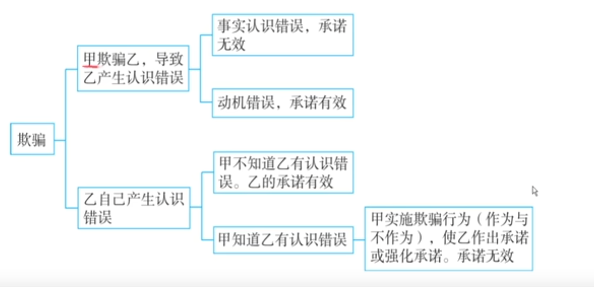

# 第1部分：紧急避险与被害人承诺——法考备考提纲

> **适用对象**：非法学背景的法考备考者
> **说明**：本提纲对照《刑法》条文，按主题整理讲稿核心内容，不遗漏考点与例题。超出主题范畴的概念以【注】标出。

## 一、紧急避险（《刑法》第21条）

### 【法条原文】
> 《刑法》第21条：“为了使国家、公共利益、本人或者他人的人身、财产和其他权利免受正在发生的危险，不得已采取的紧急避险行为，造成损害的，不负刑事责任。紧急避险超过必要限度造成不应有的损害的，应当负刑事责任，但是应当减轻或者免除处罚。第一款中关于避免本人危险的规定，不适用于职务上、业务上负有特定责任的人。”

### 1. 起因条件：面临危险

| 项目 | 内容 |
|------|------|
| 危险来源 | （1）自然灾害、野生动物袭击；（2）人的不法侵害 |
| 关键词 | 面临危险 → 攻击无辜第三人 → 不构成犯罪 |
| 现实性要求 | 危险必须**现实存在**，否则为**假想避险** |

**例题1**：武松被老虎追咬，闯进潘金莲家 → 紧急避险，不构成非法侵入住宅罪。
**例题2**：武松被西门庆追砍，闯进潘金莲家 → 紧急避险。
**例题3**：铁牛误以为狗蛋触电而用木棒打他 → 假想避险。处理：有过失定过失犯罪，无过失按意外事件。

**【注】假想防卫、假想避险与正当防卫/紧急避险的逻辑一致——客观不存在危险，主观以为存在，按过失或意外事件处理。**

### 2. 时间条件：危险正在发生

| 类型 | 定义 | 效果 | 处理 |
|------|------|------|------|
| 事前避险 | 危险尚未发生 | ❌不成立紧急避险 | 故意→故意犯罪；过失→过失犯罪；无过失→意外事件 |
| 事后避险 | 危险已经消除 | ❌不成立紧急避险 | 同上 |
| 避险适时 | 危险正在发生 | ✅成立紧急避险 | 无罪 |

**例题4**：老虎还在十公里外，武松就闯进潘金莲家 → 事前避险，不成立紧急避险（迫不及待 vs 迫不得已）。

### 3. 意思条件：偶然避险（客观打勾、主观打叉）

**定义**：客观上避免了危险，但主观上没有认识到危险（没有避险认识）。

**例题5**：高中生为泄愤砸窗，客观上救了正在自杀的夫妻 → 偶然避险。

**观点展示**：

| 观点 | 结论 | 对高中生的处理 |
|------|------|----------------|
| 避险认识不要说 | 只要客观上避免危险即可，不需主观认识 | 成立紧急避险，不构成故意毁坏财物罪 |
| 避险认识必要说 | 主客观都要求，需好心办好事 | 不成立紧急避险，构成故意毁坏财物罪（未遂） |

> ⚠️ **重要提示**：2026年法考很可能考查偶然避险的观点展示（与偶然防卫类比）。**主观题考点**，必须掌握推导逻辑。

### 4. 补充性条件（不得已条件）：迫不得已，别无他法

> 正当防卫不要求此条件，紧急避险必须要求——因为紧急避险侵害的是无辜第三人。

**例题6**：黄渤在《疯狂的石头》中偷面包 → 不构成紧急避险（因为他还有体力跑很远，说明未到奄奄一息的程度，不满足“迫不得已”）。

### 5. 受强制的紧急避险

**定义**：危险来自于他人的强制手段，行为人迫不得已侵犯第三人法益。

**例题7**：歹徒胁迫老板强奸女孩，否则二人都死 → 多数说认为可认定为紧急避险（受强制的紧急避险），老板不构成强奸罪；歹徒构成强奸罪的间接正犯 + 敲诈勒索罪 + 非法拘禁罪等。

> **【注】间接正犯**：利用他人作为工具实行犯罪的人。此处歹徒利用老板作为工具实施强奸，老板因紧急避险阻却违法，歹徒仍构成强奸罪的间接正犯（后面分则部分会详细讲）。

### 6. 限度条件：法益衡量（避险过当）

**核心规则**：保护的法益 **≥** 损害的法益

**法益价目表**：生命 > 身体健康 > 人身自由 > 财产

| 规则 | 内容 | 例题 |
|------|------|------|
| 财产=财产 | ✅有效 | 狗蛋推小芳货物下海 → 紧急避险（但民事要赔偿） |
| 生命≠生命 | ❌无效 | 狗蛋为保命把小芳扔下海 → 故意杀人罪 |
| 生命>生命？ | ❌多数说无效 | 杜德利案：杀一救多 → 故意杀人罪（道德主义为多数说） |

**例题8**：狗蛋为救自己一吨货物，推小芳一吨货物下海 → 财产对财产，成立紧急避险。
**例题9**：狗蛋为保命把小芳扔下海 → 生命对生命，不成立紧急避险，构成故意杀人罪（量刑可从宽）。
**例题10（杜德利案）** ：船长杀17岁水手帕克，食肉喝血救其余三人 → 法院判故意杀人罪，女王特赦。

> ⚠️ **重要提示**：“生命不能划等号”是法考客观题高频考点。**主观题考点**：法益衡量的逻辑推导、道德主义 vs 功利主义的观点展示。

## 二、被害人承诺

### 1. 概念

被害人同意他人侵害自己的法益，承诺有效 → 行为人不构成犯罪。

**例题11**：小芳让狗蛋砸自己的玛莎拉蒂 → 狗蛋不构成故意毁坏财物罪。

### 2. 承诺的权限与范围

| 法益类型 | 能否承诺放弃 | 说明 |
|----------|-------------|------|
| 财产 | ✅ 有效 | 可以放弃 |
| 名誉 | ✅ 有效 | 可以放弃 |
| 自由 | ✅ 有效 | 可以放弃（如自愿被锁） |
| 身体健康（轻伤） | ✅ 有效 | 如打耳光、打掉门牙 |
| 身体健康（重伤） | ❌ 无效 | 如砍胳膊 |
| 生命 | ❌ 无效 | 杨志杀牛二——故意杀人罪 |

**例题12（2024年考题）** ：黑社会入门仪式，狗蛋同意被打成重伤 → 承诺无效，打人者构成故意伤害罪。
**例题13**：杨志卖刀，牛二承诺“你杀了我” → 承诺无效，杨志构成故意杀人罪（未遂/既遂取决于案情）。

### 3. 承诺的时间：必须事前做出

事后承诺无效。

### 4. 承诺的能力

被害人必须具备**理解能力**（理解承诺事项的意义和范围）。小孩、精神病患者无承诺能力。

**【注】分则应用**：即使幼女同意发生性行为，仍构成强奸罪——因为幼女无承诺能力。

### 5. 承诺的意思表示：欺骗与认识错误（核心考点）

**基本规则**：受欺骗、受胁迫做出的承诺无效。但欺骗要看类型。

#### （1）甲欺骗乙 → 乙产生认识错误

| 错误类型 | 含义 | 示例 | 承诺效力 | 对方是否犯罪 |
|----------|------|------|----------|-------------|
| **事实认识错误** | 对**事实本身**搞错了 | 小龙女以为尹志平是杨过 | ❌无效 | 尹志平构成强奸罪 |
| **动机错误** | 对事实没搞错，但“干这件事的动机”被骗了 | 女演员知道对方是导演、知道要上床，但以为能当女一号 | ✅有效 | 副导演不构成强奸罪 |

**例题14**：尹志平冒充杨过与小龙女发生性行为 → 事实错误（对方身份），承诺无效，强奸罪既遂。
**例题15**：副导演骗女演员“跟我上床就让你当女一号” → 动机错误，承诺有效，不构成强奸罪。

> ⚠️ **核心判断标准**：看被害人**对“在和谁、干什么”有没有搞错**。搞错了 = 事实错误，承诺无效；没搞错 = 动机错误，承诺有效。

#### （2）乙自己产生认识错误（本人错误）

| 情形 | 结论 | 例题 |
|------|------|------|
| 甲不知道乙有认识错误 | 承诺有效 | 2019年考题：乙短信漏写“不”字，甲砍树 → 甲无罪 |
| 甲知道乙有认识错误，且有欺骗行为（作为或不作为） | 承诺无效 | 2019年考题：兽医不告知新药，实施安乐死 → 故意毁坏财物罪 |

> **【注】不作为的欺骗**：行为人有告知真相的义务（如本案兽医的职业义务），有义务不告知，即构成不作为的欺骗。这在分则“诈骗罪”中还会专门讲到。

### 6. 推定的被害人承诺

**定义**：被害人没有现实承诺，但能推定其会同意。

**标准**：以**一般人的合理意愿**为标准（不是被害人的实际意愿）。

**例题16**：老王帮小方关水龙头，砸坏门窗 → 推定承诺 → 不构成犯罪。
**例题17**：狗蛋救自杀女子，导致其轻伤 → 以一般人的合理意愿推定有承诺 → 不构成故意伤害罪。

## 三、超纲概念注释汇总

| 概念 | 解释 | 在讲稿中出现的位置 |
|------|------|-------------------|
| **间接正犯** | 利用他人作为犯罪工具来实现自己犯罪的人 | 受强制的紧急避险（歹徒） |
| **不作为的欺骗** | 有告知真相义务而不告知，构成欺骗 | 兽医案 |
| **无因管理** | 没有法定或约定义务而为他人管理事务（民法概念） | 推定承诺 |
| **道德主义 vs 功利主义** | 道德主义：人是目的不是手段；功利主义：算总账 | 杜德利案 |
| **防卫认识不要说/必要说** | 与“避险认识不要说/必要说”对应，同一套逻辑 | 偶然避险推导中类比用 |

## 四、2026年法考重要考点预测表

> 基于讲稿中明确提及的近年考点及讲授者强调的内容整理

| 知识点 | 可能考试方式 | 举例 | 是否主观题考点 |
|--------|-------------|------|---------------|
| **偶然避险的观点展示** | 给案例，问“甲是否构成紧急避险？”要求按不同观点分别推导 | 高中生砸窗救人案 | ⚠️ **是** |
| **生命法益能否衡量（杜德利案）** | 给案例，问是否构成紧急避险/故意杀人罪，辨析道德主义与功利主义 | 杀一救多、洞穴奇案 | ⚠️ **是** |
| **被害人承诺——事实错误 vs 动机错误** | 给欺骗性承诺案例，问承诺是否有效，对方是否构成犯罪 | 尹志平案 vs 副导演案 | ⚠️ **是**（推导逻辑） |
| **受强制的紧急避险** | 给胁迫案例，问行为人是否构成犯罪 | 歹徒胁迫强奸案 | 客观题（也可能主观题） |
| **假想避险的处理** | 给误以为有危险的案例，问如何定罪 | 甩狗屎被误认为触电案 | 客观题 |
| **承诺放弃重伤/生命的效力** | 直接问“重伤承诺是否有效”或给案例判断 | 黑社会入门仪式案、杨志卖刀案 | 客观题 |
| **推定的被害人承诺** | 给救人致伤或未经同意进入他人住宅的案例，问是否构成犯罪 | 救人致轻伤案 | 客观题 |
| **不得已条件（迫不得已）** | 给偷窃/侵犯他人法益的案例，问是否满足“迫不得已” | 黄渤偷面包案 | 客观题 |
| **自己产生认识错误（本人错误）** | 给短信漏字、兽医不告知等案例，问承诺效力 | 2019年两道考题 | 客观题 |
| **法益价目表（财产=财产、生命≠生命）** | 给法益冲突案例，判断是否避险过当 | 推货物下海、扔小芳下海 | 客观题 |

> ⚠️ **特别提示**：讲稿中讲授者明确提到“偶然避险一次都没考过”，这意味着**2026年考查概率极高**。偶然避险的推导逻辑与偶然防卫完全对应，必须熟练掌握“避险认识不要说”和“避险认识必要说”两套推导路径。此外，“事实错误 vs 动机错误”在被害人承诺中属于高频考查点，且容易与分则罪名结合考查，务必重点掌握。
>
> **标注说明**：“是否主观题考点”一栏中标注⚠️的，表示讲授者在讲稿中明确提到了观点展示、推导逻辑或需要书面论述的内容，属于主观题可能考查的方向。

# 第2部分：紧急避险与被害人承诺——讲稿整理（分段·校对版）

> **说明**：本部分以原讲稿为基础，按讲授逻辑重新切分段落，并对音频转文字中的重复、错漏、语序不畅之处作了最小必要修订。所有修改处用 **【校】** 标注；原讲稿中的案例均以“例题”形式保留；涉及超出主题范畴的刑法概念，以“【注】”形式补充说明。

## 第一段：紧急避险的定位与起因条件（危险的来源）

好，那接下来我们就看一下紧急避险。紧急避险呢，它相对来说啊，比正当防卫没那么重要，但是呢，又有一些相似性，我们还是要把它好好来看一下。

紧急避险，我们就抓住四个字，叫“避免危险”。那第一个前提条件就是我们面临了一份危险，我要避免它。这个危险主要来自于两个方面：一个就是自然灾害呀、野生动物袭击呀；第二种呢，就是人的不法侵害了。

**例题1（野生动物袭击——攻击无辜第三人）** ：比如说老虎咬武松，武松打虎，武松其实就是紧急避险。但是武松如果打不过老虎，武松就跑，老虎紧追不舍，然后武松迫不得已闯到潘金莲家——那你说这是擅闯民宅呀，侵犯了无辜第三人的住宅权法益——这个构成什么？我们认为构成紧急避险。

**例题2（人的不法侵害——攻击无辜第三人）** ：如果把老虎换成西门庆，西门庆追砍武松，武松躲无可躲、藏无可藏，被迫闯到潘金莲家，这也属于紧急避险。也就是说，武松面临的危险其实有两个：自然灾害/野生动物袭击，以及人的不法侵害。

所以危险的来源就这两个。针对这两个危险可以紧急避险，而且紧急避险往往会侵害无辜的第三人。但是由于是紧急避险，对第三人不构成犯罪，比如武松对潘金莲就不构成非法侵入住宅罪。

**【校】**
- “紧急避险呢，我们就抓住四四个字” → 修正为“紧急避险呢，我们就抓住四个字”
- “比如说西门西门庆追咬武松” → 修正为“比如说西门庆追砍武松”【校：根据上下文，此处为“追砍”而非“追咬”】
- “啊，就是人的不法侵害啊，比如说西门庆的追砍，这也算是武松。就是人的不法侵害啊，比如说西门庆的追砍，这也算是武松面临的一份危险” → 删除重复语句，合并为“这也属于紧急避险。也就是说，武松这时候面临的不法……人的不法侵害，比如说西门庆的追砍，这也算是武松面临的一份危险”
- “人家住宅的啊，权的法益啊” → 修正为“人家住宅权的法益”

## 第二段：危险的现实性——假想避险

接下来还要注意，这个危险也要具有**现实性**。如果没有现实性的话，那就叫**假象避险**【校：原文“假象避险”，刑法学通称“假想避险”，以下统一修正为“假想避险”】，跟我们前面讲的假想防卫原理是一样的。

**例题3（假想避险——甩狗屎被误认为触电）** ：狗蛋有一天穿了一双新皮鞋走在大街上，结果一不小心踩到狗屎。一手扶着电线杆，一脚在那甩狗屎。结果正在甩的时候，铁牛拿一个木棒直接就把狗蛋给打趴下了。狗蛋躺在地上一脸懵，问：“铁牛，你干嘛打我？”铁牛说：“我打你是救你呀！你触电了。我专门捡个木棒，不敢用金箍棒，怕导电，所以用木棒打你，我是救你啊！”狗蛋无奈地说：“我怎么触电了？我是在那甩狗屎呢！”铁牛说：“哎呀对不住对不住，你甩狗屎抖腿那个样子抖得那么魔性，我以为你真的触电了在抽抽呢。”

那你说铁牛算什么？这就叫**假想避险**——你以为狗蛋面临了一份危险，你赶紧要帮他避免，实际上人家没有面临危险。假想避险怎么处理呢？我们来辨认一下：在“避免危险”这四个字上，有客观要件和主观要件，它是**客观打叉、主观打勾**。也就是说，铁牛主观上想避免危险，但客观上不存在危险要求你去避免，这其实也是个认识错误，是紧急避险范围内的认识错误。

那遇到这种认识错误怎么办呢？首先不可能是故意为之，不能定故意犯罪。那就是：**有过失定过失犯罪，没过失按意外事件处理**。

**【校】**
- “假象避险” → 统一修正为“假想避险”
- “我们先看辨认一下，辨认一下就是在四个字避免危险这个四个字上” → 修正为“我们来辨认一下，在‘避免危险’这四个字上”
- “有个客观要件，有个主观要件，它是客观打差主观打勾” → 修正为“它是客观打叉、主观打勾”【校：根据上下文，此处为“打叉”】
- “那狗蛋首先不可能是故意为之” → 根据上下文，此处主语应为铁牛，修正为“那铁牛首先不可能是故意为之”

## 第三段：时间条件——事前避险与事后避险

第二个是**时间条件**。跟我们那个正当防卫也很像，正当防卫要求不法侵害正在进行，紧急避险就要求**危险正在发生**。如果还没有危险的时候你就去避险，那叫**事前避险**；如果危险已经消除了你还去避险，那叫**事后避险**。事前避险、事后避险都属于**避险不适时**【校：原文“避险不事实”，根据刑法学通称修正为“避险不适时”】，不能成立紧急避险。

该怎么处理呢？跟防卫不适时一样：**如果是故意为之定故意犯罪，如果是过失为之定过失犯罪，如果没过失按意外事件处理**。

**例题4（事前避险——老虎还在十公里外）** ：还是老虎咬武松，武松赶紧跑，说迫不得已只能闯到潘金莲家。潘金莲说：“你怎么又闯我家？”武松说：“老虎咬我，我得躲到你家啊，行行好。”潘金莲问：“老虎在哪里？我怎么没看见？”老虎还在十公里外呢。老虎还在十公里外，你就闯到人家家里——这个时间条件符合吗？我们认为不符合，因为这个时间条件要有一定的紧迫性。还在十公里外呢，你现在就闯到人家潘金莲家，这哪是迫不得已？简直就是迫不及待吧？你这是想搭讪吧？这就属于事前避险，不是紧急避险，是避险不适时了。

**【校】**
- “那叫事前避险，如果危险已经消除了，你还去避险，那叫事后避险。那事前避险、事后避险都属于避险不事实” → 修正为“那叫事前避险。如果危险已经消除了，你还去避险，那叫事后避险。事前避险、事后避险都属于避险不适时”【校：根据上下文，“避险不事实”应为“避险不适时”】
- “跟那个防卫不事实跟那个事前防卫、事后防卫一样” → 修正为“跟防卫不适时、事前防卫、事后防卫一样”
- “你这简直就是迫不急待吧” → 修正为“迫不及待”
- “你是避险不失时了啊” → 修正为“你是避险不适时了”

## 第四段：意思条件——偶然避险（核心考点）

意思条件里面有一个考点和正当防卫一模一样。正当防卫里面有**偶然防卫**，紧急避险这里面有一个叫**偶然避险**。偶然防卫考过好几次，偶然避险一次都没考过，但对偶然避险也要好好整理，比较重要。

**例题5（偶然避险——高中生砸窗救人）** ：有一个高中生跟父母吵架，一气之下离家出走，耍门而出【校：原文“耍门而而出”，应为“摔门而出”】。大晚上的，他在院子里为了泄愤，捡起一块砖随便砸一户邻居的窗户。结果那户邻居是小两口，生活非常困顿，贫贱夫妻百事哀，两口子要自杀——把煤气灶打开，门窗一关，平静地躺在床上，准备携手走向天国。刚躺下没过五分钟，脑子还清醒的，结果窗户突然被砸破了，煤气散出去了。老公气得穿着大裤头爬到阳台上大骂：“谁这么缺德呀！还让不让人死了？我死都这么难吗？”

对于这个高中生来说，他客观上把这对夫妻给救了。但他主观上想救吗？他主观上想避免危险吗？没有，因为他都没有认识到有危险。所以在“避免危险”这四个字上，它的特点是：**客观打勾，主观打叉**——他客观上避免了一方危险，救了两条人命，但他主观上没有认识到有危险要去避免，这就叫**偶然避险**。

对偶然避险怎么处理呢？跟偶然防卫一模一样，也是**观点展示**。

> **【注】观点展示之一：避险认识不要说 vs 避险认识必要说。**
>
> 这与正当防卫中“防卫认识不要说 vs 防卫认识必要说”是同一套逻辑。前者只要求客观上避免危险即可成立紧急避险；后者要求主观上也要认识到危险并有避险意图。

**（一）按照“避险认识不要说”推导**：这个高中生涉嫌的罪名是什么？故意毁坏财物罪（假如玻璃很珍贵）。按照避险认识不要说，成立紧急避险只要客观上避免危险就可以了，不需要主观上有避险认识。偶然避险恰恰是客观上避免危险、主观上没有避险认识，所以按照避险认识不要说，偶然避险一律成立紧急避险。那这个高中生就不构成故意毁坏财物罪。

**（二）按照“避险认识必要说”推导**：成立紧急避险，既要客观上避免危险，也要主观上有避险认识——你得是好心办好事。但偶然避险是坏心办好事，不能成立紧急避险。那现在就涉及到定罪了。首先成立故意毁坏财物罪，但是定既遂还是未遂？应当定**未遂**。为什么呢？故意毁坏财物罪的既遂结果有两个层次：一是在事实判断上造成了一个损害结果；二是在价值评价上这个结果还必须是个坏结果。但现在客观上你办了好事——救了两条人命——这个结果是好的，不能认定为既遂结果来严惩，只能按**未遂**处理。所以定故意毁坏财物罪的未遂。

这就是避险认识必要说的观点和逻辑推导，要能够理解，比较重要。

**【校】**
- “耍门而而出” → 修正为“摔门而出”
- “然后呢开始要平静的啊，呃走向天国” → 修正为“平静地准备走向天国”
- “正正正在刚躺下，正呃没过五分钟” → 修正为“刚躺下没过五分钟”
- “一会儿突然就直接飞进来了” → 根据上下文补充为“窗户突然被砸破了”
- “客观条件主观条件” → 修正为“客观要件、主观要件”
- “按照排除法定什么未遂” → 修正为“按照排除法定刑，只能定未遂”

## 第五段：不得已条件（补充性条件）

接下来看第四个条件，叫**不得已条件**，也叫**补充性条件**。这个条件可是正当防卫没有的，正当防卫不要求这个条件，紧急避险要求。为什么呢？因为紧急避险是攻击无辜的第三人、侵犯第三人的法益，所以必须是**迫不得已、别无他法**才可以。这不是你的首选方案，而是最后的不得已方案。

像刚才说的老虎离武松还有十公里的时候，那就不算迫不得已，叫迫不及待。

**例题6（偷面包算不算紧急避险？——《疯狂的石头》桥段）** ：黄渤在《疯狂的石头》里，在下水道待了几天几夜，饿得好像快不行了，终于爬出来，路过一个面包店，偷了一个法棍塞到嘴里就跑，主人骑着小电驴追到高架桥上。问：黄渤偷面包算不算紧急避险？

根据案情描述，我们认为**不算紧急避险**，不算迫不得已。道理很简单：你都有体力从面包店跑到高架桥上去，说明体力特别好，并没有饿到奄奄一息。真想吃饭，去打个工挣点钱再吃就可以了，为什么要盗窃呢？如果真是饿得奄奄一息、实在不行了，偷个面包救自己一命，那才有可能考虑紧急避险。但你还没到那个份上，所以不是紧急避险。

**【校】**
- “所以它叫补充性条件啥意思？补充性条件就说你不能，这不是你的首选方案” → 修正为“所以它叫补充性条件，就是说这不是你的首选方案”
- “那你就不是迫不得已” → 修正为“那你就不算迫不得已”

## 第六段：受强制的紧急避险

不得已条件里面有一个知识点得注意，叫**受强制的紧急避险**。

**例题7（受强制的紧急避险——歹徒胁迫强奸）** ：实务中有个案件，一帮歹徒劫持了一个老板，想敲诈勒索，又劫持了一个女孩，把两人关在黑屋子里，架起摄像机，要求老板强奸这个女孩，录下来作为把柄。而且威胁：如果不强奸，你们两个人都得死。

新闻报道说老板不愿意，觉得不能祸害女孩，是歹徒抬着老板把女孩给强奸了。——这个描述有点怪。如果真是抬着强奸，那老板都没有刑法上的行为了，因为刑法上的行为要求有意识性、可控制性，被抬着的话自己都无法控制，首先就不是刑法上的行为，那老板就无罪了。

但假如不是抬着，而是拿枪威胁：“你们不干这个事儿，两个人都得死。”老板没办法，被迫把女孩强奸了。这时候老板最终定强奸罪，还是按紧急避险做无罪处理？

我们认为**可以认定为紧急避险**（当然有争议）。为什么？这涉及到后面的**限度条件**——法益衡量。为了保两条人命，和女孩的性权利相比，生命权等级更高，所以多数说认为可以视为紧急避险（即“受强制的紧急避险”），少数说认为要定强奸罪。

如果认定为紧急避险，歹徒肯定不是无罪的——歹徒要定强奸罪的**间接正犯**【注：间接正犯，指利用他人作为犯罪工具来实现自己犯罪的人，后面分则部分会专门讲】，还要定敲诈勒索罪、非法拘禁罪等。

**【校】**
- “实物中有一个案件” → 修正为“实务中有一个案件”
- “哎呀，有一帮歹徒呀，那真的是没人性” → 修正为“一帮歹徒……没人性”【校：删去语气词】
- “抢劫个老板” → 根据上下文，应为“劫持了一个老板”
- “而且如果不强奸，你们两个人都得死，歹徒就这么凶残，都得死” → 修正为“而且威胁：如果不强奸，你们两个人都得死”【校：删去重复】
- “呀，我就觉得这个描述啊就有点怪怪的” → 保留语气，调整为“这个描述有点怪”
- “那在刑法上行为危害行为那一块，他都得打杀” → 修正为“那在刑法上，危害行为那一块，他都得打叉”【校：“打杀”应为“打叉”】
- “歹徒啊，如果给这个老板定了一个受强制的紧急避险” → 修正为“如果给这个老板认定了受强制的紧急避险”

## 第七段：限度条件——法益衡量（避险过当）

最后一个条件——**限度条件**。法条说，如果避险行为超过必要限度造成不应有的损害，那就是**避险过当**，要负刑事责任。怎么才算避险过当？主要涉及**法益衡量**。紧急避险要求**保护的法益 ≥ 损害的法益**，这个账算下来不能是负值，不能做赔本买卖。

法益衡量大致有个“价目表”：**生命法益 > 身体健康法益 > 人身自由法益 > 财产法益**。

**（一）财产法益可以划等号**

**例题8（财产对财产——推货物下海）** ：狗蛋和小芳做生意，共同租了一条商船，各放一吨货物，价值相同。海上遇到海难，船快沉了，两吨货物船浮不起来了。狗蛋为了救自己一吨货物，强行把小芳一吨货物推下海。算不算紧急避险？**算**。因为财产法益可以划等号，为了救自己一吨货物，不得已牺牲人家一吨货物，也是紧急避险，不构成故意毁损罪，但民事上要赔偿。

**（二）生命法益不能划等号，也不能大于**

船继续沉。狗蛋说：“小芳，为了保我一吨货物，看来我得把你扔下去。”小芳说：“我是一吨小芳吗？生命法益大于财产法益，你得把你一吨货物扔下去，否则就是避险过当。”狗蛋一听，把自己一吨货物扔下去了。船上剩下狗蛋和小芳两个人，船还要继续沉。狗蛋说：“这下我可以把你扔下去了吧？”小芳说：“你为什么不下去？你就不能学泰坦尼克号吗？”狗蛋说：“你又不是Rose，我才不学。”现实中我肯定把你打下去。现在问题来了——狗蛋把小芳打下去，构成故意杀人罪还是紧急避险？

多数说认为**不构成紧急避险，构成故意杀人罪**。因为**生命不能划等号**——你不能为救自己的命牺牲别人的命。不过量刑上可以考虑从宽处罚。

**（三）牺牲一个人的命救多数人的命？（杜德利案）**

那生命能不能划大于号呢？即**能不能牺牲一个人的命救多数人的命**？争议很大。

**例题9（杜德利案——1884年英国著名案件）** ：船长杜德利，船上共五人，遇到海难，只能上小救生艇。食物吃完了，四个人商量把最年轻的十七岁水手帕克杀掉，吃肉喝血，以此度过难关，维持了好多天，最终遇到救援队被救上来。后来其中一人良心发现去自首，真相大白，四人全部被抓，涉嫌故意杀人罪。这个案子在英国引起全国大讨论：到底是紧急避险还是故意杀人罪？

最后法院判决：**构成故意杀人罪，不构成紧急避险**。但英国女王为了安抚另一派意见（认为无罪），利用赦免权进行了特赦——定罪但赦免。

> **【注】法哲学延伸**：法哲学家富勒以此为原型编出了著名的《洞穴奇案》。李安导演的电影《少年派的奇幻漂流》中，老虎的名字就叫“帕克”——正是杜德利案中被吃掉的少年的名字。这提醒我们思考：人性在极端环境下是否经得起考验？这是一个道德困局，也是哲学上的千古难题。本案背后是两种价值观的冲突：**道德主义**（人是目的不是手段，牺牲一个人救多人不可以）vs **功利主义**（算账划算，牺牲一个人救多人可以）。道德主义是多数说。

好，我们大概了解到这个程度就可以了。这是紧急避险的避险过当——法益衡量。紧急避险重要的内容就讲完了。

**【校】**
- “浮不舟了” → 修正为“浮不起来了”
- “那就是狗蛋够不够成故意杀人罪” → 修正为“狗蛋够不够成故意杀人罪”
- “最后呢只能在一个小救生艇上，啊一共是他们五个人” → 修正为“最后只能上一个救生艇，一共五个人”
- “另外派意见” → 修正为“另一派意见”

## 第八段：被害人承诺——概述与权限范围（财产、自由、名誉）

紧急避险讲完之后，接下来就是**被害人承诺**。

**例题10（财产承诺——砸玛莎拉蒂）** ：小芳给狗蛋说：“狗蛋，我那辆玛莎拉蒂我不想要了，不顺眼，不喜欢了，你能不能帮我把它给砸了？”狗蛋说：“好呀，我就喜欢砸车！”咔咔给人砸了。狗蛋能构成故意毁坏财物罪吗？**不构成**。因为车主有承诺、有同意，你都放弃财产权的保护了，刑法就不需要保护了。理由就是**被害人有承诺**。

**承诺的权限和范围**：一个人能承诺放弃哪些法益？

- **财产**：承诺放弃——✅有效
- **名誉**：承诺放弃——✅有效
- **自由**：承诺放弃——✅有效（考试考过）

**例题11（承诺放弃自由——闭关修炼）** ：狗蛋给小芳说：“你把我锁起来，我要闭关修炼，我要考法考。”小芳锁了。小芳够不够成非法拘禁罪？**不构成**，因为自由可以承诺放弃。

**身体健康权**：轻伤承诺放弃——✅有效；**重伤承诺放弃——❌无效**

**例题12（轻伤——扇耳光、打掉门牙）** ：承诺放弃，对方无罪。

**例题13（重伤——砍胳膊）** ：承诺放弃无效，对方仍构成故意伤害罪。

**例题14（2024年考点——黑社会入门仪式打成重伤）** ：狗蛋要加入一个黑社会团伙，不是想来就来的，必须经过考验——测试抗击打能力。狗蛋同意被打，黑社会老大派手下把狗蛋打成了重伤，狗蛋也扛下来了，入了伙。虽然狗蛋有同意，但黑社会老大及其手下够不够成故意伤害罪？**构成**，因为打成重伤了，承诺无效。

**生命权**：承诺放弃——❌**无效**

**例题15（杨志卖刀——牛二承诺被杀）** ：水浒传里杨志卖祖传宝刀，号称“杀人不沾血”。街头混混牛二说：“我不信！你杀了我试试！让围观群众看看沾不沾血！”杨志说：“你赶紧滚，别影响我卖刀。”牛二说：“你不杀我，就从我裤裆钻过去。”杨志被激怒，手起刀落把牛二砍了。众人上前一看刀面，真不沾血。杨志说：“实验成功了，童叟无欺。”旁边有个懂法律的人说：“好家伙，你还在卖刀？赶紧跑！官府要抓你，故意杀人罪构成了！”杨志说：“不是他承诺放弃了吗？”那人说：“承诺放弃生命是无效的！”杨志跑但还是被抓了。

**【校】**
- “小方，呃我是个受虐狂……虐虐来虐去的啊” → 修正表述，保留案例
- “你把我一条胳膊砍了吧，啊，人家说行，砍了，那这个就不行了” → 修正为“你把我一条胳膊砍了吧——这个承诺无效”
- “二四年就考了一个” → 修正为“2024年就考了一个”
- “建议幼女” → 修正为“奸淫幼女”

## 第九段：承诺的时间、能力、意思表示（欺骗与认识错误）

**承诺的时间**：必须有现实的承诺，必须是**事前**做出的承诺，事后承诺于事无补。

**承诺的能力**：被害人对承诺事项的意义、范围要有正确的理解能力。小孩、精神病患者没有承诺能力。这就是为什么分则中**即使幼女同意发生性行为，仍构成强奸罪**——幼女没有承诺能力。

**承诺的意思表示**：考试考得最多。意思表示要真实，受欺骗、受胁迫做出的承诺无效。

### （一）欺骗导致认识错误——事实错误 vs 动机错误

考试最喜欢考的是欺骗。判断标准：看这是**事实认识错误**还是**动机错误**。

**例题16（事实认识错误——尹志平骗小龙女）** ：《神雕侠侣》里尹志平（现改名甄志平）欺骗小龙女，小龙女以为是杨过，同意发生了性行为。尹志平够不够成强奸罪？**构成**。因为小龙女对**对方的身份**有认识错误，身份是一个事实。对事实有认识错误，承诺无效，尹志平构成强奸罪。

**例题17（动机错误——副导演骗女演员）** ：一个副导演欺骗女演员：“只要答应跟我上床，女一号就是你的。”女演员上当，答应了上床。事后女演员连女二号都没演上，只演了个群众演员。女演员告强奸。

对比小龙女案：相同点是都受骗了，都产生了认识错误，都同意了。区别在哪里？小龙女对**事实**（对方身份）有认识错误；而这个女演员——她知道对方是导演，不是自己男朋友也不是自己老公；她知道自己答应的是发生性行为。她对任何**事实**都没有认识错误。

结论：这个女演员的承诺是**有效**的，副导演**不构成强奸罪**。她是**动机错误**——她知道自己跟谁干什么事，但对“干这个事的动机”（当女一号）认识错误，这个动机被骗了没实现。道德上谴责渣男，但刑法上不构成犯罪。**道德的归道德，法律的归法律**。

> **核心规则**：受骗导致**事实认识错误** → 承诺无效，对方有罪；受骗仅为**动机错误**（无事实认识错误） → 承诺有效，对方无罪。

**【校】**
- “也就是说你如果骗一个小孩的钱” → 修正为“你如果骗一个小孩的钱，小孩承诺把钱给你——无效”
- “这种建议还是属于建议幼女要构成强奸罪” → 修正为“这种情形仍属于奸淫幼女，要构成强奸罪”
- “那我们就不得不把我们呃，不得不把那个什么呢？就是神雕侠侣里面，嗯，那个桥段，我们就给他讲出来啊” → 修正为“那就不得不把神雕侠侣里那个桥段讲出来了”

## 第十段：欺骗产生认识错误——两种类型（自己产生认识错误）

第二种类型：**以自己产生认识错误**。分两种情况。

### （一）甲不知道乙自己产生认识错误

结论：**乙的承诺对甲而言有效**。

**例题18（2019年考题——短信漏写“不”字）** ：甲用短信问邻居乙：“可否砍伐乙家后院的树？甲要盖房子。”乙本想回复“不行”，结果不小心漏写了一个“不”字，发成“行”。甲一看说乙说行，就把乙的树砍了。结论：乙的承诺对甲而言有效，甲不构成故意毁坏财物罪。

> **【注】** 这个案例原封不动来自德国教授金德霍伊泽的教科书。

### （二）甲知道乙自己产生认识错误

这时候如果甲实施**欺骗行为**（包括作为的欺骗和不作为的欺骗），使乙做出错误的承诺或强化其错误承诺，那么乙的承诺是**无效**的。

**例题19（2019年考题——兽医不告知新药）** ：乙养的马生病了，乙认为无药可救，让兽医甲实施安乐死。但甲知道有一种新药特效药能治这种病，故意不告知，按乙的要求注射一针把马打死了。问：甲怎么处理？

乙是自己产生了认识错误（以为无药可救），但甲**知道**乙有认识错误。甲有没有欺骗行为？有——**不作为的欺骗**。甲作为兽医，有告知真相的义务（告知有新药），有告知义务而不告知，就是不作为的欺骗【注：不作为的欺骗在分则诈骗罪中还会专门讲】。乙的承诺无效，甲把马打死了，构成**故意毁坏财物罪**。

> **总结图表**（据原讲稿整理）：
> - **甲欺骗乙** → 乙产生认识错误 → 事实错误（承诺无效） vs 动机错误（承诺有效）
> - **乙自己产生认识错误** → 甲不知道（承诺有效） vs 甲知道（甲有欺骗行为→承诺无效；甲无欺骗行为→承诺有效）

**【校】**
- “第一种情况是什么呢？甲不知道以自己产生认识错误” → 修正为“甲不知道乙自己产生认识错误”
- “乙的承诺对甲而言是有效的” → 修正表述
- “我们一九年考了一个什么题呢” → 修正为“2019年考了一道题”
- “受益甲” → 统一修正为“兽医甲”
- “以自己产生认错误” → 修正为“乙自己产生认识错误”

## 第十一段：推定的被害人承诺

**推定的被害人承诺**：被害人没有现实的承诺，但能推定他有承诺。类似民法上的**无因管理**【注：无因管理，指没有法定或约定义务而为他人管理事务，民法上可成立无因管理之债】。

**例题20（推定承诺——帮邻居关水龙头）** ：小方不在家，水龙头忘了关，水哗哗流，再流下去就水漫金山了。邻居老王一直暗恋小方，闯到人家家里——进不了门就把门窗砸坏了，进去把龙头关了，避免了一场水灾。小方当时不在家，没经过同意。老王够不够成故意毁坏财物罪或非法侵入住宅罪？**不构成**。理由就是**推定的被害人承诺**——虽然小方没有现实的承诺，但推定你会有承诺。

**推定的标准**：以**一般人的合理意愿**为标准，而不是以被害人的实际意愿为标准。

**例题21（救人导致轻伤——被救者是自杀）** ：狗蛋在河边散步，发现一位女子落水，奋不顾身跳下去救人。救的过程中女子奋力反抗（可能是本能反应），狗蛋导致女子受了轻伤，但还是救上来了。救上岸后女子扇狗蛋两耳光：“你为什么救我？我是要自杀的！”这时候狗蛋怎么办？定故意伤害罪吗？

如果以被害人实际意愿为标准，她不愿意被救，承诺无效，狗蛋构成故意伤害罪。但我们要以**一般人的合理意愿**为标准，弘扬见义勇为——从一般人的角度肯定同意救他。所以狗蛋**不构成故意伤害罪**。否则以后救人还得先在河边问：“你同意不同意？不同意我就不救？”这显然不可能。

**排除犯罪事由体系回顾**：违法性阻却事由（或称排除违法性事由），按重要性排列：**正当防卫（最重要）> 紧急避险 > 被害人承诺**。排除犯罪事由中还有第二大类——**排除责任事由**，那是下讲的内容。

## 全文校对总览

| 序号 | 原文 | 修正 |
|------|------|------|
| 1 | 四四个字 | 四个字 |
| 2 | 假象避险 | 假想避险（全文统一） |
| 3 | 客观打差/主观打勾 | 客观打叉/主观打勾 |
| 4 | 避险不事实 | 避险不适时（全文统一） |
| 5 | 迫不急待 | 迫不及待 |
| 6 | 耍门而出 | 摔门而出 |
| 7 | 抢劫个老板 | 劫持了一个老板（据上下文） |
| 8 | 浮不舟了 | 浮不起来了 |
| 9 | 受益甲 | 兽医甲 |
| 10 | 建议幼女 | 奸淫幼女 |
| 11 | 实物中 | 实务中 |
| 12 | 二四年 | 2024年 |
| 13 | 一九年 | 2019年 |

