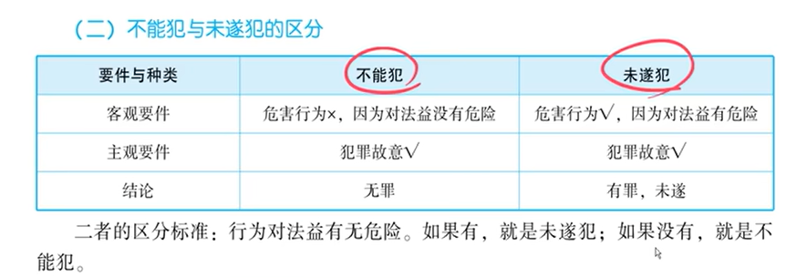
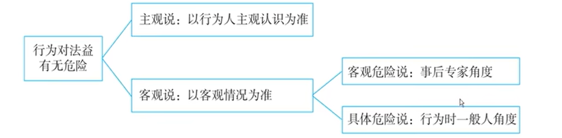

### **第1部分：法考备考学习提纲（面向非法本考生）**

**课程主题：** 刑法——犯罪预备与犯罪未遂
**学习目标：** 掌握故意犯罪在预备阶段和实行阶段的停止形态，能准确区分犯罪预备、未遂、中止与不能犯。

---

#### 一、 核心概念与体系框架

1.  **适用范围**
    *   **故意犯罪**专属制度。过失犯罪无此问题（如过失致人死亡，要么成立，要么不成立）。
    *   **终局性形态**：预备、未遂、中止、既遂，都是犯罪的最终结局，不是暂时的停顿。

2.  **两大阶段与四个形态（核心图表）**
    *   **阶段划分**：以“**着手**”为分水岭。
        *   **预备阶段**：开始犯罪 ←→ 着手
        *   **实行阶段**：着手 ←→ 发生结果
    *   **犯罪形态归属**：
        *   **预备阶段**：① 犯罪中止（主动放弃）；② 犯罪预备（被动放弃）
        *   **实行阶段**：① 犯罪中止（主动放弃）；② 犯罪未遂（被动放弃）；③ 犯罪既遂（得逞）
    *   **关键点**：“犯罪中止”可以发生在两个阶段；被动放弃在不同阶段罪名不同。

---

#### 二、 犯罪预备（核心考点）

1.  **概念（关键词）**
    *   **有预备行为 + 意志以外原因 + 无法着手 + 被迫放弃 = 犯罪预备**

2.  **重点区分：预备行为 vs 犯意表示（考试高频）**
    *   **犯意表示（无罪）**：只是思想的流露，对法益无危险。如：在日记里写杀人计划。
    *   **预备行为（有罪）**：为犯罪准备工具、创造条件，对法益有实际危险。如：购买凶器、跟踪被害人、与同伙密谋。
    *   **例题索引**：狗蛋QQ空间写杀班长（犯意表示）；狗蛋与副班长密谋杀班长（预备行为）。

3.  **注意**：财产犯罪（如侵占罪）中，若行为对象（遗忘物）尚未诞生，跟踪行为也可能只属于犯意表示。
    *   **例题索引**：跟踪钱包事件。

---

#### 三、 犯罪未遂（超级核心考点）

1.  **概念**：**已着手实行犯罪 + 意志以外原因 + 未能得逞 = 犯罪未遂**

2.  **最关键判断：“着手”的标准**
    *   **公式**：行为对法益产生**现实、紧迫、直接的危险**（核心是“**紧迫危险**”）。
    *   **注意**：判断时不能只看空间距离，要结合具体罪名行为特征。
    *   **例题索引**：埋伏未果（未着手，预备）；床下被压（未着手，预备）；扑倒被踢（已着手，未遂）；推土机铲人（已着手，中止）。

3.  **着手的特殊情形**
    *   **隔离犯**：毒酒（收到时着手）；炸弹（寄出时着手）。
    *   **间接正犯**：以被利用人着手为着手。

---

#### 四、 核心难点：未遂犯 vs 不能犯（观点展示）

1.  **基本界定（法考特定含义）**
    *   **未遂犯**：行为有危险，是危害行为，**有罪**。
    *   **不能犯**：行为无危险，不是危害行为，**无罪**。（常见类型：对象不能犯如杀稻草人，手段不能犯如迷信犯）

2.  **判断标准（递进式观点展示——必考）**
    *   **第一层（少数说 vs 多数说）**：采用**客观说（多数说）** ，从客观事实判断行为危险性，而非行为人的主观认识。
    *   **第二层（两种客观说）**：采用**具体危险说（法考多数说）** ，站在**行为时一般人的立场**判断行为是否有危险。
    *   **例题索引**：面粉运毒案（客观说判断无罪）；投毒1毫克案（具体危险说判断有罪）；打飞机案（具体危险说判断无罪）。

---

#### 五、 2026年法考考点预测与备考建议

以下是基于讲稿内容和近年命题趋势，为您整理的考点预测表。

| 知识点 | 可能考试的方式 | 举例/提示 | 主观题考点？ |
| :--- | :--- | :--- | :--- |
| **1. 犯罪形态适用范围** | 判断特定犯罪（如过失犯罪）是否存在未遂、预备状态。 | 题干：甲过失致乙重伤，问是否构成犯罪未遂？**答案：不构成。** | 否 |
| **2. “着手”的认定（最核心）** | 给出一段描述，判断行为人是否“着手”，这是区分预备和未遂、预备中止和实行中止的关键。 | 题干：甲欲强奸乙，将乙迷晕后放在床上，正在脱衣时被抓。问甲是否着手？**答案：是。**（已开始实施暴力、胁迫行为） | **是**（需说明理由：行为对法益产生了紧迫危险） |
| **3. 犯罪预备与犯意表示** | 辨析日常生活中的“想法”与刑法上的“预备行为”。 | 题干：甲在日记中写下“要杀了乙”。问是否构成犯罪预备？**答案：否。** | 否 |
| **4. 未遂犯与不能犯的区分（观点展示）** | 给出一个行为，判断是定未遂犯（有罪）还是不能犯（无罪）。**几乎必考**。 | 题干：甲以为白糖是砒霜，投毒杀乙，乙安然无恙。**分析**：按法考观点（具体危险说），行为时一般人看来是“投毒”，有危险，定**未遂犯**。 | **是**（需说明理由：结合具体危险说，从行为时一般人的角度分析有无危险） |
| **5. 特殊着手的判断** | 考查隔离犯或间接正犯的着手时点。 | 题干：甲寄毒酒给乙，乙签收后喝下死亡。问甲何时着手？**答案：乙收到时。** | 否 |
| **6. 各阶段犯罪形态对比** | 将预备、未遂、中止、既遂混合在一起，判断某一情形属于哪一种。 | 题干：（狗蛋杀狗剩系列案）判断是预备阶段中止还是实行阶段未遂。 | 是（需准确判断所处阶段及停止原因） |

---
*【备考提示】*
*   本章在客观题和主观题中均占有重要地位。尤其是“着手”的判断和“未遂犯与不能犯”的区分，是必须掌握的基本功。
*   对于主观题，务必记牢“**紧迫危险**”这一关键词，在分析理由时作为核心依据。对于观点展示题，要清晰写出所采用的学说（如“根据具体危险说……”）。

### **第2部分：讲稿逻辑切分与段落整理**

**说明：** 以下内容已根据讲解的逻辑顺序进行分段。原文中的明显语音转文字错误（如错别字、重复词句）已进行修正，并用`【修正】`标注。原文中讲授者提到的所有案例、例题和分析模型均已完整保留。

---

**【讲稿正文】**

**一、 犯罪形态总论：基本概念与框架**

好，那我们今天就来看第十一讲，犯罪形态。犯罪形态，就是我们说的预备、未遂、中止等。

我们首先要知道一点：**犯罪形态是就故意犯罪而言的**。我们前面说过，过失犯罪没有犯罪形态的问题，因为过失犯罪它只有成立和不成立的问题。比如说过失致人死亡罪，你把人弄死了，定过失致人死亡罪就完了，没有说在这个基础上，是未遂还是既遂。所以，未遂、既遂这些问题，仅就故意犯罪而言，这一点要明确。

然后第二点要明确的是，**犯罪形态都是终局性形态，而不是犯罪的暂时性停顿**。不管是犯罪预备、犯罪未遂、犯罪中止，它都是终局了，不是暂时性停顿。这一块呢，我们书上给大家有一个图表，我们一起来看一下。【图表内容描述】
犯罪形态一共有四个：
*   **既遂形态**：我们一般把它称为完成形态，因为它得成了嘛。
*   **未完成形态**：包括犯罪预备、犯罪未遂、犯罪中止。

许多同学以为未完成形态就是个暂时性的停顿，其实不是的，它们都是终局性形态。完成形态（既遂）也是终局形态，大家都是终局性形态。这一点一定要掌握好。

**二、 犯罪形态分布图：预备阶段与实行阶段**

这个图表知道了以后，接下来我们要把这个形态分布图再回顾一下。我们前面在讲结果的提前发生的时候讲过一点，但今天要正式地来学习了。

故意犯罪分为两个阶段：
1.  **预备阶段**：从开始犯罪到着手之前。
2.  **实行阶段**：从着手实行到结果发生。

各阶段的犯罪形态如下：
*   **预备阶段**有两个犯罪形态：
    *   **犯罪中止**：如果自动放弃犯罪。
    *   **犯罪预备**：如果被迫放弃犯罪。
*   **实行阶段**有三个犯罪形态：
    *   **犯罪中止**：如果自动放弃犯罪。
    *   **犯罪未遂**：如果被迫放弃犯罪。
    *   **犯罪既遂**：如果结果发生，得逞了。

**特别注意**：犯罪中止在预备阶段和实行阶段都存在，都是自动放弃犯罪。而被迫放弃犯罪，在预备阶段叫犯罪预备，在实行阶段叫犯罪未遂，概念是不同的。

**三、 框架建构：通过案例理解四个形态**

为了让大家把这些概念框架先初步建立起来，我们先用一组案例来回顾一下：

> **【例题1：狗蛋杀狗剩系列案】**
> *   **案情1**：狗蛋因情生恨，决定杀死狗剩。他在超市买了一把菜刀，回宿舍的路上忽然想到狗剩曾经给自己打过饭，觉得兄弟还不错，就主动把刀扔了，不杀了。
>     *   **问题**：狗蛋的杀人行为在哪个阶段？构成什么犯罪形态？
>     *   **分析**：还在预备阶段。他自动放弃了，因此是**预备阶段的犯罪中止**。
> *   **案情2**：狗蛋一想情敌不共戴天，继续拿刀回宿舍。到宿舍楼下，门卫老大爷端着加特林机枪拦住他：“把刀交出来，我知道你要杀狗剩。”狗蛋被迫交出刀。
>     *   **问题**：他构成什么犯罪形态？
>     *   **分析**：仍在预备阶段。他被迫放弃，因此是**犯罪预备**。
> *   **案情3**：一天晚上，狗蛋趁狗剩睡着，刚要举刀砍的那一刻，听到狗剩说梦话：“狗蛋，我喜欢的是你。”狗蛋很感动，把刀收起来，不杀了。
>     *   **问题**：他构成什么犯罪形态？
>     *   **分析**：已经进入着手实行阶段（举刀要砍）。自动放弃，属于**实行阶段的犯罪中止**。
> *   **案情4**：狗蛋又听到狗剩说梦话：“狗蛋，我恨你。”狗蛋再次举刀要砍，结果二丫从床底用M16顶住他腰：“狗剩是我欧巴，你再杀他我就毙了你。”狗蛋被迫放下刀。
>     *   **问题**：他构成什么犯罪形态？
>     *   **分析**：已着手实行。被迫放弃，属于**犯罪未遂**。
> *   **案情5**：狗蛋一转身夺过M16，先把二丫捅了，再把狗剩捅了。
>     *   **问题**：他构成什么犯罪形态？
>     *   **分析**：成功走到终点，是**犯罪既遂**。

讲完这个，整个形态分布图和概念框架体系就建构起来了。

**四、 第一节：犯罪预备**

接下来，我们四大犯罪形态要一个一个地看。首先来看第一节，犯罪预备。

**（一）犯罪预备的概念**

犯罪预备这个概念大家一定要记住：它指的是，**你有一个预备行为，因为意志以外原因无法着手，无法继续犯罪，只能被迫放弃，所形成的这种终局形态**。

许多人把犯罪预备等同于预备行为，这是错的。预备行为只是过程，犯罪预备是最终被定性为犯罪的终局形态。

**（二）考点：预备行为与犯意表示的区分**

这里常考的考点是：**什么时候算是预备行为？什么时候还只是生活行为（犯意表示）？** 预备行为已经是犯罪行为的一种了。

*   **区分标准**：
    *   **预备行为（危害行为）**：对法益至少要有危险，哪怕危险程度比较轻。
    *   **犯意表示（生活行为）**：只是犯意的一个单纯流露，对法益没有危险，还处在“意淫”、“腹诽”的阶段。

> **【例题2：犯意表示 vs 预备行为】**
> *   **案情1**：狗蛋每天在QQ空间写一条“我要杀死班长”，被辅导员发现扭送派出所。
>     *   **问题**：是否构成犯罪预备？
>     *   **分析**：不构成。这只是**犯意表示**，不是预备行为，因为对班长的生命法益没有产生现实危险。
> *   **案情2**：狗蛋找到副班长密谋策划杀死班长，约定摔杯为号，由副班长带斧头手杀出。密谋时被小方带人抓获。
>     *   **问题**：他们的行为是犯意表示，还是预备行为？
>     *   **分析**：是**预备行为**。找人密谋已经形成合力，对被害人的生命法益产生了危险，已超出单纯的犯意流露，属于犯罪预备行为。

> **【例题3：财产犯罪中的犯意表示（结合侵占罪）】**
> *   **案情**：某人骑车出清华西门，看到前方骑车人裤子口袋钱包露半截，便一路跟踪希望其掉下来。跟踪到海淀黄庄，对方将钱包塞回，此人失望而归。
>     *   **问题**：此人构成什么罪？是犯罪预备、未遂还是犯意表示？
>     *   **分析**：
>         1.  **涉嫌罪名**：他想捡钱包，应是**侵占罪（遗忘物）**，而非盗窃罪。
>         2.  **形态判断**：不构成犯罪。因为遗忘物尚未诞生（钱包未掉地），行为对象不存在，其对法益无危险。因此属于**犯意表示**，不构成犯罪。
>         *【讲授者注：该故事纯属虚构】*

**（三）回顾犯罪预备概念**

把这个知识点掌握后，我们回顾一下：犯罪预备，指的是预备行为因意志以外原因无法着手实行，只能被迫放弃，所形成的一种终局性形态。

**五、 第二节：犯罪未遂**

接下来我们看第二节，犯罪未遂。

**（一）着手：预备阶段与实行阶段的分水岭**

未遂是在着手之后的实行阶段。它和犯罪预备性质相同，都是被迫放弃，唯一区别在于所处的阶段不同。如何划分？关键就在于**着手**。

*   **“开始”与“着手”的区别**：
    *   **开始犯罪**：意味着进入预备阶段。
    *   **着手犯罪**：意味着进入实行阶段。
    *   预备阶段和实行阶段的**分水岭就是“着手”**。

**（二）着手的判断标准（核心考点）**

什么叫着手？行为对法益要产生**现实、紧迫、直接的危险**，最核心的是**紧迫危险**。

这个标准需要记忆，因为主观题要写理由。

> **【例题4：着手判断训练——强奸罪系列】**
> *   **案情1（埋伏）**：狗蛋打听到小芳每天五点半下班必经此地，遂埋伏等待。但小芳当天四点钟已提前路过，狗蛋等到半夜未果，冻回家。
>     *   **问题**：犯罪预备还是未遂？
>     *   **分析**：**犯罪预备**。狗蛋开始犯罪（预备行为），但人未出现，对小芳的法益未产生紧迫危险，尚未着手。
> *   **案情2（床底）**：狗蛋下午两点潜入小芳家藏床底。六点小芳进屋上床，因太重将床压塌，把狗蛋腰压折。
>     *   **问题**：犯罪预备还是未遂？
>     *   **分析**：**犯罪预备**。强奸罪（暴力型）的着手要求开始实施暴力。狗蛋一直未从床底爬出扑向小芳，未开始实施暴力，属于尚未着手，仍在预备阶段。
>     *   *【讲授者总结】不能仅凭空间距离判断着手，要结合具体罪名。*
> *   **案情3（扑倒）**：狗蛋用千斤顶顶住床，小芳上床未压塌。狗蛋爬出扑倒小芳，开始脱衣服时因头太大被套头衫卡住，被小芳踢飞。
>     *   **问题**：犯罪预备还是未遂？
>     *   **分析**：**犯罪未遂**。狗蛋已扑上去开始实施暴力，即已着手。进入实行阶段后因意志外原因（被踢飞）被迫放弃，构成未遂。

> **【例题5：着手判断——推土机强奸案（日本实务案例）】**
> *   **案情**：狗蛋太狼开推土机，看到妇女川岛芳子，将其铲到斗里，开到僻静处放下。川岛芳子爬出大骂，狗蛋发现是小学同学，遂道歉让其离开。
>     *   **问题**：狗蛋太狼属于哪个阶段的犯罪中止？
>     *   **分析**：**实行阶段的犯罪中止**。因为用铲子铲人、举高高的行为，已经是对被害人开始实施暴力，压制了反抗，属于**强奸罪的着手**。着手后自动放弃，是实行阶段的中止。

**（三）着手的特殊问题**

1.  **隔离犯的着手**
    *   **概念**：行为和结果之间有时间和空间间隔的犯罪。
    *   **判断标准**：看邮寄物在邮寄途中是否有危险。
        *   **有毒害性的物品（如毒酒）**：寄出时对邮递员无危险，收到时才对被害人产生紧迫危险。**着手是“收到时”**。
        *   **具有公共危险性的物品（如炸弹）**：寄出时对邮递员等不特定人产生紧迫危险。**着手是“寄出时”**。

2.  **间接正犯的着手**
    *   **概念**：将他人作为犯罪工具加以利用。
    *   **判断标准**：以**被利用人的着手为着手**。因为只有被利用人亲上火线，才可能对法益产生紧迫危险。

> **【例题6：间接正犯的着手】**
> *   **案情**：老狗蛋指使六岁的小狗蛋去盗窃小方家。小狗蛋在去小方家的路上被人贩子拐跑。
>     *   **问题**：老狗蛋构成犯罪预备还是未遂？
>     *   **分析**：**犯罪预备**。以被利用人（小狗蛋）的着手为准。小狗蛋还在路上，未进入盗窃的着手阶段（如敲门、开门），故老狗蛋也处于预备阶段，因意志外原因被迫放弃，构成预备。

**（四）未遂犯与不能犯的区分（核心考点）**

1.  **基本概念**
    *   **不能犯（无罪）**：行为对法益没有危险，不是危害行为。如沙漠里朝稻草人开枪。
    *   **未遂犯（有罪）**：行为对法益有危险，是危害行为。如朝真人开枪但没打中。
    *   *【法考观点】在法考刑法中，“不能犯”特指不可罚、不能定罪的无罪情形，与“未遂犯”是对立概念。这与法硕考试中的“不能犯未遂”概念不同。*

2.  **类型**
    *   **对象不能犯**：如杀稻草人。
    *   **手段不能犯**：如用迷信方法（扎小人）、用毫无科学依据的方法（给丈夫吃头发碎屑）杀人。

3.  **区分标准（递进式观点展示）**

    *   **第一层：主观说 vs 客观说**
        *   **主观说（少数说）**：以行为人主观认识为准，认为有危险就有危险。会导致迷信犯也被定罪。
        *   **客观说（多数说，法考立场）**：从客观角度判断行为对法益有无危险。
        *   *【讲授者提示】做题时容易受主观说影响，要特别注意坚持客观说。*

        > **【例题7：主观说与客观说】**
        > *   **案情**：甲将面粉交给乙，谎称是毒品，让乙运输。乙以为是毒品，运输途中被抓。
        > *   **问题**：乙是否构成运输毒品罪？
        > *   **分析**：按**客观说（法考多数说）**，乙运输的是面粉，客观上没有运输毒品的可能性，行为无危险，不构成犯罪（属于对象不能犯）。按主观说则可能定未遂。

    *   **第二层：客观危险说 vs 具体危险说（均属客观说）**
        *   **客观危险说**：从事后“专家”的角度，判断行为有无危险。
        *   **具体危险说（多数说，法考立场）**：从行为时“一般人”的角度，判断行为有无危险。

        > **【例题8：客观危险说与具体危险说】**
        > *   **案情（日本案例）**：妻子欲毒杀丈夫，投放了1毫克毒药（事后专家鉴定该毒药需10毫克才致命）。丈夫喝下后未死。
        > *   **问题**：妻子构成何罪？
        > *   **分析**：
        >   *   **按客观危险说**：事后看，1毫克不足以致命，行为无危险，无罪（手段不能犯）。
        >   *   **按具体危险说（法考多数说）**：行为时一般人看来，这是投毒行为，有致命可能性，行为有危险，应定**故意杀人罪未遂（未遂犯）**。

        > **【例题9：真题演练——防弹背心案】**
        > *   **案情**：狗蛋朝小芳开枪，击中小芳胸膛，但小芳穿着防弹背心，未死。
        > *   **问题**：狗蛋是未遂犯还是不能犯？
        > *   **分析**：按具体危险说（法考观点），行为时有击中并致死的可能性，有危险，构成**故意杀人罪未遂（未遂犯）**。答案为B项。

        > **【例题10：仿真训练——手枪射程案】**
        > *   **案情**：狗蛋在一百米外朝小芳开枪，未打中。事后鉴定手枪最大射程为九十米。
        > *   **问题**：狗蛋是未遂犯还是不能犯？
        > *   **分析**：按具体危险说（法考观点），行为时，距离并非固定，存在走近或被害人停下的可能性，有击中可能，有危险，构成**未遂犯**。答案为B项。

        > **【例题11：拓展思考——扔石头打飞机案】**
        > *   **案情**：机场附近村庄的小年轻，看到飞机很低，用石头砸飞机。
        > *   **问题**：是否构成犯罪？
        > *   **分析**：按具体危险说（法考观点），一般人扔石头最多十几米，飞机高度三四百米，行为时也无砸中可能性。行为无危险，不构成犯罪（属于不能犯）。

**（五）结语与鼓励**

关于犯罪未遂和不能犯的区分，这个观点展示确实有些复杂。但它不是要我们消灭厌烦情绪，而是要学会和情绪相处，静下心来，多多训练，就能慢慢消化。

好，这个讲完以后，我们犯罪未遂这一节就算讲完了。

---

### **第二部分：法考备考学习提纲（面向非法本考生）**

**课程主题：** 刑法——犯罪预备与犯罪未遂
**学习目标：** 掌握故意犯罪在预备阶段和实行阶段的停止形态，能准确区分犯罪预备、未遂、中止与不能犯。

---

#### 一、 核心概念与体系框架

1.  **适用范围**
    *   **故意犯罪**专属制度。过失犯罪无此问题（如过失致人死亡，要么成立，要么不成立）。
    *   **终局性形态**：预备、未遂、中止、既遂，都是犯罪的最终结局，不是暂时的停顿。

2.  **两大阶段与四个形态（核心图表）**
    *   **阶段划分**：以“**着手**”为分水岭。
        *   **预备阶段**：开始犯罪 ←→ 着手
        *   **实行阶段**：着手 ←→ 发生结果
    *   **犯罪形态归属**：
        *   **预备阶段**：① 犯罪中止（主动放弃）；② 犯罪预备（被动放弃）
        *   **实行阶段**：① 犯罪中止（主动放弃）；② 犯罪未遂（被动放弃）；③ 犯罪既遂（得逞）
    *   **关键点**：“犯罪中止”可以发生在两个阶段；被动放弃在不同阶段罪名不同。

---

#### 二、 犯罪预备（核心考点）

1.  **概念（关键词）**
    *   **有预备行为 + 意志以外原因 + 无法着手 + 被迫放弃 = 犯罪预备**

2.  **重点区分：预备行为 vs 犯意表示（考试高频）**
    *   **犯意表示（无罪）**：只是思想的流露，对法益无危险。如：在日记里写杀人计划。
    *   **预备行为（有罪）**：为犯罪准备工具、创造条件，对法益有实际危险。如：购买凶器、跟踪被害人、与同伙密谋。
    *   **例题索引**：狗蛋QQ空间写杀班长（犯意表示）；狗蛋与副班长密谋杀班长（预备行为）。

3.  **注意**：财产犯罪（如侵占罪）中，若行为对象（遗忘物）尚未诞生，跟踪行为也可能只属于犯意表示。
    *   **例题索引**：跟踪钱包事件。

---

#### 三、 犯罪未遂（超级核心考点）

1.  **概念**：**已着手实行犯罪 + 意志以外原因 + 未能得逞 = 犯罪未遂**

2.  **最关键判断：“着手”的标准**
    *   **公式**：行为对法益产生**现实、紧迫、直接的危险**（核心是“**紧迫危险**”）。
    *   **注意**：判断时不能只看空间距离，要结合具体罪名行为特征。
    *   **例题索引**：埋伏未果（未着手，预备）；床下被压（未着手，预备）；扑倒被踢（已着手，未遂）；推土机铲人（已着手，中止）。

3.  **着手的特殊情形**
    *   **隔离犯**：毒酒（收到时着手）；炸弹（寄出时着手）。
    *   **间接正犯**：以被利用人着手为着手。

---

#### 四、 核心难点：未遂犯 vs 不能犯（观点展示）

1.  **基本界定（法考特定含义）**
    *   **未遂犯**：行为有危险，是危害行为，**有罪**。
    *   **不能犯**：行为无危险，不是危害行为，**无罪**。（常见类型：对象不能犯如杀稻草人，手段不能犯如迷信犯）

2.  **判断标准（递进式观点展示——必考）**
    *   **第一层（少数说 vs 多数说）**：采用**客观说（多数说）** ，从客观事实判断行为危险性，而非行为人的主观认识。
    *   **第二层（两种客观说）**：采用**具体危险说（法考多数说）** ，站在**行为时一般人的立场**判断行为是否有危险。
    *   **例题索引**：面粉运毒案（客观说判断无罪）；投毒1毫克案（具体危险说判断有罪）；打飞机案（具体危险说判断无罪）。

---

#### 五、 2026年法考考点预测与备考建议

以下是基于讲稿内容和近年命题趋势，为您整理的考点预测表。

| 知识点 | 可能考试的方式 | 举例/提示 | 主观题考点？ |
| :--- | :--- | :--- | :--- |
| **1. 犯罪形态适用范围** | 判断特定犯罪（如过失犯罪）是否存在未遂、预备状态。 | 题干：甲过失致乙重伤，问是否构成犯罪未遂？**答案：不构成。** | 否 |
| **2. “着手”的认定（最核心）** | 给出一段描述，判断行为人是否“着手”，这是区分预备和未遂、预备中止和实行中止的关键。 | 题干：甲欲强奸乙，将乙迷晕后放在床上，正在脱衣时被抓。问甲是否着手？**答案：是。**（已开始实施暴力、胁迫行为） | **是**（需说明理由：行为对法益产生了紧迫危险） |
| **3. 犯罪预备与犯意表示** | 辨析日常生活中的“想法”与刑法上的“预备行为”。 | 题干：甲在日记中写下“要杀了乙”。问是否构成犯罪预备？**答案：否。** | 否 |
| **4. 未遂犯与不能犯的区分（观点展示）** | 给出一个行为，判断是定未遂犯（有罪）还是不能犯（无罪）。**几乎必考**。 | 题干：甲以为白糖是砒霜，投毒杀乙，乙安然无恙。**分析**：按法考观点（具体危险说），行为时一般人看来是“投毒”，有危险，定**未遂犯**。 | **是**（需说明理由：结合具体危险说，从行为时一般人的角度分析有无危险） |
| **5. 特殊着手的判断** | 考查隔离犯或间接正犯的着手时点。 | 题干：甲寄毒酒给乙，乙签收后喝下死亡。问甲何时着手？**答案：乙收到时。** | 否 |
| **6. 各阶段犯罪形态对比** | 将预备、未遂、中止、既遂混合在一起，判断某一情形属于哪一种。 | 题干：（狗蛋杀狗剩系列案）判断是预备阶段中止还是实行阶段未遂。 | 是（需准确判断所处阶段及停止原因） |

---
*【备考提示】*
*   本章在客观题和主观题中均占有重要地位。尤其是“着手”的判断和“未遂犯与不能犯”的区分，是必须掌握的基本功。
*   对于主观题，务必记牢“**紧迫危险**”这一关键词，在分析理由时作为核心依据。对于观点展示题，要清晰写出所采用的学说（如“根据具体危险说……”）。

---
**使用说明**：本提纲基于您提供的讲稿内容整理，旨在帮助考生建立知识框架和把握重点。在正式备考时，请务必结合最新的官方教材和法律法规进行学习。对于讲稿中涉及的“间接正犯”等概念，因其在后续“共同犯罪”章节会详细讲解，目前初学只需理解其在“着手”判断上的应用即可。好的，收到您的需求。作为一名法学教育和法考培训领域的资深专家，我将严格遵循您的要求，对这份讲稿进行专业的整理和提炼。

首先，我将对原始的音频转文字稿进行逻辑切分、段落整理和文字修正，确保内容的完整性和准确性。随后，我会基于整理后的内容，为非法律科班背景的备考者提取一份清晰、实用的学习提纲，并按照您的要求补充考点预测和注释。

---

### **第一部分：讲稿逻辑切分与段落整理**

**说明：** 以下内容已根据讲解的逻辑顺序进行分段。原文中的明显语音转文字错误（如错别字、重复词句）已进行修正，并用`【修正】`标注。原文中讲授者提到的所有案例、例题和分析模型均已完整保留。

---

**【讲稿正文】**

**一、 犯罪形态总论：基本概念与框架**

好，那我们今天就来看第十一讲，犯罪形态。犯罪形态，就是我们说的预备、未遂、中止等。

我们首先要

知道一点：**犯罪形态是就故意犯罪而言的**。我们前面说过，过失犯罪没有犯罪形态的问题，因为过失犯罪它只有成立和不成立的问题。比如说过失致人死亡罪，你把人弄死了，定过失致人死亡罪就完了，没有说在这个基础上，是未遂还是既遂。所以，未遂、既遂这些问题，仅就故意犯罪而言，这一点要明确。

然后第二点要明确的是，**犯罪形态都是终局性形态，而不是犯罪的暂时性停顿**。不管是犯罪预备、犯罪未遂、犯罪中止，它都是终局了，不是暂时性停顿。这一块呢，我们书上给大家有一个图表，我们一起来看一下。【图表内容描述】
犯罪形态一共有四个：
*   **既遂形态**：我们一般把它称为完成形态，因为它得成了嘛。
*   **未完成形态**：包括犯罪预备、犯罪未遂、犯罪中止。

许多同学以为未完成形态就是个暂时性的停顿，其实不是的，它们都是终局性形态。完成形态（既遂）也是终局形态，大家都是终局性形态。这一点一定要掌握好。

**二、 犯罪形态分布图：预备阶段与实行阶段**

这个图表知道了以后，接下来我们要把这个形态分布图再回顾一下。我们前面在讲结果的提前发生的时候讲过一点，但今天要正式地来学习了。

故意犯罪分为两个阶段：
1.  **预备阶段**：从开始犯罪到着手之前。
2.  **实行阶段**：从着手实行到结果发生。

各阶段的犯罪形态如下：
*   **预备阶段**有两个犯罪形态：
    *   **犯罪中止**：如果自动放弃犯罪。
    *   **犯罪预备**：如果被迫放弃犯罪。
*   **实行阶段**有三个犯罪形态：
    *   **犯罪中止**：如果自动放弃犯罪。
    *   **犯罪未遂**：如果被迫放弃犯罪。
    *   **犯罪既遂**：如果结果发生，得逞了。

**特别注意**：犯罪中止在预备阶段和实行阶段都存在，都是自动放弃犯罪。而被迫放弃犯罪，在预备阶段叫犯罪预备，在实行阶段叫犯罪未遂，概念是不同的。

**三、 框架建构：通过案例理解四个形态**

为了让大家把这些概念框架先初步建立起来，我们先用一组案例来回顾一下：

> **【例题1：狗蛋杀狗剩系列案】**
> *   **案情1**：狗蛋因情生恨，决定杀死狗剩。他在超市买了一把菜刀，回宿舍的路上忽然想到狗剩曾经给自己打过饭，觉得兄弟还不错，就主动把刀扔了，不杀了。
>     *   **问题**：狗蛋的杀人行为在哪个阶段？构成什么犯罪形态？
>     *   **分析**：还在预备阶段。他自动放弃了，因此是**预备阶段的犯罪中止**。
> *   **案情2**：狗蛋一想情敌不共戴天，继续拿刀回宿舍。到宿舍楼下，门卫老大爷端着加特林机枪拦住他：“把刀交出来，我知道你要杀狗剩。”狗蛋被迫交出刀。
>     *   **问题**：他构成什么犯罪形态？
>     *   **分析**：仍在预备阶段。他被迫放弃，因此是**犯罪预备**。
> *   **案情3**：一天晚上，狗蛋趁狗剩睡着，刚要举刀砍的那一刻，听到狗剩说梦话：“狗蛋，我喜欢的是你。”狗蛋很感动，把刀收起来，不杀了。
>     *   **问题**：他构成什么犯罪形态？
>     *   **分析**：已经进入着手实行阶段（举刀要砍）。自动放弃，属于**实行阶段的犯罪中止**。
> *   **案情4**：狗蛋又听到狗剩说梦话：“狗蛋，我恨你。”狗蛋再次举刀要砍，结果二丫从床底用M16顶住他腰：“狗剩是我欧巴，你再杀他我就毙了你。”狗蛋被迫放下刀。
>     *   **问题**：他构成什么犯罪形态？
>     *   **分析**：已着手实行。被迫放弃，属于**犯罪未遂**。
> *   **案情5**：狗蛋一转身夺过M16，先把二丫捅了，再把狗剩捅了。
>     *   **问题**：他构成什么犯罪形态？
>     *   **分析**：成功走到终点，是**犯罪既遂**。

讲完这个，整个形态分布图和概念框架体系就建构起来了。

**四、 第一节：犯罪预备**

接下来，我们四大犯罪形态要一个一个地看。首先来看第一节，犯罪预备。

**（一）犯罪预备的概念**

犯罪预备这个概念大家一定要记住：它指的是，**你有一个预备行为，因为意志以外原因无法着手，无法继续犯罪，只能被迫放弃，所形成的这种终局形态**。

许多人把犯罪预备等同于预备行为，这是错的。预备行为只是过程，犯罪预备是最终被定性为犯罪的终局形态。

**（二）考点：预备行为与犯意表示的区分**

这里常考的考点是：**什么时候算是预备行为？什么时候还只是生活行为（犯意表示）？** 预备行为已经是犯罪行为的一种了。

*   **区分标准**：
    *   **预备行为（危害行为）**：对法益至少要有危险，哪怕危险程度比较轻。
    *   **犯意表示（生活行为）**：只是犯意的一个单纯流露，对法益没有危险，还处在“意淫”、“腹诽”的阶段。

> **【例题2：犯意表示 vs 预备行为】**
> *   **案情1**：狗蛋每天在QQ空间写一条“我要杀死班长”，被辅导员发现扭送派出所。
>     *   **问题**：是否构成犯罪预备？
>     *   **分析**：不构成。这只是**犯意表示**，不是预备行为，因为对班长的生命法益没有产生现实危险。
> *   **案情2**：狗蛋找到副班长密谋策划杀死班长，约定摔杯为号，由副班长带斧头手杀出。密谋时被小方带人抓获。
>     *   **问题**：他们的行为是犯意表示，还是预备行为？
>     *   **分析**：是**预备行为**。找人密谋已经形成合力，对被害人的生命法益产生了危险，已超出单纯的犯意流露，属于犯罪预备行为。

> **【例题3：财产犯罪中的犯意表示（结合侵占罪）】**
> *   **案情**：某人骑车出清华西门，看到前方骑车人裤子口袋钱包露半截，便一路跟踪希望其掉下来。跟踪到海淀黄庄，对方将钱包塞回，此人失望而归。
>     *   **问题**：此人构成什么罪？是犯罪预备、未遂还是犯意表示？
>     *   **分析**：
>         1.  **涉嫌罪名**：他想捡钱包，应是**侵占罪（遗忘物）**，而非盗窃罪。
>         2.  **形态判断**：不构成犯罪。因为遗忘物尚未诞生（钱包未掉地），行为对象不存在，其对法益无危险。因此属于**犯意表示**，不构成犯罪。
>         *【讲授者注：该故事纯属虚构】*

**（三）回顾犯罪预备概念**

把这个知识点掌握后，我们回顾一下：犯罪预备，指的是预备行为因意志以外原因无法着手实行，只能被迫放弃，所形成的一种终局性形态。

**五、 第二节：犯罪未遂**

接下来我们看第二节，犯罪未遂。

**（一）着手：预备阶段与实行阶段的分水岭**

未遂是在着手之后的实行阶段。它和犯罪预备性质相同，都是被迫放弃，唯一区别在于所处的阶段不同。如何划分？关键就在于**着手**。

*   **“开始”与“着手”的区别**：
    *   **开始犯罪**：意味着进入预备阶段。
    *   **着手犯罪**：意味着进入实行阶段。
    *   预备阶段和实行阶段的**分水岭就是“着手”**。

**（二）着手的判断标准（核心考点）**

什么叫着手？行为对法益要产生**现实、紧迫、直接的危险**，最核心的是**紧迫危险**。

这个标准需要记忆，因为主观题要写理由。

> **【例题4：着手判断训练——强奸罪系列】**
> *   **案情1（埋伏）**：狗蛋打听到小芳每天五点半下班必经此地，遂埋伏等待。但小芳当天四点钟已提前路过，狗蛋等到半夜未果，冻回家。
>     *   **问题**：犯罪预备还是未遂？
>     *   **分析**：**犯罪预备**。狗蛋开始犯罪（预备行为），但人未出现，对小芳的法益未产生紧迫危险，尚未着手。
> *   **案情2（床底）**：狗蛋下午两点潜入小芳家藏床底。六点小芳进屋上床，因太重将床压塌，把狗蛋腰压折。
>     *   **问题**：犯罪预备还是未遂？
>     *   **分析**：**犯罪预备**。强奸罪（暴力型）的着手要求开始实施暴力。狗蛋一直未从床底爬出扑向小芳，未开始实施暴力，属于尚未着手，仍在预备阶段。
>     *   *【讲授者总结】不能仅凭空间距离判断着手，要结合具体罪名。*
> *   **案情3（扑倒）**：狗蛋用千斤顶顶住床，小芳上床未压塌。狗蛋爬出扑倒小芳，开始脱衣服时因头太大被套头衫卡住，被小芳踢飞。
>     *   **问题**：犯罪预备还是未遂？
>     *   **分析**：**犯罪未遂**。狗蛋已扑上去开始实施暴力，即已着手。进入实行阶段后因意志外原因（被踢飞）被迫放弃，构成未遂。

> **【例题5：着手判断——推土机强奸案（日本实务案例）】**
> *   **案情**：狗蛋太狼开推土机，看到妇女川岛芳子，将其铲到斗里，开到僻静处放下。川岛芳子爬出大骂，狗蛋发现是小学同学，遂道歉让其离开。
>     *   **问题**：狗蛋太狼属于哪个阶段的犯罪中止？
>     *   **分析**：**实行阶段的犯罪中止**。因为用铲子铲人、举高高的行为，已经是对被害人开始实施暴力，压制了反抗，属于**强奸罪的着手**。着手后自动放弃，是实行阶段的中止。

**（三）着手的特殊问题**

1.  **隔离犯的着手**
    *   **概念**：行为和结果之间有时间和空间间隔的犯罪。
    *   **判断标准**：看邮寄物在邮寄途中是否有危险。
        *   **有毒害性的物品（如毒酒）**：寄出时对邮递员无危险，收到时才对被害人产生紧迫危险。**着手是“收到时”**。
        *   **具有公共危险性的物品（如炸弹）**：寄出时对邮递员等不特定人产生紧迫危险。**着手是“寄出时”**。

2.  **间接正犯的着手**
    *   **概念**：将他人作为犯罪工具加以利用。
    *   **判断标准**：以**被利用人的着手为着手**。因为只有被利用人亲上火线，才可能对法益产生紧迫危险。

> **【例题6：间接正犯的着手】**
> *   **案情**：老狗蛋指使六岁的小狗蛋去盗窃小方家。小狗蛋在去小方家的路上被人贩子拐跑。
>     *   **问题**：老狗蛋构成犯罪预备还是未遂？
>     *   **分析**：**犯罪预备**。以被利用人（小狗蛋）的着手为准。小狗蛋还在路上，未进入盗窃的着手阶段（如敲门、开门），故老狗蛋也处于预备阶段，因意志外原因被迫放弃，构成预备。

**（四）未遂犯与不能犯的区分（核心考点）**

1.  **基本概念**
    *   **不能犯（无罪）**：行为对法益没有危险，不是危害行为。如沙漠里朝稻草人开枪。
    *   **未遂犯（有罪）**：行为对法益有危险，是危害行为。如朝真人开枪但没打中。
    *   *【法考观点】在法考刑法中，“不能犯”特指不可罚、不能定罪的无罪情形，与“未遂犯”是对立概念。这与法硕考试中的“不能犯未遂”概念不同。*

2.  **类型**
    *   **对象不能犯**：如杀稻草人。
    *   **手段不能犯**：如用迷信方法（扎小人）、用毫无科学依据的方法（给丈夫吃头发碎屑）杀人。

3.  **区分标准（递进式观点展示）**

    *   **第一层：主观说 vs 客观说**
        *   **主观说（少数说）**：以行为人主观认识为准，认为有危险就有危险。会导致迷信犯也被定罪。
        *   **客观说（多数说，法考立场）**：从客观角度判断行为对法益有无危险。
        *   *【讲授者提示】做题时容易受主观说影响，要特别注意坚持客观说。*

        > **【例题7：主观说与客观说】**
        > *   **案情**：甲将面粉交给乙，谎称是毒品，让乙运输。乙以为是毒品，运输途中被抓。
        > *   **问题**：乙是否构成运输毒品罪？
        > *   **分析**：按**客观说（法考多数说）**，乙运输的是面粉，客观上没有运输毒品的可能性，行为无危险，不构成犯罪（属于对象不能犯）。按主观说则可能定未遂。

    *   **第二层：客观危险说 vs 具体危险说（均属客观说）**
        *   **客观危险说**：从事后“专家”的角度，判断行为有无危险。
        *   **具体危险说（多数说，法考立场）**：从行为时“一般人”的角度，判断行为有无危险。

        > **【例题8：客观危险说与具体危险说】**
        > *   **案情（日本案例）**：妻子欲毒杀丈夫，投放了1毫克毒药（事后专家鉴定该毒药需10毫克才致命）。丈夫喝下后未死。
        > *   **问题**：妻子构成何罪？
        > *   **分析**：
        >   *   **按客观危险说**：事后看，1毫克不足以致命，行为无危险，无罪（手段不能犯）。
        >   *   **按具体危险说（法考多数说）**：行为时一般人看来，这是投毒行为，有致命可能性，行为有危险，应定**故意杀人罪未遂（未遂犯）**。

        > **【例题9：真题演练——防弹背心案】**
        > *   **案情**：狗蛋朝小芳开枪，击中小芳胸膛，但小芳穿着防弹背心，未死。
        > *   **问题**：狗蛋是未遂犯还是不能犯？
        > *   **分析**：按具体危险说（法考观点），行为时有击中并致死的可能性，有危险，构成**故意杀人罪未遂（未遂犯）**。答案为B项。

        > **【例题10：仿真训练——手枪射程案】**
        > *   **案情**：狗蛋在一百米外朝小芳开枪，未打中。事后鉴定手枪最大射程为九十米。
        > *   **问题**：狗蛋是未遂犯还是不能犯？
        > *   **分析**：按具体危险说（法考观点），行为时，距离并非固定，存在走近或被害人停下的可能性，有击中可能，有危险，构成**未遂犯**。答案为B项。

        > **【例题11：拓展思考——扔石头打飞机案】**
        > *   **案情**：机场附近村庄的小年轻，看到飞机很低，用石头砸飞机。
        > *   **问题**：是否构成犯罪？
        > *   **分析**：按具体危险说（法考观点），一般人扔石头最多十几米，飞机高度三四百米，行为时也无砸中可能性。行为无危险，不构成犯罪（属于不能犯）。

**（五）结语与鼓励**

关于犯罪未遂和不能犯的区分，这个观点展示确实有些复杂。但它不是要我们消灭厌烦情绪，而是要学会和情绪相处，静下心来，多多训练，就能慢慢消化。

好，这个讲完以后，我们犯罪未遂这一节就算讲完了。

---

