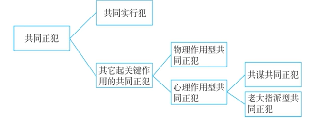

# 第1部分：法考知识提纲（面向非法本考生）

> **说明**：本提纲基于上述讲稿整理，涉及法条以《中华人民共和国刑法》为准。部分学说观点为近年理论新动向，标注“多数说/少数说”供应试参考。不确定之处已注明。

---

## 一、共同正犯的基本概念

| 概念 | 内容 |
|------|------|
| 共同正犯（又称共同实行犯） | 二人以上通过**实行行为**一起制造违法事实，有意思联络，共同实施犯罪。 |
| 法律后果 | **部分实行全部负责原则**：即使只有部分共犯人造成结果，其他共犯人也对该结果负责。 |
| 既遂的两种含义 | ①亲力亲为制造既遂结果；②为共同犯罪人的既遂结果负责。 |

> **例题1（讲稿例）**：狗蛋、小芳共同抢劫，狗蛋持枪威胁，小芳装钱——二人构成抢劫罪的共同正犯。
> **例题2**：狗蛋、小芳共同杀铁牛，狗蛋未击中，小芳击中致死——狗蛋仍定故意杀人罪既遂（部分实行全部负责）。
> **例题3**：共同越狱，小芳成功越狱，狗蛋被抓回——狗蛋仍定脱逃罪既遂（因小芳既遂，狗蛋负责）。
> **例题4**：轮奸案中，狗蛋得逞，铁牛未得逞——铁牛也构成强奸罪既遂（对狗蛋的既遂结果负责）。

---

## 二、客观要件与无法查明案件的处理

### 1. 一般规则
- 共同犯罪 → 部分实行全部负责 → 无需查明具体谁造成结果，全体负责。
- 同时犯（无意思联络） → 各自单独处理 → 存疑时有利于被告 → 不能将结果归责于任何一人。

### 2. 四种情形的对比表（基于最新多数说）

| 情形 | 意思联络 | 主观心态 | 处理规则 | 结论 |
|------|----------|----------|----------|------|
| **故意的同时犯** | 无 | 故意 | 单独处理 + 存疑有利被告 | 各自故意杀人罪未遂 |
| **过失的同时犯** | 无 | 过失 | 单独处理 + 存疑有利被告 | 各自无罪（不构成过失致人死亡） |
| **故意的共同正犯** | 有 | 故意 | 部分实行全部负责 | 全体故意杀人罪既遂 |
| **共同过失案（打野猪案）** | 有 | 过失 | 最新多数说：不成立共同犯罪，但各自单独负责；理由：相互有心理性贡献 | 各自单独构成过失致人死亡罪（有罪） |

> **特别提示**：第四种情形是近年理论变化重点，2026年法考可能重点考查。

---

## 三、主观要件：共同过失正犯的三种学说（重中之重）

### 1. 学说一：要求故意且无罪说（部分犯罪功能说，少数说）
- **结论**：共同过失不构成共同犯罪，各自单独处理，存疑有利被告 → 均无罪。
- **理由**：刑法第25条“共同犯罪是指二人以上共同故意犯罪”，过失不构成共同犯罪。
- **不足**：不符合实质正义（一起干却无罪）。

### 2. 学说二：不要求故意且有罪说（行为功能说，少数说）
- **结论**：共同过失可以构成共同正犯，适用部分实行全部负责 → 均构成过失致人死亡罪（共同犯罪）。
- **理由**：成立共同正犯只要求有意思联络，对故意/过失不加区分。
- **不足**：违反刑法第25条，不符合形式正义。

### 3. 学说三：要求故意且有罪说（结果规则说，多数说，王刚教授观点）
- **结论**：不成立共同犯罪，但各自单独构成过失致人死亡罪（有罪）。
- **论证逻辑**（核心）：
  - 各行为人对另一方的过失行为有“心理性贡献”（共同商量、一起开枪）；
  - 心理性贡献使行为人对另一方造成的结果也要负责；
  - 但各自负责，不成立共同犯罪（不违反刑法第25条）；
  - 同时符合实质正义（有罪）和形式正义（不违反法条）。
- **该说可解释2016年真题**：甲乙丙共同故意伤害丁，丁死亡，致命伤无法查明是甲或乙造成。三人对死亡结果（过失）均负责，各自单独负过失责任，但不成立共同犯罪（在过失致人死亡部分）。最终均构成故意伤害罪（致人死亡）的结果加重犯。

> **例题5（打野猪案）**：甲乙相约开枪打野猪，过失打死丙，无法查明谁开致命一枪。按多数说：甲乙各自单独构成过失致人死亡罪（有罪），但不成立共同犯罪。
> **例题6（2016年真题改编）**：甲乙丙共同故意伤害丁，丁死亡，致命伤不是丙造成，但无法查明是甲还是乙。按多数说：三人均对死亡结果负责，构成故意伤害罪致人死亡（结果加重犯）。

> **知识点提示**：
> - 刑法第25条：共同犯罪指二人以上共同故意犯罪；二人以上共同过失犯罪，不以共同犯罪论处；应当负刑事责任的，按照他们所犯的罪分别处罚。
> - 结果加重犯：故意伤害致人死亡，其中“致人死亡”为过失，若多人共同故意伤害，死亡结果无法查明时，按结果规则说，各共犯对死亡结果均有心理性贡献，故均负责。

---

## 四、共同正犯的种类

| 类型 | 子类型 | 含义 | 举例 |
|------|--------|------|------|
| **共同实行犯** | （最常见） | 均实施实行行为 | 狗蛋持枪威胁，小芳装钱 |
| **其他起关键作用的共同正犯** | 物理作用型 | 未实施实行行为，但提供物理性关键作用 | 小芳抱住铁牛，狗蛋殴打；小芳虽未打，但起关键作用，定共同正犯而非帮助犯 |
| | 心理作用型—共谋共同正犯 | 只参与共谋，未亲自实行，但对结果有心理性贡献 | 狗蛋与小芳共谋盗窃，狗蛋因车祸未去，小芳盗窃既遂，狗蛋仍定盗窃罪既遂 |
| | 心理作用型—老大指派型 | 黑老大指派小弟犯罪，未达强制程度，但作用大于教唆犯 | 老大指派小弟盗窃，小弟实行既遂，老大定共同正犯（按主犯量刑） |

> **注意**：认定“其他共同正犯”的目的是为了按主犯处罚，而不是按从犯（帮助犯）或教唆犯从轻。

---

## 五、可能的主观题考点

以下知识点可能在主观题中考查，需重点掌握**论证过程**：

| 知识点 | 可能考查方式 | 主观题标注 |
|--------|-------------|------------|
| 部分实行全部负责原则 | 结合具体案情，判断未直接造成结果的共犯人是否既遂 | ✅ 常考 |
| 共同过失正犯的三种学说及理由 | 要求考生分析案例并选择多数说，阐述理由（尤其结果规则说的论证） | ✅ 重中之重 |
| 结果规则说的论证逻辑（心理性贡献→单独负责） | 可能在案例分析中要求说明为何不成立共同犯罪但仍有罪 | ✅ 新考点 |
| 无法查明案件的归责路径 | 区分共同犯罪与同时犯，分别适用部分实行全部负责原则或存疑有利被告原则 | ✅ 常考 |
| 共谋共同正犯的认定 | 给出“共谋但未实行”的案情，判断是否对既遂结果负责 | ✅ 可能 |

---

## 六、2026年考试重点关注考点表格（含举例）

| 知识点 | 可能考试的方式 | 举例 |
|--------|---------------|------|
| **部分实行全部负责原则** | 选择题或案例分析：问未打中的人是否既遂 | 狗蛋未击中，小芳击中，狗蛋是否故意杀人罪既遂？——是。 |
| **共同过失正犯的最新多数说（结果规则说）** | 选择题：给出打野猪案，问甲乙如何处理？选项含“都无罪”“都构成共同犯罪”“各自单独有罪”等 | 甲乙相约开枪打野猪，过失打死丙，无法查明谁致命——按多数说，甲乙各自单独构成过失致人死亡罪（有罪），但不成立共同犯罪。 |
| **2016年真题同款模型（故意伤害致人死亡，无法查明）** | 选择题或主观题：判断是否对死亡结果负责 | 甲乙丙共同故意伤害丁，丁死亡，致命伤无法查明是甲或乙——三人均对死亡结果负责，构成故意伤害罪致人死亡。 |
| **同时犯与共同正犯的区别** | 判断是否构成共同犯罪，进而决定适用部分实行全部负责还是存疑有利被告 | 甲乙互不认识，同时开枪杀丙，丙身中一枪死亡无法查明谁打中——甲乙均故意杀人罪未遂（同时犯，存疑有利被告）。 |
| **共谋共同正犯** | 问“仅参与共谋但未到现场者是否既遂” | 狗蛋共谋盗窃后因车祸未去，小芳既遂——狗蛋也定盗窃罪既遂（共谋共同正犯）。 |
| **老大指派型共同正犯** | 判断老大是教唆犯、间接正犯还是共同正犯 | 老大指派小弟盗窃，未达强制程度，小弟既遂——老大定共同正犯（非教唆犯，非间接正犯）。 |
| **结果加重犯中的过失负责问题** | 结合共同故意伤害致人死亡，考查是否对加重结果负责 | 共同故意伤害，死亡结果无法查明谁造成——各共犯均对死亡结果负过失责任（多数说），成立结果加重犯。 |

---

**最后提示**：以上内容已涵盖讲稿全部要点。2026年法考刑法科目，**共同过失正犯的“结果规则说”** 是重大变化，务必理解其论证逻辑（心理性贡献→单独负责），并能在主观题中清晰表述。同时，部分实行全部负责原则、无法查明案件的归责方法是基础考点，需反复练习。祝复习顺利！

# 第2部分：切分段落并修正后的讲稿

## 1. 引入：共同犯罪主体部分的结构

好，那接下来我们就要看共同正犯。从这一节开始，我们就进入共同犯罪的主体部分了。因为我们共同犯罪的分类原理掌握好以后，共同犯罪的主体部分，我们怎么去学习呢？主体部分我们把它分为两大板块。第一个呢，就讲共同犯罪的四大角色。我们四大角色前面说了有什么呢？就是共同，先讲正犯嘛，是吧？先学习正犯。正犯呢，我们主要是两个，一个是共同正犯，一个是什么间接正犯。正犯完了以后，我们接下来就要学两大共犯，一个是教唆犯，一个是帮助犯。这四大角色我们学完了以后，接下来我们就要学这四大角色之上的一些共性的问题，总结性的问题。所以呢，主要就是这一个啊两个大的板块，一个是讲四大角色，接下来是讲四大角色之后的一些共性问题。好，那我们先看第一大角色，就是共同正犯。

## 2. 共同正犯的定义与客观要件（含部分实行全部负责原则）

那共同正犯全称其主要指的就是主要指的是共同实行犯。那你如果要给共同正犯，要给一个成立条件，一个定义，你都会给。为什么呢？因为我都给共同犯罪定义了。共同犯罪指的是什么？刚才说了，就是一起制造违法事实嘛，是吧？那共同正犯主要指的就是什么？通过实行行为一起制造违法事实，就是咱们都都弄实行行为了。啊，那这里面啊，我们先看客观要件，再看主观要件。客观要件就是一起制造违法事实。

那你比如说最简单的狗蛋跟小芳两个人，然后呢商量好，他们两个是夫妻，要商量好咱们一起抢银行。然后进去以后，狗蛋呢拿着加特林机枪对着那柜台员，啊柜台员吓得不敢动。小芳呢就负责装钱，小芳呢平时也是个会计，负责装钱，【修正：删除重复的“小芳呢平时也是个会计，他负责装钱，马代装钱”】两人夫妻俩配合得很好。那你说他们算不算一起制造违法事实啊？算，他们通过什么行为呢？通过实行行为一起制造，那么他们就属于有意识联络又是一起实行，那么他们就构成抢劫罪的共同实行犯，简称为共同正犯，明白吧？

好了，那一旦是共同正犯，就会带来一个什么法律后果呢？哎这个法律后果就特别特别喜欢考，就叫什么**部分实行全部负责原则**。这个原则是啥意思呢？他为什么经常考呢？今天我在这要给他加深一下印象啊——

比如说狗蛋跟小芳两个人啊夫妻，他们两个人呢啊又要啊抢劫铁牛的钱，怎么抢劫呢？先把他打死再取财，因为铁牛身上装了好多现金呢。那狗蛋呢又用加特林机枪扫射啊，小芳呢这时候啊加特林机枪他给老公了嘛，他自己就拿了个五四式手枪。结果狗蛋加特林机枪扫射了一圈都是【修正：仅击中】人体表面，一颗都没打中。小芳说你看你平时不好好练，总是偷懒，看我的。小芳呢拿了个五四式手枪砰一枪就把铁牛爆头了。好了现在就问，那小芳肯定啊构成啊咱先不考虑抢劫罪啊，假如说是杀人罪，再简单点说杀人罪，那小芳就要构成故意杀人罪的既遂——未遂？肯定既遂，因为小芳一枪就爆头了，是吧？那狗蛋呢，他扫射了一圈都没打中，有的说那狗蛋就是故意杀人罪未遂，因为他没打中嘛。哎，但是我们认为如果狗蛋跟小芳两个人没有意思联络互不知情，如果各自是单独犯罪的话，你这样认定是没问题的，因为互不干扰是吧？但是我们刚才说了，狗蛋跟小芳两个人是什么啊？有意思联络，是共同实行犯、共同正犯。那这时候就要有一个什么法律后果呢？**部分实行全部负责**。什么意思呢？就是即使是啊一部分实行犯制造的结果，你另外的实行犯也要负责。比如说小芳这个实行犯他制造的死亡结果，那么狗蛋这个实行犯他也要对这个死亡结果负责。所以狗蛋也要定故意杀人罪的既遂啊，小芳既遂，你也既遂。由此我们现在就知道了，犯罪既遂的含义有两种，在这里面一定要记住啊，犯罪既遂的含义有两种：一种是什么呢？就是我犯罪人亲力亲为，我亲自制造的一个杀害结果既遂结果。还一种是什么呢？我没有制造啊，这杀害结果啊，我没打中，但是呢，我要为我的兄弟，为我的共犯人啊，为我的啊另外一个共同犯罪人的既遂结果要负责，明白吧？

好，你把这个理解之后，我们接下来就要给大家巩固一下了。比如说考试有可能给你这样考：狗蛋跟小芳两个人啊，因为整天去抢劫杀人嘛，被关到监狱了。结果两个人竟然还想越狱，两个人商量好咱们手拉手一起越狱。啊，一起越狱呢，啊狗蛋呢还是不错，作为老公还不错，先把小芳推到墙顶啊，小芳爬上墙顶，接下来呢，他再抓这个狗蛋。结果呢，这时候远处人家狱警来了，狱警来了后，狗蛋一看这样，说：“哎老婆，你赶紧撤，不用管我了啊，你赶紧撤。”小芳说：“行啊”，小芳就先撤了。狗蛋呢被人家从墙上给拔下来了。现在我的问题是，小芳肯定是脱逃罪的既遂了，跑掉了既遂。那狗蛋是脱逃罪的什么？【修正：既遂还是未遂？】有人说是未遂了，因为都被抓回来了。哎，那你就错了。狗蛋也是脱逃罪的既遂。大家给我想一想，为什么？哎，那是因为虽然孤立的看你狗蛋一个人，单独看你一个人，你肯定脱逃好像是未遂。但是现在说你脱逃罪既遂是因为你要对你另外一个共同犯罪人的既遂结果要负责，因为小芳她已经既遂了，这个既遂结果你狗蛋要负责，明白吧？

好，你如果把这个能理解的话，那我们在巩固一个啊理论上有一个很争议的案件，其实在这块我觉得就没什么争议，就是什么呢？比如说啊狗蛋跟铁牛两个人啊轮奸人家一个妇女，啊狗蛋呢他得逞了，铁牛呢因为啊自身原因，意志以外原因他未能得逞。现在狗蛋是强奸罪的既遂，铁牛呢是什么？啊，考试把这个考了，有的说铁牛强奸罪未遂，他没得逞啊。但是呢我们的答案是铁牛也构成强奸罪的既遂，大家想一想为什么？那是因为你狗蛋跟铁牛两人是共同犯罪啊，共同实行犯呀。那么按照部分实行全部负责的原则，你铁牛也既遂。说你既遂的意思不是说你亲力亲为制造的既遂结果，而是说你要对你的兄弟狗蛋的既遂结果要负责，明白吧？是从这个意义上来说你是既遂啊。所以大家现在要知道了，犯罪既遂的含义有两个，一个是亲力亲为制造的既遂结果，一个是对兄弟的另外一个既遂结果要负责。

## 3. 无法查明案件中的部分实行全部负责原则

好，把这个理解了以后，那我们再看考试把这个部分实行全部负责原则又给你怎么考？啊，又特别喜欢在无法查明里面考。其实这个无法查明，我们前面就讲过，我们不过在这复习一下。比如说狗蛋和小芳啊，两个人呢，要枪杀铁牛，各开一枪，而铁牛死了，但是发现铁牛的身上只有一颗子弹，啊，只有一颗子弹打中了，但是不知道致命的这一颗子弹是谁打的，有可能是狗蛋打的，有可能是小芳打的，现在无法查明了，现在就问怎么处理。那我们给大家说过，遇到无法查明的案件，先看两人是不是共同犯罪，是吧？那现在狗蛋跟小芳两个人就是共同犯罪啊，因为有一死两枪，说咱们一起开枪呀。那么一旦是共同犯罪，那么我们要启动部分实行全部负责原则，也就是说，即使查出来是狗蛋打中的，狗蛋既遂，小芳也要负责，小芳也既遂；即使查明是小芳打中的，小芳既遂，狗蛋也要负责，也要定既遂。那既然如此，两个人还需要查明是谁打中的吗？不需要了，所以这时候就不需要查明，你们对死亡结果都要负责，你们都定故意杀人罪的既遂，明白吧？啊，要这么去区分啊。

如果他们两个人，比如狗蛋跟小芳两个互不认识，啊，没有意思联络，互不知情，但是呢，都想杀铁牛，然后呢，都开枪，铁牛一颗子弹啊，打中了，被打中了，然后呢，啊，死了，但是无法查明致命的这颗子弹是谁打的，有可能是狗蛋打的，有可能是小芳打的，现在无法查明了，现在就问怎么办。那这时候我们知道由于他们两个人没有意思联络，他们不属于一起去犯罪，那他们属于什么？同时犯。那这时候各自单独处理，各自单独处理的话，首先他们都成立了故意杀人罪，而且都着手了。那能不能定既遂呢？在这块无法查明了，存疑了。这时候给人家要启动哪个原则啊？存疑时有利于被告原则。那按照有利于被告原则的话，死亡结果给每个人都不能认定，那每个人最后都不构成故意杀人罪既遂。那定不了杀人罪既遂，各自单独定各自的什么啊，故意杀人罪未遂，明白吧？啊，这就是我们以前讲的无法查明案件。啊，在这一块呢，我们就把它重新啊，就是回顾一下。好了，这个讲完了以后，那我们整个啊共同犯罪的客观要件，我们就讲完了。

## 4. 主观要件：共同过失正犯的三种观点——第一种：要求故意且无罪说

好，接下来关于主观要件这一块呀，我在讲之前，我得跟大家说一下，这一块今年的调整变化还是挺大的。啊，所以呢，如果是二战的同学，这一块你要认真来听。那这一块为什么变化比较大？我后面会说背后的原因。

那这一块呢，我们还是秉持循序渐进的这个风格。我们先看一个简单的案例啊，以前我们也讲过的，比如说猎人甲乙两个人没有意思联络，互不知情。但是他们呢都同时以为前方有一头野猪啊，都朝那个野猪开枪，其实那不是野猪啊，那是个人。结果呢，这个人被当成野猪给打死了，但身上只有一颗子弹，这颗子弹把人给打死了。但是无法查明这颗子弹是猎人甲打的还是猎人乙打的。大家先给我想一想这个案件怎么处理。那我刚才给的条件是什么？两个猎人有没有意思联络呀？啊，没有意思联络，互不知情。那这时候呢，他们其实就属于所谓的同时犯。那他们是不构成共同犯罪的。那不构成共同犯罪的话，那各自呢要单独处理。那各自单独处理，比如说处理甲的话，那甲涉嫌的罪名是什么罪名啊？你把一个人当成野猪给打死了，那你涉嫌的罪名就是过失致人死亡罪。那我们知道过失致人死亡罪的成立条件一共有三个：第一个是要有过失行为，第二个要有死亡结果，第三过失行为和死亡结果之间要有因果关系，是吧？啊，过失犯罪它就只有成立和不成立的问题，它没有在成立基础上的既遂未遂问题了。好了，那这个甲呢，他猎人甲他的确有过失行为，因为他朝一个人开枪，他以为是野猪。那接下来呢也有死亡结果，就这个人死了。那接下来就要论证甲的过失行为和人的死亡之间有没有因果关系，而这一块呢又是无法查明，纯事实存疑了。那这时候呢，由于猎人甲他是一个单独犯罪的问题，那这时候呢对于他单独犯罪来说又是无法查明了，事实存疑了，给人家要启动哪个原则啊？那就是存疑时有利被告原则。有利被告原则的结论就是这个死亡结果就不能算到猎人甲的头上，你算到他的头上有可能冤枉他，那么也就会认为猎人甲的杀人行为和死亡结果之间没有因果关系，那么最终给猎人甲就没法定过失致人死亡罪，那过失犯罪都没法定的话，那最终给甲只能做无罪处理。那我们想一想这一套分析过程能不能适用于猎人乙呢？完全适用，因为猎人乙也是单独处理，单独处理啊，涉嫌的罪名也是过失致人死亡罪，而在因果关系这块又是无法查明，那根据存疑时有利被告原则也不能算到乙的头上，那最后呢乙也无罪，明白吧？所以这时候甲乙都无罪。有的人可能觉得那这个不合理啊，弄死了一个人呀，你怎么你们都无罪啊？这个都无罪是因为他们两个不是一起干的，他们没有意思联络，他们不是共同犯罪，所以很遗憾只能都无罪。

好了，这个你如果能理解能接受的话，那接下来我们要说接下来的第二个标准案例啊。那这个第二个标准案例就是我们书上的例二了。那就是什么呢？假如说猎人甲乙他们两个人啊一起去打猎，然后一起看到前方有个野猪，他们说咱们一起开枪，野猪啊一枪打不死的，咱们俩一起开枪把这个野猪能打死。其实他们都看错了，那不是野猪，那是个人，然后一起开枪了，结果那个人被打死了，发现身上也只有一颗致命的子弹，啊只有一颗子弹，但是呢无法查明这颗子弹是甲打的还是乙打的，要么可能是甲，要么可能是乙，但是无法查明了。现在问怎么办啊？有的人可能会问老师，这种案例都是教学案例编出来的吧？现实中有这种案例吗？还真有啊，好多年前有个这样的案例。甲向他的表哥啊警察借了一把枪，然后呢他约上他的好朋友乙两个人啊在一个院子里面，呃树上挂一个瓶子，然后呢呃他们在这个酒店的那个阳台就开始比赛枪法。一共有十发子弹，你一枪啊没打中，我一枪没打中，十发子弹打完瓶子没打中，他们呢就回房间睡觉去了。结果第二天呢就被警方破门而入把他们给抓了。为什么抓了呢？原来呀那个院墙外有一个行人骑自行车，结果呢被爆头了，和平年代哪来流弹呀？所以是重案要调查，一调查就是他们两个干的。但是呢，能够查明致命的那颗子弹就是从这个枪打出来的，但是无法查明是谁打的这致命一枪。现在问题来了，首先我们要把条件给定明确，甲乙两个人对那个院墙外行人的死亡，当然有的人说那是间接故意，有的人是过失。我们先假设他是过失啊，我们先给定条件给给定成过失。那么甲乙呢，他们涉嫌呢就是过失致人死亡罪是吧？但是呢现在啊无法查明是谁打的这致命的一颗子弹。现在问怎么办啊？

好了，这和我们刚才说的那个打野猪那个案件其实是性质一样，都是嘛，都是一起商量好一起开枪啊，都是过失都打死的人，但是又无法查明谁打死的这个人。现在就问怎么办。好了这一块呢，一共有三种观点，我们先看第一种观点啊，我们针对的是这个第二个打野猪案啊。好了第一种观点啊叫**要求故意且无罪说**。首先说结论，结论是甲乙都无罪，就是在咱们这个打野猪案，就是有意思联络的打野猪案里面啊，包括那个比赛枪法案里面，甲乙都无罪。啊，先接下来看理由啊，因为这块一定要掌握那个理由，因为考试会考理由。理由是什么呢？因为我国刑法第二十五条规定，共同犯罪是指二人以上共同故意犯罪，二人以上共同过失犯罪不以共同犯罪论处。那这就表明，按照这种观点，就认为他说那成立共同犯罪，就要求故意加故意。那甲乙两个人不是故意哦，他们以为前方是野猪，实际上是一个人。那他们不是故意，他们是过失，他们是共同过失犯罪。那共同过失犯罪呢，不构成共同犯罪，不构成共同犯罪，对甲乙各自只能单独处理。那单独处理的时候呢，比如说单独处理甲，那甲涉嫌的罪名是什么罪啊？过失致人死亡罪，是吧？那过失致人死亡罪的成立条件，我们刚才是讲过了啊，要求有过失行为，要求有死亡结果，而且要求二者之间要有因果关系。现在呢，因果关系这一块是存疑了。那这是存疑的时候怎么办呢？由于甲乙是单独处理，那单独处理的时候，给事实存疑的时候，只能启动什么？存疑时有利被告这个原则，是吧？那有利被告原则的结论就是，那甲的行为和死亡结果没有因果关系，死亡结果不能算到甲的头上。那这样的话，甲呢就不定过失致人死亡罪。那甲不构成过失致人死亡罪的话，那对甲只能做无罪处理。而这一套分析过程对乙也是适用的，因为乙也要单独处理，是吧？那单独处理的结论最终也是给乙做无罪处理，所以两个人呢都无罪处理。哎，这就是这种观点。那这种观点它的不足在于什么呢？不足就在于甲乙又意思联络，一起打死了个人，结果呢都无罪，不符合实质正义，明白吧？有的说，那前面说了一个都无罪，两人都无罪，为什么可以呢？啊，没说什么不足啊。那是因为什么？我们再回头看一下这利益同时犯的场合。那那是两个猎人，他都没有意思联络呀，他们不是一起干，那这时候呢，都无罪，那我们觉得还是能接受的，但是我们这个例二这个打野猪案，包括那个比赛枪法案，你们都是一起干的，你们有意思联络，结果呢，你们一起打死这个人，结果你们最后都无罪，啥事都没有，老百姓接受不了，不符合老百姓朴素的正义感，不符合常情常理常识，老百姓是不答应的，所以那个比赛枪法案当时老百姓是很难理解的啊，你如果都无罪的话，老百姓真的不答应的。由于这个结论呢不符合实质正义，所以啊这个结论只能视为少数说。

## 5. 第二种观点：不要求故意且有罪说（行为共同说）

好那我们看第二种观点，第二种观点它是什么呢，说**不要求故意且有罪说**。我们首先看他的结论，结论是说甲乙构成过失致人死亡罪的共同犯罪啊。他的理由是什么呢，就是啊两个人要成立共同正犯，只要求有意思联络，只要求一起制造违法事实，至于在主观上你是故意还是过失呀无所谓，也就是说共同过失犯罪可以构成共同正犯，可以构成共同犯罪。那这样的话一旦能构成共同正犯，共同实行犯，那这时候我就可以启动啊遇到无法查明的案件，我就可以启动啊部分实行全部负责原则了，那这时无法查明无需查明，你们两个人对死亡结果都要负责，啊都要负责的话你们都构成过失致人死亡罪，啊而且都是共同犯罪，是这样去处理的。那这个观点呢，啊他的结论是符合了实质正义，因为给甲乙都定罪了，啊，都定罪了，这还是比较合适的，因为你们的确是一起干，都定罪了。但是呢，他的不足在哪儿呢？他的确是啊，违反了我国刑法规定，不符合形式正义。当然这种观点他也是很努力的去解释我国的刑法规定，进行重新解释，以前也努力的重新解释，但是呢，再怎么解释还是受到了很大的批判，说你明显的违反了我国刑法规定，因为刑法明确规定共同犯罪是共同故意犯罪，所以啊这种观点的不足就在于啊，人家总是要批评你啊，违反了刑法规定，因为刑法明确规定啊，共同犯罪必须是故意加故意。因为批判的太厉害了，所以这种观点呢也是少数说，也是少数说。

## 6. 第三种观点：要求故意且有罪说（结果规则说）——铺垫借车案例

那在这种僵局之下该怎么办，这就是一个问题。也就是说，按照第二种观点，他的结论是符合了实质正义，但是呢，他不符合形式正义，就是他违反刑法规定；第一种观点无罪说呢，他啊符合了形式正义，因为他遵守了刑法规定，但是他结论可不符合实质正义，因为都给两个无罪了，那就不合理。哎，接下来有第三种观点出场了，这个第三种观点名字叫**要求故意且有罪说**，他把这两个问题都给解决了。那这个是怎么去论证的呢？那这种观点我们先说结论，他的结论是甲乙两个猎人都不成立共同犯罪，啊，因为他们是过失加过失，不是故意加故意，在这点上要遵守刑法规定，但是他们不是都无罪哦，他们各自单独构成过失致人死亡罪，有罪。哎，那这个怎么论证呢？啊，这个论证啊，是先铺垫一个案例啊，这个案例啊，我以前也经常讲的，你比如说，啊，乙喝醉了酒，摇摇晃晃的来到兄弟甲家，给甲说：“你家那辆玛莎拉蒂借我兜个风。”甲看到已经喝醉成这个样子，还把车钥匙扔给乙，说：“去兜风去吧。”那乙就醉驾，结果醉驾不小心把人撞死了。那我们知道乙是要构成交通肇事罪的，是吧？那现在问题是出借人甲要不要定交通肇事罪？那我们认为也要定啊，为什么也要定？换句话说，他要对乙制造的那个死亡结果要负责。啊，那是为什么呢？那是因为你甲，你就是车主出借人甲，你首先对你的车有一个管理过失，因为车也算是危险品，你把这个车借给了一个醉酒的人，那么你有管理过失。同时，你为什么要对醉驾者乙制造的死亡结果要负责呢？是因为你对醉驾者乙，乙他也有过失行为，他是不小心把撞死，他构成交通肇事罪，你对他的过失行为或者说肇事行为，你有帮助作用，什么帮助作用？物理性帮助啊，物理性贡献呀，因为你给他提供一辆车呀，是吧？所以由于你对他的过失行为有一个物理性贡献，所以你对他过失行为制造的死亡结果，那也要负责。所以你出借者甲有过失行为，对死亡结果也要负责。所以你出借者甲最终也要构成交通肇事罪，也要构成这个过失犯罪。但是出借者甲，不能说是交通肇事罪的帮助犯，只能定的是什么交通肇事罪的正犯啊，单独正犯。啊，为什么不能定交通肇事罪的帮助犯？是因为我们后面就会给他讲帮助犯，主观上也只能是故意犯罪啊。所以这个交通肇事罪它是个过失犯罪，帮助犯头上安的罪名只能是故意犯罪。所以你不能说这个出借者甲是交通肇事罪的帮助犯，只能说是交通肇事罪的正犯。而且为什么是单独正犯呢？不是共同正犯，不是共同犯罪呢？因为交通肇事罪是过失犯罪，按照法条规定，过失加过失是不构成共同犯罪的。所以这个出借者甲是单独构成一个交通肇事罪，然后醉驾者乙他也单独构成一个交通肇事罪，也就是说他们各自构成各自的单独的交通肇事罪，也就是说他们对死亡结果都得负责。特别是这个出借者甲，啊，他对死亡结果要负责。啊，好了，这个结论我们是都承认的是吧？啊，这个案例是应该没争议的。那我们就以这个案例为启发，那我们来看一下这个打野猪案。

## 7. 第三种观点的具体论证：打野猪案中的单独负责

打野猪案我们说了，甲乙两个商量说咱们一起开枪，啊一起开枪，结果不小心过失把人家一个人给打死了，但是无法查明谁打死的。那这里面只有两种可能，要么是乙打死的，要么是甲打死的。如果是乙打死的，我们来看一下，我直接说切换到书上了：第一种可能情形，猎人乙打死的，那么乙肯定要定一个什么过失致人死亡罪，是吧？但这时候呢，我们说由于甲跟乙有意思联络，说咱们一起开枪，那就表明甲对乙的这个过失行为（开枪行为）具有一种心理性的贡献，我们学到后面就知道这个帮助有物理性帮助和心理性帮助，就是贡献有物理性贡献和心理性贡献。所以甲由于跟乙一起商量说咱们一起开枪，所以对乙的过失行为是有个心理性贡献，那你有心理性贡献，那么你甲对乙制造的这种死亡结果就要负责。像我们刚才说出借车的案件，你出借者对于醉驾者的过失行为有一个物理性贡献，所以你对醉驾者制造的死亡结果你要负责。那咱们这个打猎案件里面，你甲对乙的过失行为有心理性贡献，所以你对乙制造的死亡结果也要负责，那你甲也构成过失致人死亡罪，但是不能定过失致人死亡罪的帮助犯，只能定过失致人死亡罪的什么单独正犯，也就是说你甲单独构成一个过失致人死亡罪，乙单独构成过失致人死亡罪，各定各的啊。好了，第二种可能情形是什么呢？是甲打了那个致命一枪，那甲构成一个过失致人死亡罪是没问题的，那同样的道理，乙跟甲说咱们一起开枪，所以乙对甲的过失行为也有心理性贡献，所以对甲制造的死亡结果也要负责，所以呢乙也构成过失致人死亡罪啊也是单独犯罪。所以最后呢我们总结下来就是不管是甲打死的还是乙打死的，他们各自都要构成过失致人死亡罪啊，但是他们不是共同犯罪，明白吧？他们各自都要定过失致人死亡罪。所以呢，这种学说叫**要求故意且有罪说**。什么意思呢？就是说我们的确要遵守法条规定，说共同犯罪要求故意加故意，所以两个猎人甲乙呢不能构成共同犯罪，但是并不是说他们就无罪哦。根据刚才的分析，他们各自单独构成过失致人死亡罪啊。那这个观点呢，它就既符合了实质正义（不是说给他们都无罪，老百姓接受不了），同时呢，它也符合形式正义（也没有违反法条规定，因为法条的确明确规定说共同犯罪是指共同故意犯罪）。那这种观点由于它既符合实质正义，又符合形式正义，所以呢，它今天是法考界的**多数说**。这种观点呢，也可以把它啊称为什么？叫**结果规则说**。这种观点我觉得以前是没有的，现在才新出现啊。这个观点呢，我觉得算是一种创新啊，非常好的解决了这个猎人打猎案、打野猪案这种问题。那这个观点是谁的呢？这我要说了，这个观点是王刚教授他在一本书叫《刑法犯罪论核心知识与阶层式案例分析》这本书二零二五年版啊的一种观点。那为什么我说这种观点它具有生命力更合理？那是因为我刚才说了嘛，既符合实质正义，又符合形式正义。而且我为什么这么重视这个观点？因为王刚老师大家知道，他是我们官方教材九大版教材啊，我们刑法这一科的副主编，作者团队里面他是副主编。所以他的观点，他最新的观点，我们肯定要重视。啊，王刚教授是清华大学法学院的教授，啊，他是我们刑法学界新生代的杰出代表。啊，那我觉得他这个观点呢，非常好的解决了前面两个观点的弊端。前面那种观点我顺便说一下，要求故意且给两个恋人都做无罪处理这种观点呢，有时候也被称为**部分犯罪功能说**。然后第二种观点，不要求故意就成立共同犯罪，给两个恋人都定有罪啊，这种观点呢，有时候也被称为**行为功能说**。那在今天，我们知道了，有了王刚老师的这个最新的观点，他把前面两个观点的不足都给弥补了。所以前面部分犯罪功能说和行为功能说只能算是少数说，而这个要求故意且有罪说，或者叫结果规则说，那这个学说呢，那就成为我们的**多数说**。那这个呢，因为它更合理呀。好了，那这就算是最新的学说了啊，以前是没有这种学说的，现在有最新的这个学说出来了，因为你看这是二零二五年的出版的书上的学说啊，这我得研究呀。那这个学说呢很有生命力，那这个学说呢我们后面啊遇到这样的题，我们就要以这个学说来进行新的解析了。

## 8. 该学说与法考真题（2016年卷）的解析

好了，那接下来呢，我们就看法考真题它是怎么考的？像打野猪这个案件，就是两个人说一起开枪，结果不小心把一个人打死了，这种案件呢在零八年四川那张卷里面考过，当时的官方答案是要求故意且无罪说，就是两个人都无罪啊，是这样的。但是呢到了二零一六年的第一题，官方答案采取的是有罪说啊。那对这个官方答案有罪说这个呢，我们怎么去解析它，我们一起来看一下，这个呢我们通过书上一定要好好看一下。大家看一下这个二零一六年这个第七题啊，这道题说甲乙丙共同故意伤害丁，然后丁死亡。说完这句话，我先问大家，甲乙丙对这个死亡结果是故意还是过失呀？有的说故意呀，那就审题不仔细了。既然人都说是共同故意伤害丁，那就说明他们对死亡结果只能是什么啊，只能是过失了啊。好了，那说经查明甲乙都使用铁棒，并未使用任何凶器，尸体上除一处致命伤外，再无其他伤害，可以肯定致命伤不是丙造成的，但不能确定是甲造成还是乙造成。说关于本案啊，问怎么处理，咱们先不看选项啊，咱们先看这个案件怎么去分析。我们刚才说了，我们也可以先不分析丙，因为他是个打酱油的，我们先说甲乙。首先，我们知道甲乙两个人首先是构成了故意伤害罪的共同犯罪，是吧？那他们又导致丁死亡了，那就看他们够不够成故意伤害罪致人死亡这个结果加重犯。那我们又知道这个结果加重犯的，他是致人死亡指的是什么，过失致人死亡，因为如果你对死亡是故意的话，直接就要定故意杀人罪了，这个大家都知道是吧？好了。那现在甲乙呢，他们是构成故意伤害罪的共同正犯，故意伤害罪他们共同正犯共同犯罪是没问题的。那现在问题就是他们对死亡结果要不要负责？对死亡结果要不要负责，其实就说他们对这个过失致人死亡这个部分要不要负责，核心就是这个问题。好，那我们来看一下，如果按照第一种观点，要求故意且无罪说，那他们针对过失致人死亡这个环节啊，他们认为甲乙是不构成共同正犯的，因为要构成共同正犯啊，要求故意加故意嘛，你们现在对死亡都是过失嘛，所以呢，你们不能构成共同正犯，不构成共同犯罪，那各自就得单独处理。那单独处理的话，这时候遇到存疑，事实存疑的时候，你就无法适用部分实行全部负责这个原则了，那要适用哪个原则啊，适用存疑时有利被告原则。适用存疑时有利被告原则的结论就是每个人对死亡结果都不用负责，都不用负责，那他们都不构成故意伤害罪致人死亡，他们都只构成故意伤害罪的共同犯罪，但是他们对死亡结果呢，就不用负责了，就是这种观点。但是呢，这个观点不符合官方答案，因为官方答案认为甲乙构成故意伤害罪过失致人死亡，也就是说对过失致人死亡是要负责的。那这个呢，怎么去解释这个问题呢？以前呢，由于我刚才说的那个第三种观点，就王刚老师这个观点没出来，那么以前就只能用行为共同说去解释这个为什么要求负责，但是呢这个解释呢，也受到批评，就说你违反了刑法规定，因为刑法规定要求共同犯罪是共同故意犯罪呀。那现在呢，按照王刚老师的这个要求故意且有罪说或者叫结果规则说第三种观点，那这个我们就要用这个观点来解释这个题了。那这个解释这个题呢，那就比较好解释了，也就是说你甲乙两个人在致人死亡这一块，你们是有意思联络，因为你们是一起去伤害是吧，你们有意思联络，那么你们相互都有心理性贡献，有心理性贡献，那就表明不管是甲导致的死亡还是乙导致死亡，其中一方对另一方的死亡都有心理性贡献，所以对另一方制造的死亡结果都要负责，所以你甲乙对死亡结果呢都要负过失责任，不过是各自单独负责，也就是说在致人死亡这一块你们不构成共同犯罪，各自单独负责，所以呢你们各自都构成故意伤害罪过失致人死亡。丙呢虽然他没有使用凶器，但是由于他也构成故意伤害罪的共同犯罪，同时他对甲乙的过失致人死亡也有心理性贡献，因为他毕竟也是同伙啊，也有一种心理性贡献，所以丙对死亡结果也要负责。所以三个人对死亡结果都要负责，所以三个人都构成故意伤害罪，过失致人死亡——在故意伤害罪这个范围内你们是共同犯罪，但在过失致人死亡这一块你们是各定各的过失致人死亡，当然最终你们都构成故意伤害罪，过失致人死亡，明白吧？就是这样。那由于这道题认为甲乙丙都构成故意伤害罪，过失致人死亡，所以这道题至少没有采取第一种学说，就是没有采取那种要求故意且无罪说。那这种官方结论，以前我们认为他采取的是不要求故意且有罪说（行为共同说），但这个受到了批评，那今天王刚老师这个观点出来以后，那我们认为就可以按照王刚老师的这个最新的观点去解析这道题，那就可以做到很好的解释了，就是要求故意且有罪说——你们三个人对死亡结果都要负责，那这样的话符合了官方答案，并且呢也不违反我们刑法规定，因为刑法规定共同犯罪是共同故意犯罪，那么我们认为三个人在过失致人死亡这一块的确不是共同犯罪，是各自单独处理，单独负责，明白吧？是这样的。

有的同学可能就会说老师啊，那这个题是一道旧题，一种以前的题，那怎么解释，怎么有新的解释，那没办法呀，因为有新的观点出来了，所以我们只能是新的解释呀。相当于答案还是这个官方答案，这官方答案至少说明早期那个部分犯罪功能说（要求故意且无罪说）人家官方没采纳。那以前我们用行为功能说，说官方采纳的行为功能说，但是现在出现了比行为功能说更合理的一种结果规则说，那这时候呢，那我们肯定要用这个来去解释了嘛，明白吧？何况王刚老师还是这个官方教材里面的副主编嘛。

但是有些同学会说，按照部分犯罪功能说也能得出这个答案，就是甲乙对过失致人死亡也要负责。其实这个经不起推敲的。为什么呢？比如说部分犯罪功能说的确有观点认为，打野猪案是一个故意的过失致人死亡，甲乙对死亡结果都不用负责，都无罪，就是那个打野猪案，而现在这道题呢甲乙的过失致人死亡是在故意伤害罪的基础上派生出来的，所以要对死亡结果负过失责任。但是这种说法呢，它没有实质性的回答一个问题，就是为何单纯的过失致人死亡案要做无罪处理，而将过失致人死亡案镶嵌到一个故意伤害罪里面，镶嵌到一个结果加重犯里面，那么过失致人死亡就要有有罪处理，要对死亡结果负责。你没有实质性回答这个问题。同样都是过失致人死亡，为什么故意存在的时候两个人都无罪，如果把它镶嵌到一个故意伤害罪底下，两个人都有罪？这里面其实也是逻辑上难以自洽的。所以这时候呢，我们认为只有采取结果规则说，以王刚老师这种观点，才能把这个问题很好的做到逻辑自洽的去解决，既不违反法条规定（共同犯罪要求共同故意犯罪），而且也符合实质正义，也就是给两个人对死亡结果都要负责。我觉得这个是比较合理的。

## 9. 总结：无法查明情形的四种类型图表

好了，这是我们给他讲的这个，那我们把这个讲完以后，这一块呢我们还要给他再总结一下，这里面有无法查明的一些情形，有一个图表我书上给他画了一下，这个图表我就按照最新的观点重新给他整理了一下，我们一起来看，一共四种情形。

**第一种：故意的同时犯**——就是甲乙没有意思联络，互不知情，都杀人，都朝丙开枪，丙死了，但是只有一枪致命，无法查明谁打的这致命一枪。现在呢，由于甲乙没有意思联络是同时犯，所以不构成共同正犯，那单独处理，单独处理启动存疑时有利于被告原则，那么对死亡结果都不负责，那甲乙都各自构成什么故意杀人罪的未遂，是吧？我们前面说过。

**第二种：过失的同时犯**——比如说甲乙呢没有意思联络，然后呢各自过失导致子弹飞向丙，丙死了，又无法查明怎么办？首先他们不构成共同正犯，各自单独处理，启动存疑时有利被告原则，各自都对死亡结果都不负责，都不构成过失致人死亡罪，都无罪。

**第三种：故意的共同正犯**——甲乙有意思联络，说咱们一起开枪把丙打死，结果一枪致命，无法查明谁打的这一枪。这时候由于他们有意思是联络，他们是共同正犯，那么根据部分实行全部负责原则，他们对死亡结果都要负责，都构成故意杀人罪的既遂。

**第四种：共同过失案**——就是我们说的打野猪案，甲乙有意思联络，说咱们一起开枪，结果共同过失把人家丙给打死了，但是无法查明谁打的这致命一枪。那这时候呢，根据旧的观点（要求故意且无罪说/部分犯罪功能说），甲乙都不构成共同正犯，根据存疑时有利被告原则，都不构成过失致人死亡罪，都无罪。但是根据最新的要求故意且有罪说（结果规则说），甲乙由于相互给对方的致人死亡结果都有心理性的贡献，所以对对方的致人死亡结果都要负责，所以他们各自都要构成过失致人死亡罪，但是的确不构成共同犯罪。明白啊，就是这样。好了，这就算是多数说了，这是清华大学法学院王刚教授的一种观点，这种观点既符合了形式正义（不违反条文规定），又符合了实质正义，具有生命力，更代表未来方向的一种观点，所以我们把这个观点今年重点介绍了一下，这一块也是我们二六年一个重大的变化。大家要认识到这个变化。

有的人可能会说：“老师你怎么整天改，整天变？”第一，我也没有整天改。第二，考试是指挥棒嘛，那人家现在指挥棒往那指，咱就往那打呗。我作为学者，讲法考的时候，我是没有自己的观点自由的。咱们经常说财务自由，其实在学习的时候，研究的时候，也有一种观点自由。如果我在学术界做学术研究，我有观点自由，写论文我有观点自由。但是呢，我现在给你讲课的时候，我是个法考讲师，那这时候法考就是考试，那我没有观点自由，你也没有观点自由。那这时候我们就以考试的指挥棒为准，明白吧？所以这一块你不要说我整天改，那没办法。而且这一块呢，你不要跟人家命题团队去较真，我们考试是过桥，不是在桥上欣赏风景，更不是在桥上跟人家命题团队打起来。我们过了这座桥，你拿到了执业证，那你爱咋咋地，那时候你就实现了观点自由。

## 10. 共同正犯的种类

好，那接下来呢，我们要看一个共同犯罪的种类问题啊，这个问题相对来说比较简单，是一些概念的界定问题。就是我们刚才前面讲了那么多的共同正犯，主要指的是共同实行犯。但是**共同正犯它是一个更大的概念**，它的子概念有共同实行犯，但它还有其他种类的，还有其他起关键作用的共同正犯。那其他起关键作用的共同正犯有哪些呢？

**第一个是物理作用型的共同正犯**。举个例子你就明白了，比如说，狗蛋和小方两个人，他们商量好，咱们要一起教训教训那个铁牛。那他们怎么教训呢？他们分工，由小方从后面把铁牛拦腰给抱住，死死的抱住，狗蛋呢从正面去打铁牛，噼里啪啦打，铁牛想挣脱，结果人家小方臂力大无穷牢牢的抱住，铁牛动不了。然后呢，狗蛋迎头痛击。好了，那我们知道，狗蛋跟小方两个人肯定是构成故意伤害罪的共同正犯。那狗蛋呢是共同的实行犯，因为狗蛋他打的嘛。但小方你说定什么？小方这时候你还不能说他是共同实行犯，因为他没有去打，他只是抱住。那这时候呢，有的说那就给他定个帮助犯，但你如果给小方定帮助犯的话，那量刑的时候只能按从犯来量刑，我们觉得就太便宜他了，因为我们觉得他的作用要大于普通的从犯、普通的帮助犯。那这时候怎么办呢？他又不是实行犯，但是作用又大于帮助犯，所以这时候给他定个什么呢？给他定一个**其他共同正犯**，也就是说他还是起到了关键作用，他不是共同实行犯，但是起到其他关键作用，所以给他就叫其他共同正犯。所以两人呢都是共同正犯，狗蛋是共同实行犯，小方就属于其他共同正犯，明白吧？起到关键作用的共同正犯。

**第二个是心理作用型的共同正犯**。包括两种子类型：

**（1）共谋共同正犯**。比如说狗蛋跟小方两人又策划又共谋又商量，说咱们一起盗窃铁牛家。两人商量好以后，开始就去铁牛家。结果去铁牛家的路上呢，两人出车祸了，狗蛋动不了了。那小方呢，就赶紧送狗蛋去医院。狗蛋说不用不用，你去铁牛家盗窃这个事儿更要紧，你赶紧去。小方呢就擦干眼泪然后一个人去铁牛家，而且也盗窃既遂了。那你说这时候小方盗窃既遂，那你说躺在医院的狗蛋定什么呢？是盗窃罪的未遂还是预备？我们觉得给他还要定什么，也要定盗窃罪的既遂，也就是说他也要对小方的既遂结果要负责。那为什么负责呢？因为部分实行全部负责，因为你们是共同犯罪，具体来说你们是共同正犯。但你看这个共同正犯里面，小方是共同实行犯有实行行为，但是狗蛋呢其实没有实行行为，他都躺到医院了。但是给狗蛋叫什么呢？我们给他叫**共谋共同正犯**，也就是说你跟小芳还是有一个共谋行为，一个共同策划。那这也是一种心理性的作用，所以这是心理作用型的一种共同正犯，就是共谋共同正犯。所以你狗蛋虽然没有亲自去实行，躺在医院，但是对既遂结果也要负责。

**（2）老大指派型的共同正犯**。比如说一个黑社会老大指派一个小弟去盗窃铁牛家，小弟说领命就去偷了，小弟肯定是一个实行犯。那老大跟小弟是共同犯罪，那你说给老大定个什么角色呢？你如果给老大定一个教唆犯，普通的教唆犯，我们觉得有点便宜他了，因为教唆只是引起他人犯罪，他不但引起了，而且他对小弟有一种心理上的影响力。但是问题是这个影响力没达到强迫的程度，你如果达到假如说加条件达到强迫程度，比如说给小弟说你今天必须给我去偷铁牛家，不偷我就杀你全家，那这时候老大就达到强制的程度，那就要定间接正犯。但是现在没达到这个程度，只是指派一下派个活而已，那这时候给老大又定不了间接正犯，但是他作用又大于普通的教唆犯，那这时候我们给他定什么呢？给他就定**共同正犯**，属于具有心理作用的共同正犯。因为一旦定了共同正犯有个好处就是可以给他量刑的时候按主犯去量刑就完了。好，这就是这一种叫老大指派型的共同正犯。

那接下来呢我们把共同正犯这一块种类画了个图表，共同正犯首先最常见的是共同实行犯，还有就是其他起关键作用的共同正犯。关键作用有物理性作用的，还有心理性作用的。心理作用有两种，一种是共谋共同正犯，还有一种是老大指派型的共同正犯。这就是整个共同正犯的这么一种类。当然我们后面要讲的主要是共同实行犯了，也就是说如果没有特别说明的话，我们说的共同正犯，主要指的就是共同实行犯。把这个呢整个要给大家要完整的要讲解一下。

## 11. 结束语

好了，这是我们说的这个共同正犯。那这共同正犯这个我们讲完了以后，有些同学可能还是觉得有点难了，那的确有点难，因为理论上本身就很难。同时呢，我们今年这个观点又有了最新的观点，那对二战的同学可能还有一个重新适应的过程，但是这个没办法呀，因为理论不断在发展。大家想一下，为什么法考老师的学历背景各方面都要求很高？别的我不太了解，就是我们刑法，虽然法律规定不怎么改，但是理论不断在发展，那么我们就得不断学习不断充电，我们才能跟得上形势，否则的话，我们刑法这个你不可能说我一本书一个讲义三十年如一日不改，年年都不变，不是的。这本书每年改动还是挺大的。我也不想改，不改多省事，但是没办法，因为理论它不断在发展，形势不断在变化，所以呢，我们得不断跟上这形式，我们不能刻舟求剑，也不能固步自封。

其实呀，咱们作为考生同学，我觉得也一样。我就问过一个考生同学，你为什么参加法考？他说其实我是单身，下了班以后很无聊，开始也挺享受孤独，但是时间长了觉得空虚无聊，看到朋友参加法考，每天忙忙碌碌认认真真学习，挺充实，所以我也就报了法考，学习法律知识，完全是为了摆脱空虚无聊。我就觉得这个考生同学活得挺充实，有些人也不一定非要考过，就是感兴趣，爱屋及乌。总之，人还是要有所追求，宁可追求虚无，也不能无所追求。所以在这一块，知识不断更新变化，我们不断学习这种学习知识的状态，我觉得还是挺点赞的。好，那我们这一节就讲到这儿。

---

