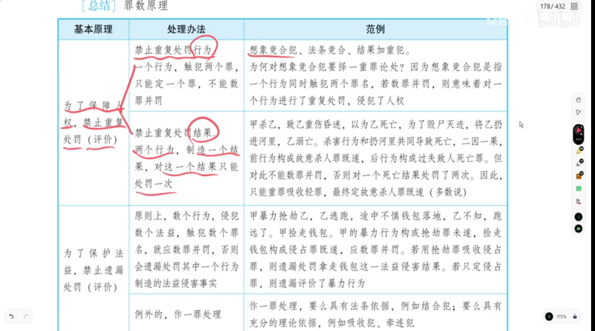

### **第1部分：法考备考提纲**

以下提纲基于第一部分整理后的讲稿内容，旨在为非法律科班人员提供一个清晰的学习框架。提纲严格遵循讲稿内容，不添加未提及的法条或理论。

---

#### **刑法罪数论（两个行为的罪数）备考提纲**

**一、 核心原则：两个行为的一般处理原则**

- **原则**：一个行为触犯数个罪名，一般择一重罪；**两个行为**触犯数个罪名，原则上应当**数罪并罚**。
- **例外**：存在法律特殊规定（结合犯）或有充分理论依据（吸收犯、牵连犯）时，可能只定一罪。

**二、 两个行为的特殊类型详解**

| 类型 | 概念 | 行为数 | 处理方式 | 关键点/示例 |
| :--- | :--- | :--- | :--- | :--- |
| **1. 结合犯** | 两个独立的犯罪行为，法律硬性规定合并为一罪，并加重刑罚。 | 两个行为 | 定一个罪，但法定刑升格（加重处罚）。 | **法律的特殊规定**。 **示例**：拐卖妇女罪 + 强奸罪 = 拐卖妇女罪加重处罚。 |
| **2. 连续犯** | 基于同一犯意，连续实施数个性质相同的行为，触犯同一罪名。 | 数个相同行为 | **财产犯罪**：定一罪，数额累计。 **人身犯罪**：数罪并罚（多数说）。 | **法益性质决定**。 **示例**：多次诈骗 → 一罪；砍杀多人 → 并罚（多数说）。 |
| **3. 吸收犯** | 两个行为，一重一轻，重行为吸收轻行为，只定重罪。 | 两个行为 | 重罪吸收轻罪，只定重罪。 | **理论分析，非法律规定**。需满足“不遗漏评价”的条件。 **示例**：制枪后持枪 → 定制造枪支罪。 |
| **4. 不可罚的事后行为** | 犯罪既遂后的后续行为，因缺乏期待可能性或未侵犯新法益，而不单独处罚。 | 两个行为 | 只处罚前行为，后行为不处罚。 | **关键**：后行为是否侵犯了**新的法益**。 **示例**：盗窃后销赃（常规）→ 不另定罪；但欺骗第三方销赃 → 另定诈骗罪并罚。 |
| **5. 牵连犯** | 两个行为，具有手段与目的（或原因与结果）的“通常性”牵连关系。 | 两个行为 | 择一重罪论处。 | **关键**：牵连关系是否具有“通常性”。 **示例**：伪造支票后使用诈骗 → 择一重罪。 |

**三、 重点与难点辨析**

1.  **结合犯 vs. 结果加重犯**
    - 二者都是法定刑升格条件。
    - **结合犯**是**两个行为**（如拐卖+强奸）。
    - **结果加重犯**是**一个行为**（如拐卖中致人重伤）。

2.  **牵连犯 vs. 想象竞合犯**
    - 二者都是择一重罪论处。
    - **牵连犯**是**两个行为**。
    - **想象竞合犯**是**一个行为**。

3.  **吸收犯的适用条件**
    - 必须确保不遗漏评价法益侵害。如果只定一个重罪会遗漏对另一个法益的评价，则不能吸收，必须并罚。
    - 示例：盗掘古墓葬 + 见死不救（不作为杀人）→ 法益不同，不能吸收，须并罚。

4.  **连续犯的“多数说”**
    - 对于侵犯人身法益的连续行为（如连续杀人），多数观点要求**数罪并罚**，而非定一罪。

**四、 底层原理（主观题核心）**

1.  **禁止重复处罚（保障人权）**：
    - **禁止重复处罚行为**：一个行为不能两头切，不能既当A罪又当B罪来并罚。
    - **禁止重复处罚结果**：一个危害结果不能作为两个罪的成立依据来并罚（如“事先故意”案例）。

2.  **禁止遗漏评价（保护法益）**：
    - 数个行为侵犯了数个不同法益，原则上必须每个都评价，然后并罚。不能为了省事只定一个罪，而遗漏对某个法益侵害的评价（如“抢劫后捡钱包”案例）。

---

### **第2部分：2026年法考考点预测与分析**

根据讲稿内容及近年法考趋势，以下为潜在的2026年考试重点。

| **知识点** | **可能考试的方式** | **举例 / 说明** |
| :--- | :--- | :--- |
| **1. 结合犯的特殊规定（★★★★★）** | **客观题**：判断下列哪些情形属于结合犯，应如何处理？ **主观题**：在案例分析中，要求对不同罪数的处理方式进行论证。 | 题干：甲拐卖妇女乙后，又强奸了乙。问：对甲如何定罪处罚？ **答案**：定拐卖妇女罪一罪，适用加重处罚（十年以上至死刑）。 |
| **2. 结合犯与结果加重犯的区分（★★★★☆）** | **客观题**：给出案例，让考生判断属于结合犯还是结果加重犯，并说明理由。 | 题干：甲在拐卖乙的过程中，为了压制乙的反抗而将其打成重伤。问：此情形属于什么？ **答案**：属于结果加重犯（拐卖罪致人重伤），而非结合犯。理由：只有一个暴力行为。 |
| **3. 连续犯的处理规则（★★★☆☆）** | **客观题**：考查对不同法益（财产/人身）的连续犯处理方式。 | 题干：甲多次实施诈骗，金额累计巨大。问：如何定罪？ **答案**：定一个诈骗罪，数额累计计算。 **变式**：甲在一天内连续杀死三人。问：如何定罪？ **答案**：按多数说，定三个故意杀人罪，数罪并罚。 |
| **4. 吸收犯与不可罚事后行为的界限（★★★★☆）** | **主观题/客观题**：判断后行为是否可被吸收或是否“不可罚”。关键看是否侵犯新法益、是否具有期待可能性。 | 题干：甲盗窃他人财物后，将财物卖给不知情的第三人。问：甲的销赃行为是否构成犯罪？ **答案**：不构成掩饰、隐瞒犯罪所得罪（不可罚的事后行为）。但如果甲对第三人虚构事实，以正常二手价卖出，则另构成诈骗罪，须并罚。 |
| **5. 牵连犯的认定与“通常性”要求（★★★★☆）** | **客观题**：判断两个行为是否具有“通常性”的牵连关系，从而决定是择一重罪还是并罚。 | 题干：甲为了杀人，专门盗窃了一把军用枪支。问：甲构成牵连犯吗？ **答案**：不构成。盗窃枪支与杀人的牵连关系不具有“通常性”，应数罪并罚。 |
| **6. 罪数论底层原理（主观题重大考点）★★★★★** | **主观题（论述或观点展示）**：要求论述“禁止重复评价”与“禁止遗漏评价”原则，或分析具体案例中如何适用该原理。 | 题干（如讲稿“抢劫后捡钱包”案例）：甲抢劫乙，乙逃跑中遗失钱包被甲捡走。问：对甲的行为应如何评价？并说明理由。 **答案**：应定抢劫罪（未遂）和侵占罪（既遂），数罪并罚。理由：如只定一罪，会遗漏评价另一个法益侵害事实（暴力或财产损失）。这体现了“禁止遗漏评价”原则。 **（本题已被标注为极重要的主观题考点）** |

---

### **第3部分：讲稿切分与整理**

以下是对原始讲稿的逻辑切分和文字整理。**修改和标注说明**：
- `[原文疑似错误，已修正]`：表示对明显的语音转文字错误进行了修改。
- `[此句疑似重复，已删除]`：表示删除了因音频切片导致的重复语句。
- `[根据上下文补充]`：表示为了语句通顺或逻辑完整，补充了少量词语。
- `[标注]`：表示对超出主题或需要特别说明的概念进行了注释。

---

**【讲稿正文】**

**一、 罪数论概述：两个行为的处理原则**

好，那接下来我们看第二节，两个行为。如果是两个行为的话，我们看有哪些概念。

**二、 结合犯**

**(一) 概念与标准示例**

第一个叫结合犯。结合犯是什么意思呢？我们先说他的一个标准例子：比如说，狗蛋想拐卖小芳，他把小芳使用暴力控制到手。那我们知道，学到分则我们就知道，这时候你把小芳拐到手、控制到手，你这个拐卖妇女罪就已经既遂了，并不要求卖掉。 `[原文重复，已删除]` 好，已经既遂了以后，他接下来呢，又把人家小芳给强奸了，那又来了个强奸罪。那这时候你说怎么办？

按照正常原理，按照“原生态”的做法，应当怎么办？你这是几个行为？两个行为。一个是拐卖妇女罪已经既遂，然后呢再有一个独立的行为来了个强奸罪，也既遂。那我们正常应当怎么办？两罪并罚是吧？但是呢，刑法来了一个特殊规定，说不两罪并罚，说那怎么办呀？说就定拐卖妇女罪，把强奸行为作为拐卖妇女罪的一个法定刑升格条件，加重处罚。啊，就这么干。

那由此呢就生成了一个公式：**假罪 + 乙罪 = 假罪，然后乙罪成为假罪的法定刑升格条件**。也就是说，拐卖罪加强奸罪等于拐卖罪，强奸罪成为拐卖罪的法定刑升格条件。明白吧？把这个要掌握好。

好，你这个理解了后，这就叫结合犯。这种情况就叫结合犯。所以，拐卖加强奸等于拐卖，然后加重处罚，这就叫结合犯的规定。

**(二) 易混淆概念的区分：结合犯 vs. 结果加重犯**

那这个结合犯，许多同学就会问了：“老师啊，那他和结果加重犯怎么区分？他和法定刑升格条件又该怎么区分？” 哎，我们现在就给大家把这个问题说一下。

首先，我们就以拐卖妇女罪为例。拐卖妇女罪，如果你犯了，比如说基本刑是五年以下，但是呢，他说有以下情形，那么法定刑就要升格为十年到死刑。那这就叫法定刑升格，也就是所谓的加重处罚。但这加重处罚要有条件呀，法定升格要有条件呀。条件呢，它一共列了八个。其中有一个呢，就是“拐卖妇女罪致人重伤死亡”，这个叫结果加重犯。还有一个呢，就是说“你拐卖之后又强奸妇女”，也要按照拐卖罪加重处罚到十年到死刑。

这就告诉我们：**结果加重犯**（拐卖罪致人重伤死亡）是拐卖罪的法定刑升格条件；而**结合犯**（拐卖加强奸等于拐卖加重处罚）其实也是拐卖罪的法定刑升格条件。所以，法定刑升格条件很多，既包括结合犯，也包括加重犯，还可以包括别的。

它们的**相同点**：都是一个法定刑升格条件，都要加重处罚。那**区别**在哪呢？区别就在于，他们都是法律规定的特殊产物。如果把这些法律的特殊规定删掉，让它回归“原生态”，区别就出来了。

1.  **结合犯回归原生态**：拐卖加强奸，如果把特殊规定删掉，回归原生态，这个案件怎么处理？先拐卖妇女既遂，又把人家强奸也既遂，那回归原生态，就应当两罪并罚。为什么？因为你是有**两个独立的行为**。

2.  **结果加重犯回归原生态**：比如说拐卖罪致人重伤死亡，如果把结果加重犯的规定删掉，回归原生态，应当怎么处理？我们前面讲过，不管什么加重犯，回归原生态都是**一个行为**，然后触犯两个罪，按照**想象竞合择一重**。比如说，狗蛋想拐卖小芳，小芳激烈反抗，狗蛋为了控制她，把小芳打成重伤，终于控制到手。这时候你构成拐卖妇女罪（既遂），但你又构成故意伤害罪（重伤）。你整体是**一个暴力行为**，既构成了拐卖罪，又构成了故意伤害罪。按照原生态，就应当拐卖罪和故意伤害罪想象竞合，择一重罪论处。但是法条说，不择一重罪，我给你来个特殊条款，就定拐卖罪，把致人重伤作为拐卖罪的法定刑升格条件，由此生成了“拐卖罪致人重伤”这个结果加重犯。

**总结一下结合犯和加重犯的区分**：
- **加重犯**：它是一个行为。如果删掉特殊规定，回归原生态，它是想象竞合犯。
- **结合犯**：它是独立的两个行为。如果删掉特殊规定，回归原生态，它是数罪并罚（两罪并罚）。

明白吧？就是这个意思。

**(三) 常见结合犯（需要记忆的特殊规定）**

好，这就是他们的区分。我们讲完了以后，我们再回顾一下，由于结合犯也是法律规定的特殊产物，所以这样的特殊规定不多，主要考的就是四个，需要大家去记：

1.  **拐卖 + 强奸 = 拐卖罪加重处罚**。
2.  **绑架罪里面有两个**：
    - 绑架 + 故意杀人罪 = 绑架罪加重处罚。
    - 绑架 + 故意伤害罪致人重伤死亡 = 绑架罪加重处罚。
3.  **前罪 + 妨害公务罪 = 前罪加重处罚**。这样的前罪只有两个：
    - 走私、运送偷越国边境罪。
    - 走私、贩卖、运输、制造毒品罪。
    - `[标注]` 其他罪再加妨害公务罪，一律按原则处理，即数罪并罚。
4.  **交通肇事罪 + 因逃逸致人死亡 = 交通肇事罪加重处罚**。

常考的就是这四个。除了这四个之外，如果遇到两个行为两个罪，那怎么办？按原则处理，就要两罪并罚。要记就记特殊的，把特殊的记住以后，除了特殊之外的其他一般情形，你按正常原理去定。

**三、 连续犯**

**(一) 概念**

好，把这个掌握好了以后，那接下来我们就看第二个概念，叫连续犯。连续犯是啥意思呢？就是基于同一个犯意，连续实施性质相同的数个行为，但触犯的都是同一个罪名。

**(二) 处理规则**

对连续犯该怎么处理呢？这里面有两个规则，主要是看这个连续犯的罪名，到底是人身犯罪还是财产犯罪。

1.  **财产犯罪（法益具有可替代性）**：财产法益不具有人身专属性，具有可替代性。对于这样的连续犯，就只定一个罪。比如说，你多次实施诈骗，就定一个诈骗罪，然后把数额累计计算。多次走私、多次逃税、多次贪污、多次受贿，都是这样，定一个罪，数额累计。

2.  **人身犯罪（法益具有人身专属性）**：如果这个罪名是人身犯罪，那这种连续犯怎么办呢？这里面有观点展示。**多数说**认为应当数罪并罚。以前实务中发生一个案件，有个人对社会不满，拿把刀到政府办公大楼，从一楼开始砍杀，一层砍一个，一直砍到五层，杀了五个人。少数观点认为定一个故意杀人罪，一打包就完了。但多数说认为，故意杀人罪的保护法益是生命法益，具有人身专属性，不能打包，每一笔罪行都得单算，然后数罪并罚。

**(三) 图表说明**

这里面，我们书上给他画了个图表，涉及到财产犯罪里面的“多次”。
- 有的把“多次”作为犯罪成立条件，如多次盗窃、多次抢夺、多次敲诈勒索。
- 有的把“多次”作为法定刑升格条件（加重处罚），如多次抢劫。
这其实都是连续犯看怎么处理的问题。由于都是财产犯罪，肯定是定一个罪。至于到底是作为成立条件还是法定升格条件，就按照图表去记，这些都是一些死记硬背的东西，要掌握好。

**四、 吸收犯**

**(一) 概念与条件**

好，那接下来我们就看第三个（原文为“第四个”，根据上下文逻辑应为第三个新概念，调整顺序），吸收犯。吸收犯指的是什么呢？首先也是两个行为，不过这两个行为，有一个是重行为，一个是轻行为。这时候，就来了一个“重行为吸收轻行为”，只定这个重罪，轻罪被吸收。

但大家注意，这种吸收犯的做法，**不是法律规定的一个特殊产物**，它完全是理论上的一种分析。这理论分析要有一个条件：**不遗漏评价法益侵害，或者说不能遗漏处罚**。如果做不到这一点，就老老实实两罪并罚。

**(二) 例题1（可以吸收）**

举个例子。狗蛋打猎，打到了一只野鸡，他把野鸡挂在猎枪的枪头上，扛着猎枪走在大街上。结果野鸡没被打死，爪子乱抓碰到了扳机，子弹飞出去，把一个站街女打成重伤。狗蛋一看，瞧不起人家，故意不救，看着她死了（本来能救活）。

先不考虑非法持有枪支罪。狗蛋构成哪些罪？首先，对站街女的重伤，构成**过失致人重伤罪**（在大街上扛枪有过失）。接下来，你有没有救人家的义务？有，因为你的先行行为导致人家受伤。你故意不救，看着人家死，构成**不作为的故意杀人罪**。

这是几个行为？**两个行为**：一个过失行为致人重伤，一个不作为的故意杀人（不作为也是行为）。这两个罪要不要并罚？没必要，这时候来一个重罪吸收轻罪。不作为的故意杀人罪可以吸收过失致人重伤罪，最后定一个故意杀人罪。

为什么呢？因为杀人罪和重伤罪，保护的法益性质基本相同，都是身体健康和生命，性质相同只是程度不同。这样做没有遗漏评价法益侵害，所以可以重罪吸收轻罪。

**(三) 例题2（不可以吸收）**

如果性质不同就不一样了。记不记得前面讲不作为时举过的例子？两个盗墓贼在公园里挖洞，把人家土炕挖塌了，小两口掉进去，两个盗墓贼抱着文物跑了，见死不救，让人家死了。这时候，他构成两个罪：**盗掘古墓葬罪**和**不作为的故意杀人罪**。这两个罪能不能重罪（杀人罪）吸收轻罪（盗掘罪），只定一个故意杀人罪？不能。

为什么？因为杀人罪保护的法益是生命法益，盗掘古墓葬罪保护的法益是文物管理法益，两个法益性质完全不同。如果只定杀人罪，就遗漏评价了盗掘古墓葬罪。所以这时候，必须老老实实两罪并罚。

**(四) 常见吸收犯情形**

大家把这个理解了以后，我们来训练一下考试喜欢考的。

1.  **制造枪支后持有**：狗蛋非法制造了一把AK-47，放在自己家里。他构成**非法制造枪支罪**和**非法持有枪支罪**。这两个罪需不需要并罚？不需要。因为侵害的法益都是枪支管理法益，可以重罪吸收轻罪，定一个非法制造枪支罪。

2.  **盗窃后诈骗（针对同一被害人）**：狗蛋从超市偷了一个高压锅。下午，他又来到这家超市，冒充是上午买的，要求七天无理由退货，商家上当受骗，给他退货退款。他构成几个罪？上午构成**盗窃罪**，下午构成**诈骗罪**。这两个罪要不要并罚？不需要。因为被害人超市最终只遭受了一份财产损失（上午失了锅，下午失了货款，但锅回来了），狗蛋最终也只获得了一份好处（退货款）。两罪并罚会重复评价。所以可以重罪吸收轻罪。一般来说，盗窃罪比诈骗罪重一点，最终可以定一个盗窃罪。

**五、 不可罚的事后行为**

好，接下来就是第四个概念（原文为“第四个概念”，实则前面已讲三个，此为新概念），叫**不可罚的事后行为**。

**(一) 概念**

它指的是什么呢？就是一个犯罪已经既遂了，后面又实施了第二个犯罪行为，但这个第二个犯罪行为不值得处罚，只处罚前面那个行为。主要理由就是**不具有期待可能性**，或者说**没有侵犯新的法益**。

**(二) 常考情形：销赃**

常考的是销赃行为。我们一起来看一个例子。

戴鹏老师偷了李佳老师的手表（盗窃罪既遂）。然后戴鹏老师要拿到市场上去卖，分两种情形：

1.  **情形一（不可罚）**：戴鹏拿到赃物市场，低价卖给了左宁老师，双方心知肚明。问：除了盗窃罪，还要不要定一个“掩饰、隐瞒犯罪所得罪”（销赃罪）？不需要。因为不具有期待可能性——你不能期待一个小偷不去销赃。后面的销赃行为不可罚。

2.  **情形二（可罚）**：戴鹏不是去赃物市场，而是拿到一个合法的二手市场，伪造发票，冒充是自己的二手手表卖给孟献贵老师。孟老师信以为真，用正常二手价买下。问：除了盗窃罪，还要定什么罪？还要构成**诈骗罪**（多数说）。因为孟老师有财产损失（买到了权利有瑕疵的赃物）。这个诈骗罪侵犯了新的法益（孟老师的财产），是可罚的。这时候，盗窃罪和诈骗罪要**两罪并罚**。

**六、 牵连犯**

好，接下来最后一个概念，叫**牵连犯**。

**(一) 概念与处理原则**

牵连犯也是前后两个行为，不过这两个行为有一种逻辑上的特殊关系：**手段与目的的关系，或者原因与结果的关系**。这种逻辑关系被称为“牵连关系”。如果这种牵连关系**具有通常性**的话，那么就可以成为牵连犯，然后**择一重罪论处**。

**(二) 例题1（具有通常性）**

举个例子，《逍遥法外》那部电影里，主角先伪造支票，再用支票去实施票据诈骗。他构成两个罪：**伪造金融票证罪**和**票据诈骗罪**。这两个行为有手段与目的的关系，而且这种牵连关系具有**通常性**（对于票据诈骗，通常先伪造再诈骗）。所以构成牵连犯，择一重罪论处，不需要两罪并罚。

**(三) 例题2（不具有通常性）**

但有时候没有通常性的话，即使有手段与目的的关系，也不能按牵连犯择一重。比如狗蛋想杀小芳，他跑到军营偷了一把加特林机枪，用机枪把小芳打死了。他有两个行为两个罪：**盗窃枪支罪**和**故意杀人罪**。虽然有手段（盗窃枪支）与目的（杀人）的关系，但这两个行为结合起来有没有通常性？没有。一般犯罪分子不会为了杀人专门去偷枪。所以不认定为牵连犯，最终要**两罪并罚**。

**(四) 与想象竞合犯的区别**

许多同学问，牵连犯和想象竞合犯都是择一重罪论处，区别在哪？区别很简单：牵连犯是**两个行为**，想象竞合犯是**一个行为**。

**七、 罪数论的底层原理（主观题考点）**

好，那牵连犯我们讲完以后，整个罪数这一块的概念知识点就讲完了。最后我们要总结一个罪数这一讲的**底层原理**，这个很重要啊，主观题观点展示都考过。

底层原理其实就是两句话：

**(一) 为了保障人权，禁止重复处罚（禁止重复评价）**

1.  **禁止重复处罚行为**：如果你是一个行为，触犯数个罪名，就不能两罪并罚。比如想象竞合犯、结果加重犯、情节加重犯、法条竞合，都是一个行为，如果两罪并罚，等于把一个行为处罚了两次，侵犯人权。
2.  **禁止重复处罚结果**：虽然我有两个行为，但是我只制造了一个结果，对这一个结果只能处罚一次。比如“事先故意”（结果的推迟发生）的例子：甲杀乙，致乙重伤昏迷，以为乙死了，为毁尸灭迹把乙扔到河里，乙实际是淹死的。多数说认为，死亡结果是前面的杀人行为和后面的扔的行为共同导致的（二因一果）。前面的杀人行为定故意杀人罪既遂，后面的扔的行为定过失致人死亡罪。这两个罪能不能并罚？不能！因为如果并罚，等于把一个死亡结果处罚了两次（既作为故意杀人罪的结果，又作为过失致人死亡罪的结果）。这时候用吸收犯原理，重罪吸收轻罪，最终定一个故意杀人罪既遂。

**(二) 为了保护法益，禁止遗漏处罚（禁止遗漏评价）**

原则上，如果你有数个行为，侵犯数个法益，触犯了数个罪名，就应当数罪并罚。如果不数罪并罚，你就遗漏评价了某个行为制造的法益侵害事实。

**例题（真题）**：甲暴力抢劫乙，乙在逃跑途中不慎将钱包掉在地上（乙不知道），甲追到跟前，把这个钱包捡走了。甲构成什么罪？首先，抢劫罪是成立了，但能算抢劫罪既遂吗？不能。因为抢劫罪的行为链条是：暴力压制反抗 → 对方被迫放弃财物 → 劫取财物。这里，乙是遗失财物，不是“被迫放弃”，因果链条断裂。所以甲只能算**抢劫罪未遂**。捡走钱包的行为，因为乙已经跑远、失去了对钱包的占有，甲捡走定**侵占罪既遂**。

这两个罪能不能来个重罪吸收轻罪，只定一个罪？
- 如果只定抢劫罪（未遂），就遗漏评价了钱包被拿走、财产实际损失这个结果（未遂无法评价实际损失）。
- 如果只定侵占罪（既遂），就遗漏评价了前面的暴力行为（侵占罪是平和手段，无法评价暴力）。

所以，只定一个罪总会遗漏评价。这时候，就必须**两罪并罚**。虽然从自然事实看好像是一个行为（追过去捡起来），但从法律评价上要切割成两个行为，分别评价，然后并罚。

**(三) 总结**

- **原则**：两个行为两个罪，原则上就要数罪并罚。
- **例外（只做一罪处理）**：
    1.  有**法条规定**的特殊处理，如结合犯（拐卖+强奸=拐卖加重处罚）。
    2.  有**充分的理论根据**，如吸收犯、牵连犯（重罪吸收轻罪或择一重罪论处）。

这就是两个原理。掌握了以后，在分则里还要活学活用。

**八、 课程总结：犯罪论体系回顾**

好了，那我们这两个原理讲完以后，我们整个罪数这一讲就讲完了。那罪数这一讲讲完以后，我们刑法总论的主体部分——**犯罪论**——我们就讲完了。犯罪论解决的问题就是**如何定罪**的问题。这个问题又分解为几个部分：

1.  **犯罪是否成立**：用改良版的四要件构成体系判断。
    - 犯罪客体（保护的法益）
    - 犯罪主体（自然人、单位）
    - 犯罪客观要件（危害行为、危害结果、因果关系）
    - 犯罪主观要件（故意、过失、事实认识错误）
    - 排除犯罪事由：
        - 排除违法事由（正当防卫、紧急避险、被害人承诺等）
        - 排除责任事由（责任年龄、责任能力、违法性认识可能性、期待可能性等）
2.  **犯罪成立后的三大问题**：
    - 时间上的发展问题：犯罪预备、中止、未遂、既遂（犯罪形态）。
    - 空间上的分布问题（共同犯罪）：实行犯、教唆犯、帮助犯、共同正犯、间接正犯等，以及与身份犯、不作为犯、实行过限、认识错误的结合。
    - **罪数的计算问题**：也就是我们今天讲的这些。

整个犯罪论到此结束。这部分内容太多，但太重要，是主体部分，大家关键时候一定要顶住。

---

