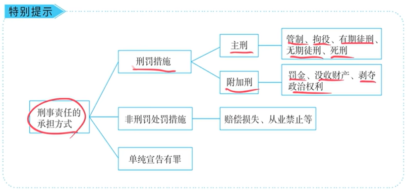
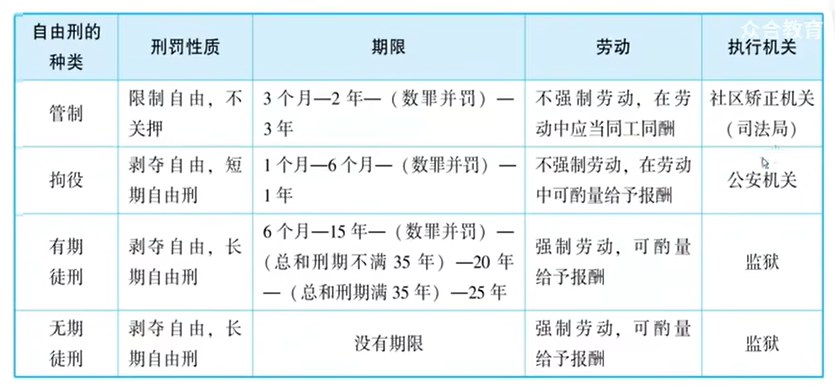

# 刑罚论·刑罚的体系——法考备考提纲

## 一、刑罚论在法考中的整体定位

- **分值占比：** 低于犯罪论（犯罪论占刑法总论90%分值），但死刑、财产刑、量刑等仍是高频考点
- **复习策略：** 记忆性内容建议放在后期（第二轮、第三轮）集中背诵；第一轮重在理解体系框架和易错陷阱
- **刑罚论四部曲：** 刑罚的体系 → 刑罚的裁量（量刑） → 刑罚的执行 → 刑罚的消灭

## 二、承担刑事责任的方式（三种类型）

| 类型 | 具体内容 |
|------|----------|
| **① 刑罚措施** | 主刑（管制、拘役、有期、无期、死刑）+ 附加刑（罚金、没收财产、剥夺政治权利、驱逐出境） |
| **② 非刑罚处罚措施** | 赔偿损失、从业禁止等 |
| **③ 单纯宣告有罪** | 不施加任何处罚，但产生犯罪记录，具有罪犯身份 |

**【注释】** 单纯宣告有罪在《刑法》第三十七条有规定：“对于犯罪情节轻微不需要判处刑罚的，可以免予刑事处罚，但是可以根据案件的不同情况，予以训诫或者责令具结悔过、赔礼道歉、赔偿损失，或者由主管部门予以行政处罚或者行政处分。”虽然讲授者未直接引述法条，但“单纯宣告有罪”即为免予刑事处罚的一种形式。

**【考点提示】** 单纯宣告有罪≠没有不利后果，会产生犯罪记录。

## 三、主刑（现代五刑：管拘有无死）

### （一）各主刑特点对比表

| 主刑 | 自由限制程度 | 是否关押 | 是否强迫劳动 | 劳动报酬 |
|------|-------------|----------|-------------|----------|
| **管制** | 限制自由（非剥夺） | 不关押 | 不强迫 | 同工同酬 |
| **拘役** | 剥夺自由（短期自由刑） | 关押 | 不强迫 | 酌量给报酬 |
| **有期徒刑** | 剥夺自由（长期自由刑） | 关押 | **强迫** | 酌量给报酬 |
| **无期徒刑** | 剥夺自由（无期自由刑） | 关押 | **强迫** | 酌量给报酬 |
| **死刑** | — | — | — | — |

**【核心记忆口诀】**
- 管制：限制不关押，不强迫，同工同酬
- 拘役：剥夺短期，不强迫，酌量报酬
- 徒刑（有期+无期）：剥夺自由，强迫劳动，酌量报酬

**【注释——“徒刑”的词源】** 讲授者引用《唐律疏议》“徒者奴也”，“奴”即奴隶，徒刑即劳役刑、苦役刑，故包含强迫劳动的内涵。

**【注释——无期徒刑vs美国终身监禁】** 美国终身监禁属于“监禁刑”，只剥夺自由不强迫劳动；我国无期徒刑剥夺自由+强迫劳动，理念是“劳动改造罪犯”。

### （二）死刑（法考核心重点）

**1. 死刑的种类**
- 死刑立即执行
- 死刑缓期两年执行（死缓）

**2. 死刑的限制对象（三类人不能适用死刑）★★★★★**

| 限制对象 | 法条依据 | 核心要点 |
|----------|----------|----------|
| **犯罪时未满十八周岁** | 《刑法》第49条第1款 | 以**犯罪时**为准，不是审判时 |
| **审判时怀孕的妇女** | 《刑法》第49条第1款 | 两个扩大解释（见下文） |
| **审判时已满七十五周岁** | 《刑法》第49条第2款 | 以特别残忍手段致人死亡的除外 |

**【重点——审判时怀孕的妇女——两个扩大解释】**

① **“审判时”** → 扩大解释为**整个羁押期间**（包括审判前羁押、审判阶段、执行阶段）；
② **“怀孕”** → 不要求一直怀孕，**曾经怀孕过即可**（哪怕一天）。

**【例题——四种情形判断】**
| 情形 | 能否判死刑 | 结论 |
|------|-----------|------|
| 羁押前没怀孕，羁押后判死罪 | ✅ 可以 | 不满足条件 |
| 羁押前怀孕，羁押后第二天流产 | ❌ 不可以 | 羁押期间曾怀孕 |
| 羁押前没怀孕，羁押后在看守所内怀孕 | ❌ 不可以 | 审判时处于怀孕状态（不问怀孕原因合法与否） |
| 判死刑后、执行前发现怀孕 | ❌ 不可以 | 终止执行，改判无期徒刑 |

**【注释】** 讲授者提到的“越南男犯人误关女牢致女囚怀孕案”说明：怀孕不问原因，不问合法非法。

**【重要提示】** 三类人不能适用死刑 = 不能适用死刑立即执行 + **也不能适用死缓**。

**3. 死缓（死刑缓期两年执行）**

| 死缓期间表现 | 法律后果 |
|-------------|----------|
| 两年内**老老实实**（没有故意犯罪） | 不执行死刑 |
| 两年内**故意犯罪、情节恶劣** | 报请最高法院核准后执行死刑 |

**【注释——法制史关联】** 讲授者提到“斩立决≈死刑立即执行，斩监候≈死缓”，此为法制史概念，超出主题范畴，仅供参考。

## 四、附加刑

### （一）附加刑的种类
罚金、没收财产、剥夺政治权利、驱逐出境

### （二）没收财产（最高频考点）★★★★★

**考点一：没收财产的范围**

没收犯罪分子**个人合法所有，并且没有用于犯罪的财产**。

三个限定条件：
- ① 个人所有 → 不能没收家庭成员财产；
- ② 合法所有 → 违法所得另行处理（非刑罚处罚措施）；
- ③ 没有用于犯罪 → 犯罪工具另行处理（非刑罚处罚措施）。

**考点二：没收财产的执行顺序**

**【例题——狗蛋交通肇事案】**
狗蛋撞死狗剩、撞伤小方（含人身损害+电瓶车损害）、欠铁牛10万元。另有罚金/没收财产待执行。

**【执行顺序口诀：先民后刑，民事优先于财产刑】**
1. 第一优先：**人身损害赔偿 + 其他损害赔偿**（赔偿被害人）
2. 第二位：**民事债务**（欠铁牛的10万元）
3. 最后：**财产刑**（罚金、没收财产）

如果前面赔完了没钱，财产刑无法执行则不再执行。

## 五、非刑罚处罚措施

### （一）从业禁止（考过一次）

- 适用对象：利用职业便利犯罪、违背职业要求特定义务的犯罪
- 法律后果：禁止从事相关职业（**可终生禁止**）
- **关键区分：故意犯罪触发，过失犯罪不触发**

**【讲授者补充案例——律师捞人诈骗案】**
律师收一千万帮人“捞人”，办不成后挪用款项买别墅，迟迟不还钱，被控诈骗罪（故意犯罪）。因无法证明“一开始没有非法占有目的”（违法事由不敢供出经办人），最终定罪。后果：故意犯罪 + 律师职业 → 终生从业禁止。

**【讲授者忠告】** 过法考后从事法律职业，守住道德底线，远离捞人、行贿等违法行为。刑事风险零容忍。

### （二）《刑法》第六十四条——追缴与没收（考过一次）

**【法条原文】**
“犯罪分子违法所得的一切财物，应当予以追缴或者责令退赔；对被害人的合法财产，应当及时返还；违禁品和供犯罪所用的本人财物，应当予以没收。没收的财物和罚金，一律上缴国库，不得挪用和自行处理。”

**【重要辨析】**
| 类型 | 没收对象 | 性质 |
|------|----------|------|
| **没收财产刑（附加刑）** | 犯罪分子个人合法所有、未用于犯罪的财产 | 刑罚措施 |
| **第六十四条的没收** | 违禁品、犯罪所得、供犯罪所用的本人财物 | 非刑罚处罚措施 |

**【例题——SUV强奸案——没收犯罪工具的“通常性”】**
A男开SUV接女性朋友，途中在车上强奸了对方。法院判强奸罪。问：该SUV是否应作为“供犯罪所用的本人财物”予以没收？

**结论：不应没收。**

**理由：** 没收犯罪工具要求**“通常性”**——即行为人通常将该物作为犯罪工具加以利用。本案中A在车上强奸属于**偶然性**，并非将该SUV作为经常性犯罪场所或工具，故不符合“通常性”条件，不应没收。

**【注释】** 讲授者提到“韩国化学阉割”为域外制度，我国无此规定。

## 六、核心考点速记表

### 高频混淆点对比

| 对比项 | 管制 | 拘役 | 有期徒刑/无期徒刑 |
|--------|------|------|-------------------|
| 自由 | 限制（不关押） | 剥夺（关押） | 剥夺（关押） |
| 劳动 | 不强迫 | 不强迫 | **强迫** |
| 报酬 | 同工同酬 | 酌量 | 酌量 |

| 对比项 | 没收财产刑（附加刑） | 第六十四条没收（非刑罚） |
|--------|---------------------|-------------------------|
| 对象 | 合法所有、未用于犯罪的财产 | 违禁品、违法所得、犯罪工具 |
| 性质 | 刑罚 | 非刑罚处罚措施 |
| 执行顺序 | 最后（被害人赔偿→民事债务→财产刑） | 单独处理 |

# 2026年法考考点预测表（基于讲稿内容）

| 知识点 | 可能考试的方式 | 举例/说明 | 是否主观题考点 |
|--------|---------------|-----------|---------------|
| **死刑限制对象——“审判时怀孕的妇女”的两个扩大解释** | 客观题（单选/多选）+ 主观题案例分析 | 给出四种情形（羁押前怀孕流产、羁押中怀孕、执行前怀孕等），判断能否判死刑 | ⭐ **是（案例分析中结合具体案情判断）** |
| **没收财产的执行顺序（先民后刑）** | 客观题（排序/判断）+ 主观题（财产处置） | 狗蛋案：死亡赔偿金→民事债务→罚金/没收财产 | ⭐ **是（量刑部分财产处置）** |
| **没收财产的范围（个人+合法+未用于犯罪）** | 客观题（判断正误） | 选项混淆“违法所得”“犯罪工具”与没收财产刑 | 否 |
| **第六十四条没收 vs 没收财产刑的区分** | 客观题（多选，区分类型） | SUV案中犯罪工具没收的判断 | 否 |
| **从业禁止（故意犯罪 vs 过失犯罪）** | 客观题（判断）+ 主观题小问 | 律师交通肇事罪（过失）不触发从业禁止；诈骗罪（故意）触发 | 可能 |
| **主刑中“强迫劳动”的区分** | 客观题 | 管制、拘役不强迫；有期、无期强迫 | 否 |
| **死缓的法律后果** | 客观题 | 死缓期间故意犯罪情节恶劣→报请核准后执行死刑 | 否 |
| **没收犯罪工具的“通常性”要件** | 客观题 + 可能主观题 | SUV强奸案——偶然使用不构成犯罪工具没收 | 可能（作为财产处置部分的小问） |
| **单纯宣告有罪的法律效果** | 客观题 | 仍有犯罪记录，属于承担刑事责任方式之一 | 否 |
| **三类不能适用死刑的对象** | 客观题（单选/多选）+ 主观题 | 特别注意：不能适用死刑=不能死立执+不能死缓 | ⭐ **是（死刑适用条件判断）** |
| **管制vs拘役vs徒刑的对比** | 客观题（对比判断） | 自由限制程度、是否关押、是否强迫劳动、报酬方式 | 否 |

# 讲稿分段整理（逻辑切分与文字修正）

**一、课程引入：刑法论在法考复习中的定位与策略**

好，从今天开始，我们就开始学习刑法论。刑法论这一个板块，我得介绍一下：

第一个，它的分值比较低，它没有我们犯罪论（定罪问题）分值那么高。我们整个犯罪论能占我们总论分值的百分之九十呢，刑法论只占一点点。

第二个呢，刑法论它主要涉及一些死记硬背的东西。所以我们在这个第一轮复习的时候，我们就不把它作为重点了——因为你死记硬背的东西放在前面背，到后期第二轮第三轮又忘了。所以凡是死记硬背、记忆性侧重多一点的，最好是放在后期复习；前期复习那种理解性比较强的。

所以呢，刑法论这一块，我们一般就放在第二轮。我们第二轮给大家也有免费的背诵版的背诵卷的课，到时候我们再详细讲解。我们在第一轮呢，刑法论这一块主要是给大家把这个体系框架搭建起来，然后呢，把一些容易误解的地方——可能是一个陷阱的地方——给大家提示一下，基本上也就可以了。

当然了，我建议你有时间的话，第一轮还是把书上的内容看一看，混个脸熟，给第二轮的记誦打一个基础。

**【注释】** 讲授者在此处将“刑罚论”称为“刑法论”，这是口语习惯，实际法考中该板块正式名称为“刑罚论”。另外讲授者提到“刑法论占一点点”，但近年法考中刑罚论（尤其是量刑、死刑、财产刑等）分值并不算太低，这里应理解为相对于犯罪论而言比例较低。

**二、刑罚论的四部分体系总览**

那刑法论这一块主要解决几个问题：

第一个，**刑罚的体系**——就是我们国家有哪些刑法的种类。【注释】此处讲授者口语说“刑法的种类”，实际应为“刑罚的种类”。

第二个呢，就是**刑罚的裁量**——那就是量刑，那个是重点，虽然是刑罚论的重头戏。

最后一个呢，就是**刑罚的执行和消灭**。

所以呢，刑罚的体系、刑罚的裁量、刑罚的执行、刑罚的消灭——就这四部曲。

那我们先看刑罚的体系。

**三、承担刑事责任的方式——三种类型**

那关于刑罚的体系，我们书上给他画了个图表。就是如果一个人构成犯罪，要承担刑事责任，那承担刑事责任的方式有哪些呢？有三种。

**第一种：刑罚措施。** 刑罚措施分为主刑和附加刑。主刑就是管制、拘役、有期徒刑、无期徒刑、死刑——管拘有无死，这是现代五刑。【注释】讲授者提到“大家都学过法制史封建五刑是啥呢？应该都知道吧，是杖徒流死是吧？”此处引入法制史概念，超出当前主题范畴，以注释保留。

附加刑有罚金、没收财产、剥夺政治权利、（驱逐出境）。

**第二种：非刑罚处罚措施。** 那就是赔偿损失呀、从业禁止呀这些。

**第三种：** 刑罚措施也不给你施加，非刑罚处罚措施也不给你施加——那就是**单纯宣告有罪**。

有的同学说：单纯宣告有罪，那也是承担刑事责任的一种方式呀？——是的，也是。

有的说：那又不让我坐牢，也不给非刑罚处罚措施，那随便宣布吧，我无所谓，反正对我们有什么不利的？

——有没有对你不利啊？有。那你就有了犯罪记录了，你就是个罪犯的身份了，这本身也是让你承担刑事责任的一种方式了，明白吧？

**四、主刑（现代五刑）总览**

那我们就先看刑罚措施里面的主刑。

那主刑这一块呢，我们就直接给大家看我们书上的一个图表啊，通过图表来总结一下就可以了。这个图表里面呢，有一些需要我们注意的地方，会给大家提醒。

那我们现在切换到图表上，大家来看一下——就是现代五刑：管拘有无死。

**（一）管制**

管制它的特点是啥呢？是**限制你的自由，不关押**——注意，不是剥夺自由，是限制自由，不关押。所以呢，刑期就比较短。同时是**不强迫劳动**，如果你劳动的话，**同工同酬**。

**（二）拘役**

拘役是**剥夺自由**，它已经属于短期自由刑了。然后呢，**也不强迫劳动**，如果劳动的话，**酌量给一点报酬**。

**（三）有期徒刑**

有期徒刑显然是**剥夺自由**，属于长期自由刑。那是**强迫劳动**，可以酌量给一点报酬。

**（四）无期徒刑**

无期徒刑当然也是**剥夺自由**，长期的无期刑，长期的自由刑了，也是**强迫劳动**，酌量给点报酬。

**【补充讲解】关于“徒刑”的含义与中外对比**

那在咱们考试里面考过——哪些强迫劳动、哪些不强迫劳动？这个给大家说一下：

有期徒刑、无期徒刑，只要叫“徒刑”，就要强迫劳动了。为什么呢？“徒刑”是啥意思？唐律疏议说过：“徒者奴也。”“奴”是啥？就是奴隶。所以徒刑其实就是那种劳役刑、苦役刑，就是强迫你劳动的。比如说我们经常说“学徒”“徒弟”，这都是让你去劳动的。

有的同学会问：那咱们国家这个无期徒刑和人家美国——我看美剧里面经常说什么“终身监禁”——有啥区别啊？

——你说的很好。他们叫“终身监禁”，叫监禁刑。监禁刑就是只剥夺你的自由，但是不强迫劳动。我们这个无期徒刑呢，不但剥夺你的自由，还强迫你劳动。

那为什么有这个区别呢？这个区别主要在于美国或者西方跟我们中国的一些观念不一样。美国那边，他们近代的那种苦役犯，他们觉得那个不好——比如《悲惨世界》里面那个冉阿让，那就是苦役犯——他们觉得强迫人劳动是侵犯人权。所以他们只是监禁你，剥夺你的自由，但不强迫你劳动。

但我们国家的理念是什么呢？劳动是改造犯人最好的方式。因为许多犯人都是好逸恶劳，所以呢，我们认为让你掌握一份劳动技能——比如说踩个缝纫机呀、糊个火柴盒呀——让你在这个劳动中去改造你。我们认为这是很好的一个方式，不能让你不劳而获。所以我们的无期徒刑跟他们的终身监禁还是不一样的。

**【注释】** 讲授者在此处有一段关于“土味情话”的轻松内容（“我要判你终身监禁，将你监禁在我的心里”“为你量身定做”“拨动了我的心弦”等），为活跃课堂气氛的即兴发挥，不属于考点内容，予以省略，特此说明。

**五、死刑（重点）**

死刑相对来说还是比较重要的，比前面那几个重要，我们要好好说一下。

首先，死刑包括**死刑立即执行**和**死刑缓期两年执行**。

那这里面常考的是**死刑的限制对象**——一共有三类人：

**（一）犯罪时未满十八周岁的人（未成年人）**

也就是犯罪时的未成年人，对未成年人是不能适用死刑的。

**【讲授者补充案例】** 这让我想起1940年代美国有一个真实的案件——小威利，15岁，被控犯了谋杀罪，要给他执行死刑。当时他在看守所里面正在吃蛋糕，狱警喊他说要执行死刑了，今天要上路了。他说“好好好，我马上来”，把剩下还没吃完的蛋糕小心翼翼地包好，告诉另外一个狱友说“你帮我保管好，我剩下的我一会儿回来我还吃”，然后他就去了。大家都愣了。当时就引起广泛讨论：这个小威利是不是有点智障？他对死亡的含义好像还没理解，以为是梦游呢，过一会儿就醒了就回来了。所以当时就说对这种人执行死刑，他的受刑能力是不是要重新评估一下？——那个争议很大。

我们国家现在是法律明确规定，对未成年人犯罪是不能适用死刑的。

**（二）审判时怀孕的妇女（重点考点）**

接下来第二类人就是**审判时怀孕的妇女**，也是不能适用死刑。

那这个“审判时怀孕的妇女”这个点特别喜欢考。这里面有**两个扩大解释**需要注意：

**第一个，“审判时”要扩大解释为包括整个羁押期间。** 既包括审判前的羁押期间，也包括法院审判阶段，还包括事后执行期间。不能狭义地理解为在法院的那个审判阶段。

**第二个，“怀孕的妇女”——不要求一直处在怀孕状态，只要曾经怀孕过就行，哪怕怀孕过一天都行。**

**【例题：审判时怀孕的妇女四种情形】**
| 情形 | 能否判死刑？ | 理由 |
|------|-------------|------|
| ①羁押前没怀孕，羁押后被判死罪 | **可以** | 不满足“审判时怀孕”条件 |
| ②羁押前怀孕，羁押后第二天流产 | **不可以** | 羁押期间曾怀孕，属于审判时怀孕的妇女 |
| ③羁押前没怀孕，羁押后第六个月在看守所内怀孕 | **不可以** | 审判时（羁押期间）处于怀孕状态 |
| ④判死刑后、执行前发现怀孕 | **不可以** | “审判时”包括执行阶段，终止执行，改判无期徒刑 |

**【讲授者补充案例】** 情形③——有的同学问：在看守所里面还能怀孕？有没有这种可能？有的。电视剧《黑冰》里面那个刘梅，就是在看守所里面怀孕的。越南那边发生过一个案件：一个男犯人长得清秀，狱警没仔细看，以为是个女犯人，关到了女牢。洗澡的时候女犯人一看——原来是个男的，纷纷怀孕。最后能判死刑吗？按我们国家刑法，没法判死刑了。非法怀孕？管他呢，判死刑？不行。这个怀孕可不管合法非法。

**（三）审判时已满七十五周岁的人（原则上不适用死刑）**

第三类人——审判时已满七十五周岁的人，**原则上不适用死刑**，但**以特别残忍手段致人死亡的除外**。

**【注释】** 讲稿原文在此处音频似乎有内容缺失，讲授者对第三类限制对象未展开讲解。根据《刑法》第四十九条第二款，补充如下：“审判的时候已满七十五周岁的人，不适用死刑，但以特别残忍手段致人死亡的除外。”

**【重要补充】三类人不能适用死刑的含义**

这三类人不能适用死刑，既包括**不能适用死刑立即执行**，也包括**不能适用死刑缓期两年执行**（死缓）。所以如果执行前真怀孕了，只能改判为无期徒刑。

**（四）死刑缓期两年执行（死缓）**

死缓其实就是给你一个缓期，就是两年。两年内你如果老老实实的，那就不给你判死刑立即执行了；如果两年内不老老实实的，还故意犯罪、情节恶劣，那就要死刑立即执行了。

死缓这个制度其实也是学习我们国家古代的法律观念。我们古代有“斩立决”，也有“斩监候”——斩立决就类似于死刑立即执行，斩监候就类似于我们今天的死刑缓期执行（死缓）。一般人判了死缓肯定会老老实实的，基本上就是把命保住了。

**【注释】** 此处“斩监候”与“斩立决”为法制史概念，超出当前刑罚论主题范畴，以注释保留。

**六、附加刑**

接下来就是第二节——附加刑。附加刑有**罚金、没收财产、驱逐出境、剥夺政治权利**。

这里面考得最多的是**财产刑**——就是罚金和没收财产。当然考得最多最多的是**没收财产**。

**【重点】没收财产——第一考点：没收财产的范围**

没收财产的范围是什么呢？是没收犯罪分子**个人合法所有，并且没有用于犯罪的财产**。

三个限定条件必须同时满足：
- ① **个人所有**——不能把家庭成员的给没收了；
- ② **合法所有**——如果是违法所得，当然要没收，但那不叫没收财产刑，是非刑罚处罚措施中的没收违法所得；
- ③ **没有用于犯罪**——如果财产用于犯罪，那就是犯罪工具，当然要没收，那也不属于没收财产刑。

**【重点】没收财产——第二考点：执行顺序（常考）**

**【例题：狗蛋交通肇事案——执行顺序】**
狗蛋犯交通肇事罪，不小心把狗剩撞死了，还不小心把小方撞成重伤，把小方的电瓶车都撞坏了。另外他还欠铁牛十万元。

对整个狗蛋的财产怎么执行？

**执行顺序：**
1. **第一优先：赔偿被害人的人身损害赔偿或其他损害赔偿**——死亡赔偿金、人身损害赔偿、物质损害赔偿（电瓶车）等；
2. **第二位：民事债务**——欠铁牛的十万元；
3. **最后：财产刑（罚金、没收财产）** ——刑法的公法财产刑放到最后一位。

如果前面赔完了没钱了，财产刑没法执行就没法执行了，没办法。

**七、非刑罚处罚措施**

接下来就是第三节——非刑罚处罚措施。

**（一）从业禁止（考过一次）**

从业禁止是一个比较新的非刑罚处罚措施。

**【举例：律师故意犯罪的从业禁止】**
比如说咱们律师，如果犯了故意犯罪的话，除了吊销执照以外，一辈子都不能当律师了——而且是终生从业禁止。这碗饭就不能吃了。过失犯罪不算，比如交通肇事罪属于过失犯罪，不会触发从业禁止。

**【讲授者补充案例——律师诈骗案】**

我以前就接受过这么一个案件。有个律师，家属找到我们。他涉嫌诈骗罪被抓了，怎么回事呢？有个人请他办事儿，给他一千万，办什么事儿呢——捞人。他说没问题，拿了一千万就去办事儿。结果办不了，那你就把钱赶紧还给人家。结果他拿这个钱买了一套别墅，一时周转不开，就骗人家说“还正在办，还可能有希望”。后来人家报案了，报的是诈骗罪，诈骗一千万。

其实根据案情，他是不构成诈骗罪的，最多最多构成侵占罪，甚至侵占罪都比较勉强。但是麻烦了，人家控告是诈骗罪。你要证明自己不是诈骗，就得证明一开始没有非法占有目的——一开始想真心实意办事儿。但你要证明你真心实意办事儿，就得证明你找了什么法官、什么检察官。他敢说吗？他不敢说。因为办的这种事儿都是违法的事儿，拿不上台面。无法证明一开始是真心实意办事儿的，人家就认为你有非法占有目的。最后定了诈骗罪，金额一千万，刑罚特别重。而且诈骗罪是故意犯罪，所以触发从业禁止。

**【讲授者忠告】** 奉劝大家，过了法考当了律师、法官、检察官，一定要守住道德底线。像捞人这种违法的事儿别去做。有可能挣钱挣得少，但能睡安稳觉，行稳致远。刑事风险一定要谨记，一定要零风险。

**（二）刑法第六十四条——追缴违法所得与没收犯罪工具**

六十四条也考过一次。它规定：犯罪分子违法所得要追缴；违禁品和供犯罪所用的本人财物应当没收。

**【重要辨析】**
- **没收财产刑（附加刑）** ：没收犯罪人本人合法所有、没有用于犯罪的财产；
- **第六十四条的没收（非刑罚处罚措施）** ：没收违禁品、犯罪所得、供犯罪所用的财物。

这两者不是一回事。

**【例题：SUV强奸案——没收供犯罪所用之物的“通常性”判断】**

某地有个男的，开了一辆SUV去接一个女性朋友（不是女朋友）。在路上，他使用暴力把人家强奸了。最后判了强奸罪。现在要不要没收他的供犯罪所用之物——也就是那辆SUV？

**争议观点：**
- 一种观点认为：算啊，他就是在车上强奸的，车利用了，所以没收。
- **我们认为不应该没收。** 为什么呢？没收犯罪工具（供犯罪所用之物）有一个条件叫**“通常性”**——也就是说，他是**通常**把这个作为犯罪工具加以利用的，不能是一个**偶然性**。刚才那个案件，他是在车上偶然地实施这个行为，又不是说把这个车整天作为一个强奸的场所工具加以利用。所以是偶然性，不是通常性，那辆车不应该没收。

**【注释】** 讲授者在此处提到“韩国有那种刑罚……化学阉割……是一种没收犯罪工具”，此为域外法律制度介绍，超出我国刑法主题范畴，以注释保留。我国没有化学阉割这种规定。

**八、本讲小结**

那我们讲完以后，整个刑罚的体系——里面一些容易混淆的点——就给大家整理了一下。

好，那我们这一讲就先讲到这儿。

# 第二步：法考备考提取提纲（非科班适用）

