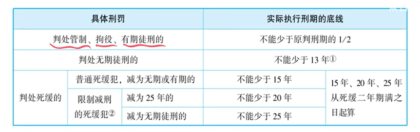
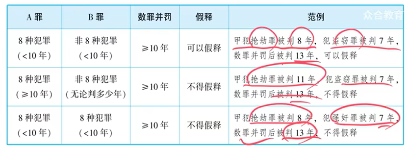
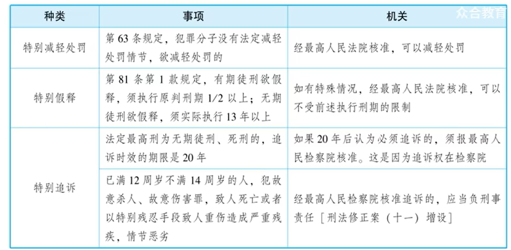

# 1、提纲整理（对照刑法条款）

> **使用说明**：以下提纲按讲稿中讲授的逻辑顺序编排，对照《刑法》相关条款，供非法律科班考生系统复习使用。

## （一）减刑

| 项目 | 内容 | 对应法条 |
|------|------|----------|
| **适用对象** | 被判处管制、拘役、有期徒刑、无期徒刑的犯罪分子 | 《刑法》第78条 |
| **条件** | 在执行期间认真遵守监规，接受教育改造，确有悔改表现，或者有立功表现（可以减刑）；有重大立功表现（应当减刑） | 《刑法》第78条 |
| **减刑限度** | 管制、拘役、有期徒刑：实际执行刑期**不少于原判刑期的二分之一** | 《刑法》第78条第2款第1项 |
| | 无期徒刑：实际执行刑期**不少于十三年** | 《刑法》第78条第2款第2项 |
| **减刑程序** | 一般减刑、假释：**中级人民法院**裁定 | 讲稿内容 |
| | 无期徒刑减刑、假释及死缓减为无期：**高级人民法院**裁定 | 讲稿内容 |

## （二）假释

### 1. 假释的概念

假释 = 凭借一定条件**提前释放**（假 = 凭借；释 = 释放）。注意与刑诉法中的“保释”（取保候审）区分。

### 2. 假释的条件

| 项目 | 内容 | 对应法条 |
|------|------|----------|
| **对象条件** | 被判处有期徒刑、无期徒刑的犯罪分子 | 《刑法》第81条 |
| **执行刑期条件** | 有期徒刑：执行原判刑期**二分之一以上** | 《刑法》第81条第1款 |
| | 无期徒刑：实际执行**十三年以上** | 《刑法》第81条第1款 |
| **实质条件** | 认真遵守监规，接受教育改造，确有悔改表现，**没有再犯罪的危险** | 《刑法》第81条第1款 |
| **社区影响** | 应当考虑假释后对所居住社区的影响 | 《刑法》第81条第3款 |

### 3. 不得假释的对象

| 类型 | 具体内容 |
|------|----------|
| **第一类** | **累犯**（同时总结：累犯 → 从重处罚 + 不得缓刑 + 不得假释） |
| **第二类** | 因**故意杀人、强奸、抢劫、绑架、放火、爆炸、投放危险物质、有组织的暴力性犯罪**被判处**十年以上有期徒刑、无期徒刑**的犯罪分子（“八加十”规则） |

> **【重要考点——数罪并罚与假释】** 判断能否假释时，看的是**每个罪名各自的宣告刑**是否达到十年以上，而非数罪并罚后的总和刑期。
>
> **例题1**：抢劫罪判8年 + 盗窃罪判7年，数罪并罚13年 → **可以假释**（抢劫罪只判8年，未达十年以上）
>
> **例题2**：抢劫罪判11年 + 盗窃罪判7年，数罪并罚13年 → **不得假释**（抢劫罪本身已达十年以上）
>
> **例题3**：抢劫罪判8年 + 强奸罪判7年，数罪并罚13年 → **不得假释**（两罪均为八种暴力犯罪之一，并罚后超过十年）

### 4. 假释的考验期

| 刑种 | 考验期 |
|------|--------|
| 有期徒刑 | **剩余没有执行的刑期** |
| 无期徒刑 | **十年** |

### 5. 假释的法律后果

| 类型 | 情形 | 后果 |
|------|------|------|
| **成功的假释** | 考验期内规规矩矩，平安度过 | **视为原判刑罚已经执行完毕** |
| **失败的假释** | 考验期内犯新罪 | 撤销假释，数罪并罚 |
| | 考验期内发现漏罪 | 撤销假释，数罪并罚 |
| | 考验期内违反监督管理规定 | 撤销假释，收监执行 |

### 6. 假释与缓刑的对比（重要）

| 对比项 | 缓刑 | 假释 |
|--------|------|------|
| **成功的后果** | 原判刑罚**不再执行** | **视为**原判刑罚**已经执行完毕** |
| **考验期内又犯新罪** | 撤销缓刑（不管何时发现） | 撤销假释（不管何时发现） |
| **考验期内发现漏罪** | 撤销缓刑 | 撤销假释 |
| **考验期满后发现漏罪** | **不撤销**（另行起诉） | **不撤销**（另行起诉） |
| **考验期满后又犯新罪** | **不撤销**（单独处理） | **不撤销**（单独处理） |

## （三）追诉时效

### 1. 追诉时效的概念

犯罪经过一定的期限，国家就不再追究行为人的刑事责任。

### 2. 追诉时效的期限

| 法定最高刑 | 追诉期限 |
|------------|----------|
| 不满五年有期徒刑 | **五年** |
| 五年以上不满十年有期徒刑 | **十年** |
| 十年以上有期徒刑 | **十五年** |
| 无期徒刑、死刑 | **二十年**（二十年后认为必须追诉的，须报请**最高人民检察院**核准） |

### 3. 追诉时效的计算

| 项目 | 规则 |
|------|------|
| **起算日** | **犯罪成立之日** |
| **故意犯罪** | 成立日（注意区分：着手日、既遂日≠起算日） |
| **过失犯罪** | 损害结果发生之日（犯罪成立之日） |
| **连续犯、继续犯** | **行为终了之日**起算（**2025年考点**：非法持有枪支罪、非法拘禁罪） |
| **截止日** | **审判之日**（审判时未超过追诉期限即可追诉） |

> **【例题4】** 狗蛋星期一寄毒酒杀小芳，星期三小芳收到，星期五小芳喝后死亡。故意杀人罪的追诉时效从**星期一**（犯罪成立之日）起算。

### 4. 追诉时效的延长

| 情形 | 法律依据 | 效果 |
|------|----------|------|
| 立案侦查/受理案件后，**逃避侦查或审判** | 《刑法》第88条第1款 | **不受追诉期限限制** |
| 被害人控告，应当立案而**不予立案** | 《刑法》第88条第2款 | **不受追诉期限限制** |

> **【例题5】** 狗蛋犯罪后不知自己被侦查，去外地打工 → **不构成**逃避侦查。若知道被侦查后伪装身份蒙混过关 → **构成**逃避侦查，追诉时效无限延长。

### 5. 追诉时效的中断

**规则**：在追诉期限以内又犯罪的，前罪的追诉期限从**犯后罪之日**起重新计算（中断并重新起算）。

> **【例题6】** 甲犯A罪（追诉时效15年），第8年又犯B罪 → A罪的追诉时效**重新起算**（已过的8年清零）。

**注意**：共同犯罪中各共犯人的追诉时效中断、延长**互不影响**，各算各的账。

**延长与中断并存时的处理**：**优先适用无限延长**，不再适用中断并重新起算。

> **【例题7】** 狗蛋犯盗窃罪后公安机关立案侦查，狗蛋逃避侦查（A罪追诉时效无限延长）→ 第二年又犯诈骗罪 → 盗窃罪的追诉时效**优先适用无限延长**，不适用中断并重新起算。

## （四）两高的特殊权利（填空型选择题高频考点）

| 特殊权利 | 含义 | 找谁核准 | 法律依据 |
|----------|------|----------|----------|
| **特别减轻处罚** | 无法定减轻情节，但因案件特殊情况需要在法定刑以下判处刑罚 | **最高人民法院** | 《刑法》第63条第2款 |
| **特别假释** | 未达到法定执行刑期要求，但因特殊情况需要提前假释 | **最高人民法院** | 《刑法》第81条第1款 |
| **特别追诉（20年后）** | 法定最高刑为无期、死刑的犯罪，20年后仍需追诉 | **最高人民检察院** | 《刑法》第87条 |
| **特别追诉（低龄犯罪）** | 12-14周岁的人犯故意杀人、故意伤害罪等，需要追究刑事责任 | **最高人民检察院** | 讲稿内容 |

**记忆口诀**：审判权找**最高法院**，追诉权找**最高检察院**。

# 2、2026年法考考点预测表

| 知识点 | 可能考试的方式 | 举例 | 是否主观题考点 |
|--------|----------------|------|----------------|
| **假释的禁止对象（八加十规则）** | 客观题案例判断，给一个数罪并罚的案例判断能否假释 | 甲抢劫判8年+强奸判7年并罚13年 → 不得假释（两罪均为八种罪之一，并罚超十年） | 否 |
| **假释考验期内发现漏罪/又犯新罪的处理** | 客观题判断撤销与否 | 考验期满后发现漏罪 → 不撤销假释，漏罪另行起诉 | **是**（案例分析可能涉及） |
| **假释与缓刑的对比** | 客观题对比型选择 | 成功的缓刑=不再执行；成功的假释=视为执行完毕 | 否 |
| **追诉时效的起算（犯罪成立之日）** | 客观题案例判断 | 隔离犯寄出毒物时犯罪成立，从寄出日起算 | 否 |
| **继续犯/连续犯的追诉时效起算（行为终了之日）** | 客观题案例判断（**2025年已考过非法持有枪支罪，2026年仍可能考**） | 非法拘禁他人，释放之日为起算日 | 否 |
| **追诉时效的延长（逃避侦查）** | 客观题案例判断“是否构成逃避侦查” | 不知自己被侦查而去外地打工 → 不构成逃避侦查 | **是**（案例分析可能涉及） |
| **追诉时效的中断（重新起算）** | 客观题计算型 | A罪追诉15年，第8年犯B罪 → A罪重新起算15年 | 否 |
| **两高特殊权利（填空型选择题）** | 客观题填空型选择 | 特别减轻处罚找（①最高法院）；特别追诉找（②最高检察院） | 否 |
| **数罪并罚与假释的综合判断** | 客观题/主观题案例分析 | 见上文例题1-3 | **是**（案例题中可能结合考查） |

> **【主观题特别提示】** 以下知识点在主观题中可能重点考查，需特别注意：
> 1. **假释的撤销条件**（考验期内犯新罪、发现漏罪、违反规定）——可能结合具体案例考查是否应当撤销假释
> 2. **追诉时效的延长**（逃避侦查的认定）——可能结合具体行为判断是否构成“逃避侦查”
> 3. **数罪并罚与假释资格**——可能结合具体罪名和宣告刑判断是否具备假释资格

# 3、讲稿切分与整理

## 第一段：引言——第十六讲开场

好，接下来就是第十六讲，刑罚的执行和消灭，这是我们整个刑罚总论的最后一讲。我们终于走到总论的最后一讲了。啊，有的同学说：“哎呀，关关难过，关关过。”啊，真的是这样。大家看那个小说《飘》啊，那个女主角斯嘉丽，她在那个困境中，她说什么话呢？北方佬休想征服我啊，我一定要闯过最后一关。啊，等这一切结束，我绝不再挨饿了，我也不让我的家人挨饿了。啊，不管怎么说，明天又是新的一天。我觉得这种女性啊，真的是那句话叫什么？柔弱胜刚强。她这种勇敢的乐观精神啊，值得我们学习。你说一只鸟，它坐在一个树枝上，它从不害怕树枝会断裂。那是因为他相信树枝很结实吗？不是的，他是相信他自己的翅膀，是吧？所以呢，我们还是要继续的展翅高飞，把这最后一关给过了。幸好这最后一讲相对来说比较简单。

**【整理说明】** 原文“展示高飞”疑似语音识别错误，根据语境修改为“展翅高飞”。

## 第二段：第一节 减刑——基本含义与底线

第一个呢是减刑，减刑这个大家都理解吗？就把刑罚往低的减吗？比如说有期徒刑，给你往低的减。那这一块呢，减减减，也有个底线吧。我们大概了解一下底线的问题。我们看书上的这个图表，就是说如果判的是管制、拘役、有期徒刑的话，再给你减刑。那你实际的执行刑期是有个底线的，是不能少于原判刑期的一半（二分之一）。比如说判十三年，那你至少得做六年半的牢，是吧？那如果判的是无期徒刑的话，至少要做十三年牢。他是这样的，他是这么一个说法。好了，这就是大概把这些数字了解一下就可以了。

## 第三段：减刑的程序

减刑还有一些程序啊，比如说一般的减刑、假释，找的都是中级人民法院做出裁定。如果是无期徒刑减刑、假释还有死缓减为无期徒刑的减刑，都是找高级人民法院，就已经和刑诉法已经很接近了，但这一块考的也比较少，了解一下。

## 第四段：第二节 假释——概念与混淆

接下来我们要说假释，第二节假释，假释考的相对来说就比较多了。那什么叫假释？许多人把假释和我们刑诉法说的那个保释容易混淆。刑诉法说的那个保释其实指的就是取保候审，是吧？那我们这个假释是啥意思呢？假就是假借凭借的意思，释就是释放啊。那“君子善假于物”，那个假就是凭借嘛。所以假释指的就是凭借一定条件提前释放，凭借一定条件提前释放。

> **【注释】** “保释”是刑诉法中的“取保候审”，与刑法中的“假释”是不同的概念。取保候审是刑事诉讼中的强制措施，假释是刑罚执行中的提前释放制度。

## 第五段：不得假释的两类人

那凭借哪些条件提前释放？哪些人不能提前释放？那我们就需要看一下了。首先不能给你提前释放的人，不能假释的人是两类人，我们书上给他画了两类人，大概得了解一下。

**第一类人是累犯。** 好在这有累犯，那你就要总结一下，一旦你是累犯的话，不但要给你从重处罚，而且有两个不得：一个是不得假释，还有一个是不得给你判缓刑——不得假释、不得缓刑。

**第二种人不得假释的人是什么呢？** 那就按书上说的，那就很长了，就是实施杀人、强奸、抢劫、绑架、放火、爆炸、投放危险物质，还有有组织的暴力性犯罪，等等等，然后说还要再加一个什么条件呢？被判十年以上有期徒刑。大概就是八种犯罪，再加一个十年有期徒刑，就是一个“八加十”。但这个大概呢，你就理解成是一些很严重的暴力性犯罪，然后还要再判十年以上有期徒刑的话，那这种人啊，我们不能给你假释，不能给你提前释放。

## 第六段：数罪并罚与假释的判断——例题

不过在这里面有一个数罪并罚的问题，考试考过一点，那我们要给他总结一下。我书上给他画了一个例子，我画了一个图表，我们一起来切换到书上，通过例子来看就可以了。

**【例题1】** 甲犯抢劫罪，判八年；犯盗窃罪，判七年。数罪并罚以后十三年，你说能不能假释呀？有的说，要抢劫罪是那个八种罪之一，然后又判了十三年，所以不能假释——错。我抢劫罪只判了八年哦，没到十年以上哦。那虽然数罪并罚到了十年以上了，但是那是借用的，是盗窃罪啊，盗窃罪又不是那个暴力性的八种罪之一啊，是吧？所以这个**可以假释**。

**【例题2】** 甲犯抢劫罪被判十一年，犯盗窃罪被判七年。这时候数罪并罚十三年，这个能不能假释？**不得假释**。这时候其实都不用考虑数罪并罚，光一个抢劫十一年，这就不能假释了，因为抢劫罪就是八种暴力犯罪之一，然后又被判十年以上有期徒刑，那就不得假释。

**【例题3】** 甲犯抢劫罪被判八年，犯强奸罪被判七年。数罪并罚判十三年，这能不能假释呢？**不得假释**。抢劫单说八年，还是可以假释；单说强奸七年，强奸是那个八种暴力性犯罪之一，但只是七年，单说的话也能假释。但两个罪并罚以后超过十年，那是不能给他假释的，因为他们两个都是八种罪之一。那八种罪之一，如果并罚以后超过十年，那是不能给他假释的，明白吧？就是这个条件。

## 第七段：假释的实质条件

好了，那能给你假释，能提前释放，要有个实质条件。这个实质条件关于这一块呢，有一些司法解释，我书上也列了一些要点，三个要点。但是呢，你一定要掌握背后的原理，你想一想，能给你提前释放有什么实质条件？那就是**确有悔改表现，不再有人身危险性、再犯可能性**。因为我就要把你提前释放，把你放出去啊，让你回归社会啊。你如果有人身危险性、再犯可能性，如果还死不悔改，那我敢把你放出去吗？那就不敢放出去，是吧？就是这样。

## 第八段：假释被撤销的案例——例题

你比如说有一个黑社会老大坐牢啊，判了八年，然后在里面表现还不错，然后呢就给他提前释放了。结果出监狱那天，好家伙，他底下的那些马仔呀，弄了十几辆加长林肯，铺着红地毯，就在那个监狱门口。每个人呢，那些手下穿着西装带着墨镜，然后在监狱门口夹道欢迎，还放鞭炮，还奏乐，还还给老大呢，把衣裳一换，然后让老大也是穿着西装带着墨镜披个大衣，然后再给他夹个雪茄，然后让他走红地毯。好家伙，那这个欢迎仪式搞得好像是重出江湖了，出山了，好像老大在里面闭关修炼了，太嚣张了，是吧？还喊“老大大哥辛苦了”，还这么干。那你说我们司法机关能受得了吗？再查查看有没有漏罪。好，一查有漏罪，一旦有漏罪，那么我们就要给你撤销假释，你还是回来吧，回来继续坐牢吧。

**【例题分析】** 此例说明：假释考验期内发现漏罪，应当撤销假释。

## 第九段：假释的执行刑期与考验期

接下来假释那就说到一个问题了。那我们书上给大家画了个图表，我们来看一下。就是假释是有条件的提前释放啊。那这时候呢，要求已经执行的刑期是多少啊，还要有一个假释的考验期是多少，我们来看一下。

**有期徒刑**：什么时候给你提前释放？要求已执行的刑期是原判刑期的二分之一才能给你假释。比如判你十年有期徒刑，那么要给你假释的话，你至少得坐五年牢，才可能给你提前释放。那提前释放以后，要给你一个假释考验期，那这个假释考验期多久呢？那就是剩余没有执行的刑期。那比如说你判了十年，你坐了七年牢，表现挺好，也没有再犯可能性、人身危险性了，那第七年把你提前释放了。那这个提前释放，接下来要给你有考验期，那考验期是什么呢？那就是剩余刑期，就是十年牢你坐了七年，还剩三年，那这考验期就是三年。

**无期徒刑**：那什么时候可以假释、可以提前释放？你至少得坐十三年牢才可以提前释放。所以无期徒刑大家注意啊，实务中真的不是说遥遥无期、牢底坐穿，不是那样的啊。一般来说，从我们法律规定上来说，执行十三年都可以给你提前释放。你看是十三年就能提前释放，好像也没那么长，好像也没那么可怕，是不是？好了，那考验期给你多少呢？考验期是十年。

## 第十段：假释的法律后果

那接下来我们就得说一下假释的法律后果了。

**成功的假释**：就是你在考验期内规规矩矩地平安度过，那么考验期满了就算成功的假释。成功的假释的后果是什么呢？那就视为原判刑罚已经执行完毕了。

**失败的假释**：就是你在假释考验期内有三种情形——第一个发现漏罪，第二个又犯新罪，第三个违反规定。那这时候要撤销假释，那撤销假释怎么办呢？那就是把剩余刑期再老老实实地回来再做一做。

> **【注释】** 失败的假释三种情形对应《刑法》第八十六条：犯新罪（第1款）、发现漏罪（第2款）、违反监督管理规定（第3款）。

## 第十一段：假释与缓刑的对比

最后我们要把假释和缓刑放在一起来进行一个对比。假释和缓刑有点相似，因为都有一个考验期。但如果都是考验期满了——成功的缓刑、成功的假释，这个效果不一样，后果不一样。**成功的缓刑**的效果是原判刑罚不再执行；**成功的假释**是视为原判刑罚执行完毕。一个是不再执行，一个是执行完毕，略有区别。

## 第十二段：失败的缓刑与假释——撤销规则

那接下来撤销不撤销这一块，就是成功的缓刑假释、失败的缓刑假释，这个发现漏罪什么的、又犯新罪这一块呢，有些情形需要我们注意。我们书上给他画了个图表，我们一起来看一下，把刚才那个失败的缓刑、假释我们给他挑出来。

**失败的缓刑、假释，一共有两种情形：**

**第一种**：在考验期内发现漏罪——那这时候我要撤销缓刑、撤销假释。

**第二种**：在考验期内又犯新罪——不管什么时候发现，不管是考验期内就发现，还是考验期满了发现，都要撤销缓刑、假释。

这都是失败的缓刑、假释，这都要撤销的。

**但是有两种情形是不能撤销的，视为成功的缓刑、成功的假释：**

**第一种**：是考验期满了以后才发现人家漏罪了——那人家考验期都满了，那这时候就视为成功的缓刑、成功的假释了，那这时候就不能给人再撤销了。那这个漏罪怎么办呢？漏罪就另行起诉就完了，只要没过追诉期，另行起诉。

**第二种**：又犯新罪，但人家是在缓刑、假释考验期满了以后又犯新罪——那人家还是我们说的，只要考验期满了，那人家就是一个成功的缓刑、成功的假释。那这时候此后人家再犯新罪，那是不能撤销人家那个缓刑、假释的，人家已经是成功缓刑、假释了。那又犯新罪怎么办？又犯新罪就单独处理就完了。

## 第十三段：琐碎知识点的学习建议

好了，这就是我们说的要不要撤销这一块容易记混的问题，我们通过这个图表先混个脸熟，然后到后面阶段我们再好好去记。哎呀说到这些很琐碎的这些知识点呀，杂七杂八很琐碎的需要记的知识点，这一块呢，我坦白的说，我觉得张宇琛老师总结的比较好，比我好。因为张宇琛老师这个女老师嘛，她那个心很细，娓娓道来，循循善诱，然后总结的一些很细致。这方面呢，所以你如果这个要记的这一块，如果你觉得好像头疼，那你可以再找张宇琛老师的一些课呀、资料呀，可以再补充补充。每个老师都有他的优点啊，希望大家也能够这样去相得益彰。好了，这是我们说的这个问题，那这个讲完以后我们整个假释的问题我们就总结完了。

## 第十四段：第三节 刑罚的消灭与追诉时效——基本概念

好，那接下来就是第三节，也是最后一节，刑罚的消灭和追诉时效。这里面考的主要是追诉时效。追诉时效就是什么呢，就是过了一定的追诉期限，你国家就不能再追究他了。

## 第十五段：追诉时效的期限

那这个追诉期限大概是什么呢？我们书上给他画了个图表就是什么呢：

- 如果**法定最高刑不满五年有期徒刑**的话，追诉期限就是**五年**；
- 如果**法定最高刑为五年以上不满十年有期徒刑**的话，追诉期限是**十年**；
- 如果**法定最高刑为十年以上有期徒刑**的话，追诉期限就是**十五年**；
- 如果**法定最高刑为无期徒刑、死刑**的话，那么追诉期限是**二十年**。

## 第十六段：追诉时效的立法理由——超出主题范畴的说明

> **【注释】** 以下内容属于讲授者引入的关于追诉时效制度法理基础的讲解，超出了“刑罚的执行和消灭”这一主题的纯法条范畴，但有助于理解该制度的精神，故以注释形式保留。

那有些同学可能就会问啊，那国家为什么要规定一个追诉期限捆住自己的手脚，然后期限一到就不能再追究了，为什么这样便宜这个犯罪人呢？为什么过了一定期限他犯的这个罪行我们就不能追究了呢？哎，这里面简单讲主要是相信时间的力量。也就说时间呀它是最好的和事佬了，有些曾经你以为你挥之不去的事情，其实随着时间的流逝，你可能就想不起他了，你不知不觉的就把他给遗忘了。时间真的有时候可以湮灭一切。你今天可能觉得是天大的事儿，过上个五年八年，那这个慢慢你也就想不起他了。走出失恋的最好的状态不是你还记恨他，是你想不起他。所以呢，立法者相信时间的力量，所以他就觉得仇恨不能一直在仇恨的状态下去度过，而要有一个休止符，要有一个止损点，所以规定了一个追诉期限。

> **【注释】** 关于追诉时效的正当性根据，理论上存在多种学说，包括准受刑说、改善推测说、证据湮灭说、规范感情缓和说、尊重事实状态说等。

## 第十七段：特别追诉制度

但是有些仇恨特别大、罪恶特别大，那过了期限我们也追究，这就是**特别追诉制度**。但是他只是针对犯了无期徒刑、死刑的这种罪，那这个追诉期限是二十年，但如果二十年过了，但是司法机关觉得还是得追究，那这时候启动特别追诉制度，那找谁呢？找**最高人民检察院**进行核准，那还是可以追究的。

那比如说以前啊，二十年前，南京医科大学有一个奸杀案，那个女生被奸杀了，那真凶当时一直没找到，那就过了二十年以后，通过DNA技术才把他找到了。那找到以后这已经过了二十年了，因为这家伙罪行太大了，那这时候呢找最高检，然后呢申请核准，那还是能够追诉的。

但是大家注意啊，这只是针对那种罪行最严重的、要判无期徒刑死刑的，针对这个追诉时效二十年这个档次才有这么一个特别追诉制度。如果不是这个最严重这个档次，如果追诉时效是五年、十年、十五年这个，那过了就永远过了，覆水难收，再也没有机会追究了。法律就是这样规定的。

## 第十八段：追诉时效的计算——起算日

接下来大家还要注意追诉时效的这个计算问题。就是比如说那个十年追诉期限是十年，那这十年什么时候起算？起算日是什么时候，截止日是什么时候？这时候呢我们书上给大家画了个图表，我们一起来看一下。

**起算日是犯罪成立之日。**

那我们在这里面要注意，犯罪有故意犯罪、过失犯罪。

**故意犯罪**：一般来说什么时候成立？你实施一个行为产生危险，你犯罪就成立了，造成损害结果是既遂。但是我们起算日是成立之日，一定要注意这一点哦，不要混淆哦。

**【例题4】** 考验大家一下啊，狗蛋要杀小芳，给小芳寄毒酒，隔离犯嘛。星期一寄出，星期三小芳收到，星期五小芳一喝死了。那么狗蛋这个故意杀人罪肯定是追诉期限是二十年了。那这二十年的起算日是哪一天？是星期一寄出，还是星期三小芳收到，还是星期五小芳死掉？——正确答案是**星期一**。因为狗蛋的故意杀人罪什么时候就成立了？星期一寄出毒酒的时候，犯罪就成立了。起算日是犯罪成立之日。星期三那叫着手，那叫犯罪着手，着手是进入实行阶段。星期五是犯罪既遂日。所以一定要注意啊，就故意犯罪来说，成立日、着手日、既遂日，而我们的起算日是成立之日。

**过失犯罪**：过失犯罪我们知道他只有成立不成立，而过失犯罪的成立要求以造成损害结果为前提。所以过失犯罪是要造成损害结果，比如过失致人死亡罪，那这个罪是要以死亡那天，有死亡结果那天才成立，那天死亡了，那天成立了，那天开始起算，这个是比较简单的。

## 第十九段：追诉时效的计算——连续犯、继续犯（2025年考点）

不过这里面还有一些例外，我们要注意就是什么**连续犯、继续犯**，这时候是以**行为终了之日**起起算。

**2025年就把这个考了**，考了一个非法持有枪支罪。比如说你狗蛋在家里面放了几把AK47，你非法持有枪支，你从星期一就开始放，然后到了星期六你觉得还是不行，还得上交，你上交了，那么我们的起算日是什么时候呢？是你星期六行为终了之日，就是上交那天，行为终了那天才开始起算你的追诉时效。

继续犯还有哪些呢？我们说过还有**非法拘禁罪**。比如说你狗蛋星期一把人小王给拘禁了，你到星期六把人释放了，那哪天开始起算非法拘禁罪的追诉时效呢？那是星期六释放那天，行为终了那天。

## 第二十段：追诉时效的计算——截止日

**截止日**是什么时候呢？就是**审判之日**。就是说比如说追诉期限是十年，那这十年什么时候算是到了十年呢？就是按审判那天算，审判那天只要没超十年，那就能够追诉。

## 第二十一段：追诉时效的延长（第八十八条）

接下来呢，还有追诉时效的延长，主要是第八十八条第一款和第二款。

**第八十八条第一款**：就是说在公检法都已经立案侦查了，如果你逃避侦查，那么这时候不受追诉期限的限制。逃避侦查。

大家注意那个逃避侦查，那要求的是什么呢？就是第一，他知道自己现在被追查、被侦查呢；然后呢，他逃避侦查。而且这个逃避侦查要求给司法机关的侦查活动设立了实质的障碍，那叫逃避侦查。

**【例题5】** 你比如说狗蛋犯了罪以后，公安机关就开始立案侦查了，但是狗蛋不知道自己这个行为已经犯了罪，他去外地去打工去了。那你说他去外地打工这个事儿算不算逃避侦查呢？那不算啊，这个不算。那如果他知道自己犯了罪，也知道公安机关已经立案侦查了，他开始想逃往外地，他在高速公路收费站那一块呢，他就假装身份，然后蒙混过关，人家在那排查呢，那这时候就属于逃避侦查了，那追诉时效就无限延长了。

**第八十八条第二款**：就是被害人已经控告了，结果呢公检法应当立案不予立案——就是你公检法司法机关不作为，那这时候呢，不受追诉期限的限制。

## 第二十二段：追诉时效的中断（第八十九条）

接下来还有追诉期限的中断。这个“追诉期限的中断”这个词语很具有迷惑性，其实应当把它完整地叫“中断并重新起算”，这个可能更好一点。

**【例题6】** 我们举个例子，大家一般来说就明白了。比如说甲犯了一个A罪，追诉期限是十五年，他犯了A罪，追诉期限是十五年，结果到了第八年他又犯了一个B罪。那这时候会产生一个什么效果？到第八年他犯那个B罪，那的效果就是你A罪经过的这八年的期限清零作废，然后你A罪的十五年的追诉期限**重新起算**。所以追诉时效的中断，完整的叫追诉时效的中断并重新起算。

**各算各的账**：共同犯罪里面有好几个犯罪人，那他们追诉时效的中断呀、延长呀都是互不干扰。

## 第二十三段：追诉时效延长与中断的并存

追诉时效有时候呢中断和延长可以并存，经常可以并存。有同学说：“哎，怎么可以并存呢？”哎，举个例子你就明白了。

**【例题7】** 比如说狗蛋，他先犯了一个盗窃罪，犯了个盗窃罪以后公安机关已经立案侦查了，他竟然逃避侦查。那这个逃避侦查的话，那这时候追诉时效呢，就无限延长了嘛，是吧？但是呢，他接下来第二年呢，他又犯了一个诈骗罪。那又犯了一个诈骗罪，等于说你又犯了一个新罪，是吧？那这时候你其实又是一个中断，中断并重新起算。但是我们说这就叫追诉时效的中断并重新起算，但是前面又有追诉时效的无限延长。那这时候怎么办呢？到底适用无限延长的这个规定，还是适用中断并重新起算的规定呢？我们就要适用**无限延长**这个规定，应当无限延长了，就不需要再弄那个什么中断并重新起算了。所以他这时候再犯一个新罪的话，那个追诉时效前面的那个盗窃罪的追诉时效，并不需要中断并重新起算了，就**优先适用无限延长**就可以了。

## 第二十四段：两高的特殊权利——图表总结（重点）

最后最后，我们要给大家总结一个图表，就是“两高的特殊权利”，那是我们书上给大家画的。这个相对来说还是比较重要的，我们要来给他整理一下。我们切换到书上，我们来看这个图表。

**第一个叫特别减轻处罚。** 啥叫特别减轻处罚呢？首先减轻处罚指的是啥？我们说了，就是下一个台阶是吧？从轻处罚是在那个幅度内给你找一个轻的，减轻处罚就下一个台阶了，下一个刑格了。由于给你下一个台阶，那从宽的力度很大，所以只能有法定减轻处罚情节的话，你法官才有权利减轻处罚。你基层法官没有权利，就是普通法官你没有权利酌定减轻处罚，你只能法定减轻处罚。但是呢，如果法官真的想酌定减轻处罚，他觉得很有必要，怎么办？找**最高法院**。

> **【注释】** 特别减轻处罚的法律依据是《刑法》第六十三条第二款：“犯罪分子虽然不具有本法规定的减轻处罚情节，但是根据案件的特殊情况，经最高人民法院核准，也可以在法定刑以下判处刑罚。”

**第二个叫特别假释。** 特别假释啥意思呢？就是我们前面说了，假释是要求凭借一定的条件提前释放。那这个提前释放的话，我们说你得先把牢坐上一段时间，比如说有期徒刑，你得坐上二分之一的牢。但是呢，现在出现一种情况，怎么办？比如说有一个科学家，他因为贪污什么经费，然后判了十五年有期徒刑，判了十五年有期徒刑，那要给他假释的话，提前释放的话，那他得坐一半的牢呀，那他得坐七年半呀，才可能提前释放。那他现在刚坐了三年牢，结果呢，比如说中美贸易战、科技战给打起来了，那人家制裁我们国家的芯片了，那如果这个科学家他又是芯片方面的一个顶级专家，得把他假释出山，在牢里面坐牢太浪费人才了。那这时候呢，想赶紧假释，但是问题是，他还没坐一半的牢呢，只坐了三年，那这时候怎么办？那这时候很想让他出来，很想给他假释，那要特别假释，那找谁？也是找**最高法院**。

> **【注释】** 特别假释的法律依据是《刑法》第八十一条第一款：“如果有特殊情况，经最高人民法院核准，可以不受上述执行刑期的限制。”

**第三个就叫特别追诉。** 特别追诉呢，有两个特别追诉：一个就是法定最高刑是无期徒刑、死刑的追诉时效是二十年，如果二十年过了以后，还认为还是要追诉的，找**最高检察院**。还有一个就是我们说的十二到十四岁的人杀人、伤害呀，这些人呢，如果要追究刑事责任的话，也要找谁？找**最高检察院**。

大家给我想一想，为什么特别追诉要找最高检察院？因为追诉权就是检察院的权力啊。而特别减轻处罚和特别假释为什么找的是最高法院呢？因为这都是审判权的一个部分。所以呢，这里面一定要把找谁一定要搞清楚。

如果考的话，就有可能给你考一个**填空型选择题**。大家知道什么叫填空型选择题吗？就是给你那个题干里面弄几个空，空上答一个圈一、圈二，然后ABCD四个选项里面说圈一应当填的是什么，圈二应当填的是什么。这种题我们刑法也考过客观题。那像这种呢就容易考，所以把这一块还要记清楚。

## 第二十五段：结语——总论结束

好，我们这个图表我们讲完了以后，那我们整个这一讲——刑罚的执行和消灭——我们就讲完了。那整个刑法总论我们也就完了。有些同学说呀，我复习了这么多天才弄完一个总论，哎呀还是有点着急。哎呀，不要着急啊。你看有一个作家黑塞，他以前有重度的抑郁症，但是后来人家通过研究佛学，最后人家还写了一本书，最后获得诺贝尔文学奖呢。他那本书就叫《悉达多》。那里面有一句话很有名的，就是所谓自我，就是过去一切经历的总和。你读过的书呀、走过的路呀、接触过的人呀，就塑造了现在的你。所以你所做的事情不是在开创某个未来，而是在成就此刻的自己。所以呢，如果命运是一条河流，谁是你的摆渡人，只能是你自己。所以我觉得重要的不是说你这个摆渡船要走得多快。那有时候快的话，那风高浪急呀。我觉得最重要的是找到自己的节奏，不徐不急。然后呢，快有时候是慢，慢有时候是快。根据自己的节奏，有条不紊地往前推进。这时候你并不需要慌，咱只要有效率就可以。好了，那我们整个总论我们就到此结束。接下来我们就展开分论的学习。

