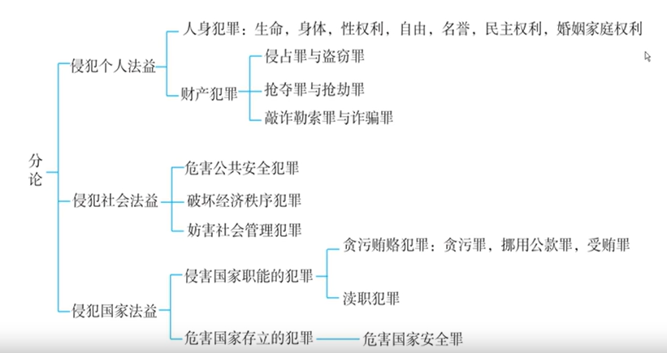

### 1：法考备考提纲（非科班友好版）

以下提纲基于上述讲稿内容，对照**刑法分则**的结构提取，面向非法本备考者。**注意**：本人未自造法律名词，不确定处已标注，超出主题的内容以注释形式包含。

---

#### 一、刑法分则复习总纲

| 维度 | 内容要点 |
| :--- | :--- |
| **核心策略** | **抓大放小**：分罪名级别投放精力，不求体系全覆盖。 |
| **罪名分级（按分值）** | **一线（占50%分值）**：财产犯罪、人身犯罪、贪污贿赂犯罪（共40+罪名）。 **二线**：经济犯罪、妨害社会管理犯罪、危害公共安全犯罪、渎职犯罪。 **三线（不重点复习）**：危害国家安全犯罪。 |
| **复习顺序** | 个人法益（人身→财产）→ 社会法益 → 国家法益。 |
| **分则与总则区别** | 总则重体系，分则重颗粒状、散状知识点。分则理解难度低，但记忆负担重。 |

---

#### 二、特殊罪名与罪状

| 类别 | 名称 | 核心解释 | 举例 |
| :--- | :--- | :--- | :--- |
| **选择性罪名** | 可拆分、可合并的罪名（顿号连接） | 动词顿号（行为方式）或名词顿号（行为对象）均可。多个行为/对象，原则上只定一个完整罪名，**不并罚**。 | 拐卖妇女、儿童罪；引诱、容留、介绍卖淫罪。 |
| **选择性罪名（认识错误）** | 对象认识错误时的处理 | **看客观，按客观对象定罪**。只定一个罪（既遂），不定未遂+既遂并罚。 | 想拐妇女，实际拐了男童→定拐卖儿童罪既遂。 |
| **空白罪状** | 罪状需援引其他法律（前置行政法）才能完整 | 条文本身只写“违反XX法规定”，具体内容留白。 | 滥伐林木罪（需查《森林法》）。 |
| **注意规定** | 重复强调，正常办事 | 删掉该条，结论不变。 | 携带挪用公款潜逃→定贪污罪（即使无此规定，也应定贪污）。 |
| **法律拟制** | 特事特办 | 将本不符合A罪构成的行为，**法律强行规定**按A罪处理。需要专门记忆。 | 盗窃后为抗拒抓捕当场使用暴力（转化抢劫）→ 定抢劫罪（而非盗窃+故意伤害并罚）。 |

> **【注释】** 讲稿中提到“叙明罪状”“简单罪状”“引证罪状”，但未详细展开，仅提及名称，故本提纲未列为重点。如需了解，可咨询讲师或查阅教材。

---

#### 三、例题汇总（根据讲稿整理）

| 例题编号 | 案情简述 | 考点 | 正确答案 |
| :--- | :--- | :--- | :--- |
| 例1 | 拐卖妇女和儿童各一名 | 选择性罪名（名词顿号） | 拐卖妇女、儿童罪（一罪）。 |
| 例2 | 引诱、容留、介绍同一个人卖淫 | 选择性罪名（动词顿号） | 引诱、容留、介绍卖淫罪（一罪）。 |
| 例3 | 引诱A卖淫、容留B卖淫、介绍C卖淫（均满14岁） | 选择性罪名（动词+多个对象） | 引诱、容留、介绍卖淫罪（一罪）。 |
| 例4 | 引诱幼女（13岁）卖淫 + 容留/介绍已满14岁女性卖淫 | 独立罪名 + 选择性罪名合并 | 引诱幼女卖淫罪 + 容留、介绍卖淫罪（**两罪并罚**）。 |
| 例5 | 想拐卖妇女，实际拐卖了男童 | 选择性罪名 + 对象认识错误 | 拐卖儿童罪既遂（一罪）。 |
| 例6 | 盗窃后，为抗拒抓捕将失主打成重伤 | 法律拟制（转化抢劫） | 抢劫罪（一罪）。 |

---

#### 四、2026年法考刑法分则考点预测与备考建议

> **【说明】** 以下内容基于讲稿中讲授者对历年考试规律的分析，结合当前刑法理论与实务动态（2025-2026年）进行合理推测，供备考参考。

| 知识点 | 可能考试的方式 | 举例 | 主观题考点 |
| :--- | :--- | :--- | :--- |
| **选择性罪名的认定与适用** | 客观题（单选/多选），结合具体案情判断罪名个数及是否并罚。 | 行为人对同一对象实施引诱、容留、介绍卖淫的，如何定罪？对多个对象分别实施不同行为的，如何定罪？ | **是**（案例分析中需准确书写罪名，判断罪数） |
| **选择性罪名中的认识错误** | 客观题，考察“主客观相统一”原则在选择性罪名中的具体适用。 | 甲欲拐卖妇女乙，实则拐卖了男童丙。甲构成何罪？ | 否 |
| **引诱幼女卖淫罪与引诱、容留、介绍卖淫罪的关系** | 客观题，考察特殊罪名与普通罪名的区分，以及罪数处理。 | 行为人引诱幼女卖淫，同时容留、介绍已满14周岁女性卖淫的，如何定罪？ | **是**（法考主观题刑法科目常考罪名辨析与罪数） |
| **空白罪状的识别** | 客观题，给出具体条文，判断属于何种罪状。 | 下列哪个选项属于空白罪状？ | 否 |
| **法律拟制（尤其是转化抢劫）** | 客观题/主观题，考察转化抢劫的构成要件（前提行为、目的、暴力当场性等）。 | 甲抢夺乙财物后，为窝藏赃物而当场使用暴力，是否构成抢劫罪？ | **是**（转化型抢劫是主观题高频考点，需掌握“事后抢劫”的认定） |
| **注意规定与法律拟制的区分** | 客观题，判断某一司法解释或条文属于注意规定还是法律拟制。 | “携带挪用的公款潜逃的，以贪污罪定罪处罚”属于何种规定？ | 否 |

**特别提示（2026年备考）：**
1.  **选择性罪名**是每年必考的基础点，务必熟练掌握“动词顿号”与“名词顿号”的不同处理规则，尤其是结合“幼女”等特殊对象的综合考查。
2.  **法律拟制（转化抢劫）** 是主观题刑法科目的“常客”，不仅要知道结论，更要会分析“为何转化”以及“何种情况下不转化”（例如，已满14不满16周岁的人在盗窃、诈骗、抢夺中为抗拒抓捕使用暴力致人重伤的，如何定性？——此为需特别关注的理论争议点）。
3.  讲稿中提到“分则理解难度低，但记忆负担重”，建议考生在2026年备考中，对上述“一线罪名”的构成要件进行“类型化记忆”（如：财产犯罪中的“占有”认定、人身犯罪中的“伤害”与“杀害”的区别等）。【注：本段建议系根据讲稿内容引申，非原文】。

---

### 2：讲稿切分与整理（逻辑分段与文字修正）

以下是根据逻辑顺序重新切分、修正和整理的讲稿内容。**修正之处**已用`【修改】`标注，原文内容尽量保留，段落间逻辑承接关系已理顺。

---

#### 【第一部分：分则复习方法论总论——从总则到分则的思维转换】

好，从今天开始，我们就进入分则的学习。总则我们学习完了，还没有真正的分别，就开始想念，想念大家有没有休息好，有没有在总论复习完以后来一个短暂的休整。我们接下来呢，要投入新的战斗。

那分则的复习方法论和总论就有点不一样了，得提醒大家。最大的区别就在于，总则的复习体系性特别强，比如犯罪的成立，你就按照犯罪的成立要件，一个要件一个要件地往过去复习；成立之后有三大问题，时间上的问题、空间上的问题、数量上的问题，我们就一个一个复习。但到了分则，我们复习面对的内容只是罪名，四百多个罪名，那它都是颗粒状的东西，没有什么体系，都是分散的颗粒状知识点，所以显得很杂乱。许多同学觉得分则复习很头疼，的确是这样，你的感受是真实的。

但是，在这种分散杂乱的知识点中，我们也有应对策略。分则虽然体系性不强，但难度也降低了，理解性的东西比总论要少得多，缺点就在于杂乱。

我们的应对方法：
**第一，抓大放小。** 四百多个罪名，我们不能平均分配精力，不能胡子眉毛一把抓。我们要给罪名分级别：一线罪名、二线罪名、三线罪名，把精力精确投放。
**第二，只抓常考点。** 分则罪名的复习，不求体系性，只抓常考的那个点，那个点往往是在构成要件里面，而且只抓常考的那个点就可以了。
**第三，记住常考陷阱。** 比如一些特殊点、例外情况，通过这个方式去复习。

相信大家把分则就能够拿下。

---

#### 【第二部分：罪名分级体系与分值分布（抓大放小的具体操作）】

我们接下来对分则的罪名，按照一线、二线罪名来分类。切换到咱们的书上【修改：原文为“切换到咱们书上”】，在分则目录前面有一个体系图。分则四百多个罪名，根据侵犯的法益分为三大类：侵犯个人法益的犯罪、侵犯社会法益的犯罪、侵犯国家法益的犯罪。我们的复习顺序是：个人→社会→国家【修改：原文为“个人、社会、国家”】，因为大致的重要性也是这个顺序。

如果按分值来分类，具体地位如下【修改：原文表述重复且逻辑不清，整合如下】：
- **一哥（考得最多）**：财产犯罪，内有七大罪名。
- **二哥**：人身犯罪。
- **三哥**：贪污贿赂犯罪。
- **四哥**：经济犯罪。
- **五哥**：妨害社会管理犯罪【修改：原文为“防和社会管理犯罪”】。
- **六哥**：危害公共安全犯罪【修改：原文为“危害公安犯罪”】。
- **七哥**：渎职犯罪。
- **老八**：危害国家安全犯罪（平时不用复习，考得非常少，考前提醒重点即可，不做常规复习）。

平时常规复习前七章。其中，**财产犯罪、人身犯罪、贪污贿赂犯罪**这三章，罪名数量只有四十多个，但分值占整个分则的一半（50%）。所以这三章是重中之重，要详详细细、毫无遗漏地拿下。

在此基础上，再复习其他四章（经济犯罪、妨害社会管理犯罪、危害公共安全犯罪、渎职犯罪）。那四章罪名虽多，但分值加起来才占一半。复习时也是抓大放小，有些小罪名真的可以不复习。把前三章四十多个罪名复习好，再加上其他章节的几个重点罪名，总共五六十个罪名，就能覆盖分则知识点的70%。100分的卷子拿70分就够了，目标定在70多分，遇到冷僻罪名，大家都不会，赋分后对你没啥影响。

所以，**抓大放小是基本法**。到时候许多同学会说：“老师，我发现你分则讲的没有总则好，没体系，跳来跳去。”这没办法，四百多个罪名，必须跳跃式讲解。除了财产犯罪几乎是一页一页讲，其他必须跳跃，否则课时太长，对其他部门法复习也不利。大家不要嫌跳跃，要先把书看一遍，讲到哪能找到位置。

这就是分则复习的基本策略。

---

#### 【第三部分：分则特殊条文——选择性罪名（核心考点）】

接下来我们看第十七讲，分则概述，讲一些特殊条文：罪状、罪名。最重要的是**选择性罪名**，考试喜欢考。

**定义**：罪名里有顿号。罪名基本是动宾结构（动词+名词）。顿号要么打在动词上（多个行为方式），要么打在名词上（多个行为对象）。

**特点**：可以分拆使用，也可以整体使用。

**例题1（名词顿号型）**：
拐卖妇女、儿童罪。
- 光拐卖妇女→拐卖妇女罪。
- 光拐卖儿童→拐卖儿童罪。
- 两个都拐卖了→不定两个罪并罚，只定一个**拐卖妇女儿童罪**（完整罪名）。

**例题2（动词顿号型——引诱、容留、介绍卖淫罪）**：
狗蛋引诱小芳卖淫，又容留小芳在其房中卖淫，又为小芳介绍客源。
→ 不定三个罪并罚，只定一个**引诱、容留、介绍卖淫罪**。

**例题3（动词+多个对象，难度升级）**：
狗蛋引诱大女儿卖淫，容留二女儿卖淫，介绍三女儿卖淫（三人都已满14周岁）。
问：定几个罪？
【常见错误】定三个罪并罚。
【正确答案】依然只定一个**引诱、容留、介绍卖淫罪**。结论：**即使动词有多个，对象也有多个，仍然只定一个完整罪名，不需要数罪并罚。**

**例题4（结合特殊对象的罪名——终极考点）**：
狗蛋**引诱**孙女儿（**13岁，幼女**）卖淫，**容留**二女儿（已满14周岁）卖淫，**介绍**三女儿（已满14周岁）卖淫。
问：怎么办？
【分析】引诱幼女卖淫，有一个独立罪名——**引诱幼女卖淫罪**。这个罪名与引诱、容留、介绍卖淫罪是不同罪名。
【正确答案】应当定：**引诱幼女卖淫罪** + **容留、介绍卖淫罪**（二罪并罚）。
【考点提示】这是考过的，有一定难度。

**例题5（对象认识错误与选择性罪名）**：
狗蛋以为眼前是个妇女（主观想拐卖妇女），实际上是个男童（客观是儿童）。
问：怎么定？
【正确答案】看客观，按客观对象定罪。定**拐卖儿童罪既遂**。
【常见错误】定拐卖妇女罪未遂 + 拐卖儿童罪既遂，然后并罚。
【结论】只定一个**拐卖儿童罪既遂**。

---

#### 【第四部分：分则特殊条文——罪状类型（空白罪状）】

罪状类型：简单罪状、叙明罪状【修改：原文为“序名罪状”】、引证罪状、空白罪状。考试考过**空白罪状**。

**定义**：条文规定违反某种前置法（如行政法）构成犯罪，但具体规定在罪状中没有描述出来，需要援引其他法律。
**举例**：滥伐林木罪。条文写“违反森林法的规定，滥伐林木……”，但具体违反森林法哪一条、什么行为，条文本身没有说，需要去查《森林法》。这种罪状就叫空白罪状。

---

#### 【第五部分：分则特殊条文——注意规定与法律拟制（核心难点）】

**一、注意规定**
- **含义**：正常办事，重复强调，提醒注意。删掉该规定，也要这么办。
- **举例**：司法解释规定“官员携带挪用的公款潜逃的，定贪污罪”。因为携带潜逃说明有非法占有目的，不想归还，本来就应该定贪污罪。删掉这条规定，依然定贪污罪。
- **判断标准**：删掉它，看能否正常这么办。能，就是注意规定。

**二、法律拟制【修改：原文个别处为“法律一致性质条文”，统一改为“法律拟制”】**
- **含义**：特事特办。把一个本不能定A罪的情形，立法者规定定A罪。
- **举例（事后转化抢劫，考得最多）**：
  狗蛋偷窃小芳手机（盗窃罪），被发现后逃跑，小芳追赶。狗蛋为了窝藏赃物、抗拒抓捕，三拳两脚把小芳打成重伤。
  【正常处理】盗窃罪 + 故意伤害罪 → 两罪并罚。
  【法律拟制（特事特办）】不定两罪并罚，**定抢劫罪**（按抢劫罪论处）。这就是**事后转化抢劫**，也叫法律拟制来的抢劫。
- **生活中的拟制思维（帮助理解）**：狗蛋追不到小芳，小芳嫁给了铁牛。狗蛋骂：“好白菜被猪拱了。”铁牛明明是牛，被拟制为猪。这就是拟制思维。民法里也有，会说“视为什么什么”。
- **注意事项**：刑法里没有说“视为”，需要辨认。书上已经给大家把常考的法律拟制条款总结好了，后面遇到具体罪名再专门讲。

---

#### 【第六部分：复习顺序预告】

讲完特殊罪名、特殊条文后，分则复习的方法论就讲完了。接下来展开分则复习，顺序是：先侵犯个人法益的犯罪（先人身犯罪，后财产犯罪），再侵犯社会法益的犯罪，最后侵犯国家法益的犯罪。下一讲我们看人身犯罪。

---

