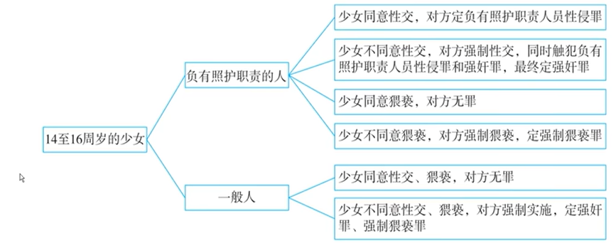
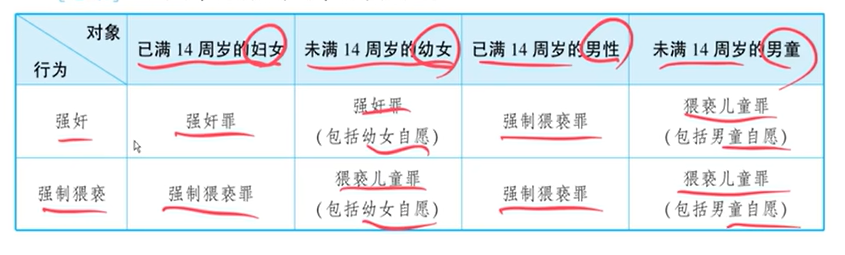

### 1：法考备考提纲与重点梳理

以下提纲根据上述讲稿内容，结合《中华人民共和国刑法》相关条文整理，专为非法律科班人士备考设计。

#### 侵犯性权利的犯罪 备考提纲

##### 一、 核心法条概览

1.  **强奸罪**：《刑法》第236条
2.  **负有照顾职责人员性侵罪**：《刑法》第236条之一（《刑法修正案（十一）》新增）
3.  **强制猥亵、侮辱罪**：《刑法》第237条第1款
4.  **猥亵儿童罪**：《刑法》第237条第3款

##### 二、 各罪详细拆解

**【罪一】强奸罪**
*   **保护法益**：妇女（女童）的性自主权（需扩大理解，卖淫女也有此权利）。
*   **行为方式**：必须具有“强制性”。
    1.  **暴力**：简单了解。
    2.  **胁迫（核心考点）**：模型是“以恶害相通告”。注意区分“胁迫”（让对方恐惧）和“利诱”（让对方心动）。注意胁迫对象必须是被害人或其亲友，“自杀”相逼不属于这里的胁迫。
    3.  **其他手段**：必须达到“足以压制反抗”的程度。重点是“昏醉强奸”和“欺骗型强奸”。
        *   **昏醉强奸**：利用被害人醉酒、昏迷等不知反抗状态发生关系，构成强奸。被害人自行喝醉，行为人趁机性侵，也构成强奸。
        *   **欺骗型强奸（难点）**：关键在于被害人是否“事实认识错误”。
            *   **事实错误（构成）**：认错了人（如误以为是男友）。
            *   **动机错误（不构成）**：被骗“会结婚”、“给钱”等，但知道对方是谁、在做什么。此为“渣男”不构成强奸罪的原理。
*   **加重情节（十年以上至死刑）**：
    1.  **公共场所当众**：注意“公共场所”与“私密空间”的转换（试衣间、火车厕所不算）；“当众”包括“听得见”，但需被害人知情，法益侵害增加。
    2.  **二人以上轮奸**：注意“轮奸未遂”的认定（基本犯既遂，加重犯未遂）。
    3.  奸淫不满十周岁幼女或造成幼女伤害。
    4.  **致人重伤、死亡（结果加重犯）**。

**【罪二】负有照顾职责人员性侵罪**
*   **一句话记忆**：**对特定少女（14-16岁）的“潜规则”定罪**。
*   **身份**：负有“照顾职责”（如养父、班主任，不包含课外辅导老师）。
*   **对象**：已满14，不满16周岁少女。
*   **行为**：只限性交，不含猥亵。
*   **核心**：**即使少女同意，也犯罪**（承诺无效）。

**【罪三】强制猥亵、侮辱罪**
*   **保护法益**：性羞耻心。
*   **对象**：已满14周岁的男性和女性。
*   **行为**：
    1.  **猥亵**：侵犯性羞耻心的一切行为。**不要求身体接触**（强迫自摸、强迫观看都算）。 **`【注】法考与法硕观点存在差异，法考采用此观点，而法硕传统观点可能认为“强制猥亵”要求身体接触，备考时需注意区分。`**
    2.  **侮辱**：在此罪中，和“猥亵”同义。
*   **与强奸罪关系**：程度关系（强奸罪=强制猥亵+性交）。

**【罪四】猥亵儿童罪**
*   **对象**：不满14周岁的儿童（男女都算）。
*   **核心**：**即使儿童自愿，也犯罪**（承诺无效）。
*   **强奸男童**：因强奸罪对象限女性，所以强奸男童只能定猥亵儿童罪。

### 附：2026年法考高频考点与考查方式预测

根据讲稿内容和近年出题趋势，整理如下。**表格中“※”标示的内容，属于可能考查主观题的重要考点。**

| 知识点 | 可能考试的方式 | 举例（基于讲稿） | 主观题提示 |
| :--- | :--- | :--- | :--- |
| **1. 胁迫型犯罪的模型判断** | **客观题/主观题案例分析**。给出一个“谈条件”的情景，判断是否属于刑法上的“胁迫”。 | **例题2、3**（导师威胁刷人、男同事用裸照威胁）。 | ※ **核心考点**。**答题模板**：需严格论证“恶害相通告→产生恐惧→基于恐惧答应”。凡“利诱”、“对己恶害”均不构成。 |
| **2. 欺骗型强奸的认定** | **客观题/主观题案例分析**。判断被害人的“同意”是否有效。 | **例题4**（冒充男友vs. 骗婚骗感情）。 | ※ **关键区分点**。**答题模板**：先判断是“事实认识错误”还是“动机错误”。前者承诺无效，构成强奸；后者承诺有效，不构成强奸。 |
| **3. “公共场所当众”强奸** | **客观题/主观题案例分析**。判断特定场所是否属于“公共场所”，以及“当众”的认定。 | **例题5**（公共厕所、酒店房间隔墙有耳）。 | ※ **答题要点**：1. 场所是否为“不特定人可自由进出的物理空间”；2. “当众”是否增加了被害人的羞耻感（被害人是否知情）。 |
| **4. 轮奸的既遂与未遂** | **客观题/主观题案例分析**。考查共同正犯的归责原则。 | **例题6**（狗蛋和铁牛轮奸，一人未遂）。 | ※ **最复杂考点**。**答题模板**：1. 基本犯：适用“部分实行全部责任”，均既遂；2. 加重犯（轮奸）：成立，但因未全部得逞，系加重犯未遂，量刑时可从宽。 |
| **5. 负有照顾职责人员性侵罪** | **客观题/案例分析**。判断主体、对象、行为是否符合，尤其是“承诺无效”原则。 | **例题9变式**（高中班主任 vs. 课外班老师）。 | ※ **新型罪名**。**答题模板**：1. 确认被害人年龄（14-16岁）；2. 确认行为人身份（有“照顾”职责）；3. 确认行为（性交）；4. 结论：即使同意也构成本罪；若不同意，则与强奸罪想象竞合，定强奸罪。 |
| **6. 强制猥亵罪的行为方式** | **客观题/主观题案例分析**。判断“猥亵”是否必须以身体接触为必要。 | **例题7**（强迫被害人自己摸自己或摸行为人）。 | **答题要点**：明确指出强制猥亵罪**不要求**有身体接触，只要行为侵犯了被害人的性羞耻心即可。 |
| **7. 不同罪名间的对象与行为对照** | **客观题（如表格题）**。给定情景，判断应定何罪。 | **例题9、10**（女班主任与13岁男童；保安队长性侵成年男队员）。 | ※ **综合图表**。**备考要求**：必须熟记任务一中整理的“四罪总结图表”，能快速根据“性别-年龄-行为”三要素定位罪名。 |

### 2：讲稿切分、校对与段落整理

**处理说明：**
1.  **分段原则**：按照授课的逻辑顺序，从保护法益、构成要件、法定刑升格条件到具体罪名（强奸罪、负有照顾职责人员性侵罪、强制猥亵侮辱罪、猥亵儿童罪）进行划分，并保留所有讲授中的例题。
2.  **修改说明**：对语音转文字中的明显错误（如错别字、“婚罪”->“昏醉”、“结伙加重犯”->“结果加重犯”等）进行了修正，并用 **`【】`** 标注；对重复、口语化的内容进行了适当精简和理顺，但**严格保留了所有知识点和案例**，未做任何删减。
3.  **注释保留**：在文中以“【注】”的形式保留了讲授者引入的民法概念（如留置权）和其他刑法概念（如共同犯罪、想象竞合）的解释。

### 侵犯性权利的犯罪 讲稿整理

---

#### 第一段：强奸罪（第236条）—— 保护法益

好，接下来我们看第二节，侵犯性权利的犯罪。那第一个就是强奸罪，也就是刑法第二百三十六条。这个罪我们主要是讲它的考点，跟考点有关的东西。

首先第一个就是**保护法益**。这个罪的保护法益是妇女的性自主权。不过对这个“性自主权”你不能狭义地去理解，应当扩大解释。

**【例题1】包夜协议的性自主权问题**
> 比如，有一个叫狗蛋的人，他叫了一个**`【卖淫女】`**上门服务，达成了口头包夜协议。到了后半夜，这个卖淫女说要走，要去打第二份工。结果狗蛋说：“懂不懂包夜协议啊？后半夜你就走，那不行！”于是强行要跟她发生一次关系。最后卖淫女报警了。
>
> **问：** 狗蛋构不构成强奸罪？
>
> **分析：**
> 律师朋友问我，他的理由是“不构成”，他说狗蛋有民法上的留置权，或者说根据合同法，卖淫女有继续履行的义务。【注：讲授者在此引入民法概念，但指出其适用错误。】
> 但你想一想，这个包夜协议完全是非法的，法律会保护这样的协议吗？肯定不保护。现在人家卖淫女要走，你强行发生，那就侵犯了人家的性自主权。卖淫女也有性自主权，人家同意才可以，如果人家不同意，你强行发生，那就侵犯了性自主权，这时候还是要构成强奸罪的。
>
> **结论：** 构成强奸罪。

所以，不要以为对方好像愿意，人家不愿意，你强行发生，就是要构成的。这就是性自主权这个保护法益，一定要扩大理解。

---

#### 第二段：强奸罪 —— 构成要件（行为方式）

接下来是**构成要件**。首先说**行为**。法条里讲了暴力、胁迫、其他方法。但这个行为有一个统一的要件，叫**强制手段**。

**1. 暴力手段**
这个比较简单，不多说。

**2. 胁迫手段**
“胁迫”这个词语非常重要。我们有很多胁迫型的犯罪，比如强奸罪里有胁迫，抢劫罪里也有胁迫，敲诈勒索罪里也有胁迫。它有时候用别的词语来表示，比如恐吓、威胁、敲诈，它们和“胁迫”是一个意思，可以统一称为“胁迫”。

**【考点】胁迫型犯罪的行为模型**
胁迫的行为模型非常重要，一定要记住：
> **行为人以恶害相通告——你若不应允我的要求，我便对你或对你的亲友施加恶害——使你对我产生恐惧心理——进而你基于恐惧心理，答应了我的不法要求。**

这个不法要求可以是“要钱”（抢劫、敲诈），也可以是“要色”（强奸）。罪名不同，但行为模型是一样的。

**【例题2】导师与考研女生（以好处利诱 vs 以恶害胁迫）**
> （1）一个女生考研，联系了一个导师。导师说：“现在考研竞争很激烈，不过你想考上也很容易，你懂我意思吧？”女生说“我懂”，于是发生了关系。结果导师骗了她，没录取她。女生告其胁迫型强奸。
>
> **问：** 这算不算胁迫型强奸？
>
> **分析：** 不算。这不是“以恶害相通告”，而是“以好处相利诱”。这是全色交易、潜规则，没有让女生产生恐惧心理，只是让她产生被诱惑的心理。不构成胁迫型强奸。
>
> （2）如果这个女生初试第一名，导师说：“如果你不跟我上床，我就把你刷下来！”女生被吓到，于是发生了关系。
>
> **问：** 这算不算胁迫型强奸？
>
> **分析：** 算。这就是“以恶害相通告”，让人家产生了恐惧心理，妥妥地构成胁迫型强奸。

**【例题3】男同事的胁迫（对己恶害 vs 对他人恶害）**
> 车间里，男同事和女同事玩暧昧。男同事开好房约女同事来“聊天”，女同事去了，但拒绝发生关系。男同事说：“你不答应，我就喝农药自杀！”女同事怕闹出人命，被迫答应。事后报警，告其胁迫型强奸。
>
> **问：** 这算不算胁迫型强奸？
>
> **分析：** 不算。因为胁迫的行为模型是“你若不应允，我便对你或你的亲友施加恶害”。而这里男同事是“对自己施加恶害”（自杀），不属于对女同事的胁迫。不构成胁迫型强奸。
>
> **变式：** 如果男同事拿出女同事的裸照，说：“你不答应，我就把你的照片曝光！”女同事被迫答应。
>
> **问：** 这算不算胁迫型强奸？
>
> **分析：** 算。因为这时是对女同事施加恶害，符合胁迫的行为模型。

**3. 其他手段**
“其他手段”不是指除暴力、胁迫之外的一切手段。根据同类解释规则，它要和暴力、胁迫手段具有共同特征：**足以压制妇女反抗**。主要是两种情况：

**（1）昏醉强奸**
*   **情形一：** 行为人带着强奸目的，下迷药将人迷晕后性侵。构成强奸罪。
*   **情形二：** 女孩自行喝醉，行为人趁机性侵。**也构成强奸罪**。实务中有人认为这不构成，这是错误的。女孩在昏醉状况下没有同意能力，不能以“我以为她同意”为由免责。

**（2）欺骗型强奸**
关键在于：被害人是否有“事实认识错误”。
*   **如果是事实认识错误**：被害人的同意（承诺）是无效的，行为人构成强奸罪。
*   **如果仅仅是动机错误**：被害人的承诺是有效的，行为人不构成强奸罪。

**【例题4】欺骗型强奸的判断**
> （1）【《三个火枪手》桥段】男主角达达尼昂欺骗女主角米莱蒂，冒充其男朋友发生关系。
>
> **分析：** 构成强奸罪。因为被害人对事实（对方是谁）有认识错误，其承诺无效。
>
> （2）男明星骗女粉丝：“我很干净，对感情认真，是奔着结婚去的。”女粉丝感动并发生关系。事后男明星翻脸不认人。女粉丝告其强奸。
>
> **分析：** 不构成强奸罪。只能道德谴责。因为女粉丝没有事实认识错误，她知道对方是谁、在做什么，承诺有效。这就是“道德的归道德，法律的归法律”。
>
> （3）如果男明星给女粉丝偷偷下迷药后性侵。
>
> **分析：** 构成强奸罪（昏醉强奸）。

---

#### 第三段：强奸罪 —— 法定刑升格条件

**1. 在公共场所当众强奸妇女、奸淫幼女**
法定刑升格为十年以上有期徒刑、无期徒刑或死刑。

*   **“公共场所”的认定：**
    *   **算：** 教室、电影院、商场、公用电梯、**街边大型公共厕所（非隔间内）** 等多数人可以自由进出的场所。
    *   **不算：** 火车上的厕所、优衣库试衣间等，当有人使用时，其内部已成为**私密空间**。

*   **“当众”的认定：**
    *   既包括“当面看”，也包括“看不见但听得见”。
    *   **关键区别：** 判断“当众”要看法益侵害是否增加。如果被害人知道外面有人听见（如公共厕所外有同伙欢呼），多了一份羞耻心，就属于“当众”。
    *   如果是在酒店房间，隔墙有耳，但被害人不知情，则**不算**“当众”。

**【例题5】公共场所当众强奸的认定**
> 黑社会老大在一个街边大型公共厕所内（非小隔间），对一名妇女实施强奸，妇女呼救。墙外的小弟们听见并欢呼，妇女也知道外面有人。
>
> **问：** 是否构成“在公共场所当众强奸妇女”？
>
> **分析：** 构成。厕所是公共场所，且外面的人“听得见”，妇女也因此更感羞辱，属于“当众”。

**2. 二人以上轮奸**（2024年考点）

**【例题6】轮奸未遂问题（2024年考）**
> 狗蛋和铁牛共谋轮奸小芳，一起将小芳打晕。狗蛋先强奸，得逞；铁牛因自身原因未能得逞。
>
> **问：** 如何定罪处罚？
>
> **分析（两层次）：**
> 1.  **基本犯（强奸罪）：** 狗蛋和铁牛是共同正犯，适用“部分实行、全部负责”原则。狗蛋既遂，铁牛也要对狗蛋的既遂结果负责，所以**铁牛的强奸罪也是既遂**。
> 2.  **情节加重犯（轮奸）：** 二人有轮奸的故意和行为，成立轮奸这一情节加重犯。但是，轮奸本身要既遂，要求每个参与者都得逞。现在铁牛未得逞，所以**轮奸是未遂**。
>
> **最终处理：** 对二人以强奸罪（既遂）的轮奸情节加重犯论处，法定刑为十年以上至死刑；但在量刑时，可以适用未遂犯的规定，对轮奸这一加重情节从宽处理，以实现罪刑相适应。【注：讲授者在此引入“共同犯罪”和“加重犯未遂”的总论知识点。】

**3. 奸淫不满十周岁的幼女或者造成幼女伤害**
法定刑升格为十年以上有期徒刑、无期徒刑或死刑。

**4. 强奸致人重伤、死亡**
这是**结果加重犯**。【注：讲授者指出该知识点在总论中已详细讲过，此处不再赘述。】

---

#### 第四段：负有照顾职责人员性侵罪（第236条之一）

这是一个比较新的罪名。

**核心要点：**
1.  **行为主体：** 负有照顾职责的人（如养父、班主任等）。
2.  **行为对象：** **已满十四周岁不满十六周岁**的少女（幼女由强奸罪和猥亵儿童罪保护）。
3.  **行为方式：** **只包括性交行为**，不包括猥亵。
4.  **被害人承诺无效：** 即使少女同意，也不影响犯罪成立。

**【考点】做题逻辑图表（总结）**

| 被害人 | 行为人 | 行为内容 | 少女是否同意 | 定罪 |
| :--- | :--- | :--- | :--- | :--- |
| **已满14不满16岁少女** | **负有照顾职责的人** | **性交** | 同意 | **负有照顾职责人员性侵罪** |
| | | | 不同意 | **同时构成强奸罪**（重）和本罪，想象竞合，择一重，**定强奸罪**。 |
| | | **猥亵** | 同意 | **无罪** |
| | | | 不同意 | **强制猥亵罪** |
| **已满14不满16岁少女** | **一般人**（无照顾职责） | **性交或猥亵** | 同意 | **无罪** |
| | | **性交** | 不同意 | **强奸罪** |
| | | **猥亵** | 不同意 | **强制猥亵罪** |

**【注意】** 不是所有老师、医生都是“负有照顾职责的人”。需要看其是否有“照顾”职责。例如，课外辅导班的英语老师与15岁学生自愿发生关系，**不构成本罪**，因为其职责是传授知识，而非“照顾”。但高中班主任与15岁学生发生关系，则**构成本罪**。

---

#### 第五段：强制猥亵、侮辱罪（第237条第1款）

**1. 保护法益：** 性羞耻心。

**2. 犯罪主体：** 年满十六周岁的自然人，包括男性和女性。

**3. 行为对象：** **已满十四周岁**的人，**包括男性和女性**。（不满十四周岁的儿童由猥亵儿童罪保护）

**4. “猥亵”的含义：** 侵犯性羞耻心的行为。

**【例题7】猥亵行为的认定**
> （1）强制猥亵通常表现为摸、脱衣服等，这是典型的。
>
> （2）行为人强迫女教师自己摸自己，他在旁边观看。
>
> **问：** 算不算强制猥亵？
>
> **分析：** 算。这也是侵犯性羞耻心的行为。
>
> （3）行为人强迫女教师摸行为人（狗蛋）。
>
> **分析：** 算。
>
> （4）行为人（狗蛋）自己摸自己，强迫女教师观看。
>
> **分析：** 算。虽然没接触对方身体，但强迫对方观看，侵犯了其性羞耻心。
>
> **结论：** 强制猥亵罪的实施，**不要求行为人与被害人有身体接触**。

**【例题8】强制猥亵与一般猥亵的区别**
> 狗蛋在街上突然脱裤子暴露自己，妇女吓得捂脸扭头就走。
>
> **问：** 算不算强制猥亵？
>
> **分析：** 不算。有“猥亵”行为，但无“强制”。如果妇女扭头走，他追着一定让人家看，那就有了“强制”，构成强制猥亵罪。

**5. “侮辱”的含义：** 在此罪中，与“猥亵”做相同理解，都是侵犯性羞耻心的行为。

**【考点】“侮辱”的多义性**
> **问：** 强制猥亵、侮辱罪中的“侮辱”，与侮辱罪（第246条）中的“侮辱”含义是否相同？
>
> **答：** **不同**。
> *   **强制猥亵、侮辱罪中的“侮辱”**：侵犯性羞耻心。
> *   **侮辱罪中的“侮辱”**：侵犯名誉权。
>
> **例：** 在大街上，正房太太抓小三，给小三点泼粪便。这属于侵犯名誉的“侮辱”（侮辱罪）。
> 如果强行扒小三的衣服，则属于侵犯性羞耻心的“侮辱”（强制猥亵、侮辱罪）。

**6. 强制猥亵罪与强奸罪的关系：** 不是A与非A的对立排斥关系，而是**程度关系**。强奸罪是“强制猥亵+性交行为”，即强制猥亵罪是基础（A），强奸罪是基础加性交（A+B）。

---

#### 第六段：猥亵儿童罪（第237条第3款）

**1. 犯罪主体：** 年满十六周岁的人，包括男性和女性。

**2. 行为对象：** **不满十四周岁**的儿童，包括女童（幼女）和男童。

**3. 被害人承诺无效：** 即使儿童自愿，也构成犯罪。

**【考点】四罪总结图表**

做题时，先看被害人性别，再看年龄，最后看行为。

| 被害人性别 | 被害人年龄 | 行为 | 定罪 |
| :--- | :--- | :--- | :--- |
| **女** | **已满14周岁** | 强奸 | 强奸罪 |
| | | 强制猥亵 | 强制猥亵罪 |
| | **不满14周岁（幼女）** | 强奸 | 强奸罪（奸淫幼女） |
| | | 猥亵 | 猥亵儿童罪 |
| **男** | **已满14周岁** | 强奸 | 强制猥亵罪（法律上无“强奸男性”罪名） |
| | | 猥亵 | 强制猥亵罪 |
| | **不满14周岁（男童）** | 强奸 | 猥亵儿童罪 |
| | | 猥亵 | 猥亵儿童罪 |

**【例题9】女班主任与13岁男生**
> 初中女班主任留下13岁男生“课后辅导”并发生性关系。父母发现后报警。
>
> **问：** 女班主任构成何罪？
>
> **分析：** 被害人为13岁男童（不满14周岁），属于猥亵儿童罪的对象。即使儿童自愿，也构成犯罪。因此，**定猥亵儿童罪**。

**【例题10】保安队长性侵男队员**
> 工厂保安队长多次与男队员发生性关系。厂长报警。
>
> **问：** 保安队长构成何罪？
>
> **分析：** 被害人为成年男性（已满14周岁），行为是性交（强奸行为）。
>
> **结论：** 刑法规定强奸罪的被害人是女性，故不能定强奸罪。对男性实施性交行为，以强制猥亵罪论处。**定强制猥亵罪**。

