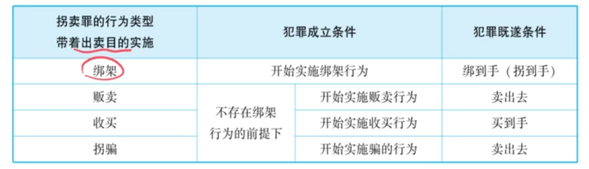

## 第1部分：备考提纲（对照《刑法》相关条款）

> **说明**：本提纲基于讲稿内容整理，涉及的法条主要是《刑法》第240条（拐卖妇女儿童罪）、第241条（收买被拐卖的妇女儿童罪）、第238条（非法拘禁罪）、第239条（绑架罪）、第236条（强奸罪）、第263条（抢劫罪）、第262条（拐骗儿童罪）。以下按主题排列，不臆造法条。

---

### 一、拐卖妇女儿童罪（刑法第240条）

**1. 四种行为类型（均需“出卖目的”）**

| 类型 | 行为特征 | 既遂标准 | 与近似罪区分 |
|---|---|---|---|
| 绑架型 | 暴力劫持 | 绑到手（控制到手） | 区别于绑架罪（目的不同） |
| 贩卖型 | 无绑架前提，捡拾或收养后产生出卖目的并贩卖 | 卖出去 | 若卖不掉则未遂 |
| 收买型 | 收买（进货） | 买到手 | 与“收买被拐卖妇女儿童罪”区分（目的：出卖 vs 自己养） |
| 拐骗型 | 欺骗手段，无暴力 | 多数说：卖出去 | 与“拐骗儿童罪”区分（目的：出卖 vs 自己养/其他） |

**2. 加重情节**
- 结合犯：拐卖 + 强奸 = 拐卖罪加重处罚（不另定强奸罪）。

---

### 二、收买被拐卖的妇女儿童罪（刑法第241条）

**1. 客观行为**：收买（与被收买型拐卖罪相同）
**2. 主观目的**：买来自己养（做老婆、儿子等），非出卖。
**3. 既遂**：买到手。
**4. 罪数处理**：
- 原则上，收买后又实施强奸、非法拘禁、伤害、侮辱等，**数罪并罚**。
- **唯一例外**：收买后又卖出的，只定**拐卖罪**（重罪吸收）。

---

### 三、拐骗儿童罪（刑法第262条）

**1. 行为**：拐骗儿童，使其脱离父母或监护人监护。
**2. 目的**：不要求出卖目的（常见为自己收养，但也可以为其他非出卖目的）。
**3. 与拐卖儿童罪关系**：
- 拐骗儿童罪 = A（使儿童脱离监护）
- 拐卖儿童罪 = A + B（出卖目的）
- 有出卖目的则定拐卖儿童罪，无则定拐骗儿童罪。

---

### 四、实力控制型犯罪的罪名区分（总表）

| 实力控制 + 目的 | 罪名 |
|---|---|
| 拘禁目的 | 非法拘禁罪 |
| 奸淫目的 | 强奸罪 |
| 向本人勒索财物 | 抢劫罪 |
| 向亲属勒索财物 | 绑架罪 |
| 出卖目的 | 拐卖妇女/儿童罪 |
| 无出卖目的 + 对象是儿童 | 拐骗儿童罪 |

---

### 五、例题汇总（来自讲稿）

**例题1（小唐僧案）**：
捡到孩子后产生出卖目的并贩卖 → 贩卖型拐卖罪，卖出去既遂，未卖出未遂。

**例题2（小伙伴案）**：
骗孩子上车想卖掉但未卖出 → 拐骗型拐卖罪（未遂）；若途中实力控制则转为绑架型拐卖罪（既遂）。

**例题3（真题：质押孩子案）**：
骗走孩子押给商店骗取财物，无出卖目的 → 对店主诈骗罪 + 对小孩拐骗儿童罪，不构成拐卖儿童罪。

---

## 第2部分：2026年法考可能考点及考查方式预测

> **说明**：以下为根据讲稿重点提示及近年考试趋势归纳，讲稿中明示“考试考过”“真题”或反复强调的考点。主观题考点已标注⭐。

| 知识点 | 可能考试的方式（选择/主观） | 举例/说明 |
|---|---|---|
| **拐卖罪四种行为类型的既遂标准**（特别是贩卖型、拐骗型） | 选择题、案例分析 | 例：甲捡到婴儿后产生出卖目的，但未卖出，是否既遂？答：未遂。 |
| **收买型拐卖罪 vs 收买被拐卖妇女儿童罪**（目的区分）⭐ | 选择题，主观题案例分析 | 例：甲花钱买一妇女，想留作老婆，后又转卖。定性？答：收买罪+拐卖罪，只定拐卖罪（例外）。 |
| **拐骗型拐卖罪 vs 拐骗儿童罪**（出卖目的有无）⭐ | 选择题，主观题案例分析 | 例：甲骗走小孩用于抵押骗取财物（无出卖目的）→ 拐骗儿童罪（非拐卖）。 |
| **收买罪后罪数并罚原则及例外**⭐ | 选择题、主观题 | 例：收买妇女后强奸，如何处罚？答：收买罪+强奸罪并罚。例外：收买后又卖出的，只定拐卖罪。 |
| **“行为与目的同时存在”原则** | 选择题 | 例：收买时无出卖目的，收买后才产生出卖目的并卖出，应定何罪？需结合行为与目的。 |
| **实力控制+目的对应罪名**（拘禁、奸淫、要钱、出卖等）⭐ | 选择题、主观题 | 例：甲劫持乙，向乙本人索财，定抢劫罪；向乙家人索财，定绑架罪。 |
| **拐骗儿童罪与拐卖儿童罪的A与A+B关系** | 选择题 | 例：骗走儿童为自己收养，无出卖目的，定拐骗儿童罪；有出卖目的则拐卖儿童罪。 |
| **结合犯：拐卖+强奸=加重拐卖** | 选择题 | 例：拐卖妇女过程中强奸该妇女，不另定强奸罪，按拐卖罪加重处罚。 |

---

> **主观题特别提示**：收买罪罪数处理（并罚与例外）、拐卖罪与拐骗罪的区分、实力控制型犯罪的罪名界分，均为主观题高频考点，备考时务必结合案例练习定性分析。

## 第3部分：讲稿切分与校订

> **说明**：括号内【校订】表示对语音转写错误或重复语句的修正，以尽量保持原意；【保留原文】表示对口语化但不影响理解的表达予以保留。未标注之处为原文直接保留。

---

**【1. 引入：拐卖类三个罪，总说拐卖妇女儿童罪】**

好，那接下来我们就要看拐卖类的三个罪了。第一个就是**拐卖妇女儿童罪**。这个罪的实行行为，法条规定了四种行为类型。这四种行为类型都要带着**出卖目的**去实施。

---

**【2. 第一种：绑架型的拐卖罪】**

第一个是**绑架型的拐卖罪**。比如狗蛋想卖小芳，使用暴力把人家劫持到手，目的是卖掉她。什么时候既遂？绑到手就既遂，或者说拐到手就既遂（和绑架罪既遂原理一样）。

【校订：原文“继随”均改为“既遂”。】
注意：这个虽然叫“绑架型拐卖罪”，但定的是**拐卖妇女儿童罪**，不是绑架罪，因为目的不同——我们是出卖目的。
**考点**：不要看到题目中有“绑架”二字就认为是绑架罪，绑架只是手段，可以成为很多罪的犯罪手段。关键看目的：绑架罪有“勒索财物或绑架人质”的目的，拐卖罪有“出卖”目的。

---

**【3. 第二种：贩卖型的拐卖罪】**

第二种是**贩卖型拐卖罪**。前提是不存在绑架行为。
举例：狗蛋在河边捡到小唐僧（母亲放在船上漂流），抱回家收养。养了几天发现孩子卖相不错，产生出卖目的，抱着孩子到处卖。此时构成**贩卖型拐卖儿童罪**。
既遂标准：**卖出去**才算既遂。如果到处卖没人要（比如买家嫌孩子唠叨），卖不掉，就是**未遂**；卖掉了就是既遂。

---

**【4. 第三种：收买型的拐卖罪】**

第三种是**收买型拐卖罪**。这个罪要和后面讲的“收买被拐卖的妇女儿童罪”区分。客观行为都是“收买”，区分在于**主观目的**——仍是“行为与目的同时存在”原则。
- 定收买型拐卖罪：收买目的是**出卖**（相当于“进货”），买到手就既遂。
- 如果收买目的是自己养（比如买孩子当儿子），则构成后面的**收买被拐卖的儿童罪**（不是拐卖罪）。

---

**【5. 第四种：拐骗型的拐卖罪】**

第四种是**拐骗型拐卖罪**。注意两点：
（1）重在“骗”，不能有暴力绑架或实力控制；如果使用暴力劫持，就属于绑架型拐卖罪。
（2）要和后面的**拐骗儿童罪**区分，区分仍看主观目的：
- 带着出卖目的把孩子骗到手 → 拐骗型拐卖罪（拐卖儿童罪）。
- 想把孩子骗到手自己养 → 拐骗儿童罪。

既遂标准（多数说）：**卖掉**算既遂；没卖掉则是未遂。

**例题（讲者亲身事例）**：
讲者小时候的小伙伴遇到人贩子，人贩子用零食玩具骗他跟着走，上了火车。小伙伴在火车上吃完零食、玩腻玩具后，向列车员呼救，人贩子被抓。
问：人贩子构成什么罪？
分析：人贩子想卖掉小伙伴，是骗，构成**拐骗型拐卖罪**，但因未卖掉，是**未遂**。如果途中被识破而实施实力控制（绑架），则转为绑架型拐卖罪，绑到手即既遂。

---

**【6. 法定刑加重条件（结合犯）】**

法定刑加重条件中最重要的就是**结合犯**：拐卖罪 + 强奸罪 = 拐卖罪加重处罚（不另定强奸罪，升格法定刑）。

---

**【7. 第二个罪名：收买被拐卖的妇女儿童罪】**

接下来看第二个罪名：**收买被拐卖的妇女儿童罪**。
最大考点：与前述“收买型拐卖罪”的区分——客观行为相同，区分在主观目的。收买被拐卖的妇女儿童罪，目的是**买来自己养**（如做老婆、做儿子）；如果买了是为了卖，直接定收买型拐卖罪。
既遂标准：**买到手**即既遂。

**罪数问题**：
原则：犯收买罪之后，再犯其他罪，**数罪并罚**。例如：
- 收买妇女后强行圆房【校订：原文“原房”】 → 收买罪 + 强奸罪并罚；
- 收买后拘禁、伤害、虐待、侮辱等，均与收买罪并罚。

**唯一例外**：收买妇女儿童到手后，又将其卖掉的（收买罪 + 拐卖罪），法条规定只定一个**拐卖罪**（重罪吸收轻罪），不再并罚。

总结：原则上收买罪 + 后罪 = 数罪并罚；例外：收买罪 + 拐卖罪 = 拐卖罪。

---

**【8. 第三个罪名：拐骗儿童罪】**

接下来是**拐骗儿童罪**。最大考点：与“拐骗型拐卖儿童罪”的区分——都是骗，区分在目的：
- 骗到手想卖掉 → 拐卖儿童罪；
- 骗到手想自己养 → 拐骗儿童罪。

**真题例题**（讲者称为真题）：
狗蛋在小学门口骗走一个小朋友，带到烟酒门市部，对老板说要买大量烟酒，但钱不够，提出把孩子押在店里，自己回家取钱，老板同意，狗蛋一去不返，骗取财物价值约一万元。
问：狗蛋对小孩构成什么罪？
分析：
- 对店老板构成诈骗罪（骗得烟酒）。
- 对小孩是否构成拐卖儿童罪？不构成，因为没有出卖目的——把孩子押在店里相当于“质押”，不是“卖”，不是等价交换。
- 构成**拐骗儿童罪**。

**理论升华**：拐骗儿童罪与拐卖儿童罪不是“A与非A”的关系，而是**A与A+B**的关系：
- A = 使儿童脱离父母监护（拐骗儿童罪，不要求特定目的，常见目的是自己养，但其他目的也可）。
- B = 出卖目的。
- A+B = 拐卖儿童罪（法定刑更重，最高死刑，而拐骗儿童罪最高仅五年）。
讲者评论：两罪法定刑差异过大不合理，因为对父母造成的痛苦无区别。

---

**【9. 大总结：拘禁型犯罪区分图表】**

总结：实力控制（绑架、劫持、拘禁） + 不同目的 → 不同罪名：

| 行为（实力控制） | 目的 | 罪名 |
|---|---|---|
| 实力控制 | 拘禁目的 | 非法拘禁罪 |
| 实力控制 | 奸淫目的 | 强奸罪 |
| 实力控制 | 向被害人本人要钱（财物） | 抢劫罪 |
| 实力控制 | 向被害人家人要钱 | 绑架罪 |
| 实力控制 | 出卖目的 | 拐卖妇女罪（儿童则拐卖儿童罪） |
| 实力控制（针对儿童） | 无出卖目的 | 拐骗儿童罪 |

至此，侵犯人身自由的五大犯罪讲完。

---

