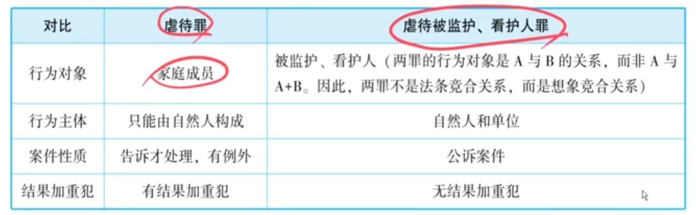

# 1：法考备考提纲

> **整理说明：** 本提纲基于上述讲稿整理，对照《中华人民共和国刑法》相关条款，按照知识逻辑编排。**加粗**部分为重点考点，标注"【2026预测】"的为讲授者暗示或可合理推断的考查热点。标注"【主观题】"的为主观题可能考查的知识点。

## 一、侵犯名誉权、人身权类犯罪

### （一）侮辱罪（《刑法》第246条）

| 项目 | 内容 |
|------|------|
| 法条 | 第246条 |
| 保护法益 | 名誉（社会评价） |
| 使用事实 | 可以是虚假事实，也可以是**真实事实** |
| 手段 | 暴力或非暴力均可 |
| 公然性 | **要求有公然性**（能使不特定人或多数人知悉） |
| 情节要求 | 情节严重才构成犯罪 |
| 告诉方式 | 告诉才处理；但严重危害社会秩序或国家利益的除外（可公诉） |

**【例题】** 狗蛋将女友小芳的真实裸照大量复印后在女方老家村里张贴。问：构成何罪？→ 侮辱罪（真实事实+公然性）

### （二）诽谤罪（《刑法》第246条）

| 项目 | 内容 |
|------|------|
| 法条 | 第246条 |
| 保护法益 | 名誉（社会评价） |
| 使用事实 | **只能使用虚假事实**，且**不能假得太离谱**（须足以使一般人相信） |
| 手段 | **只能使用非暴力** |
| 公然性 | **要求有公然性** |
| 情节要求 | 情节严重才构成犯罪 |
| 告诉方式 | 告诉才处理；但严重危害社会秩序或国家利益的除外（可公诉） |
| 特别领域 | 网络诽谤（网络暴力）有专门司法解释，可结合非法经营罪 |

**【例题】** 狗蛋当众骂小芳"你脑子里全是粪便"。小芳欲追究诽谤罪。问：是否构成？→ 不构成诽谤罪（假得太离谱）；属于侮辱。

### （三）侮辱罪与诽谤罪核心对比【主观题高频考点】

| 对比项 | 侮辱罪 | 诽谤罪 |
|--------|--------|--------|
| 事实性质 | 真/假均可 | **必须虚假** |
| 手段 | 暴力/非暴力 | **仅非暴力** |
| 虚假事实程度 | 无要求 | 须**足以使一般人相信** |

### （四）诬告陷害罪（《刑法》第243条）

| 项目 | 内容 |
|------|------|
| 法条 | 第243条 |
| 保护法益 | 名誉权 + **人身自由** |
| 捏造内容 | **必须捏造虚假的犯罪事实**（仅违法事实不够，如卖淫嫖娼） |
| 实行行为 | **向司法机关告发**（捏造只是预备行为） |
| 着手 | 开始向司法机关告发 |
| 既遂标准 | **司法机关收到材料，足以引起调查活动**（不需要实际被定罪坐牢） |
| 与诽谤罪区别 | 诽谤罪只需虚假事实（不限犯罪）+公然散布；诬告陷害罪须虚假**犯罪**事实+向**司法机关**告发 |
| 与检举权区别 | 明知有犯罪事实去举报 → 合法检举权；明知没有去告发 → 诬告陷害 |

**【2026预测·客观题·高频】** 诬告陷害罪的既遂标准是近年反复考查点，2026年仍极可能以选择题形式出现。核心是"司法机关收到并足以引起调查"即既遂，而非"诬告成功"。

**【例题4】** 狗蛋因怀疑女友与大爷跳广场舞暧昧，向公安机关告发二人"卖淫嫖娼"（违法事实）。是否构成诬告陷害罪？→ 不构成（卖淫嫖娼不是犯罪事实）。如告发"大爷是皮条客介绍卖淫"（介绍卖淫罪）→ 构成。

### （五）刑讯逼供罪、暴力取证罪、虐待被监管人罪（《刑法》第247、248条）

| 项目 | 内容 |
|------|------|
| 主体 | **身份犯**：司法人员、监管人员 |
| "刑讯"含义 | 肉刑或变相肉刑（酷刑），非刑事诉讼法之讯问 |
| 法律拟制条款 | **致人伤残、死亡的，定故意伤害罪、故意杀人罪**（即使主观上是过失） |
| 条款性质 | 此为**法律拟制**（特事特办），非注意规定 |

**【2026预测·客观题】** 法律拟制条款是命题人偏爱的考查方式，需特别注意"过失致人伤残死亡→定故意伤害/杀人罪"的特殊转化规则。

**【主观题提示】** 案例分析中如出现司法人员刑讯逼供致嫌疑人伤残的情节，需准确判断罪名转化，并说明此条属于"法律拟制"。

### （六）非法侵入住宅罪（《刑法》第245条）

| 项目 | 内容 |
|------|------|
| 保护法益（多数说） | **居住者的居住生活安宁状态** |
| 重要结论 | 侵入**常年无人居住的空房子** → **不构成本罪**（仅民事侵权） |

### （七）侵犯公民个人信息罪（《刑法》第253条之一）

**【讲授者重要提示】** 注意"内容"与"载体"的关系：

- 单纯偷拍他人洗澡 → **不构成**侵犯公民个人信息罪
- 将偷拍形成的视频文件（存储于硬盘/U盘）**非法提供给他人** → 构成侵犯公民个人信息罪

**【例题5】** 狗蛋在阳台偷拍对面女孩洗澡。问：偷拍行为本身是否构成本罪？→ 不构成。须有"记录载体+非法提供"。

### （八）强迫劳动罪（《刑法》第244条）

了解有此罪即可。

### （九）雇佣童工从事危重劳动罪（《刑法》第244条之一）

| 项目 | 内容 |
|------|------|
| "童工"年龄 | **未满十六周岁**（注意：不是未满十四周岁） |
| 与刑法"儿童"区别 | 刑法"儿童"一般指未满14周岁，但"童工"是未满16周岁 |

## 二、侵犯婚姻家庭类犯罪

### （一）重婚罪（《刑法》第258条）

| 项目 | 内容 |
|------|------|
| 行为方式 | 法律婚 + 法律婚；或 法律婚 + **事实婚姻** |
| 是否包括同居 | **不包括**（仅同居不构成重婚罪） |
| 刑法与民法的关系 | 民法不承认事实婚姻的**民事法律效力**，但刑法承认其**存在**（作为侵犯合法婚姻的现象） |

**【2026预测·客观题】** 重婚罪中"事实婚姻"的认定（公开同居+以夫妻名义相称+周围群众认为系夫妻）与"同居"的区分，是高频命题点。

### （二）破坏军婚罪（《刑法》第259条）

| 项目 | 内容 |
|------|------|
| 行为方式 | 与军人配偶**同居**或**结婚** |
| 与重婚罪区别 | 多了"同居"这一项（保护更严格） |

**构成破坏军婚罪的情形：**
- 与军人配偶法律婚 ✓
- 与军人配偶事实婚姻 ✓
- 与军人配偶同居 ✓
- 与军人配偶通奸 ✗
- 与军人配偶一夜情 ✗

### （三）核心概念层级（必记！）

一夜情 → 通奸（+一方有配偶）→ 同居（+共同生活）→ 事实婚姻（+公开性+以夫妻名义相称）→ 法律婚（+登记领证）

**【讲授者核心考点·主观题高频】** 重婚罪与破坏军婚罪的构成要件对比是案例分析题高频考点，尤其需注意"同居"在二罪中的不同地位——同居**不构成重婚罪**，但**构成破坏军婚罪**（如对方为军人配偶）。

**【例题6】** 甲已婚，与乙女长期同居但未公开、未以夫妻名义相称。问：（1）甲是否构成重婚罪？（2）如乙女为军人配偶，甲是否构成破坏军婚罪？→（1）不构成重婚罪（仅为同居）；（2）构成破坏军婚罪（同居即构成）。

### （四）暴力干涉婚姻自由罪（《刑法》第257条）

干涉他人**结婚自由**或**离婚自由**。

**【记忆提示】** 本罪的结果加重犯包括被害人自杀（与虐待罪相同）。

### （五）虐待罪（《刑法》第260条）

| 项目 | 内容 |
|------|------|
| 行为对象 | **家庭成员**（**扩大解释**为常年共同生活的人） |
| 扩大解释范围 | 常年共同生活的保姆、管家；长期同居的男女朋友等 |
| 告诉方式 | 告诉才处理（有例外） |
| 结果加重犯 | **有**——致人死亡（**包括被害人自杀**） |
| 特殊记忆 | 刑法中**两个罪**的结果加重犯包括自杀：①虐待罪；②暴力干涉婚姻自由罪 |

**【2026预测·主观题提示】** 虐待罪中"家庭成员"的扩大解释（长期同居的男女朋友是否构成家庭成员）在实务中有重要案例支撑，2026年可能以案例形式考查。同时注意虐待罪致人死亡"包括自杀"的特殊规则。

### （六）虐待被监护、看护人罪（《刑法》第260条之一）

| 项目 | 内容 |
|------|------|
| 行为对象 | 被监护人、被看护人 |
| 犯罪主体 | 自然人和单位均可 |
| 告诉方式 | **公诉案件**（非告诉才处理） |
| 结果加重犯 | **没有** |
| 与虐待罪关系 | 两罪可想象竞合（对象可重合），从一重罪处断 |

**立法背景：** 为解决幼儿园虐待小朋友既不能定虐待罪（非家庭成员）也不能定故意伤害罪（未达轻伤）、只能定寻衅滋事罪（口袋罪）的困境而增设。

## 三、全章重点罪名层级（讲授者划分）

| 重要层级 | 罪名 |
|----------|------|
| ★★★第一重要 | 绑架罪 |
| ★★★第二重要 | 非法拘禁罪 |
| ★★★第三重要 | 拐卖妇女儿童罪、收买被拐卖妇女儿童罪、拐骗儿童罪 |
| ★★较重要 | 强奸罪（胁迫行为模型、法定升格条件）、强制猥亵罪 |
| ★★较重要 | 故意杀人罪、故意伤害罪（自杀自伤区分） |

## 四、2026年考点预测表

| 知识点 | 可能考试的方式 | 举例 |
|--------|----------------|------|
| **侮辱罪可用真实事实** | 选择题判断 | 张贴真实裸照→侮辱罪，非诽谤罪 |
| **诽谤罪虚假事实须足以使一般人相信** | 选择题/案例判断 | "脑子全是粪便"假得太离谱→侮辱，非诽谤 |
| **诬告陷害罪既遂标准** | 选择题高频 | 司法机关收到材料足以引起调查即既遂，非需诬告成功 |
| **诬告陷害罪须捏造"犯罪事实"** | 选择题/案例 | 告发"卖淫嫖娼"→违法事实→不构成本罪 |
| **事实婚姻/同居/通奸/一夜情区分【主观题】** | 选择题/案例分析 | 重婚罪须事实婚姻；破坏军婚罪同居即可 |
| **虐待罪"家庭成员"扩大解释【主观题】** | 案例分析 | 长期同居男女朋友可认定家庭成员 |
| **虐待罪致人死亡包括自杀** | 选择题 | 虐待致女友自杀→虐待罪致人死亡 |
| **刑讯逼供罪法律拟制条款** | 选择题 | 过失致伤残→定故意伤害罪（法律拟制） |
| **非法侵入住宅罪保护法益** | 选择题 | 侵入空房子→不构成本罪 |
| **侵犯公民个人信息罪需"载体"** | 选择题 | 偷拍不构成本罪；提供视频文件才构成 |
| **"童工"年龄（未满16周岁）** | 选择题 | 雇佣15周岁从事危重劳动→构成本罪；12周岁→另可能涉其他罪 |
| **虐待被监护看护人罪为公诉案件** | 选择题 | 幼儿园阿姨虐待小朋友→公安立案侦查 |
| **重婚罪 vs 破坏军婚罪构成要件对比【主观题】** | 案例分析 | 同居→不构成重婚罪；同居→构成破坏军婚罪（如对方系军人配偶） |

**【主观题特别提示】** 以下知识点在案例分析题中极可能涉及：
1. **诬告陷害罪**与诽谤罪的区分 + 既遂标准（"司法机关收到并足以引起调查"）
2. **重婚罪**与**破坏军婚罪**的构成要件对比（同居、事实婚姻的认定）——讲授者花大量篇幅讲解概念层级，暗示此为主观题高频考点
3. **虐待罪**中"家庭成员"的扩大解释 + "致人死亡包括自杀"——结合实务案例考查的可能性大
4. **刑讯逼供等三罪的法律拟制条款**——涉及罪名转化，案例分析中容易设置考点
5. **侮辱罪与诽谤罪**的核心区别（事实性质 + 手段 + 公然性）——对比型案例分析

# 2：讲稿切分与整理（按逻辑顺序分段）

## 第一段：侵犯名誉权犯罪总论——侮辱罪、诽谤罪的保护法益

好，那接下来我们就看第四节——侵犯名誉方面的犯罪。

首先我们知道有一组罪叫侮辱罪、诽谤罪。它们的保护法益就是人的名誉，或者叫名誉权。那名誉是什么？简单讲就是社会评价。如果在这方面侵犯你的名誉，那给你心理会造成很大的伤害。

当然，有时候我们也不能光指望刑事罪名来保护自己，有时候还是需要有一个强大的内心。你看，你站在一楼，如果有人骂你，你听到了你很生气；如果你站在十楼，有人骂你，你有可能听不见，你还以为他跟你打招呼呢；如果你站在一百层了，那底下如果有人骂你，你根本就看不到他，放眼望去都是风景。所以如果你跟他拉开一定的层次，那他的辱骂诋毁其实就成了一种仰望。所以更重要的是提高自己，有时候的确不需要跟他们一般见识。内心有时候也不能太敏感，有句话叫"有心者有所累，无心者无所谓"。有时候内心强大一点，嘤嘤嗡嗡、区区什么的，其实就不用太在意了。

**【讲授者注】** 此处为课堂导入，非考点，但体现了对法考考生心态的引导。

## 第二段：侮辱罪与诽谤罪的核心对比（图表内容）

好了，所以侮辱罪、诽谤罪保护的是名誉，保护的是社会评价。那这两个罪该怎么学呢？书上给了一个图表，我们一起来看一下。

**侮辱罪与诽谤罪的核心对比：**

| 对比项 | 侮辱罪 | 诽谤罪 |
|--------|--------|--------|
| 使用的事实 | 可以是虚假事实，也可以是**真实事实** | **只能**使用虚假事实 |
| 公然性 | 要求有公然性 | 要求有公然性 |
| 手段 | 可以使用暴力，也可以使用非暴力 | **只能**使用非暴力 |
| 告诉方式 | 告诉才处理，但有例外 | 告诉才处理，但有例外 |

如果严重危害社会秩序或者国家利益的，可以转为公诉。这就是它们基本的相同点和区分。

## 第三段：侮辱罪可以使用"真实事实"——裸照案例

有些同学问：侮辱罪可以使用真实事实，既然是真实事实，为什么还能构成犯罪呢？

举例来说，有个男的被女朋友甩了，他为报复，把人家的裸照打印好多份，拿到人家老家村里，从村头挂到村尾。这算不算侮辱罪？这肯定是侮辱罪。这事实是不是真实的？是真实的。他使用的方式是暴力还是非暴力？是非暴力。这时候定不了诽谤罪（因为是真实裸照），但可以定侮辱罪。所以侮辱罪是可以使用真实事实的。

**【例题1】** 狗蛋被女友小芳甩了后，将小芳的真实裸照大量复印，从女友老家的村头张贴到村尾。问：狗蛋构成何罪？

**【分析】** 构成侮辱罪。因为使用的是真实事实，且具有公然性，损害了被害人的社会评价。

## 第四段：诽谤罪必须使用"虚假事实"且不能太离谱

诽谤罪必须是虚假事实。但注意，这个虚假事实也不能假得太离谱。

比如狗蛋骂小芳："你脑子进水了，你脑子里面都是粪便。"小芳说："你这是虚假事实啊，我脑子里面怎么能是粪便呢？我都是脑细胞。"但大家想想，这叫诽谤吗？这不是诽谤。因为这个假得太离谱，不足以使一般人相信。

**【讲授者重要提示】** 诽谤罪中的虚假事实，不能假得太离谱，**要求足以使一般人相信**。假得太离谱的，不是诽谤，而是侮辱——你是在侮辱对方智商。

**【例题2】** 狗蛋当众骂小芳："你脑子里全是粪便！"小芳欲追究其诽谤罪的刑事责任。问：是否构成诽谤罪？

**【分析】** 不构成诽谤罪。因为"脑子里全是粪便"假得太离谱，不足以使一般人相信，不满足诽谤罪"虚假事实"的要求。该行为属于侮辱。

## 第五段：公然性的判断——一对一通话 vs 大街上辱骂

两个罪都要求具有公然性，因为侵犯的是社会评价。

**举例判断：** 一个男的给电信公司客服打电话，说话结巴，客服竟然学他说话："大大大大哥，你你你你这这这这样说话，话费能不费吗？"这属于"伤害性不大，侮辱性极强"。但是否构成侮辱罪，还要看公然性。这是一对一的通话，没有公然性，不构成侮辱罪。但如果在大街上辱骂人家，那就具有公然性了。

**【例题3】** 狗蛋因话费问题致电电信客服，客服在通话中学狗蛋结巴说话，带有侮辱性。问：客服是否构成侮辱罪？

**【分析】** 不构成。侮辱罪要求具有公然性，一对一的通话不具有公然性（未被不特定人或多数人知悉）。如情节严重可能涉及民事侵权，但不构成本罪。

## 第六段：告诉才处理与情节要求；网络诽谤与非法经营罪

这两个罪属于告诉才处理的犯罪，而且有情节要求——**情节严重才构成犯罪**，情节不严重的一般按民事侵权处理。

现在诽谤罪的重灾区是网络，也就是网络暴力。有专门的司法解释针对网络诽谤。故意帮水军有组织地诋毁他人，目前国家从民事侵权入手加强保护，互联网法院可以受理，因为实名制能查到信息。但如果买的别人的手机号去诽谤，查出来是别人的信息，那卖号码的人如果知道对方拿去实施网络诽谤，自己也要担责。

**【讲授者提示】** 故意帮水军干这种事，轻的是民事侵权，重的还能构成**非法经营罪**（后续章节会讲）。建议大家不要干这种事，不要挣这个钱。

## 第七段：诬告陷害罪——与诽谤罪的对比

【本节讲授者先从道德层面强调了诬告陷害的危害，并以电影《窃听风暴》中东德"斯塔西"组织鼓励告密为例，警示学生守住底线。以下是核心知识点。】

**诬告陷害罪与诽谤罪的对比：**

| 对比项 | 诽谤罪 | 诬告陷害罪 |
|--------|--------|------------|
| 捏造内容 | 捏造虚假事实（不限犯罪） | 捏造**虚假的犯罪事实** |
| 保护法益 | 外部的名誉（名誉权） | 名誉权 + **人身自由** |
| 传播/实行手段 | 公然散布 | **向司法机关等机关告发**（实行行为是告发，捏造是预备行为） |

**【例题4】** 狗蛋23岁，女友46岁。狗蛋怀疑女友与78岁大爷跳广场舞动作亲密，向公安机关告发二人"卖淫嫖娼"。事实上二人并无此行为。问：狗蛋是否构成诬告陷害罪？

**【分析】** 不构成。诬告陷害罪要求捏造的是**虚假的犯罪事实**。卖淫嫖娼属于违法事实，不属于犯罪事实。如果狗蛋捏造的是"大爷是皮条客、介绍卖淫"（介绍卖淫罪是犯罪），那就构成诬告陷害罪。

## 第八段：诬告陷害罪——既遂标准

**【讲授者重要考点】** 既遂标准不是"诬告成功、被害人被冤枉坐牢"——那样打击太晚，既遂的太少。

**既遂标准：** 司法机关收到诬告材料，**足以引起司法机关的调查活动**，即构成诬告陷害罪的既遂。

**着手标准：** 向司法机关告发是着手实行行为；捏造虚假犯罪事实只是预备行为。

**【讲授者提示】** 正常的检举权：如果知道对方真的有犯罪事实、违法事实，去举报告发，是行使检举权，不构成犯罪。但如果明知人家没有违法犯罪事实，为了上位、不正当竞争去诬告，就构成诬告陷害罪。

## 第九段：刑讯逼供罪、暴力取证罪、虐待被监管人罪

这三个罪是**身份犯**，主体主要是司法人员、监管人员。

**刑讯逼供罪：** "刑讯"的"刑"指的是**肉刑或者变相肉刑**（酷刑），不是指刑事诉讼法意义上的讯问。比如满清十大酷刑、老虎凳等。在审讯室连续放一晚上歌不让人睡觉，如果让人连续几夜睡不着，已经算酷刑；但如果能睡着、能催眠，就不算。

**【讲授者提示】** 播放白浪涛老师的课是否算酷刑？讲授者认为不算，还能催眠。——此处为课堂调侃，非考点。

**三个罪的共同特点（法律拟制条款，非常重要）：**

三个罪都规定：**致人伤残、死亡的，定故意伤害罪、故意杀人罪。** 这里的致人伤残死亡是指**过失**致人伤残死亡，但最终定**故意**伤害罪、**故意**杀人罪。

**【讲授者提示】** 这是**法律拟制**（特事特办），不是注意规定。比较特殊，要注意。

## 第十段：非法侵入住宅罪——保护法益

按照**多数说**，本罪的保护法益是**居住者的居住生活安宁状态**。

**【讲授者重要结论】** 如果侵入一个**常年无人居住的空房子**，虽然是民事上的侵权行为，但**不构成刑法上的非法侵入住宅罪**。

## 第十一段：侵犯公民个人信息罪——内容与载体的关系

**内容和载体的关系：**

**【例题5】** 狗蛋在自家阳台架摄像机偷拍对面女孩小芳洗澡。问：偷拍行为本身是否构成侵犯公民个人信息罪？

**【分析】** **不构成**。只是偷拍行为本身不构成本罪。

那什么时候构成呢？偷拍好了以后，生成视频文件存在硬盘或U盘里，如果把这个硬盘或U盘**非法提供给他人**，这时候才构成侵犯公民个人信息罪。

**【讲授者提示】** 司法解释规定公民个人信息要以"电子或其他方式记录"的信息，意思是**要有一个载体**。

## 第十二段：强迫劳动罪、雇佣童工从事危重劳动罪

**强迫劳动罪：** 了解有这个罪即可。

**雇佣童工从事危重劳动罪：** 注意，这里的"童工"指**未满十六周岁**，不是未满十四周岁。刑法中的"儿童"一般指未满十四周岁，但"童工"是未满十六周岁。

**【讲授者提示】** 了解即可，知道这个区分点。

## 第十三段：侵犯婚姻家庭犯罪总述——家庭的阶段意义

接下来看第五节，侵犯婚姻家庭的犯罪。这一节的罪名主要保护的是婚姻家庭。

本节的罪名包括：重婚罪、破坏军婚罪、暴力干涉婚姻自由罪、虐待罪、虐待被监护看护人罪等。

【讲授者以"家对不同人生阶段的意义"导入：一到六岁家是全部，七到九岁家是晚上，十到十五岁家是周末，十六到二十二岁家是寒暑假，工作后家只是过年。——非考点，课堂导入】

## 第十四段：重婚罪与破坏军婚罪——核心对比

**（一）重婚罪**

指同时拥有两份婚姻：一份法律婚 + 另一份法律婚或事实婚姻。

**【讲授者特别注意】** 民法不承认事实婚姻的民事法律效力，但**刑法承认事实婚姻的存在**——不是承认其民事效力，而是承认"存在这种侵犯合法婚姻的现象"。这是刑法与民法的不同之处。

**【实务案例】** 有男子堪称"时间管理大师"，十年间有一份法律婚和一份事实婚，两个家庭都有孩子，互不知情。后男子出车祸死亡，继承遗产时两个"妻子"才知道对方存在。实体法上构成重婚罪，但程序上人已死亡无法追诉。

**（二）破坏军婚罪**

指和军人的配偶**同居**或者**结婚**。多了"同居"这个要件。

**（三）几个核心概念的层级关系（非常重要，考点密集）：**

| 概念 | 定义 | 法律后果 |
|------|------|----------|
| **一夜情** | 基本形态 | 不构成犯罪 |
| **通奸** | 一夜情 + 一方有配偶 | 不构成犯罪（我国已非犯罪化） |
| **同居** | 通奸 + 共同生活 | 可能构成破坏军婚罪（如对方是军人配偶） |
| **事实婚姻** | 同居 + 公开性 + 对外以夫妻名义相称，周围群众认为系夫妻 | 可能构成重婚罪 |
| **法律婚** | 事实婚姻 + 登记领证 | 法律认可的婚姻 |

## 第十五段：重婚罪与破坏军婚罪的构成要件对比

**【讲授者核心考点——两个罪名的构成要件对比：】**

**重婚罪的构成要件：**
- 一份法律婚 + 另一份**法律婚**或**事实婚姻**
- **不包括同居**

**破坏军婚罪的构成要件：**
- 与军人配偶：法律婚 → 构成
- 与军人配偶：事实婚姻 → 构成
- 与军人配偶：**同居** → 构成
- 与军人配偶：通奸 → **不构成**
- 与军人配偶：一夜情 → **不构成**

**【例题6】** 甲男已婚（有法律婚），在外与乙女长期同居生活，但未公开、未以夫妻名义相称。问：甲是否构成重婚罪？如乙女是军人配偶，甲是否构成破坏军婚罪？

**【分析】** （1）不构成重婚罪——重婚罪要求第二份为法律婚或事实婚姻，同居不够。（2）如乙女是军人配偶，则构成破坏军婚罪——破坏军婚罪只要求同居即可。

## 第十六段："包二奶"的性质判断

**【讲授者提示】** 实务中的"包二奶"属于什么概念？

- 符合一夜情 ✓
- 符合通奸 ✓
- 符合共同生活 → 同居 ✓

但符不符合**事实婚姻**？要加条件：
- 公开同居 + 以夫妻名义相称 + 周围群众认为是夫妻 → 升级为事实婚姻 → 构成重婚罪
- 如只是秘密同居 → 不构成重婚罪

但如果包的这个"二"是**军人配偶**，至少构成同居 → **破坏军婚罪**。军婚受到更严格的保护。

## 第十七段：暴力干涉婚姻自由罪

干涉他人**结婚自由**或**离婚自由**。

**【讲授者举例】** 《白娘子传奇》中法海干涉白素贞和许仙结婚，就是暴力干涉婚姻自由。——课堂举例，理解即可。

## 第十八段：虐待罪——家庭成员的范围（扩大解释）

**虐待罪的行为对象是"家庭成员"。**

**【讲授者重要提示——扩大解释】** "家庭成员"不仅包括父母、子女，还应**扩大解释**为**常年共同生活的人**。例如《红楼梦》中贾宝玉虐待袭人，袭人虽是丫鬟，但属于常年共同生活的关系，可认定为家庭成员，构成虐待罪。

同样，**长期同居的男女朋友**也可扩大解释为家庭成员。

**【讲授者提示道德层面】** "如果一个人对父母都不孝顺，对你好绝对是在利用你"——非考点，道德引导。

**【实务案例】** 某知名高校男生长期同居虐待女友，法院判虐待罪。许多人认为男女朋友不是家庭成员，但长期同居可扩大解释为家庭成员，判决没问题。

## 第十九段：虐待罪——结果加重犯（致人死亡包括自杀）

**虐待罪致人死亡（结果加重犯）：**

**【讲授者特别记忆提示】** 刑法中有**两个罪的结果加重犯包括"被害人自杀"**：
1. **虐待罪**致人死亡（包括自杀）
2. **暴力干涉婚姻自由罪**致人死亡（包括自杀）

在上述高校男生虐待女友案中，女友抑郁自杀，给男方定虐待罪并属于"虐待罪致人死亡"，学界认为没问题。

## 第二十段：虐待被监护、看护人罪——增设背景

**【立法背景】** 某地幼儿园阿姨虐待小朋友：拎耳朵旋转270度、扔进垃圾桶。但：
- 虐待罪要求"家庭成员"——幼儿园非寄宿制，不算家庭成员
- 故意伤害罪要求轻伤以上——阿姨"分寸把握得好"，没造成轻伤
- 最后只能定**寻衅滋事罪**（口袋罪），但总觉得不妥

于是立法增设**虐待被监护、看护人罪**。幼儿园小朋友就是被看护人，幼儿园阿姨可定本罪。

**【讲授者提示】** 立法者将本罪设为**公诉案件**（非告诉才处理），所以幼儿园出现虐待小朋友案件，公安机关会立案侦查。

## 第二十一段：虐待罪 vs 虐待被监护看护人罪的对比（图表）

| 对比项 | 虐待罪 | 虐待被监护、看护人罪 |
|--------|--------|---------------------|
| 行为对象 | 家庭成员 | 被监护人、被看护人 |
| 对象关系 | 二者并非对立关系，可结合（想象竞合） | 二者并非对立关系，可结合（想象竞合） |
| 犯罪主体 | 只能是自然人 | 自然人和单位均可 |
| 告诉方式 | 告诉才处理（有例外） | 公诉案件 |
| 结果加重犯 | **有**（致人死亡，包括自杀） | **没有**结果加重犯 |

## 第二十二段：全章总结——人身犯罪重点罪名层级

整个人身犯罪讲完了，我们来复习一下重点：

**第一重要：绑架罪**——重点条文最多
**第二重要：非法拘禁罪**
**第三重要：拐卖类犯罪**（拐卖妇女儿童罪、收买被拐卖妇女儿童罪、拐骗儿童罪）

**其次重要：**
- **强奸罪**——"胁迫"行为模型、法定升格条件（轮奸、公共场所当众强奸等）
- **强制猥亵罪**
- **故意杀人罪、故意伤害罪**——自杀自伤的区分问题

## 第二十三段：课程结语（非考点）

【讲授者以《沧浪之水》为例，勉励学生磨练学习能力、守住良知底线。内容较长，属课堂鼓励性结语，非考点，此处从略。】

