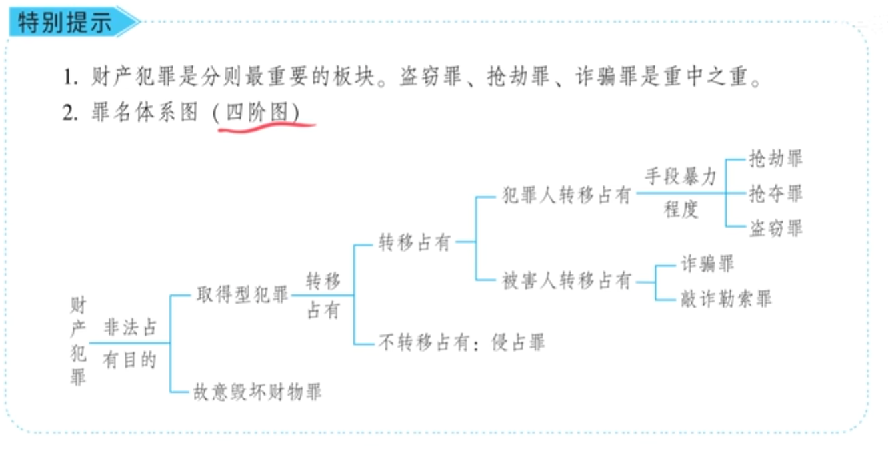

### **第1部分：财产犯罪通用原理（总论）**

本部分适用于所有财产犯罪，是理解和区分具体罪名的基石。

| **知识模块** | **核心知识点** | **讲解中的模型/例题** | **对应法条/司法解释（注释）** | **备注与理解** |
| :--- | :--- | :--- | :--- | :--- |
| **一、财产犯罪总体系（四阶图）** | 七大罪名分类 | 四大组：盗窃/侵占；抢劫/抢夺；诈骗/敲诈勒索；职务侵占罪 | 刑法分则第五章 | 理解“四阶图”的递进关系是解题关键。 |
| | 四阶图分析逻辑（四个十字路口） | **第一步**：有无非法占有目的？（区分取得型犯罪与故意毁坏财物罪） **第二步**：是否转移占有？（区分盗窃/抢夺/诈骗与侵占罪） **第三步**：谁转移占有？（区分盗窃/抢夺与诈骗/敲诈勒索） **第四步**：暴力程度如何？（区分盗窃、抢夺、抢劫） | - | 这是财产犯罪最核心的分析工具，用于区分此罪与彼罪。 |
| **二、保护法益（财产犯罪的保护客体）** | 三个保护等级及其对抗关系 | **模型一（黑吃黑）** ：铁牛偷狗蛋偷来的车→铁牛构成盗窃罪（侵犯非法占有事实）。 | - | **重点**：非法占有事实受刑法保护，但不能对抗所有权人。 |
| | | **模型二（车主偷回赃物）** ：小芳偷回被狗蛋偷走的车→多数说无罪（非法占有事实不能对抗所有权人）。 | - | **重点**：观点展示。 |
| | | **模型三（借出人偷回）** ：小芳偷回自己合法借给狗蛋的车→多数说构成盗窃罪（合法占有可以对抗所有权人）。 | - | **最高保护级别**：合法占有 > 所有权 > 非法占有事实 > 一般人。 |
| | **保护等级排序（结论）** | **合法占有** 可以对抗 **所有权**。 **所有权** 可以对抗 **非法占有事实**。 **非法占有事实** 可以对抗 **一般人/第三人**。 | - | 答题时可直接套用此逻辑。 |
| **三、行为对象（财物）** | 财物的范围（六类） | 1. 有体物/无体物（电、热、气、WiFi信号） 2. 虚拟财产（Q币、游戏装备） 3. 违禁品（毒品、假币） 4. 债权凭证（存折、银行卡） 5. 不动产（房屋产权可骗，但房屋本身不能偷） 6. 已分离的人体器官（血库血液、冷冻卵子） | 司法解释：盗窃电力、燃气等以盗窃罪论处。 | **注意**： 1. 身体本身不是财产犯罪对象。 2. 不动产的“材料”可以成为盗窃对象（如偷公路柏油）。 |
| **四、非法占有目的（核心主观要件）** | 排除意思 | **盗用**：偷骑摩托车买酱油后放回→无罪（有返还意思，无排除意思）。 | - | 排除意思=永久排除主人占有。有“返还意思”即无排除意思。 |
| | 利用意思 | 1. 偷内衣→有利用意思（不要求按正常用途使用）。 2. 偷“锤子”手机砸核桃→有利用意思。 3. 偷教材当枕头→有利用意思。 | - | **不要求**按正常经济用途使用，利用物理形状也算。无利用意思=故意毁坏财物。 |
| | 为谁占有 | 偷手机放进女友包里→构成盗窃罪（为第三人非法占有）。 | - | 非法占有目的包括为自己和第三人。 |

### **第2部分：具体罪名（一）——侵占罪**

本部分基于通用原理，对侵占罪进行详细拆解。

| **知识模块** | **核心知识点** | **讲解中的模型/例题** | **对应法条/司法解释（注释）** | **备注与理解** |
| :--- | :--- | :--- | :--- | :--- |
| **一、行为公式（核心）** | **将“他人所有、自己占有”的财物变成“自己所有”** | **【例题】** 狗蛋借小芳的泰迪狗看家护院，到期拒不归还。 | 刑法第270条 | **【主观题答题金句】** 判断是否构成侵占罪，直接套用此公式。 |
| **二、行为对象（“他人所有、自己占有”）** | 代为保管物 | **【难点：不法原因委托物】** 狗蛋将偷来的赃物委托铁牛保管，铁牛拒不返还。 | - | **【观点展示】** 多数说：铁牛不构成侵占罪。理由：狗蛋基于不法原因无返还请求权（民法不支持）。【注：属民法与刑法交叉考点。】 |
| | 遗忘物、埋藏物 | **【例题】** 小芳的泰迪狗走失，被狗蛋捡到后拒不归还。 | - | 捡到遗失物不还，数额较大即构成犯罪。 |
| | **不限于上述三类** | **【例题】** 楼上内衣被风吹落打到狗蛋脸上，狗蛋将其卖掉。 | - | 关键是看财物状态是否为“他人所有、自己占有”，不限于法定列举。 |
| **三、行为方式（“变成自己所有”）** | 常见方式：拒不返还 | 借狗不还。 | - | 是最典型方式，但不是唯一方式。 |
| | 其他方式：擅自处分、消费 | 1. 将捡到的狗卖掉。 2. 将借来的狗炖了吃掉。 | - | 只要有“据为己有”的意思和行为即可，不要求“拒不返还”的形式要件。 |
| **四、程序特点** | 告诉才处理 | - | 刑法第270条第3款 | 属于自诉案件，定罪率低，但不影响其犯罪性质。 |

### **第3部分：2026年法考命题预测及考点聚焦**

根据讲稿中强调的重点和历年考查规律，以下知识点在2026年考试中极有可能出现。

| **知识点** | **可能考试的方式** | **举例/命题角度** | **主观题考点** |
| :--- | :--- | :--- | :--- |
| **1. 财产犯罪的保护法益等级（通用原理）** | **选择题/主观题观点展示** | 给出“黑吃黑”或“车主偷回”的场景，判断行为人是否构成犯罪，侵犯了何种法益。 | **是**（如：分析狗蛋、铁牛、小芳三人的刑事责任链） |
| **2. 非法占有目的的“排除意思”（通用原理）** | **选择题** | 判断“盗用”行为是否构罪。关键看行为人是否有“返还意思”。 | 否 |
| **3. 非法占有目的的“利用意思”（通用原理）** | **选择题** | 判断“毁坏”与“占有”的区别。关键看行为人是否想利用财物的某种效用。 | 否 |
| **4. 侵占罪的行为公式与不法原因委托（具体罪名）** | **选择题/主观题** | 1. 判断某种行为是否符合侵占罪构成。 2. 重点考查“黑吃黑”的侵占罪是否成立（多数说观点）。 | **是**（如：分析铁牛拒不返还赃物狗的行为性质） |
| **5. 盗窃、抢夺、抢劫的暴力程度区分（通用原理）** | **选择题** | 描述暴力取财场景，判断是盗窃、抢夺还是抢劫。重点关注暴力对象和程度。 | 否 |
| **6. 诈骗罪与盗窃罪的区分——被害人是否处分财物（通用原理）** | **选择题** | 区分“骗”和“偷”的关键：被害人是否基于错误认识处分了财物。 | **是**（常与诈骗罪构成要件结合考查） |

---
**总结与备考建议：**

1.  **原理先行**：务必牢固掌握通用原理（四阶图、保护法益、行为对象、非法占有目的），这是区分所有财产犯罪的基础。
2.  **罪名逐个击破**：在通用原理基础上，按照“小弟-大哥”的逻辑，逐个学习具体罪名。侵占罪作为第一组的小弟，相对简单，但“不法原因委托”是重要考点。
3.  **重视观点展示**：对于“不法原因委托物”等存在多数说和少数说的考点，要清晰记忆法考官方所采纳的“多数说”及其理由。
4.  **紧扣公式**：对于侵占罪，死记硬背其行为公式“将他人所有自己占有的财物变成自己所有”，是攻克主观题的法宝。

### **第4部分：讲稿切分与整理（按逻辑顺序分段）**

**一、 课程导入与总体框架**

好，今天呢，我们就来看第十九讲，财产犯罪。财产犯罪，是我们刑法分则里面最重要的一讲，也是最难的，所以我们要重点复习。这一讲，我们要认认真真、仔仔细细、全全面面、角角落落地把它复习好。

有些同学说，复习到这一块总觉得效率比较低。我的看法是，可能是你的专注力还是不行，得想方设法提高专注力。怎么提高呢？就是要有意识地培养自己的一种屏蔽力。我们人生最大的荒唐，就是在有些烂人烂事上纠缠不清，你要对它们有屏蔽力。形成屏蔽力以后，你就会发现，任何消耗你宝贵时间的无意义的事情，你多看一眼都算你输。有了屏蔽力和专注力，学习效率自然会提高。

回到财产犯罪，我们复习时一定要先回顾一下一共有哪些罪名。一共有七大罪名，我们把它分为四组：
- 第一组：盗窃罪和侵占罪
- 第二组：抢劫罪和抢夺罪
- 第三组：诈骗罪和敲诈勒索罪
- 最后一组：职务侵占罪（它是一个综合性罪名，放在最后）

这七大罪名该怎么复习呢？一定要注意，要掌握一个体系思维。这七大罪名有一个非常好的体系，我们要按体系来复习。它不像前面复习的人身犯罪，每个罪名之间是孤岛；这七大罪名（至少是前六个）就像一棵树上结的果子，彼此关联。

**二、 财产犯罪的核心体系——“四阶图”**

【修正】我们画了一个图表，称为“罪名体系图”或“四阶图”。它有四个台阶（十字路口）：

**第一个台阶：非法占有目的**
根据有没有非法占有目的，区分为：
- **故意毁坏财物罪**：没有非法占有目的。
- **取得型犯罪**：有非法占有目的（如盗窃罪、侵占罪、抢夺罪等）。

> **【例题】** 狗蛋看女朋友小芳低头专注地看手机，悄悄走过去一看，发现小芳在看前男友的私密照。狗蛋气不打一处来，一把从小芳手里夺过手机，直接扔水沟里了。问：狗蛋构成抢夺罪（取得型犯罪）还是故意毁坏财物罪？
> **【分析】** 构成故意毁坏财物罪。因为他对手机没有非法占有目的（没有利用意思），直接扔了，所以不能定抢夺罪。

**第二个台阶：是否转移占有**
如果是取得型犯罪，接下来看财物是否发生了“转移占有”。
- **有转移占有**：可能构成盗窃罪等。
- **没有转移占有**：可能构成侵占罪。

> **【例题1：转移占有——盗窃罪】** 狗蛋趁小芳睡着，把手伸进小芳口袋，将手机偷出来装进自己口袋。这就是将小芳占有的手机转移为自己占有，构成盗窃罪。
>
> **【例题2：不转移占有——侵占罪】** 狗蛋手机真坏了，向小芳借手机用两天，承诺到时归还。小芳同意借出。狗蛋使用两天后，发现手机里有精彩影片，看的不亦乐乎。到期后小芳索要，狗蛋拒不退还。狗蛋构成侵占罪。其特点是没有非法转移占有（是合法占有），但合法占有后拒不归还，将“占有”升级为“所有”。

**第三个台阶：谁实施的转移占有**
如果是转移占有型犯罪，看是谁实施了转移占有的行为。
- **犯罪人实施转移占有**：构成盗窃罪、抢夺罪等。
- **被害人实施转移占有**：构成诈骗罪或敲诈勒索罪。

> **【例题：被害人转移占有——诈骗罪】** 狗蛋想弄到小芳的手机，但不想动手偷。他骗小芳说：“你手机五千块买的，我出一万块买。”小芳同意，把手机递给狗蛋，狗蛋给了小芳一万元“现金”。小芳回家发现，一万元全是【修正：天地银行发行的冥币】。狗蛋构成诈骗罪。其特征是犯罪人狗蛋没有亲自实施转移占有，是小方（被害人）自己把手机递给了狗蛋。

**第四个台阶：犯罪人转移占有时的手段暴力程度**
如果是由犯罪人实施的转移占有，再看其手段的暴力程度：
- **平和手段（对人无危险）**：盗窃罪。例如，趁人睡着偷走手机。
- **对物暴力（对人有危险）**：抢夺罪。例如，带着非法占有目的，一把将被害人胸前挂着的手机扯走。这种行为对物暴力，对主人的人身安全有危险，属于夺取财物，构成抢夺罪。
- **对人暴力（足以压制反抗）**：抢劫罪。例如，拦住被害人，索要手机不给即拳打脚踢，将被害人打趴下后抢走手机。暴力程度达到足以压制人的反抗，构成抢劫罪。

**【归纳】** 盗窃罪、抢夺罪、抢劫罪是根据手段暴力程度划分的三个台阶：
- 盗窃罪：对物平和手段，暴力程度为零。
- 抢夺罪：对物暴力，对人有危险。
- 抢劫罪：对人暴力，足以压制反抗。

**三、 第一节：基本原理**

通过四阶图，我们只是对六大罪名有了基本概念。真正的内容，还要一节一节学习。接下来，我们先学习第一节“基本原理”。

**（一）保护法益**

财产犯罪要保护的客体（法益）主要有三个：合法占有、合法的所有权、非法占有事实。我们通过几个模型来理清。

> **【模型一：非法占有事实对抗一般人】**
> 【修正】小芳的五菱宏光被狗蛋偷走，放在自家后院。邻居铁牛特别喜欢这车，又从狗蛋家偷走。狗蛋构成盗窃罪无疑。铁牛是否构成盗窃罪？是。那铁牛侵犯了狗蛋的什么法益？狗蛋对车没有所有权，但他有一个非法占有事实，且处于平稳状态。刑法保护这种非法占有事实，不允许“黑吃黑”。因此，铁牛侵犯了狗蛋的非法占有事实，构成盗窃罪。
> **【结论】** 非法占有事实能够对抗一般人（第三人），受刑法保护。

> **【模型二：非法占有事实无法对抗所有权人】**
> 狗蛋偷了小芳的车。小芳事后得知，又从狗蛋家偷了回去。车主小芳是否构成盗窃罪？【修正】多数说认为不构成。虽然狗蛋有非法占有事实，受刑法保护，但这种保护是针对一般第三人，不能对抗合法的所有权人。车主偷回自己的车，没有非法占有目的，不构成盗窃罪。
> **【结论】** 非法占有事实虽能对抗一般第三人，但无法对抗所有权人。

> **【模型三：合法占有可以对抗所有权人】**
> 狗蛋向小芳借用五菱宏光，说好用十天办婚礼。第二天，小芳因嫉妒新娘，后悔了，偷偷从狗蛋家把车偷了回去。小芳是否构成盗窃罪？【修正】多数说认为构成。模型二中，狗蛋是非法占有（偷来的），无法对抗所有权人。但模型三中，狗蛋是基于借用合同的合法占有人。合法占有（占有的权能）可以对抗所有权人。因此，小芳（所有权人）偷回自己合法借出的车，侵犯了狗蛋的合法占有，构成盗窃罪。

**【保护法益的等级总结】**
1. **合法占有** 可以对抗 **所有权**。（模型三）
2. **所有权** 可以对抗 **非法占有事实**。（模型二）
3. **非法占有事实** 可以对抗 **一般人/第三人**。（模型一）

**（二）行为对象（财物）**

财产犯罪的行为对象分为两大类：财物和财产性利益。这里主要讲财物，包括：

1. **有体物与无体物**：包括电、热、气等。偷电可能构成盗窃罪，蹭WiFi造成重大资费损失也可能构成犯罪。【修正：但“凿壁偷光”不构成盗窃罪（光不是财产性利益），但砸坏墙可能构成故意毁坏财物罪。】
2. **虚拟财产**：如Q币、游戏装备。抢劫游戏装备也可构成抢劫罪。
3. **违禁品**：如毒品、假币。抢劫毒品也构成抢劫罪。（考试考过）
4. **债权凭证**：如存折、银行卡。
5. **不动产**：房屋本身不能成为盗窃罪对象（无法转移占有），但房屋产权可以成为诈骗罪等对象。公路路面材料可以被盗，构成盗窃罪。【修正：著名的“偷公路”案件，盗走柏油和石料卖钱，构成盗窃罪。】
6. **人的身体及器官**：人的身体本身不能成为财产犯罪对象。但已分离出来并具有财产价值的器官（如血库里的血液、冷冻的卵子）可以成为盗窃罪对象。

**（三）非法占有目的**

非法占有目的由两个意思组成：

1. **排除意思**：永久地、终局性地排除原主人对财物的占有。
   - **【例题】** 狗蛋偷骑小芳的摩托车去超市打酱油，买完后又放回原处。这种“盗用”行为，因为没有“排除意思”（有返还意思），不构成盗窃罪。

2. **利用意思**：利用财物本身或其价值的意思，而非毁弃。
   - **不要求按正常用途使用**。
   - **【例题1】** 变态男偷女性内衣，虽非正常用途，但仍有利用意思，构成盗窃罪。
   - **【例题2】** 偷“锤子”手机用来砸核桃，利用了物理形状的用途，有利用意思。
   - **【例题3】** 偷张明楷教授的《刑法学》教材当枕头枕，利用物理形状，有利用意思。
   - 如果没有利用意思，只有毁弃意思，则可能构成故意毁坏财物罪（如开头扔手机的案例）。

**【特别注意】**
- **为谁非法占有**：非法占有目的既包括为自己，也包括为第三人。
- **【例题】** 狗蛋在电梯里偷了一位女士的三折叠手机，悄悄放进女友小芳的包里。狗蛋为第三人（小芳）非法占有，仍构成盗窃罪。

**【本节小结】**
基本原理部分讲了三个重要问题：保护法益（等级标准）、行为对象（财物范围）、非法占有目的（排除意思+利用意思）。

**四、 后续章节预告**

接下来将按顺序讲解七大罪名：
1. 第一组：侵占罪（小弟）与盗窃罪（大哥/种子选手）。
2. 第二组：抢夺罪（小弟）与抢劫罪（大哥/种子选手）。
3. 第三组：敲诈勒索罪（小弟）与诈骗罪（大哥/种子选手）。
4. 最后：职务侵占罪（综合性罪名）。

每年必考的三个“大哥级”罪名是：**盗窃罪、抢劫罪、诈骗罪**。

**五、 第二节：侵占罪**

**（一）典型行为公式**

将 **“他人所有、自己占有的财物”** 变成 **“自己所有”**。

> **【例题】** 狗蛋借小芳的泰迪狗看家护院一周。到期后小芳索要，狗蛋拒不归还。狗蛋的行为符合公式：狗是小芳所有、狗蛋合法占有，狗蛋将其据为己有，构成侵占罪。

**（二）行为对象：他人所有、自己占有的财物**

1. **代为保管物**：
   - **【难点：基于不法原因的委托保管物（黑吃黑）】**
   - **【例题】** 狗蛋偷了小芳的泰迪狗，委托铁牛保管十天。铁牛明知是赃物仍答应（构成掩饰、隐瞒犯罪所得罪）。七天后狗蛋来取，铁牛拒不归还。铁牛是否构成侵占罪？
   - **【观点展示】** 【修正】多数说认为不构成侵占罪。理由是狗蛋基于不法原因（保管赃物）委托铁牛保管，狗蛋没有返还请求权（民法上不支持）。既然连民法上的侵权行为都不构成，刑法上更不构成侵占罪。当然，赃物会被司法机关没收并返还被害人小芳，铁牛不可能永久占有。

2. **遗忘物、埋藏物**：
   - **【例题】** 小芳的泰迪狗走失，被狗蛋捡到。狗是小芳所有，狗蛋在占有。狗蛋如拒不归还，构成侵占罪。

**（三）行为方式：变占有为所有（据为己有）**

1. **不限于“拒不返还”**：拒不返还只是最常见的一种表现形式。
2. **其他方式**：擅自处分（卖掉）、消费（吃掉）等，只要表现出将财物当作自己所有物来行使权利，即可构成。
3. **【例题】** 楼上邻居小芳的内衣被风吹落，打到狗蛋脸上。狗蛋明知是小芳的，仍将该内衣卖掉（数额较大）。狗蛋构成侵占罪。因为财物状态是小芳所有、狗蛋占有，其卖掉的行为就是变占有为所有。
4. **【总结】** 判断侵占罪，紧扣行为公式：“将他人所有、自己占有的财物变成自己所有。”

