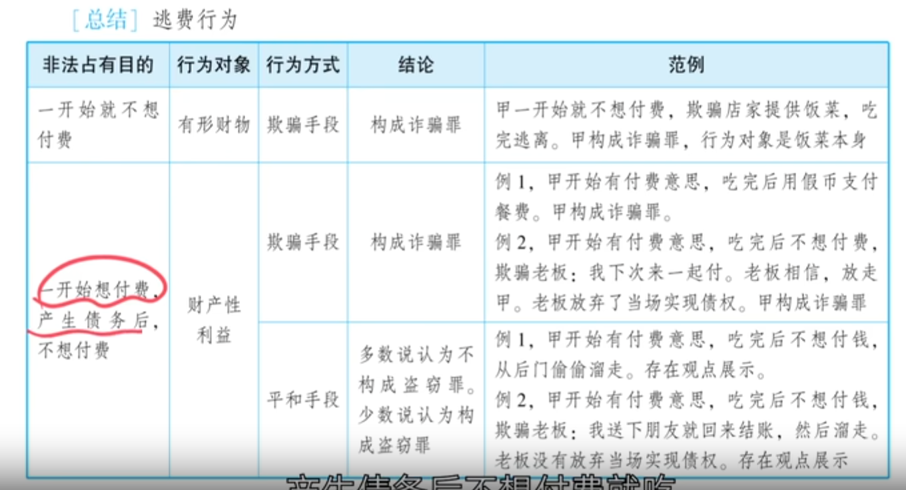
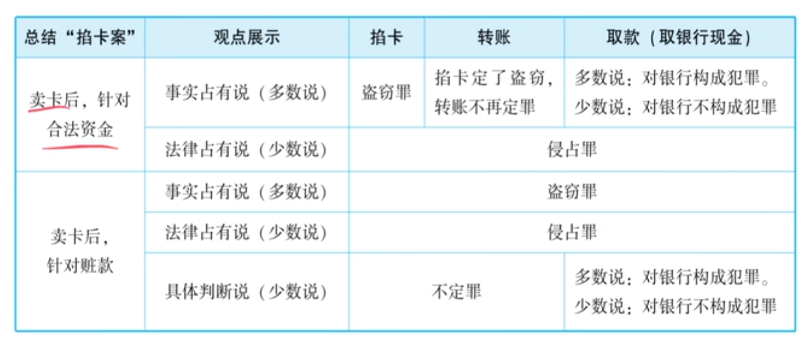

# 1：法考备考提纲

## 财产性利益与财产犯罪罪数——备考提纲

### 一、核心概念：财产性利益

**定义：** 财产性利益是指财物之外的有财产价值的利益，包括：
- 积极的财产增加（如取得债权）
- 消极的财产减少（如免除债务）

**法考中的地位：** 可以成为财产犯罪的对象（如诈骗罪、抢劫罪、盗窃罪的对象）。

### 二、三大基本类型

#### 类型一：犯罪人是债务人，被害人是合法债权人

**核心原理：** 债务人通过非法方式免除自己的合法债务→侵害了债权人的财产性利益→构成财产犯罪。

**三个标准模型：**

| 模型 | 手段 | 构成罪名 |
|------|------|----------|
| 骗免过路费 | 欺骗 | 诈骗罪 |
| 抢劫车费 | 暴力/胁迫 | 抢劫罪 |
| 餐厅逃单（一开始想付费，后偷偷溜掉） | 平和手段 | **不构成盗窃罪**（多数说） |

**逃费（餐费）行为的判断步骤：**

1. **第一步：看一开始是否想付费**
   - **一开始就不想付费**（霸王餐）→一开始就有非法占有目的→骗吃骗喝→诈骗对象是饭菜本身→**诈骗罪**
   - **一开始想付费，后来才不想付费**→看手段：
     - 暴力→**抢劫罪**
     - 欺骗（如假币）→**诈骗罪**
     - 偷偷溜掉→**不定盗窃罪**（多数说）

#### 类型二：犯罪人是债务人，被害人是非法债权人

**核心模型：骗免嫖资案**

> 【模型】谈好嫖资800美元，用伪造的1200美元支票支付，并要求对方找回400美元现金。
>
> **处理：**
> - 对400美元现金→**诈骗罪**（无争议）
> - 对800美元嫖资→**多数说：不构成诈骗罪**（非法债权不受民法保护→刑法也不保护；“黑吃黑”）

**原理：** 债权是请求权，请求权需要借助法制秩序实现。非法的请求权，法院不受理→刑法不保护。

#### 类型三：犯罪人与被害人无债权债务关系

**子类型1：为自己生成非法债权**

| 模型 | 结论 |
|------|------|
| 强迫写欠条 | 抢劫罪（未遂/既遂取决于是否实际取得财物） |
| 非法充值（磁卡电话） | 盗窃罪 |

**子类型2：非法使用他人财产**

> 【模型】擅自出租他人房屋（邻居出国，空房）→收租客一个季度租金。
>
> **处理：**
> - 对房东：不构成非法侵入住宅罪（空房，无人居住）；不构成盗窃罪/诈骗罪
> - 对租客：构成**诈骗罪**（数额=未住的两个月租金）
> - 已住的一个月租金→不当得利，应返还房东；不返还构成**侵占罪**

**子类型3：冒名行使债权（冒名收款案）**

> 【模型】被辞退的业务员仍以公司名义向客户收款（表见代理）。
>
> **分析：**
> - 乙客户（债务人）→付钱给狗蛋算有效履行债务→**不是受害人**（只是受骗人）
> - 甲公司（债权人）→债权无法实现→**是受害人**（损失的是债权/财产性利益）
> - **多数说：三角诈骗**（受骗人与受害人不是同一人）
> - **少数说：盗窃罪**（盗窃债权）
>
> **【考点提示】考过一次。**

### 三、存款问题（掐卡案）——几乎年年考

#### 基本原理
- 存款现金→归银行占有、所有
- 存款人→拥有对银行的**存款债权**
- 存款债权可随时兑现→实体化为“卡里的钱”

#### 两大基本学说

| 学说 | 占有归属 | 标准 |
|------|----------|------|
| 事实占有说（**多数说**） | 实际用卡人占有 | 实质标准 |
| 法律占有说（少数说） | 卡主占有 | 形式标准 |

#### 模型一：卖卡后针对合法资金

**按事实占有说（多数说）：**
- 掐卡→**盗窃罪**（转移占有）【2025年考了】
- 掐卡后转账→**不再定罪**（转移赃款）
- 取现金（柜台）→**诈骗罪**（多数说）/不构成犯罪（少数说）
- 取现金（ATM）→**盗窃罪**（多数说）/不构成犯罪（少数说）

**按法律占有说（少数说）：**
- 掐卡+转账+取款一体化→**侵占罪**

#### 模型二：卖卡后针对赃款

**基础罪名：**
- 明知用于电信诈骗还卖卡→**诈骗罪的帮助犯 + 帮助信息网络犯罪活动罪（帮信罪）** →想象竞合择一重

**掐卡转账取款的处理：**
- 事实占有说→**一律盗窃罪**
- 法律占有说→**一律侵占罪**
- 具体判断说→掐卡、转账不定罪；取款观点展示（对银行构成/不构成犯罪）

#### 模型三：错误汇款

> 【模型】乙想给丙汇款1万元，误打入甲卡中。
>
> **处理：**
> - 甲事实上占有这笔资金
> - 不当得利→应当返还
> - 拒不返还→**侵占罪**
> - 取现金→观点展示（对银行构成犯罪/不构成犯罪）

### 四、黑吃黑问题

#### 构成犯罪的情形
**原理：非法占有事实受刑法保护，可对抗第三人。**

| 情形 | 结论 |
|------|------|
| 偷赃物（甲偷丙的摩托，乙从甲家偷走） | 盗窃罪 |
| 偷赃款（甲诈骗所得存折，乙转走） | 盗窃罪 |
| 共犯中非保管人偷走保管人占有的赃物 | 盗窃罪 |
| 偷违禁品（毒品、淫秽物品等） | 盗窃罪 |

#### 不构成犯罪的情形
**原理：非法请求权不受刑法保护。**

| 情形 | 结论 |
|------|------|
| 骗免嫖资（非法债权） | 不构成诈骗罪（多数说） |
| 不法原因委托物（甲让乙藏赃车，乙拒不返还） | 不构成侵占罪（多数说）；但构成掩饰、隐瞒犯罪所得罪 |

### 五、财产犯罪的罪数问题

#### 类型一：销赃行为（卖树案）

> 【模型】把邻居的树卖给不知情的木材商。
>
> **结论：**
> - 对邻居→**盗窃罪**
> - 对木材商→**诈骗罪**（多数说）
> - 一个行为→两个罪→**想象竞合择一重**

#### 类型二：免除返还义务（先侵占后诈骗）

> 【模型】保管他人名画→变卖→骗保管人说画被偷了，免除返还义务。
>
> **结论：**
> - 变卖→**侵占罪**
> - 骗免返还义务→**诈骗罪**（诈骗财产性利益）
> - **不需要并罚**（一份好处、一份损失）
> - 多数说：**重罪吸收轻罪**
> - 少数说：只定侵占罪（诈骗是不可罚的事后行为）

#### 类型三：先偷后骗

> 【模型】偷高压锅→拿回超市退货退款。
>
> **结论：**
> - 偷→**盗窃罪**
> - 退货退款→**诈骗罪**
> - 多数说：**重罪吸收轻罪**（不并罚）
> - 少数说：**应当并罚**

## 考点预测表（基于讲稿分析）

> **说明：** 以下内容基于授课老师在讲稿中明确提及的“考过”“喜欢考”“重要”“没考过但重要”等信息整理。带⭐者为讲稿中明确提及可能涉及**主观题**的考点。

| 知识点 | 可能考试的方式 | 举例/说明 |
|--------|----------------|-----------|
| **财产性利益可成为财产犯罪对象** ⭐ | 判断某种“利益”是否属于财产性利益，能否成为某罪的对象 | 骗免过路费→诈骗罪；抢劫车费→抢劫罪 |
| **逃单行为的定性（一开始想付费vs不想付费）** | 区分诈骗罪与无罪（盗窃罪不成立） | 一开始不想付费→诈骗罪（饭菜本身）；一开始想付费后溜掉→不定盗窃罪（多数说） |
| **非法债权是否受刑法保护** | 观点展示（多数说vs少数说） | 骗免嫖资→多数说：不构成诈骗罪（非法债权不受保护） |
| **强迫写欠条** | 抢劫罪的既遂/未遂判断 | 强迫写欠条→抢劫罪（未遂/既遂取决于是否实际取得财物） |
| **非法充值** | 盗窃罪的认定 | 磁卡非法充值→盗窃罪 |
| **冒名收款案（三角诈骗/盗窃债权）** | 判断是三角诈骗还是盗窃罪（观点展示） | 被辞退业务员冒名收款→多数说：三角诈骗；少数说：盗窃罪 |
| **掐卡行为的定性** ⭐ | 盗窃罪or侵占罪（观点展示）；掐卡vs转账vs取款的区别处理 | 事实占有说→掐卡=盗窃罪；法律占有说→掐卡=侵占罪。**主观题重点** |
| **掐卡后取款（柜台vsATM）** | 诈骗罪与盗窃罪的区别 | 柜台取款→诈骗罪（骗人）；ATM取款→盗窃罪（骗机器） |
| **卖卡后针对赃款的掐卡行为** ⭐ | 同时涉及帮信罪+诈骗罪帮助犯+掐卡行为的罪数 | 明知电信诈骗还卖卡→帮信罪+诈骗罪帮助犯（想象竞合）；掐卡转账取款→盗窃罪（事实占有说）/侵占罪（法律占有说）。**主观题重点** |
| **错误汇款** | 侵占罪的认定+取款行为的观点展示 | 误打入他人账户→拒不返还=侵占罪；取现金→观点展示 |
| **黑吃黑构成犯罪的情形** | 判断哪种黑吃黑构成犯罪 | 偷赃物、偷违禁品→构成盗窃罪（非法占有事实受保护） |
| **黑吃黑不构成犯罪的情形** | 判断哪种黑吃黑不构成犯罪 | 骗免嫖资、不法原因委托物拒不返还→不构成（非法请求权不受保护） |
| **卖树案（销赃行为）** | 盗窃罪与诈骗罪的想象竞合 | 卖邻居的树给木材商→盗窃罪+诈骗罪→想象竞合择一重 |
| **先侵占后诈骗（免除返还义务）** ⭐ | 侵占罪+诈骗罪的罪数处理（观点展示） | 保管名画→变卖→骗免返还义务→不并罚，重罪吸收轻罪/只定侵占罪 |
| **先偷后骗** | 盗窃罪+诈骗罪的罪数处理（观点展示） | 偷高压锅→退货退款→不并罚/并罚（观点展示） |

### 关于本提纲的重要说明

1. **关于“片面”一词：** 讲稿中老师使用的“片面过路费”“片面餐费”“片面返还义务”中的“片面”，在该老师的授课习惯中意指“骗免”（即通过欺骗方式免除债务），而非字面意义上的“片面”。这是该老师的个人用语习惯，在法考学习中应理解为“骗免”的含义。

2. **关于“掐卡”一词：** “掐卡”是法考刑法中的习惯用语，指卡主通过挂失等方式使实际用卡人无法继续使用银行卡的行为。

3. **关于“事实占有说”与“法律占有说”：** 这是存款类案件中判断资金由谁占有的两种标准。法考中以**事实占有说为多数说**，但两种观点都需要掌握（观点展示题）。

4. **关于“黑吃黑”：** 讲稿中老师使用该词指代犯罪人之间“以黑吃黑”的行为（即一方对另一方的违法犯罪所得再进行侵害）。并非所有“黑吃黑”都构成犯罪，需要具体分析。

5. **关于表见代理：** 冒名收款案中涉及“表见代理”概念，这是民法概念。在刑法中主要用来判断被害人是谁、财产损失归属等问题。具体内容可咨询民法老师孟老师（讲稿原话：“这个民法上你问一下孟老师”）。

6. **关于“三角诈骗”：** 指受骗人与被害人不是同一人的诈骗类型。其构造为：行为人→欺骗受骗人→受骗人处分财产→被害人遭受财产损失。

7. **关于帮助信息网络犯罪活动罪（帮信罪）：** 刑法第287条之二规定的罪名，指明知他人利用信息网络实施犯罪，为其提供帮助，情节严重的行为。

8. **关于“不可罚的事后行为”：** 指在状态犯的场合，利用该犯罪结果的行为，如果未被新的法益侵害所包含，则不可单独处罚；如果侵害了新的法益，则可能单独成罪。本讲稿中的“先侵占后诈骗”中，少数说认为诈骗行为是侵占的不可罚的事后行为。

9. **关于《刑法》中相关罪名的主要条文（备考参考）：**
    - 诈骗罪：刑法第266条
    - 抢劫罪：刑法第263条
    - 盗窃罪：刑法第264条
    - 侵占罪：刑法第270条
    - 敲诈勒索罪：刑法第274条
    - 抢夺罪：刑法第267条
    - 职务侵占罪：刑法第271条
    - 帮助信息网络犯罪活动罪：刑法第287条之二
    - 掩饰、隐瞒犯罪所得罪：刑法第312条
    - 非法侵入住宅罪：刑法第245条

# 2：讲稿逻辑切分与整理

## 段落一：开场——学习本部分内容的忠告

好，接下来我们看第十二节——**财产性利益**。这个是最难的，也是这几年考得相对比较多的一个知识点。

这一块的知识点太难了，所以我建议大家**一定要先看书**，如果不看书的话，这一块你根本就听不懂，甚至书看两遍还不一定能听得懂。如果书一点都不看，那就很麻烦。所以——小姐姐、小公主、大少爷、兄弟、大兄弟——赶紧看书，赶紧把这个视频一关，赶紧看书。这是忠告，否则的话你听的是一头雾水。

好，如果你看完书之后，我们来看一下财产性利益这一块。因为这一块有点太难了，有的时候都跟学术探讨一样，就是学术观点展示。那我觉得是这样的：我干脆给大家整理一下，有的时候你理解不了，干脆就去记，哪怕总结几个模型，死记硬背就完了。

## 段落二：第一大类型——犯罪人是债务人，被害人是合法债权人（概述与三个标准案例）

我们现在就死记硬背几个模型。

### 第一大类型：债权问题——犯罪人是债务人，被害人是合法的债权人

在这个类型之下，你记**三个案例**就行了，把它作为标准案例去记。

**标准案例一：骗免过路费案（片面过路费案）**

> 【例题1】狗蛋将卡车伪装成军车，到了收费站，说“我是军车，你不能收我的过路费”。收费员被骗，就免收了过路费，放行。
>
> **结论：** 构成诈骗罪。诈骗的对象是**财产性利益**——不是一笔现金，不是有体物，而是一个无形的财产性利益。

**标准案例二：抢劫车费案**

> 【例题2】狗蛋坐出租车到目的地，司机说“请支付车费100元”，狗蛋拿出刀子：“我坐出租车从来就不付钱，还敢问我要？捅死你！”司机害怕，说“算我倒霉，不收了你下车吧”。狗蛋下车。
>
> **结论：** 构成**抢劫罪**。抢劫的对象是**财产性利益**——通过暴力方式让人免除了一笔债务。这与骗免过路费案性质相同，只是手段不同（欺骗→诈骗罪；暴力→抢劫罪）。

**标准案例三：餐厅逃单案**

> 【例题3】狗蛋到餐厅吃饭，一开始想付费，吃完了说“服务员买单”，人家说“一共2000元”。狗蛋一摸身上，一分钱没装，手机、卡都没带，此时产生了不想付费的意图，说“行，我买单，我先上个洗手间”，趁机悄悄溜掉，逃单。
>
> **结论（多数说）：** **不构成盗窃罪**。理由：这种逃单行为太多了，如果都定罪，监狱关不下。这个跟前面定诈骗罪、抢劫罪刚好相反。

## 段落三：逃费行为的总结图表

好，如果把这些都能理解的话，我们有个图表来总结一下，叫**逃费行为**。

### 情形一：一开始想付费，产生债务后不想付费

行为对象：财产性利益（即餐费）

- **平和手段（偷偷溜掉）** ：多数说→**不构成盗窃罪**
- **欺骗方式**：构成**诈骗罪**（如用假币支付，除构成使用假币罪外，还构成诈骗罪——骗免餐费）
- **暴力方式**：构成**抢劫罪**（如拔出刀威胁“敢问我要费？捅死你！”）

【注意】骗免过路费、骗免餐费都能构成诈骗罪。

### 情形二：一开始就不想付费（霸王餐）

> 【例题4】狗蛋进餐厅时身上一分钱没有，大摇大摆往那一坐，“服务员点菜！二两牛肉、二斤女儿红、三两鹤顶红”，吃完了偷偷溜掉。
>
> **分析：** 一开始就不想付费，说明一开始就有**非法占有目的**，属于**骗吃骗喝**，诈骗的对象是**饭菜本身**（有形财物）。
>
> **结论：** 构成**诈骗罪**。如果饭菜值两三千元，吃到肚子里了，诈骗罪既遂——占有得太彻底了，“用胃来占有”。

### 吃霸王餐的判断步骤总结

做题时遇到“吃霸王餐”“加霸王油”这类题：

**第一步：看一开始想不想付费**
- 一开始就不想付费（一开始就有非法占有目的）→ **骗吃骗喝，诈骗的是饭菜本身→诈骗罪**

- 一开始想付费，吃完买单时才不想付费→ **看手段**：
  - 暴力→抢劫财产性利益→**抢劫罪**
  - 欺骗（如假币）→**诈骗罪**
  - 偷偷溜掉→多数说→**不定盗窃罪**

## 段落四：第二大类型——犯罪人是债务人，被害人是非法债权人

好，这是我们说的第一大类型——犯罪人是债务人，被害人是合法的债权人。

接下来我们说**第二大类型**：犯罪人还是债务人，但被害人是**非法的债权人**。

### 标准案例：骗免嫖资案（电影《猫鼠游戏》）

> 【例题5】莱昂纳多饰演的男主角叫了一个高级妓女给自己服务，谈好嫖资800美元。服务完后，他问人家“收不收个人支票”，然后转过身，在自己伪造的一沓支票中，明明有一张写着800美元，但他不拿，拿了一张写着1200美元的支票递给妓女，说“咱们谈好的价格是800美元，我这个支票值1200美元，你得给我找400美元现金”。妓女还真给他找了400美元现金。
>
> **第一步分析（无争议）：** 莱昂纳多对**400美元现金**（有形物、有体物）构成**诈骗罪**——诈骗了有形的美钞。
>
> **第二步分析（有争议）：** 他**骗免了800美元嫖资**，这个怎么处理？

### 观点展示

这个嫖资，对妓女来说是一个**非法的债权**、非法的财产性利益，与前面的过路费、餐费不同（那些是合法债权人）。

- **多数说：不构成诈骗罪。**
  - 理由：债权本质上是**请求权**，请求权要借助法制秩序（如民事诉讼程序）来实现。但非法请求权，法院不受理。民法、民事诉讼法都不保护，刑法也不保护——这属于“黑吃黑”，刑法不认为构成犯罪。

- **少数说：构成诈骗罪。** 因为这也是“血汗钱”，刑法应当保护。

## 段落五：第三大类型——无债权债务关系（类型一：为自己生成非法债权）

好了，接下来看**第三大类型**：犯罪人和被害人之间**没有债权债务关系**。

### 第一种情形：为自己生成非法债权

**标准案例一：强迫写欠条案**

> 【例题6】杜洪波老师拿一把杀猪刀来到温文运老师面前：“你现在给我写个欠条——温文运欠杜洪波10万元，写不写？砍了你！”温文运老师没办法，写了。杜老师收起刀，拿着欠条走了。
>
> **结论：** 定**抢劫罪**。但此时抢劫罪**尚未既遂**——如果温文运老师真给了10万元，抢劫罪既遂；如果不搭理，只能算抢劫罪未遂。

**标准案例二：非法充值案**

> 【例题7】一个理工男用技术手段给自己的磁卡电话充值卡里非法充值了5000元，然后去打白打（免费打电话），让电信公司遭受了5000元资费损失。
>
> **结论：** 定**盗窃罪**。

**规律总结：** 用非法方式为自己生成了一个非法债权，让被害人成为债务人——构成财产犯罪（抢劫罪、盗窃罪等）。如果让人家遭受了实际财产损失，就既遂。

## 段落六：第三大类型——无债权债务关系（类型二：非法使用他人财产）

### 第二种情形：非法使用他人的财产

非法使用行为在许多情况下是**无法定罪**的。

> 【补充说明】盗用摩托车例：狗蛋把小芳的摩托车偷着骑走，只是为了到超市打酱油，然后再放回去——没有非法占有目的→不构成盗窃罪，只能按民事赔偿或行政处罚处理。

### 重点案例：擅自出租他人房屋案

> 【例题8】狗蛋看到邻居出国了，知道常年不回来。狗蛋撬开门、换掉锁，对租客说“我就是这个房子的房东，我把这房子租给你，按季度付钱”。租客信以为真，付了一个季度的房租。住了一个月后，房东回来了，事情败露。

**分析：**

**（一）对房东：**

- **非法侵入住宅罪：** 多数说认为非法侵入住宅罪保护的法益是**居住生活的安宁权**。房子长期没人住→没法定非法侵入住宅罪→民事侵权处理。
- **盗窃罪/诈骗罪：** 也不能定。狗蛋收的租金不能说是盗窃房东的——房东没有要出租，也不知道被出租了。

**（二）对租客：**

- **构成诈骗罪**（让租客有财产损失）。
- 租客交了三个月房租，住了一个月→**两个月没住** → 这两个月的租金是租客的财产损失→狗蛋对租客构成诈骗罪，数额为两个月的租金。
- 租客住的那**一个月**的租金→租客没有损失（住了）→狗蛋收了，属于**不当得利**，应返还给房东；不返还的话，构成**侵占罪**。

## 段落七：第三大类型——无债权债务关系（类型三：冒名行使债权）

### 第三种情形：冒名收款案（冒名行使债权）

> 【例题9】狗蛋是甲公司的业务员，一直负责向乙客户收款（代表甲公司向乙客户收款）。后来狗蛋犯错误被甲公司辞退了，但甲公司没有及时通知乙客户。有一天，狗蛋到乙客户处，骗乙客户说“我还是代表甲公司来收款”，乙客户就把货款付给了狗蛋。

**分析步骤：**

**第一步：确定债权债务关系**
- 甲公司是**债权人**
- 乙客户是**债务人**

**第二步：乙客户是不是受害人？**
- 要看乙客户付钱给狗蛋，算不算**有效履行了对甲公司的债务**？
- 这要看狗蛋的收款行为是否构成**表见代理**【注释①】。
- 民法上——这**应当算表见代理**。
- 一旦构成表见代理→乙客户付钱给狗蛋，算有效履行了对甲公司的债务→甲公司不能再向乙客户收款→乙客户**没有财产损失**（乙客户只是**受骗人**）。

**注释①：** 表见代理是民法概念，指行为人虽无代理权，但相对人有理由相信其有代理权时，该代理行为有效。本题中，乙客户有理由相信狗蛋仍代表甲公司（因为甲公司未通知乙客户狗蛋已被辞退）。

**第三步：甲公司是不是受害人？**
- 甲公司**有财产损失**——损失的不是有形现金，而是一笔**债权无法实现了**（债权没法向乙客户主张了，钱也没收上来）。
- 甲公司损失的是一笔债权，也叫**财产性利益**。

**第四步：狗蛋的行为如何定性？**

- **多数说：三角诈骗。** 受骗人（乙客户）和受害人（甲公司）不是同一个人，符合三角诈骗的特点。

- **少数说：盗窃罪。** 狗蛋在甲公司不知情的情况下，代为行使了甲公司对乙客户的债权——属于**盗窃债权、盗窃财产性利益**。

**【考点提示】这个模型考过一次，要记住。**

## 段落八：过渡——鼓励与提示

好，整个关于债权的问题我们就总结完了。我估计有些同学觉得这一块太难了，晕了，快坚持不下去了。

我想起爱因斯坦给他孩子爱德华写过一封信，信中有一句话比喻得很好：**“生活就像骑自行车，为了保持平衡，你就必须不断继续向前。”** 所以，我们为了保持平衡，就必须继续向前。

接下来还有一关——**存款的问题**。存款问题也是这几年**特别喜欢考的**，几乎年年考，**不是在客观题里考，就是在主观题里考**。所以也很重要。如果实在觉得难，还是先看看书。公主请看书，王子请看书。看完书，我们再继续。

## 段落九：存款问题——基本原理

好，在讲存款问题之前，大家先想清楚一个问题：

> 【原理说明】你把一万元现金存到银行里，你对这一万元现金还拥有所有权吗？
>
> **答案：没有了。** 这一万元现金已经归银行占有、所有。你换回来的是——你的卡里多了一个“+1万元”，也就是你多了一笔**针对银行的存款债权**。
>
> 这个存款债权有什么特点？你可以随时兑现、提现。由于能够自由地随时取现，所以我们形象地说“我卡里有一万元资金”——这就相当于把存款债权实体化了，按实体的资金去理解卡里的钱。

## 段落十：存款问题——第一大类型（卖卡后针对合法资金）

### 标准模型

甲将自己的银行卡**卖给或借给**乙。日后，甲发现卡里面乙存了一万元资金（乙是这笔资金的所有权人）。

**焦点问题：谁是这个资金的占有人？**

### 两大观点

**观点一：事实占有说（多数说）**
- 在事实层面，**乙（实际使用人/用卡人）** 在事实上占有这笔资金。
- 这是一种**实质标准**。

**观点二：法律占有说（少数说）**
- 甲是法律上、名义上的卡主，所以**甲（卡主）** 在法律上占有这笔资金。
- 这是一种**形式标准**。

---

### 按“事实占有说”（多数说）分析：

**动作一：掐卡【注释②】**
> 甲拿着身份证到银行柜台把卡挂失了。
>
> **结论：** 定**盗窃罪**。因为掐卡导致乙无法支配使用卡里的资金——乙失去占有，甲建立占有→转移占有→盗窃罪。
>
> **【考点提示】2025年就考了这一点。**

**注释②：** “掐卡”是法考刑法中的习惯用语，指卡主通过挂失等方式，使实际用卡人无法继续使用该银行卡的行为。

**动作二：掐卡后转账**
> 甲把卡里的一万元转到自己另外一个账户。
>
> **结论：** **不再构成犯罪**。因为掐卡行为已经构成盗窃罪并且既遂了，再把资金从左口袋放到右口袋——属于转移赃款，不再定罪。

**动作三：掐卡后取款（取现金）**

这里关键是取款方式不同，定性不同：

- **到银行柜台取现**：
  - 多数说：甲对银行构成**诈骗罪**（诈骗对象是银行的现金）——甲没有取款权限，骗银行职员，银行直接损失一万元现金。至于银行事后通过民事规则弥补损失，那是民法的事后问题，刑法只看直接损失。
  - 少数说：甲对银行不构成诈骗罪——因为甲有取款权限（甲是法律上的卡主）。

- **到ATM机取现**：
  - 多数说：甲对银行构成**盗窃罪**（盗窃银行的现金）。
  - 少数说：甲对银行不构成犯罪——因为甲有取款权限。

---

### 按“法律占有说”（少数说）分析：

卡主甲在法律上占有这笔资金。

**结论：** 掐卡、转账、取款**一体化看待**——甲干了一件事：将乙所有、甲占有的资金变成自己所有→构成**侵占罪**，简单。

## 段落十一：存款问题——第二大类型（卖卡后针对赃款）

### 标准模型

甲向乙卖卡，**知道乙用于电信诈骗还卖卡**。日后，甲知道卡里多了一万元，是乙诈骗犯罪所得的赃款。甲又来了个掐卡、转账、取款。

**分析：**

**第一步：甲构成什么罪（卖卡行为本身）**
- 甲明知乙要实施电信诈骗（罪名是**诈骗罪**，没有“电信诈骗罪”这个罪名）还提供卡→**诈骗罪的帮助犯**
- 同时构成**帮助信息网络犯罪活动罪**（帮信罪）
- 一个行为触犯两个罪→**想象竞合择一重**

**第二步：掐卡转账取款行为**

**按“事实占有说”（多数说）：**
- 卡里资金是乙（用卡人）在占有，甲没有占有
- 掐卡+转账+取款一体化看待→**一律定盗窃罪**

**按“法律占有说”（少数说）：**
- 卡主甲在法律上占有资金
- 掐卡+转账+取款一体化看待→**一律定侵占罪**

**按“具体判断说”（少数说）：**
- 掐卡行为→**不定罪**。理由：卡里是赃款，甲一掐卡，乙想转移赃款也转移不了了，客观上帮了司法机关追赃，不是危害行为。
- 转账行为→**不定罪**。
- 取款行为（取现金）→对银行构成犯罪（多数说）/对银行不构成犯罪（少数说）。取款方式不同又涉及诈骗罪或盗窃罪的区别。

## 段落十二：存款问题——总结图表

### 掐卡案总结

**类型一：卖卡后针对合法资金**

| 学说 | 占有归属 | 掐卡 | 掐卡后转账 | 取现金 |
|------|----------|------|------------|--------|
| 事实占有说（多数说） | 实际用卡人（乙）占有 | 盗窃罪 | 不再定罪 | 对银行构成犯罪（多数说）/不构成犯罪（少数说） |
| 法律占有说（少数说） | 卡主（甲）占有 | 一体化看待→侵占罪 | 一体化看待→侵占罪 | 一体化看待→侵占罪 |

**类型二：卖卡后针对赃款**

| 学说 | 掐卡+转账+取款一体化 |
|------|----------------------|
| 事实占有说（多数说） | 一律盗窃罪 |
| 法律占有说（少数说） | 一律侵占罪 |
| 具体判断说（少数说） | 掐卡、转账不定罪；取款观点展示（对银行构成犯罪/不构成犯罪） |

## 段落十三：错误汇款问题

> 【例题10】乙本来想给丙汇款1万元，结果不小心打到甲的卡里了。
>
> **分析：**
> - 甲在事实上占有这笔资金
> - 这属于**不当得利**，甲应当返还
> - 如果甲拒不返还→构成**侵占罪**
> - 如果甲到银行取现金→观点展示：多数说认为对银行构成犯罪（无取款权限）；少数说认为对银行不构成犯罪（有取款权限）

## 段落十四：黑吃黑总结

### 第一大类：黑吃黑构成犯罪的情况

**核心原理：** 刑法保护**非法占有事实**——非法占有能够对抗第三人。

**类型一：偷赃物**
> 甲偷到丙的摩托车，乙从甲家偷走。
>
> **结论：** 乙构成**盗窃罪**（刑法保护甲对赃物的非法占有事实）。

**类型二：偷赃款**
> 甲诈骗到丙的钱款存在存折里，乙非法转为占有。
>
> **结论：** 乙构成**盗窃罪**。

**类型三：共同犯罪中的黑吃黑**
> 甲与乙共同盗窃了丙的摩托车，甲是实行犯、乙是帮助犯，由甲负责保管占有。乙不服，从甲家偷走。
>
> **结论：** 乙构成**盗窃罪**（甲在占有，乙没有占有，非法占有事实受保护——主人偷回去不构成犯罪，但别人偷构成犯罪）。

**类型四：违禁品的非法占有**
> 甲非法占有毒品、淫秽物品等违禁品，有人偷走。
>
> **结论：** 偷走者构成**盗窃罪**（刑法对违禁品的非法占有也保护）。

### 第二大类：黑吃黑不构成犯罪的情况

**核心原理：** 假没有非法占有某个财物，只是对某个财物有**非法的请求权**——乙侵犯了非法请求权→无罪（多数说）。

**类型一：非法的债权**
- 即前面说的骗免嫖资案等→不构成诈骗罪。

**类型二：基于不法原因的委托物**
> 甲将盗窃的摩托车交给乙保管，说“这是我偷来的，你帮我藏起来”。乙藏起来后，拒不返还。
>
> **结论：** 乙构成**掩饰、隐瞒犯罪所得罪**（没问题），但**不构成侵占罪**（多数说）——因为甲对赃物的返还请求权是非法的，没有合法的返还请求权。

## 段落十五：财产犯罪的罪数——销赃行为

好，第十三节是财产犯罪的最后一节——**罪数的联系**。

### 第一大类型：销赃行为

最常考的模型——**卖树案**：

> 【例题11】有个木材商到村里收购木材。狗蛋看到邻居不在家，邻居院子里的树长得挺高挺大，就骗木材商说“那几棵树是我的”，让木材商把钱给他，自己伐树。木材商上当受骗，就这么干了。
>
> **分析：**
> - 对邻居：在不知情的情况下把人家的东西卖了→构成**盗窃罪**
> - 对木材商：多数说认为也构成**诈骗罪**——木材商花了正常行情价，买到了权利有瑕疵的财物，有财产损失
>
> **罪数处理：** 一个行为（卖树）针对两个对象→构成两个罪（盗窃罪+诈骗罪）→一个行为触犯数罪→**想象竞合，择一重罪论处**。

## 段落十六：财产犯罪的罪数——免除返还义务

### 第二大类型：免除返还义务

标准案例——**先侵占后诈骗**：

> 【例题12】小方对狗蛋说：“我有一幅名画，我家这两天闹贼，你拿回家帮我保管几天。”狗蛋拿回家后，第二天就把画变卖掉了，钱自己私吞。三天后小方来取画，狗蛋说：“你家闹贼，我家也闹贼，画被偷了，你看我也尽力了，能不能别让我赔？我赔不起啊。”小方说算了不用赔。
>
> **分析：**
> - **第一个行为（变卖名画）** ：将他人所有、自己占有的财物变成自己所有→构成**侵占罪**
> - **第二个行为（骗免返还义务）** ：骗小方说画被偷了，免除返还义务→骗免返还义务→诈骗财产性利益→构成**诈骗罪**
>
> **罪数处理：** 两个行为，但最终狗蛋获得的好处是一份好处，小方遭受的损失是一份损失→**不需要并罚**。
>
> - **多数说：** 重罪吸收轻罪→哪个重定哪个（诈骗罪重→定诈骗罪）
> - **少数说：** 只定前面的侵占罪——诈骗手段是为侵占罪打掩护的，属于**不可罚的事后行为**

## 段落十七：财产犯罪的罪数——先偷后骗

### 第三大类型：先偷后骗

> 【例题13】狗蛋到超市偷了一个高压锅，悄悄偷回家。第二天拿到超市说：“这是我昨天买的，没拆封，七天内无理由退货，给我退货退款。”超市不知情，真给他退了货款。
>
> **分析：**
> - **第一天（偷）** ：构成**盗窃罪**
> - **第二天（退货退款）** ：构成**诈骗罪**
>
> **罪数处理：**
> - **多数说：** 不需要并罚→**重罪吸收轻罪**（狗蛋最终获得一份好处，超市最终遭受一份损失）
> - **少数说：** 这是独立的两个行为→应当**并罚**

## 段落十八：总结与结束语

好，讲完这些，整个财产犯罪就讲完了——整个分则的“青藏高原”。

我们来简单回顾一下，财产犯罪基本上分为两大板块：

1. **七大罪名**：盗窃罪、侵占罪、抢夺罪、抢劫罪、诈骗罪、敲诈勒索罪、职务侵占罪
2. **归纳性知识点**：犯罪数额问题、财产性利益问题、罪数的联系问题

虽然内容比较多，但一个山头一个山头去攀登，也没什么问题。

有些同学说“我真的累了，我想躺平了”。其实，只要成年以后，你不管跑到哪里，总会和真实的自己相遇，想躲也躲不掉。如何面对真实的自己，是我们每个人必须思考的问题。

康德说过，人生有三种快乐：
- 第一种：通过获得实际利益而获得的快乐
- 第二种：通过做有道德的事情而获得的快乐
- 第三种：通过获得纯粹的审美而获得的快乐

考法考，如果只瞄准“过关”那一刻的快乐，那就是第一种快乐。但我希望大家把第三种快乐——**逻辑思维的快乐、推理之美**——也加大比例。如果你能体会到逻辑推导过程中的美感，复习过程就会更快乐，疲惫感会减轻。

我们好歹已经攀上了青藏高原。接下来一些章节的罪名，基本就是下高原了——从西藏往青海走，往兰州走，相对简单多了。

我们后面再见。

