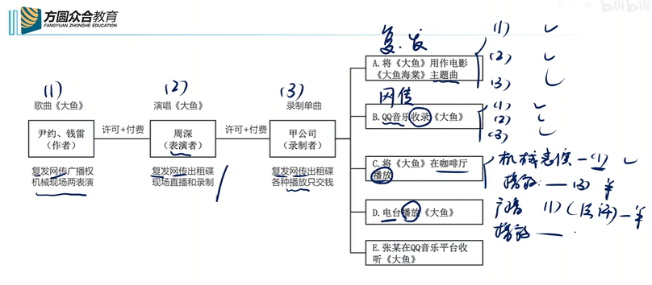

### 1：讲稿逻辑切分与文字梳理

**【修改说明】** ：原文中部分语句存在重复、口语化填充（如“哎”、“呢”、“啊”）、口误或语音转文字错误。在保持原意和所有例证完整的前提下，我对文字进行了通顺化处理，并用`[修改]`或`[删减]`进行标识。原文中讲授者提到的“四百三十五页”等为教材页码，予以保留。

---

#### **第一部分：邻接权（著作权有关权利）概述与四大主体**

**主题：什么是邻接权？为什么需要保护它？**

各位同学，我们接着来看第六考点——邻接权，它也被称为“与著作权有关的权利”。整个著作权法相对复杂，主要因为它涉及两个核心环节。

第一个环节是**创作**。作者创作出作品，这个环节当然值得保护，由此产生**著作权**。
但作品创作出来，目的是为了有效传播，发挥其传播文学、艺术、科学之美的功能。这就到了第二个重要环节——**传播**。

举个例子：一首歌，词曲再美，如果没人演唱、没人录制，我们作为受众就无法直接感受到它的美。反之，一个合适的声音把它唱出来，音响公司精心录制，这首歌就能广泛传播，打动人心。

因此，**表演者（唱的人）、录制者（录的人）等传播环节的参与者同样重要**，法律赋予他们的权利就是**邻接权**。

邻接权包括四大板块：
1.  **表演者**（演员、歌星、舞蹈家等）；
2.  **录制者**（录音录像制作者）；
3.  **广播者**（广播电台、电视台）；
4.  **出版者**（图书出版环节）。

**【考试重点】** ：前两个——**表演者和录制者**，需要重点准备。

---

#### **第二部分：表演者权详解**

**主题：表演者权的权利客体与权利性质**

**（一）权利客体：每一次表演活动**
表演者的权利客体是“一次一次的表演活动”。每一次单独的表演，都是一个单独的权利客体。
*   **例题**：周深在北京演唱会演唱《大鱼》，北京卫视获得授权进行现场直播。之后周深在上海演唱会再次演唱《大鱼》，北京卫视能否凭借之前的授权进行直播？
    *   **答案**：不能。上海的表演是一次新的、独立的表演活动，需要获得新的授权。

**（二）权利内容：人身权利与财产权利**

表演者权是一项**复合权利**，包含人身权和财产权。

**1. 人身权利（永久保护）**
*   **权利一：表明表演者身份**
    *   例如，影视剧片尾字幕显示“剧中人物翠花扮演者：巩俐”。
    *   **延伸考点**：没有台词的“死尸”扮演者，也需要表明身份吗？
        *   **结论**：需要。演员不以台词为评价标准。只要镜头完整扫过其形象，就属于表演者，应为其署名，否则侵犯表明表演者身份的权利。
*   **权利二：保护表演形象不受歪曲**
    *   这是对演员人格尊严的保护。演员塑造的荧屏形象与演员本人息息相关。恶意诋毁、丑化其塑造的经典形象，也可能构成对其人格的侵犯。
    *   **例题**：李明启老师因在《还珠格格》中成功塑造“容嬷嬷”一角，在生活中被路人扔菜、谩骂，这体现了什么？
        *   **分析**：这侧面反映了演员塑造的形象与其本人的关联性。如果对荧屏形象进行恶意诋毁和负面评价，则可能侵犯表演者“保护表演形象不受歪曲”的权利。
    *   **例题**：葛优在情景喜剧中的“葛优躺”形象，被他人截取并配上“不上进”、“烂泥”等负面标签用于商业或传播，可能侵犯什么权利？
        *   **分析**：可能侵犯葛优老师“保护表演形象不受歪曲”的权利。

**2. 财产权利（六大类，需重点记忆）**
表演者的财产权利控制以下六种行为，未经许可实施即为侵权：
*   现场直播；
*   录制（首次录制）；
*   复制；
*   发行；
*   网络传播；
*   出租（出租录制的“碟”，即载体）。

*   **讲授者提供的顺口溜**：**“复发网传、出租碟、现场直播和录制。”**
    *   “复”——复制；“发”——发行；“网传”——网络传播；“出租碟”——出租录有表演的载体；“现场直播和录制”——对现场表演进行直播和首次录制。

*   **关于“碟”的说明**：这里的“碟”是一个泛指概念，代表录制表演的载体。它可以是早年的磁带、后来的CD、MP3文件，乃至现在智能手机里的各种电子文档。时代在变，载体在变，但“录制”这一行为和由此产生的权利性质不变。

**主题：易混淆概念——表演权 vs. 表演者权**

*   **表演权**：是**著作权**中的一项**财产权**，控制的是“现场表演”（活人表演）和“机械表演”（如播放背景音乐）。
*   **表演者权**：是**邻接权**，是一项**复合权利**，包含人身权和财产权，控制的是前文所述的六大类行为。
*   **结论**：一字之差，千里之别。

**主题：职务表演**

*   **定义**：指演员为了完成演出单位的任务而进行的表演。典型如剧团、话剧团组织的演出（例如“开心麻花”公司组织沈腾、马丽出演话剧《夏洛特烦恼》）。
*   **权利归属**：
    *   **人身权利**（表明身份、保护形象）——归**演员个人**。
    *   **财产权利**（许可他人直播、录碟等）——首先由**单位和演员约定**；**没有约定**的，归**演出单位**享有。这样更便于对外授权，提高效率。

---

#### **第三部分：录制者权详解**

**主题：录制者权的权利范围与2026年考点预测**

*   **主体**：音响公司、唱片公司等首次将声音、影像录制下来的主体（如曾经的华纳、滚石唱片）。
*   **传统权利范围**：控制对其录制的“碟”（各种载体）进行**复制、发行、网络传播、出租**的行为。未经许可，不得实施。

*   **重要变化与考点**：
    *   随着技术发展，传统上控制“复制、发行、网络传播、出租”带来的收益越来越少（盗版和实体出租店消亡），而**各种播放**（咖啡厅、电台、电视台、网络直播间的背景音乐）成了音乐使用的主要场景。
    *   旧法下，录制者对“播放”环节无权控制，导致其投入大量成本却收益甚微。
    *   **修法变化**：新《著作权法》为录制者增加了**“获酬权”**。
    *   **规则**：对于各种形式的播放（线上/线下、有线/无线、现场/远程），**无需经过录制者许可，但必须支付报酬**。
    *   **讲授者提示**：这个新增的“获酬权”是**近年来的重要考点**。

---

#### **第四部分：权利主体与权利范围全景梳理——“侵权一招鲜”方法论**

**主题：三大权利主体的权利范围口诀**

为了应对著作权侵权题，必须精准掌握以下三类主体的权利范围。讲授者提供了便于记忆的“顺口溜”：

1.  **著作权人（作者）** ：控制 **“复制、发行、广播权，机械现场两表演，视听软件出租权”** 。
2.  **表演者**：控制 **“复发网传、出租碟、现场直播和录制”** 。
3.  **录制者**：控制传统权利 **“复发网传、出租碟”** ，以及新增的 **“各种播放，只交钱”** （获酬权）。

**主题：侵权分析的“三步骤”（“侵权一招鲜”）**

这是解决著作权侵权题的核心方法论，尤其适合非法学考生理解。

*   **第一步：定位权利人及其权利范围**。
    *   明确题目中涉及的权利人是谁（作者？表演者？录制者？）。
    *   对照上述口诀，找出他们各自控制哪些行为。
*   **第二步：定性第三方行为**。
    *   题目中的第三方（如甲公司、QQ音乐、咖啡厅）具体在做什么？是“录制”？“网络传播”？“播放”？还是“复制发行”？
*   **第三步：对比排查，得出结论**。
    *   将第三方行为与权利人控制的范围进行比对。
    *   如果该行为属于权利人控制的范围，则**需要获得许可并付费**；否则构成侵权。
    *   如果有法定许可或合理使用等豁免情形，则无需许可（但可能要付费）。

**主题：《大鱼》全场景案例分析（综合应用“侵权一招鲜”）**

*   **设定**：
    *   **作品**：《大鱼》。
    *   **权利人1（作者）** ：词曲作者尹约、钱雷。权利范围：复发网传广播权、机械现场表演权。
    *   **权利人2（表演者）** ：演唱者周深。权利范围：复发网传出租碟、现场直播和录制。
    *   **权利人3（录制者）** ：甲公司（首次录制并制作单曲的公司）。权利范围：复发网传出租碟（传统）+ 各种播放只交钱（新增获酬权）。

*   **场景分析**：

| 场景（第三方行为） | 行为定性 | 涉及权利人及分析 | 结论 |
| :--- | :--- | :--- | :--- |
| **A. 电影《大鱼海棠》使用《大鱼》作主题曲** | **复制、发行** | **作者**：管复制发行。需要许可付费。 **表演者**：管复制发行。需要许可付费。 **录制者**：管复制发行。需要许可付费。 | 需获得**三方**授权。 |
| **B. QQ音乐平台收录并提供《大鱼》** | **网络传播**（信息网络传播） | **作者**：管网传。需要许可付费。 **表演者**：管网传。需要许可付费。 **录制者**：管网传。需要许可付费。 | 需获得**三方**授权。 |
| **C. 咖啡厅播放《大鱼》** | **机械表演** & **播放** | **作者**：管机械表演。需要许可付费。 **录制者**：管播放（各种播放只交钱）。无需许可，但要付费。 **表演者**：不管机械表演，也不管播放。 | 需获**作者**许可；需向**录制者**付费。 |
| **D. 电台播放《大鱼》** | **广播** & **播放** | **作者**：管广播。但适用**法定许可**，无需许可，但需付费。 **录制者**：管播放（各种播放只交钱）。无需许可，但要付费。 **表演者**：不管广播/播放。 | 需向**作者、录制者**付费，无需许可。 |
| **E. 个人在QQ音乐上收听《大鱼》** | **个人欣赏** | **作者**：属于合理使用，不管。 **表演者**：不管。 **录制者**：不管。 | **不侵权**，可自由收听。 |

---

#### **第五部分：补充考点（技术措施、权利管理信息、计算机软件）**

**主题：技术保护措施**

*   **定义**：权利人为防止作品被随意盗用而采取的技术手段（如下载需回复、付费等）。
*   **保护**：法律保护这些技术措施，禁止他人非法破解。
*   **例外（可以破解的豁免情形）** ：为**科研**、**执行公务**、**进行网络安全测试**、**反向工程**、或**为残障人士提供便利**等，且无法从其他途径获得时，可以避开技术措施。这体现了公共利益与个人权利的平衡。

**主题：权利管理电子信息**

*   **定义**：指作品上的版权信息，如出版社、作者、版次等（常见于图书扉页背面的版权页）。
*   **保护**：未经许可，不得删除或更改这些信息。

**主题：计算机软件著作权（可能涉及主观题考点）**

*   **权利归属**：软件开发者（自然人或法人）。
*   **合理使用范围大大缩窄**：与其他作品不同，软件的合理使用仅限于**学习、研究**目的。安装使用正版软件用于学习研究是合理的，但个人欣赏、适当引用等一般不适用。
*   **盗版软件使用的特殊规则（重点）** ：
    *   **使用盗版软件 = 侵权**。因为安装/下载盗版软件的行为本身就构成了法律上的“复制”，而复制是软件著作权人控制的行为。
    *   **对比**：读盗版书一般不侵权（个人使用），但用盗版软件侵权。
    *   **侵权认定不取决于主观状态**：即使使用者不知情（善意），使用盗版软件依然构成侵权，只是**不承担赔偿责任**（但需停止使用）。
    *   **补救措施**：使用盗版软件被追责后，可以通过向权利人付费购买正版许可（获取正版序列号），使其“正版化”。

---

### 2：讲稿知识提纲与考点预测

#### 一、讲稿知识提纲（面向非法科考生）

本提纲基于讲稿内容，梳理了邻接权及著作权侵权的核心考点，旨在帮助您建立清晰的知识框架。

**模块一：邻接权（与著作权有关的权利）概述**
1.  **产生原因**：作品的创作（产生著作权） + 作品的传播（产生邻接权）。后者保护的是表演者、录制者等传播者的贡献。
2.  **四大主体**：表演者、录制者、广播者、出版者。重点：前两者。

**模块二：表演者权（重中之重）**
1.  **权利客体**：每一次独立的“表演活动”。不同场次的表演，权利客体不同。
2.  **权利性质**：复合权利。
3.  **人身权利（永久）** ：
    *   表明表演者身份（如署名）。
    *   保护表演形象不受歪曲。
4.  **财产权利（六大类）** ：
    *   **口诀**：复发网传、出租碟、现场直播和录制。
    *   具体：复制、发行、网络传播、出租、现场直播、首次录制。
5.  **易混淆概念**：区分“表演权”（著作权财产权）与“表演者权”（邻接权复合权利）。
6.  **职务表演**：
    *   定义：演出单位为完成演出任务组织的表演。
    *   权利分配：人身权归演员；财产权，有约从约，无约归单位。

**模块三：录制者权（重中之重）**
1.  **主体**：首次制作录音录像制品的公司。
2.  **传统权利**：控制复制、发行、网络传播、出租（口诀同样适用：复发网传出租碟）。
3.  **新增权利（获酬权）** ：
    *   **规则**：各种形式的播放（线上线下、有线无线），无需许可，但必须支付报酬。
    *   **原因**：应对技术发展，保障录制者从主要使用场景（播放）中获得合理回报。
    *   **考点地位**：近年必考或高频考点。

**模块四：侵权分析“一招鲜”（核心方法论）**
1.  **第一步**：明确权利人及其权利范围（熟练背诵三大口诀）。
    *   作者：复发网传广播权，机械现场两表演，视听软件出租权。
    *   表演者：复发网传、出租碟、现场直播和录制。
    *   录制者：复发网传、出租碟；各种播放只交钱（获酬权）。
2.  **第二步**：准确定性第三方的具体行为（录制？网络传播？播放？复制发行？）。
3.  **第三步**：将行为与权利范围对比。在“控制范围”内且无豁免（合理使用、法定许可）的，即需授权/付费，否则侵权。
4.  **豁免规则**：
    *   **合理使用**（如个人欣赏）——不侵权。
    *   **法定许可**（如电台广播）——无需许可，但需付费。

**模块五：其他考点（了解即可）**
1.  **技术措施**：保护权利人技术手段，非法破解禁止。例外情况（科研、公务等）允许破解。
2.  **权利管理信息**：版权页等信息，不得删除或篡改。
3.  **计算机软件**：
    *   合理使用限于学习、研究。
    *   **使用盗版软件构成侵权**（包含下载/安装的复制行为），与读盗版书不同。善意使用者仍构成侵权，但不承担赔偿责任。

#### 二、讲授人提到的考点与2026年考点预测

以下表格基于讲稿内容，梳理了讲授人明确提到的历年考点、重点提示以及对2026年考试的预测。讲授人多次强调“侵权一招鲜”和“录制者获酬权”是核心。

| 知识点 | 可能考试的方式（客观题/主观题） | 举例 / 讲授人提示 |
| :--- | :--- | :--- |
| **1. 表演者权的客体** | 客观题。判断特定行为是否侵犯了针对某次表演的权利。 | 周深北京演唱会授权直播，上海演唱会需重新授权。**讲授人明确为“注意”考点**。 |
| **2. 表演者人身权利** | 客观题。判断是否属于“表明身份”或“保护形象不受歪曲”的情形。 | 死尸演员署名；将“葛优躺”配负面文字传播。“容嬷嬷”扮演者被扔菜。**讲授人作为例子详细讲解**。 |
| **3. 表演者权 vs. 表演权** | 客观题。概念区分。 | 表演权是著作权财产权（控制现场/机械表演）；表演者权是邻接权复合权利。 |
| **4. 职务表演权利归属** | 客观题。判断财产权归演员还是单位。 | 开心麻花演话剧。原则：人身归演员，财产有约从约，无约归单位。 |
| **5. 录制者权的获酬权（新增）**| **主/客观题高频考点**。判断具体播放场景下，是否需要许可、是否要付费。| 咖啡厅、电台播放背景音乐。**讲授人强调“这是非常非常重要的考点，几乎每年都会有所涉及”**。 |
| **6. “侵权一招鲜”三步法** | **主观题核心方法论**。给出案例，要求分析是否侵权，侵犯何种权利。 | 讲授人用《大鱼》案例完整演示了该方法，并要求学生反复练习。 **（主观题显著考点）** |
| **7. 信息网络传播权** | 客观题。定性平台“收录”、“上传”行为。| QQ音乐平台收录歌曲供用户点播，属于信息网络传播行为，需获得作者、表演者、录制者的三重许可。 |
| **8. 机械表演权** | 客观题。定性咖啡厅等场所播放背景音乐。| 咖啡厅播放音乐属于机械表演，仅与作者有关（需作者许可），与表演者无关。 |
| **9. 广播法定许可** | 客观题。判断电台播放音乐的特殊规则。| 电台播放音乐，适用法定许可，无需作者同意，但需付费。同时需向录制者支付“播放”的报酬。 |
| **10. 计算机软件版权** | 客观题。特殊规则：使用盗版软件侵权。 | 使用盗版软件与阅读盗版书不同，因安装即构成“复制”，构成侵权。善意（不知情）仍侵权，但不赔偿。 |
| **11. 技术措施与权利管理信息** | 客观题。了解基本规则和例外。| 非法破解技术措施一般禁止；例外情况（科研、公务等）。不得删除权利管理信息。 |

### 3：讲稿原文字切片

以下为根据讲授逻辑切分和校订后的讲稿全文，保留了所有例证、分析和讲授细节。

---
**【切片1：邻接权概述与四大主体】**

好了，咱们接着看一下我们第六考点，叫邻接权，它也称为与著作权有关的权利。整个著作权法会相对复杂一点，主要原因是因为它有两个环节。前一步中我们重点学了第一环节，就是创作。一个作者创作一个作品出来，创作环节是值得保护的，所以会有著作权的呈现。可是一个作品出来之后，要想有效传播，真正发挥著作权传播文学之美、艺术之美、科学之美的功能和使命，那么这个传播环节也很重要。

你想想，一首歌，词曲很美是基础，可是只有美的词和曲子，如果没人把它唱出来，没人把它录成一个音乐文件，让我们能够听到，那传播会受很大影响。光看谱子和歌词，感受不到那种直击心灵的美。有一个合适的声音把它唱了，音响公司精心加工录了文件，一下子被我们听到，DNA动了，喜欢得不得了，这首歌就传播开了。所以唱的人、录的人也很重要。因此，这个唱、录等邻接的环节或传播的环节，就需要邻接权来实现。

邻接权整体包括四个板块：一是关于唱的、跳的、表演的，我们叫**表演者**；二是录制相关音乐文件的，叫**录制者**；三是广播电台电视台，叫**广播者**；四是图书出版环节，叫**出版者**。从考试重点来看，会放在前两个，即**表演者和录制者**，我们需要重点准备。

---
**【切片2：表演者的权利客体与人身权利】**

先来看表演者，包括演员、歌星、舞蹈家等。他们的**权利客体**，是人家一次一次的表演活动。每唱一次，单独的表演活动就是一次单独的权利客体。比如周深在北京开演唱会唱《大鱼》，这是一个单独的权利客体。如果周深去上海又开演唱会唱《大鱼》，北京卫视能以北京演唱会的授权去直播上海那场吗？**不能**，因为上海的表演是一次新的课题，需要做一次新的授权。

表演者的权利是**复合权利**，有**人身权利**和**财产权利**两类。人身权利有两个，重点是人格尊严方面的尊重和保护。

第一个，**表明表演者的身份**。影视剧结尾有字幕，剧中人物翠花扮演者是巩俐，高启强扮演者是张颂文，体现角色和演员的对应关系。甚至剧中人物是“死尸”，扮演者是西西。有同学说，死尸没台词还叫演员吗？当然叫。演员不以台词为评价标准，只要镜头完整扫过了脸或形象，躺在那也得做表情管理，不能笑嘻嘻。这需要演技，就应该写上“死尸扮演者：西西”，否则就侵犯了表演者的权利。

第二个，**保护表演形象不受歪曲**。这是对演员人格尊严的保护。演员塑造的荧屏形象和本人息息相关。像常演反面人物的演员，演得太像了，观众觉得他就是坏人，说明演技好。比如《还珠格格》里的容嬷嬷，李明启老师塑造得太成功，导致她个人生活受影响，买菜被人扔手机骂“死老太太”。侧面反映出荧屏形象和本人的关系。如果有人对荧屏形象恶意诋毁、谩骂，就是对演员的不尊重。再比如葛优在情景喜剧里的“葛优躺”，被截取贴上“不上进”、“烂泥”等负面标签，也是对葛优老师的不尊重，可能侵犯保护形象不受歪曲的权利。因为人身权利是人格性的，**没有期限限制，永久保护**。

---
**【切片3：表演者的财产权利与顺口溜】**

财产权利更重要，因为演员演戏、歌星唱歌，哪些行为需要获得授权，是看是否侵权的依据。这里有**六大类权利**。

以周深北京演唱会唱《大鱼》为例：
1.  **现场直播**：北京卫视要做现场直播，需要周深团队授权。包括网络直播。
2.  **录制**：QQ音乐想去录现场Live版专辑，需要授权付费。音乐文件分录音棚版和现场版（Live），Live版有现场气氛，也需要授权。
3.  有了录好的“碟”（泛指磁带、CD、MP3文件等各种载体）之后，要**复制、发行、网络传播、出租**这个碟，都需要授权。

所以六个环节是：现场直播、录制、复制、发行、网络传播、出租。
顺口溜就是：**“复发网传、出租碟、现场直播和录制”**。
（“复”是复制，“发”是发行，“网传”是网络传播，“出租碟”是出租录好的载体。）这个顺口溜简单高效，直接对应做题。

---
**【切片4：表演权与表演者权区分；职务表演】**

有同学问表演权（著作权里的财产权）和表演者权（邻接权）的区别。一字之差，千里之别。**表演权**只是著作权中一项财产权，控制现场表演（活人）和机械表演（背景音乐）。**表演者权**是复合权利，既有人身又有财产，完全不同。

**【职务表演】** ：这是新修改的著作权法新增内容。典型是演出单位为卖票组织演员表演，如“开心麻花”公司组织沈腾、马丽演话剧《夏洛特烦恼》。整台话剧的表演者权分配：**人身性权利**（表明身份、保护形象）归演员；**财产性权利**（许可直播、录碟等），由单位和演员**约定**，**没约定**的，归**单位**。因为第三方想直播，找一个个演员授权效率太低，归单位更高效。

---
**【切片5：录制者权及其新变化】**

录制者，无论是原来录磁带的、录CD的、还是现在录音乐文件的音响公司，投入了成本（设备、录音师、演员费用）。他们作为首次制作人，录了碟（各种载体），别人要干什么需要授权呢？

以甲公司录了周深《大鱼》单曲为例。传统上，第三方想**复制、发行、网络传播、出租**这个单曲，都需要甲公司许可付费。但随着技术发展，盗版CD、磁带少了，出租店也少了，传统控制几乎收不到钱。而音乐最大的使用场景变成了**各种播放**（咖啡厅、电台、电视台、网红直播间）。旧法下录制者对播放管不了，收不到钱。

**著作权法做了深刻变化**：单独给录制者增加了一个**“获得报酬的权利”** （只交钱）。任何形式的播放（线上/线下、有线/无线、现场/远程），**不用许可，但要给钱**。这叫“各种播放只交钱”。从此，传统权利（复发网传出租碟）可正常许可付费；新增的（各种播放）只获得报酬。这个点改革后几乎每年都考，非常重要。

---
**【切片6：权利主体全景梳理与《大鱼》场景分析】**

我们用一个歌《大鱼》场景还原。权利主体：
1.  **词曲作者**（著作权人）：权利范围是“**复发网传广播权、机械现场两表演**”。
2.  **周深**（表演者）：权利范围是“**复发网传、出租碟、现场直播和录制**”。
3.  **甲公司**（录制者）：权利范围是传统“**复发网传、出租碟**” + 新增“**各种播放只交钱**”。

分析场景：
1.  **甲公司要把《大鱼》录成单曲**：对作者来说，这是“复制”，作者管复制，需要作者授权。对周深来说，这是“录制”，表演者管录制，需要周深授权。甲公司得到授权后，成为录制者。
2.  **QQ音乐平台收录**：就是把文件上传网络服务器，供用户自主点播，这叫“网络传播”。作者管、表演者管、录制者也管，需要三方授权。
3.  **QQ音乐平台个人收听**：这是个人欣赏，属于合理使用。作者不管，表演者不管，录制者也不管。直接听，不侵权。
4.  **咖啡厅播放《大鱼》** ：用机械装置播出来，这叫“机械表演”。作者管机械表演，需要作者许可。同时，有“播放”动作，录制者对新增加的“各种播放”有获酬权，需要向录制者付费。表演者不管播放。所以咖啡厅需要作者许可，并向录制者付费。
5.  **电台播放《大鱼》** ：这是“广播”。作者管广播，但电台广播适用“法定许可”，不用作者同意，但要付费。录制者同样对“播放”有获酬权，要付费。表演者不管。

---
**【切片7：“侵权一招鲜”方法论总结】**

为了解决著作权侵权难题，用“侵权一招鲜”三步法：
**第一步**：看题目中权利人是谁，有什么权利范围。熟背口诀：
- 著作权人：复制、发行、广播权，机械现场两表演，视听软件出租权。
- 表演者：复发网传、出租碟、现场直播和录制。
- 录制者：复发网传、出租碟；各种播放只交钱。

**第二步**：看案情中第三方行为是什么（录制？网传？播放？复制发行？）。

**第三步**：对比。第三方行为属不属于权利人的禁止范围？属于，就需要授权/付费；不属于或属于合理使用/法定许可，就过掉。

这个方法能应对所有侵权题。以《大鱼》为例：
- A（用于电影）：复制发行，涉及三方。
- B（QQ收录）：网络传播，涉及三方。
- C（咖啡厅播）：机械表演（涉及作者）+播放（涉及录制者付费）。
- D（电台播）：广播法定许可（涉及作者付费）+播放（涉及录制者付费）。
- E（个人听）：合理使用，谁都不管。

---
**【切片8：技术措施、权利管理信息、计算机软件】**

**【技术保护措施】** ：权利人为防止盗版采取的措施（如下载需回复）。法律保护，不能随意破坏。但例外（避开措施的豁免）：为科研、执行公务、网络系统安全测试、反向工程、为残障人士提供便利等，且别处获取不了时，可以破解。

**【权利管理电子信息】** ：就是版权页信息（出版社、作者、版次）。未经许可不能涂改或删除。

**【计算机软件著作权】** ：
1.  **权利归属**：开发者（自然人或法人）。
2.  **合理使用范围窄**：软件合理使用只限于“学习、研究”。安装使用用于学习研究可以，其他不行。
3.  **盗版软件特殊规则**：
    - 用盗版软件（下载、安装）是**侵权**，因为下载安装就是“复制”，而复制是权利人控制的。跟读盗版书不同，读盗版书一般不侵权。
    - 就算不知情（善意），也是侵权，只是**不承担赔偿责任**。
    - 补救：可以向权利人付费购买正版许可（序列号），使其正版化。
4.  **考试就两个点**：合理使用范围缩窄；盗版软件使用规则。不属最核心考点。

---

